## Details
### You will learn
  - How to set up a sample workflow application in SAP Web IDE
  - How to integrate business rules with workflow

---

[ACCORDION-BEGIN [Step 1: ](Import Employee Onboarding sample application)]

1. In your web browser, open [SAP Cloud Platform Trial cockpit](https://cockpit.hanatrial.ondemand.com/cockpit).

2. Choose **Launch SAP Web IDE**.

    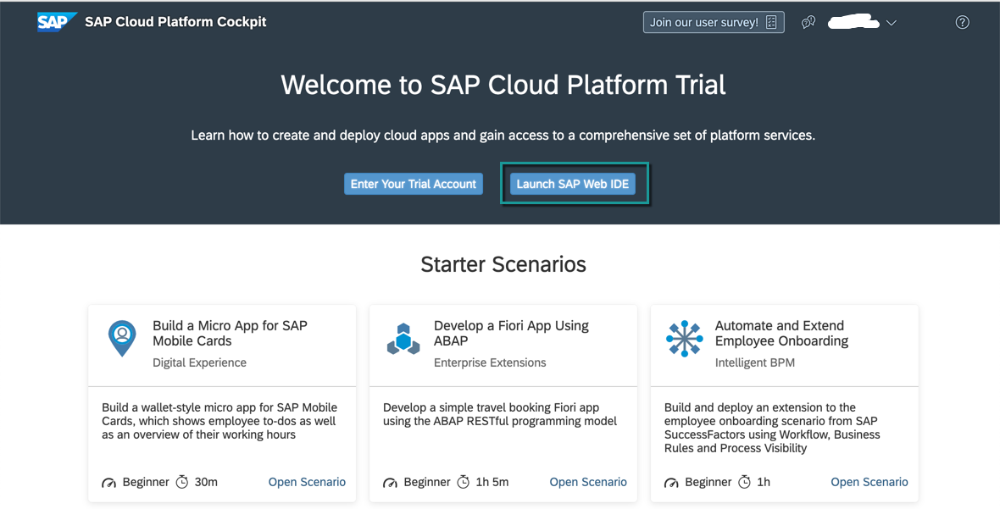

1. In the navigation area of the **SAP Web IDE**, choose the **Development** icon.

2. Choose **New** | **Project from Sample Application**.

    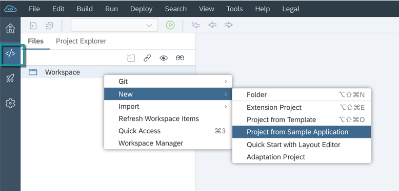

3. Select the **Employee Onboarding Extension Workflow for Cloud Foundry** application from the list of available sample applications.

    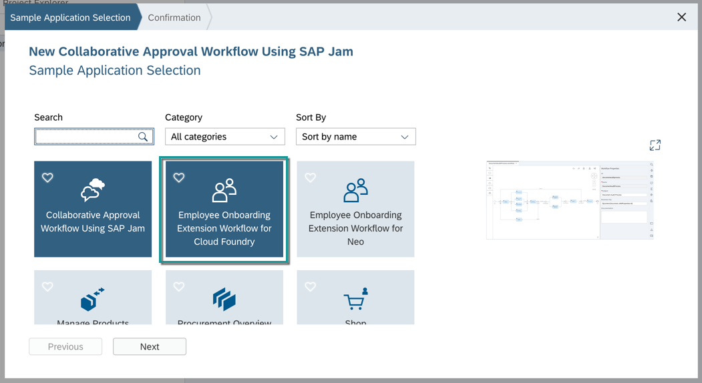

    > If you do not see this option, then ensure that you have correctly enabled and saved the Workflow Editor extension under SAP Web IDE Preferences.

4. Choose **Next**.

5. Accept the SAP License Agreement by selecting the checkbox, then choose **Finish**.

    You will see the sample `Employee Onboarding` application is imported into your workspace.

    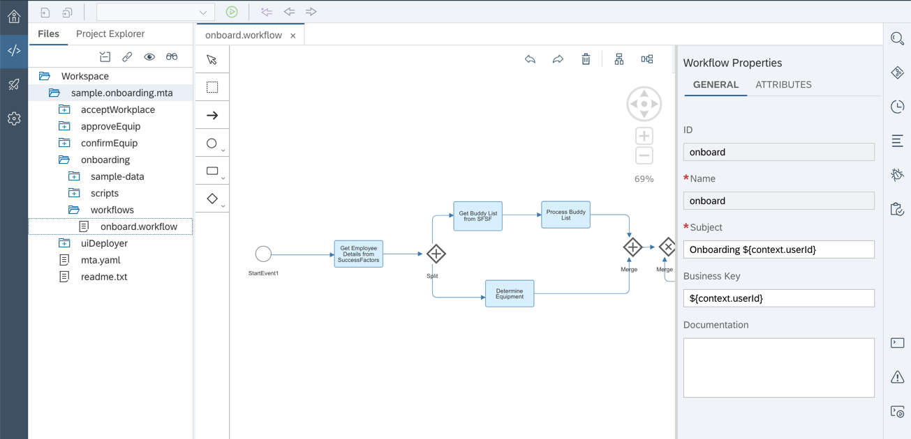

[DONE]
[ACCORDION-END]

[ACCORDION-BEGIN [Step 2: ](Configure sample application)]

SAP Cloud Platform Workflow supports the **multi-target** application model to create, build, and deploy workflow applications in the Cloud Foundry environment. A multi-target application contains multiple modules created with different services, build and deployed to different targets but with a common lifecycle.

An MTA model is a platform-independent description of the different modules, their dependencies and the configuration data that they expose, and the resource that they require to run. This model is specified using YAML (<https://yaml.org>).

1. Update the `mta.yaml` file.

    - Expand the `sample.onboarding.mta` project.
    - Open the `mta.yaml` file in the **MTA Editor**.
    - In the **Resources** tab, delete the existing `workflow_sample_onboarding`.
    - Add a new entry and name it `workflow`.
    - Set the type to `org.cloudfoundry.existing-service`.
    - **Save** the editor.

    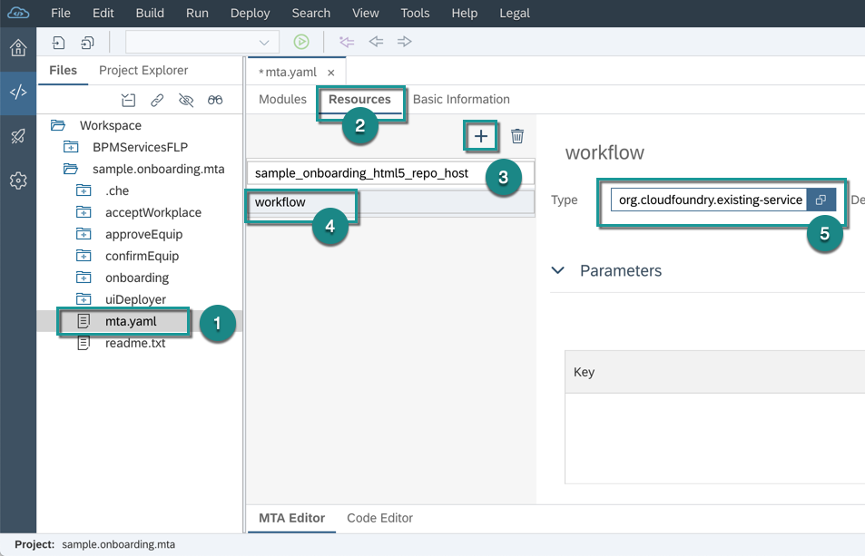

2. Modify the workflow sample data and **Save**.

    Update the `SampleInputContext.json` with your trial user email as both `buddyId` and `managerId`.

    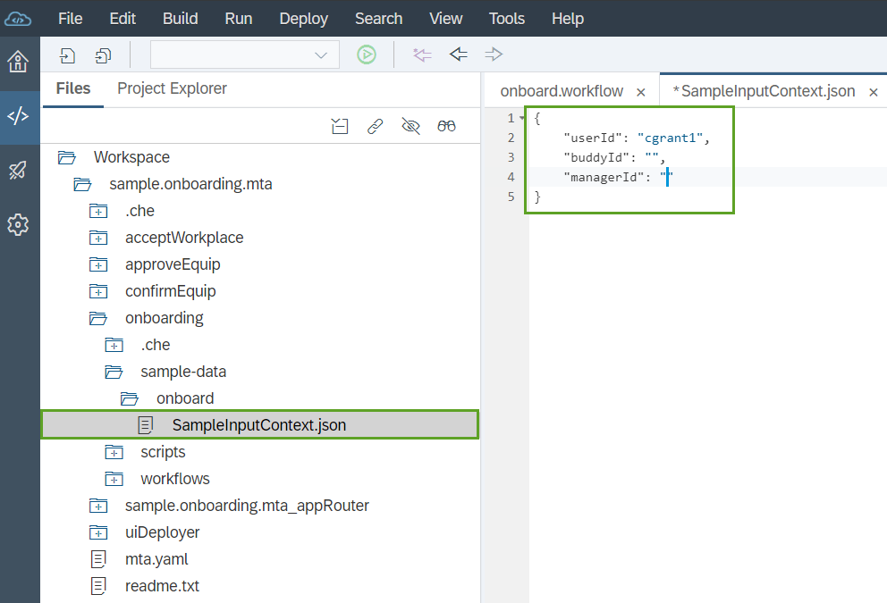


3. Modify the workflow definition.

    If you do not have `SuccessFactors` system and have not configured `SuccessFactors` destination in the setup tutorial, then you will have to update the workflow definition otherwise skip this step.

    - Open `onboard` workflow.
    - Click on `Get Employee Details from SuccessFactors` service task and select **Delete** option.

    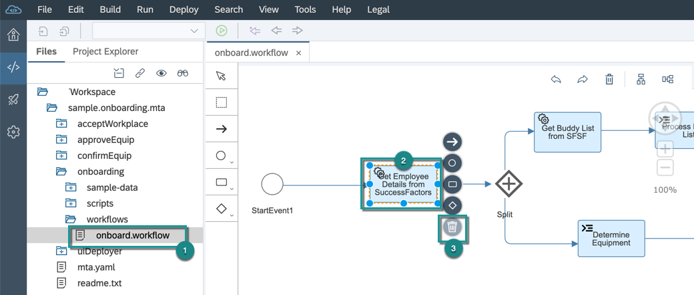

    - Similarly, delete `Get Buddy List from SFSF` service task.

    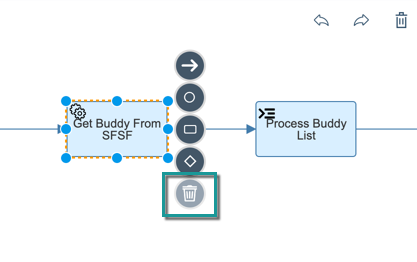

    - Your workflow will look like this.

    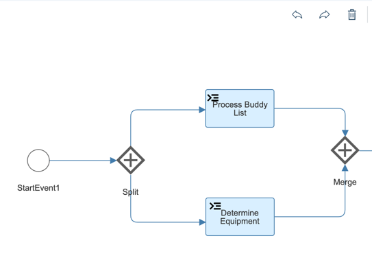

[DONE]
[ACCORDION-END]

[ACCORDION-BEGIN [Step 3: ](Integrate business rules)]

Now, you will see how easy it is to integrate the business rules with your sample workflow. These business rules you have already imported and deployed in previous chapter. It will give the list of equipment needed for the new hire.

1. In `onboard` workflow, select the `Determine Equipment` task and in the **Script Task Properties** change the name to `Prepare Rules Input`.

2. To update the script, select the `DetermineEquipment.js` file under **Script File**.

    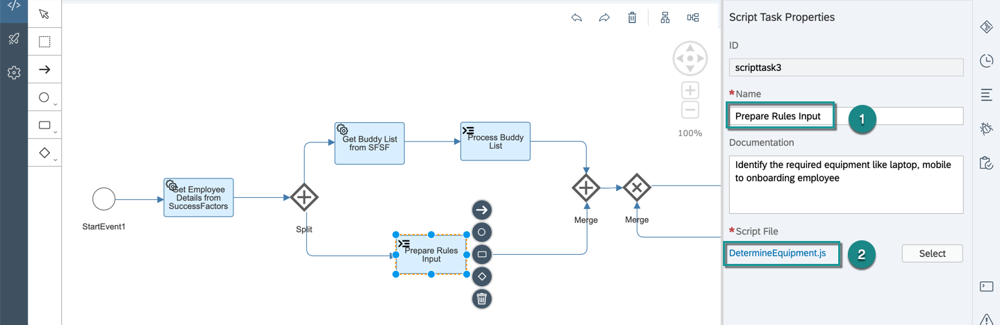

3. Replace the code with the following one, then **Save** the file:

    > This script is preparing the input payload to call the business rules invocation API. If you want to know more about different SAP Cloud Platform Business Rules APIs, visit [here](https://api.sap.com/package/SAPCPBusinessRulesAPIs?section=Artifacts).

    ```JavaScript
      var empJob = $.context.empData.d.results[0].empInfo.jobInfoNav.results[0];
      var empData = $.context.empData.d.results[0];

      /************ Prepare Input Payload to Execute Rules ****************/
      var employee = {};
      employee.countryOfCompany = "USA";
      employee.isFullTimeEmployee = empJob.isFulltimeEmployee;
      employee.company = empJob.company;
      employee.jobTitle = empJob.jobTitle;

      var Vocabulary = [{
      	"Employee": employee
      }];
      var rulesPayload = {
      	"RuleServiceId": "6bbd196d50c14b918d04c181e78d3a5b",
      	"RuleServiceVersion": "000001000000000000",
      	"Vocabulary": Vocabulary
      };
      $.context.rulesPayload = rulesPayload;

      /************ Enhance Workflow Context for additional attributes ****************/
      var attributes = {
      	username: empData.firstName + " " + empData.lastName,
      	division: empData.division,
      	city: empData.city,
      	country: empData.country,
      	jobCode: empData.jobCode,
      	jobTitle: empJob.jobTitle
      };
      $.context.empData.personalInfo = attributes;
    ```

4. Select the `Prepare Rules Input` task and from the speed buttons choose **Service Task**.

    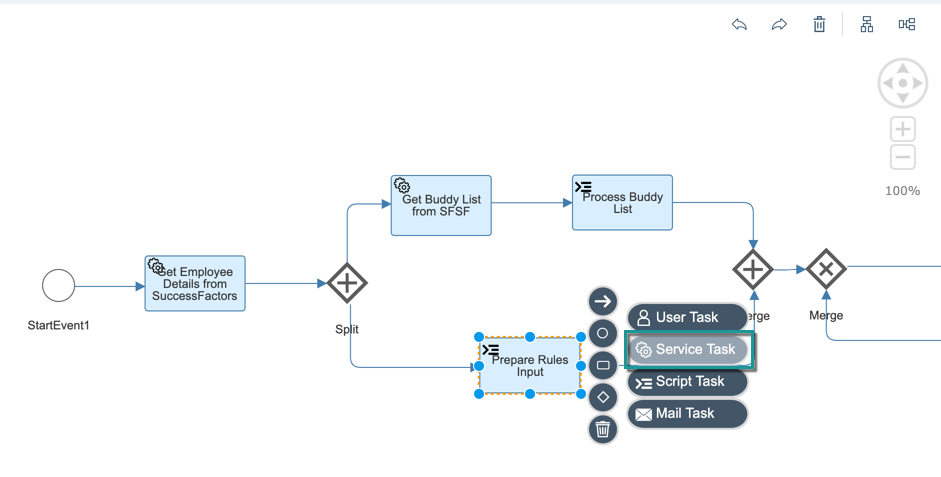

5. On the **General** tab of the **Service Task Properties**, enter `Determine Equipment` in the **Name** field.

6. On the **Details** tab of the **Service Task Properties**, enter the following data, then **Save** your changes:

    |  Field Name       | Value
    |  :--------------- | :-------------
    |  **Destination**      | `BUSINESS_RULES`
    |  **Path**             | `/rest/v2/rule-services`
    |  **HTTP Method**      | `POST`
    |  **Request Variable** | `${context.rulesPayload}`
    |  **Response Variable** | `${context.equipment.EquipmentsInfo}`

    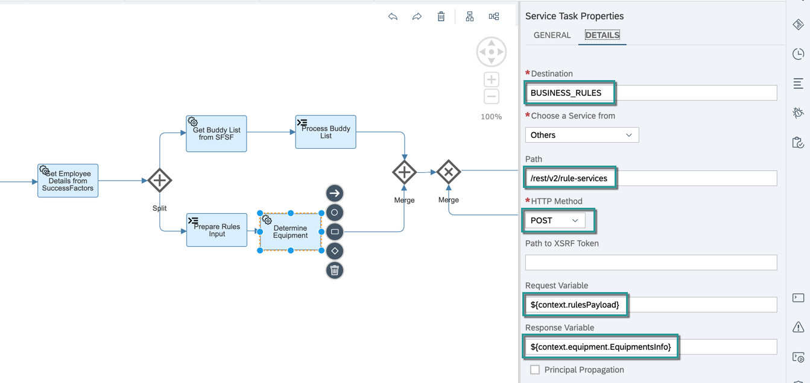

7. Select the `Determine Equipment` task, and choose from the speed buttons **Script Task**.

    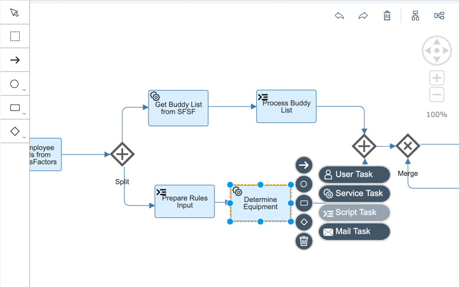

8. On the **Script Task Properties**, enter `Enrich Context` in the **Name** field and click **Create File**.

    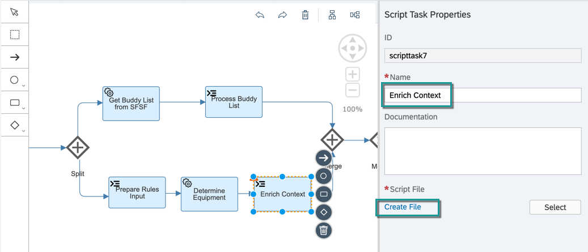

9. Enter `EnrichContext.js` as the file name.

10. Add the following code, then **Save** the file:

    ```JavaScript
      var EquipmentInfo = $.context.equipment.EquipmentsInfo.Result[0].EquipmentList;
      var EquipInfo = [];
      var equip = {};
      if (EquipmentInfo.length > 0) {
      	for (var i = 0; i < EquipmentInfo.length; i++) {
      		equip = EquipmentInfo[i];
      		equip.ProdDesc = equip.ProductDesc;
      		equip.Status = "New";
      		equip.ExpectedDate = "";
      		equip.RequestedLoc = "Building 01";
      		equip.CostCenter = $.context.empData.d.results[0].empInfo.jobInfoNav.results[0].costCenter;
      		EquipInfo.push(equip);
      	}
      }else {
      	equip = EquipmentInfo;
      	equip.ProdDesc = equip.ProductDesc;
      	equip.Status = "New";
      	equip.ExpectedDate = "";
      	equip.RequestedLoc = "Building 01";
      	equip.CostCenter = $.context.empData.d.results[0].empInfo.jobInfoNav.results[0].costCenter;
      	EquipInfo.push(equip);
      }
      $.context.equipment.EquipmentsInfo = EquipInfo;

    ```
11. Now the workflow configurations are done. **Save** the workflow.

You will see the workflow enhanced with new tasks to integrate business rules.

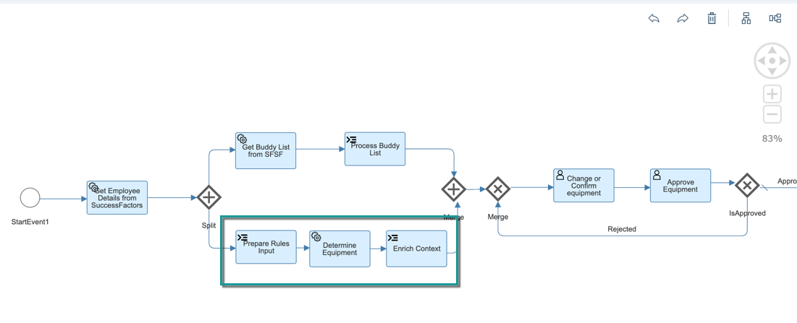

[VALIDATE_2]
[ACCORDION-END]

[ACCORDION-BEGIN [Step 4: ](Add workflow attributes)]

1. Select `onboard.workflow` to open the **Workflow Properties**.

2. Switch to **ATTRIBUTES**.

3. Choose **Add**, and enter the following attribute details:

    | ID             | Label          | Type          | Value                                   |
    | :------------- | :------------- |:------------- | :-------------------------------------- |
    | `username`     | User Name      | String        | ${context.empData.personalInfo.username}|
    | `division`     | Division       | String        | ${context.empData.personalInfo.division}|
    | `country`      | Country        | String        | ${context.empData.personalInfo.country} |
    | `jobTitle`     | Job Title      | String        | ${context.empData.personalInfo.jobTitle}|

    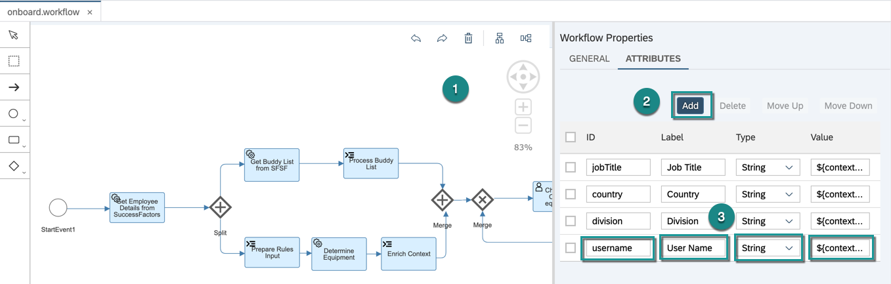

4. **Save** the workflow.

[DONE]
[ACCORDION-END]

[ACCORDION-BEGIN [Step 5: ](Build and deploy the sample application)]

1. Right-click the `sample.onboarding.mta` project, and choose **Build**.

    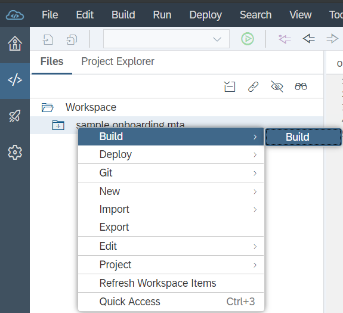

2. In the build archive, right-click the `sample.onboarding.mta_<xxx>.mtar` file and choose **Deploy** | **Deploy to SAP Cloud Platform**.

    

A successful deployment message is shown at the top-right corner.


[VALIDATE_1]
[ACCORDION-END]


---
