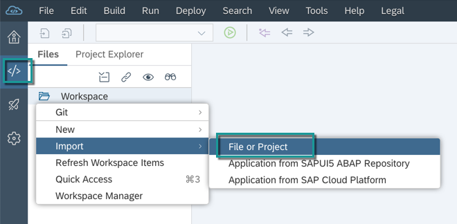
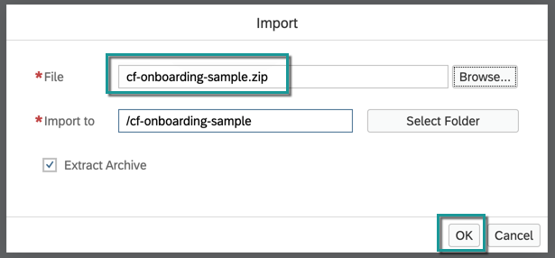
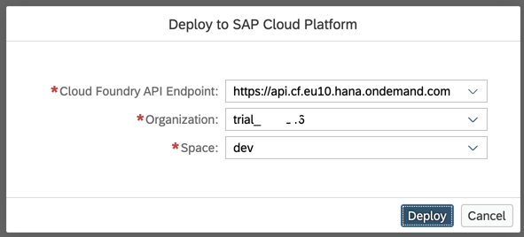

## Details
### You will learn
  - How to set up a sample workflow application in SAP Web IDE

---

[ACCORDION-BEGIN [Step 1: ](Download sample application)]

Download `Employee Onboarding` sample application from [GitHub](https://github.com/SAP-samples/cloud-workflow-samples/blob/master/cf-onboarding-sample/resources/cf-onboarding-sample.zip) in your local file system.

!

[DONE]
[ACCORDION-END]

[ACCORDION-BEGIN [Step 3: ](Import sample application)]

1. Choose **Launch SAP Web IDE**.

    > If you are new user then Web IDE Full-Stack will not be enabled for your account and you will see a message saying "SAP Web IDE Full-Stack is not be enabled for this account". Follow the instructions on the Web IDE page, to enable the Web IDE.

    !

2. In the navigation area of the **SAP Web IDE**, choose the **Development** icon.

3. Right click on the **Workspace** folder and choose **Import | File or Project**.

    

4. In the **Import** dialog, browse for the `cf-onboarding-sample.zip` file that you downloaded in your local system and choose **OK**.

    

5. You will see the sample `Employee Onboarding` application is imported into your workspace.

    > This sample workflow has:

    > - **Business Rules** integrated into it. You can find the integration as part of service task with name `Determine Equipment`.

    > - **User Tasks** for confirmation of the equipment selected via business rules and for the approval of equipment. You can find these user tasks with name `Confirm and Change Equipment` and `Approve Equipment` respectively.  The user interface associated with these user tasks have been built as SAPUI component and you can find these modules bundled under `confirmEquip` and `approveEquip` respectively in the same multi target application.

    

[DONE]
[ACCORDION-END]

[ACCORDION-BEGIN [Step 2: ](Build and deploy sample application)]

1. Right-click the `cf-onboarding-sample` project, and choose the **Build** option.
    > Use the deprecated option to build the resources

    

2. In the build archive, right-click the `sample-onboarding.mta_<xxx>.mtar` file and choose **Deploy** | **Deploy to SAP Cloud Platform**.

    

    > In the popup, select the Cloud Foundry API Endpoint, Organisation and Space where you would want to deploy the application.

    

A successful deployment message will be shown at the top-right corner once the deployment successfully completes.

[VALIDATE_1]
[ACCORDION-END]

---
