## Details
### You will learn
  - How to import, build and deploy a sample workflow application project using SAP Cloud Platform Business Application Studio

---

[ACCORDION-BEGIN [Step 1: ](Download a sample application)]

Download **cf-onboarding-sample.zip**  project from [GitHub](https://github.com/SAP-samples/cloud-workflow-samples/blob/master/cf-onboarding-sample/resources/cf-onboarding-sample.zip) in your local file system and extract the files.

!

[DONE]
[ACCORDION-END]

[ACCORDION-BEGIN [Step 2: ](Import sample application)]

1. Choose **SAP Business Application Studio**.

    !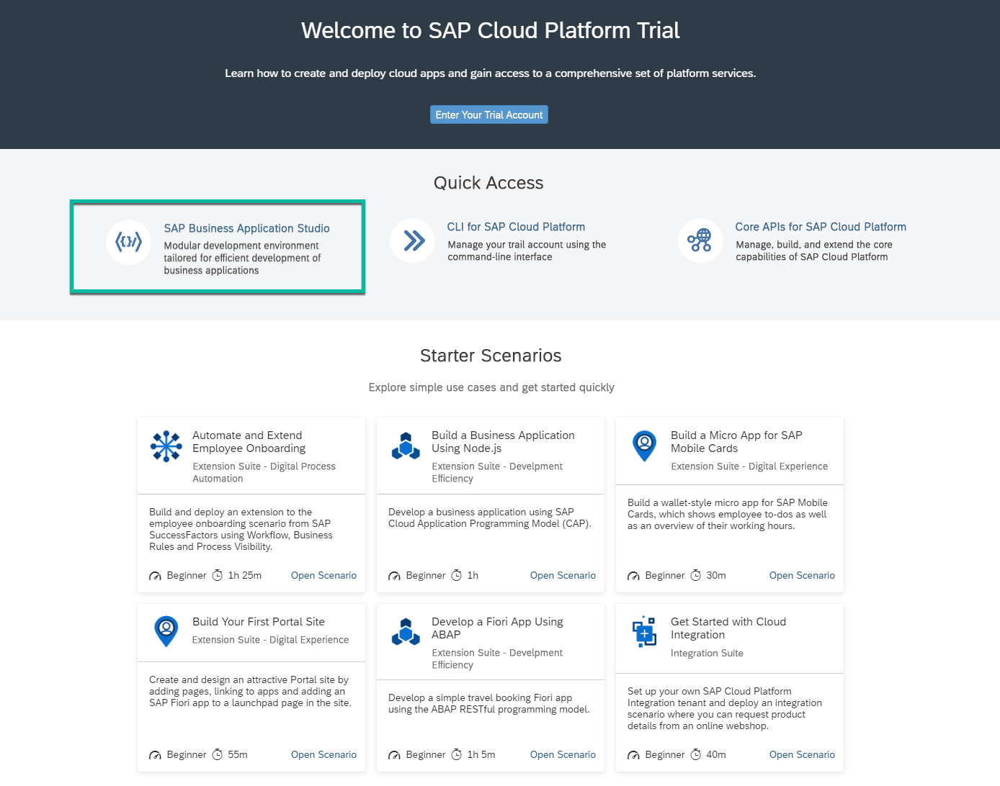

2. Click on the **Dev Space** to go into the workspace and from **File** menu choose **Open Workspace**

    > - If you do not have any dev-space, then click **Create Dev Space**. In the New Dev Space page, enter any dev space name, select **SAP Fiori** kind and **Workflow Management** extension. Finally click **Create Dev Space** to create a space in your business application studio.
    !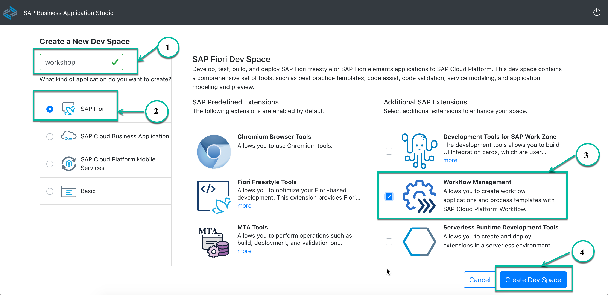

    > - If you have a dev-space but **Workflow Management** extension is not added then click **Edit**, select **Workflow Management** and **Save Changes**.
    !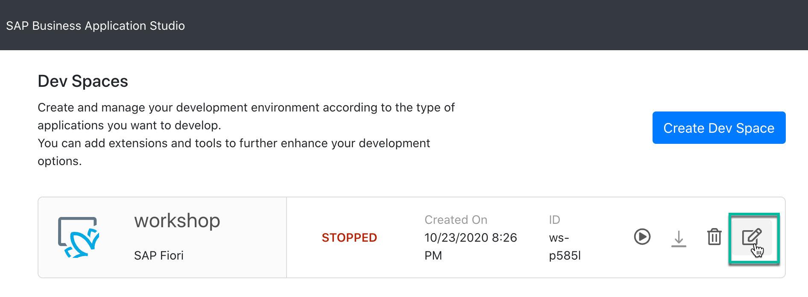
    !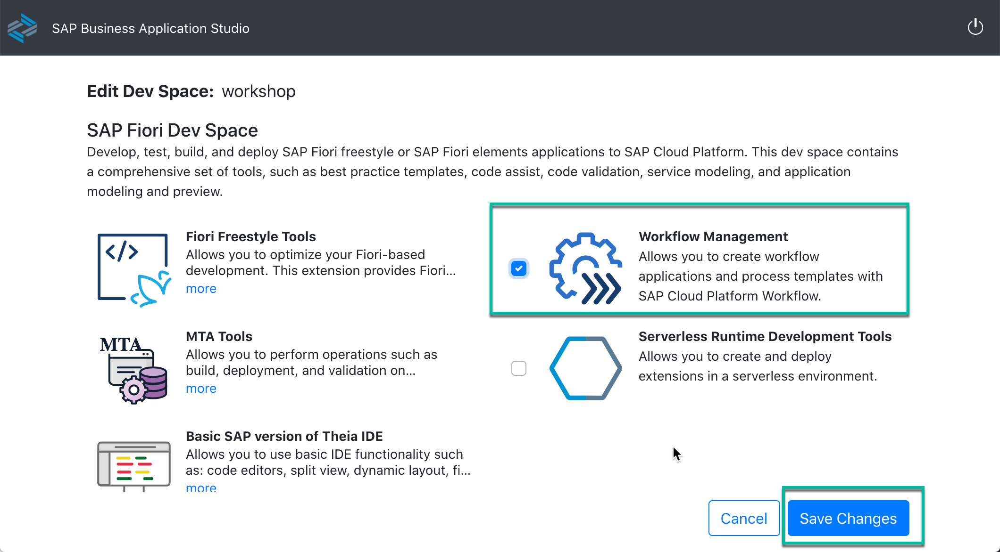

    > - If you have the dev-space with Workflow Management extension added, and the dev-space status is STOPPED then click run to start the space.
    !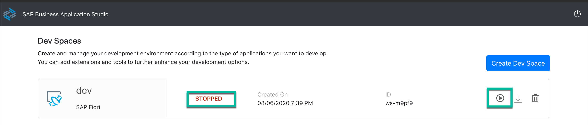

    !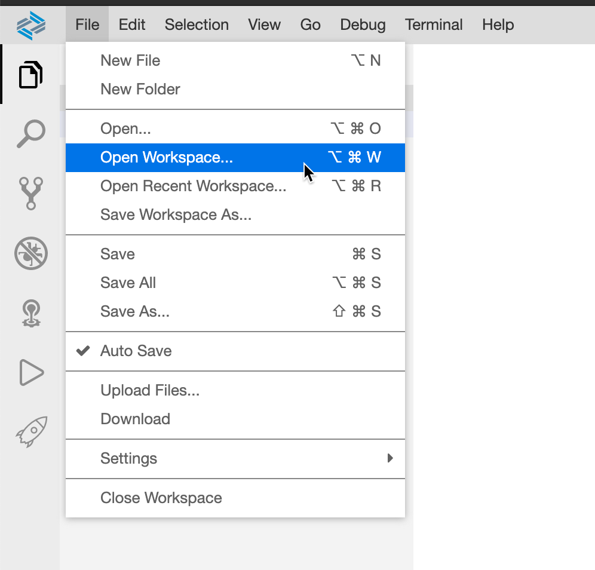

3. Drag and drop the extracted **cf-onboarding-sample** project in the dialog and click **Open**.

    !

    !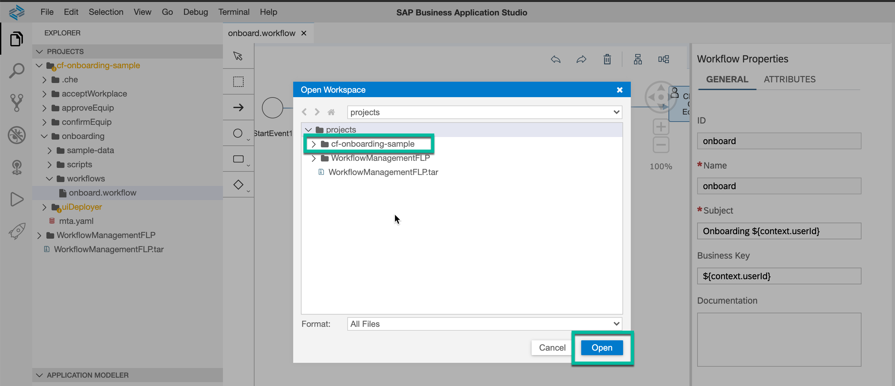

5. You will see that the **cf-onboarding-sample** project is imported into your workspace.

    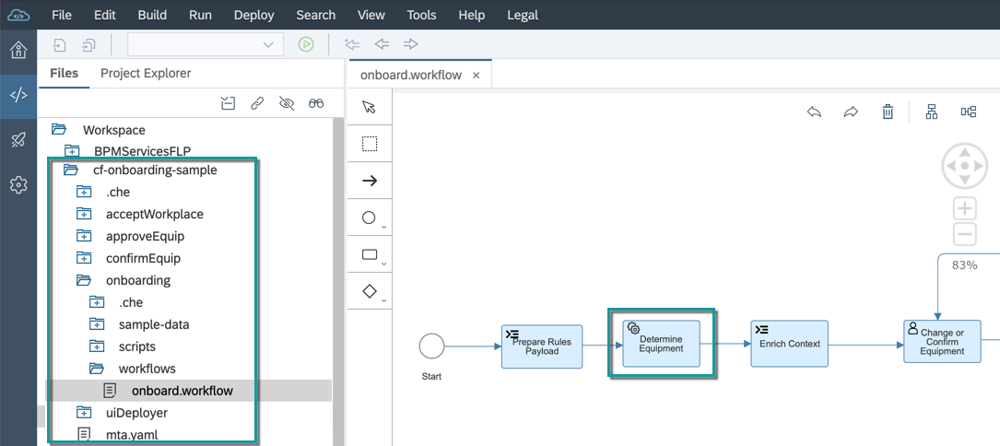

    > This sample workflow has:

    > - **Business Rules** integrated into it. You can find the integration as part of service task with name `Determine Equipment`.

    > - **User Tasks** for confirmation of the equipment selected via business rules and for the approval of equipment. You can find these user tasks with the names `Confirm and Change Equipment`, `Approve Equipment` and `Accept Workplace` respectively.  The user interface associated with these user tasks has been built using Workflow Form and you can find these under **forms** folder in the same multi target application.

[DONE]
[ACCORDION-END]

[ACCORDION-BEGIN [Step 3: ](Build and deploy sample application)]

1. Right-click the **mta.yml** file inside the **cf-onboarding-sample** project, and choose the **Build MTA** option.

    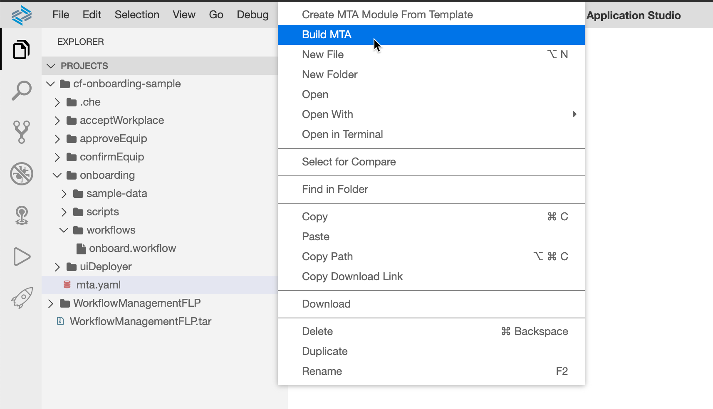

2. Once the build is completed successfully, right-click on the **`mta_archives` | `sample-onboarding.mta_0.0.1.mtar`** file and choose **Deploy MTA Archives**.

    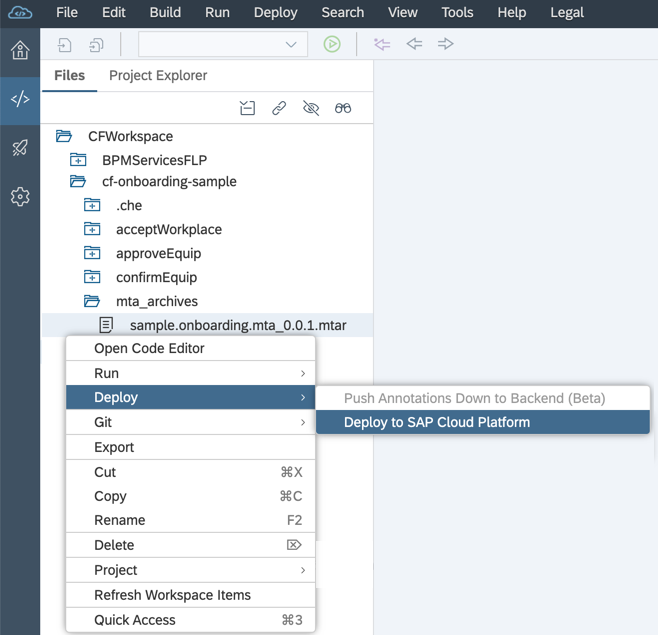

    >The deployment will fail if you have not logged in to the trial account. Check in the bottom blue bar, if you have already logged in to your trial account. If it does not show organisation-name/space-name then click on the bar and follow the wizard to login to your trial account.
    

    >A successful deployment message will be shown in the terminal once the deployment has completed successfully.
    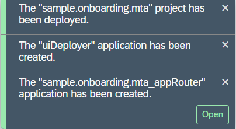

[VALIDATE_1]
[ACCORDION-END]

---
