## Details
### You will learn
  - How to quickly set up a Process Visibility scenario in your account
  - How to quickly create and activate a business scenario to provide operational end-to-end visibility into your workflow

**Process Visibility** provides visibility into processes that run in the cloud, on-premise, or in hybrid environments. Process Visibility works on events. SAP or non-SAP applications (cloud or on-premise) push events into Process Visibility.

These events are persisted, processed and enhanced to form end-to-end process instances with insights, which are visualized by business users in their process workspace. The insights enable business users to identify process bottlenecks, track process performance, and operational issues and act on them.

---

[ACCORDION-BEGIN [Step 1: ](Create a business scenario)]

1. In your web browser, open the Workflow Management application and choose **Configure Visibility Scenarios**.

    >You should have gotten the workflow management application link in the last step of the setup tutorial. The link should be like this:

    >`https://<subdomain>.cockpit.workflowmanagement.cfapps.<eu10 or us10>.hana.ondemand.com/cp.portal/site#Shell-home`

    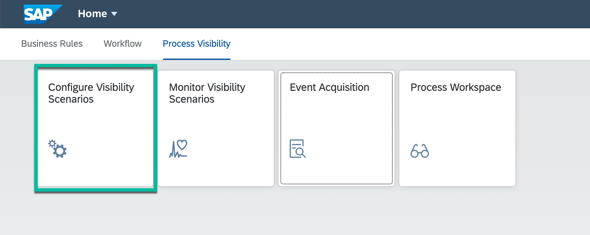

2. To create a new visibility scenario, choose **+**.

    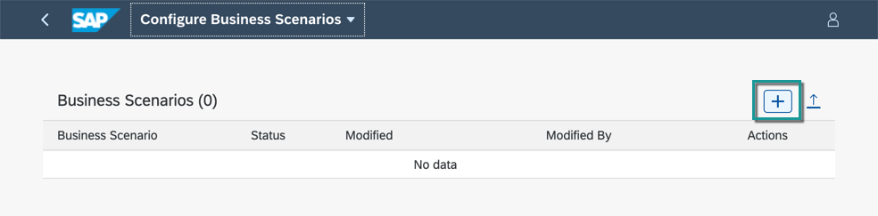

3. Enter **Name** as `Employee Onboarding`, any **Description** of your choice, and click **Create**.

    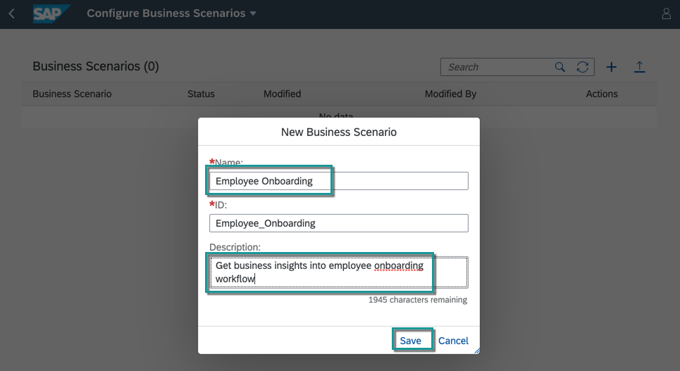

The business scenario will be created with **Draft** status.

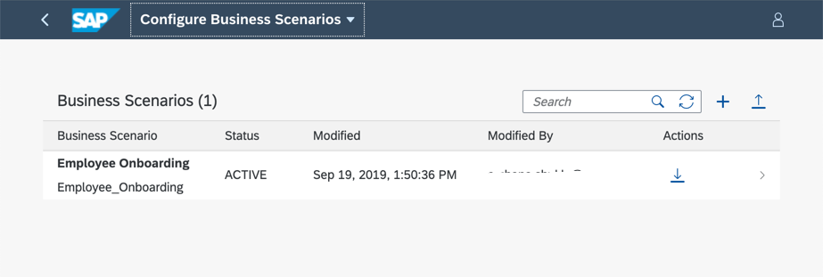

[DONE]
[ACCORDION-END]

[ACCORDION-BEGIN [Step 2: ](Add a workflow)]

1. Navigate into the newly created scenario and click the **Processes** tab, choose **+** and select **Add SAP Cloud Platform Workflow** to add workflow to business scenario.

    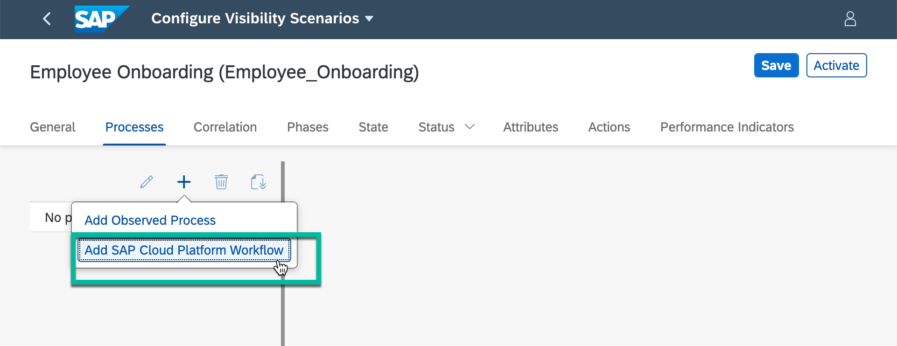

2. Select the `onboard` workflow from the choices.

    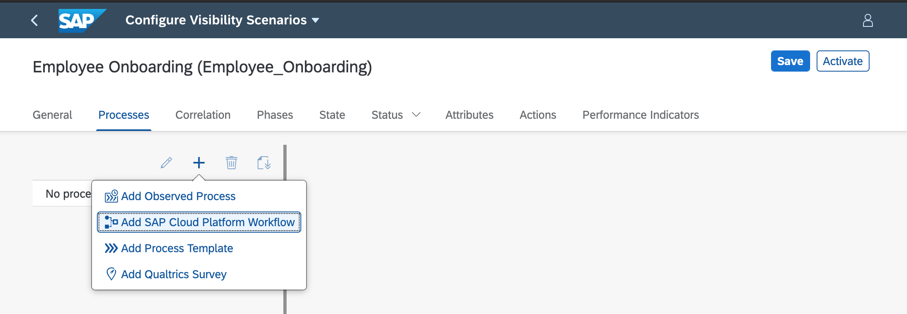

    >*onboard* is the sample workflow that you have deployed in the previous tutorial.

3. The workflow is added and all the needed **Events** and **Context** are  imported as well.

    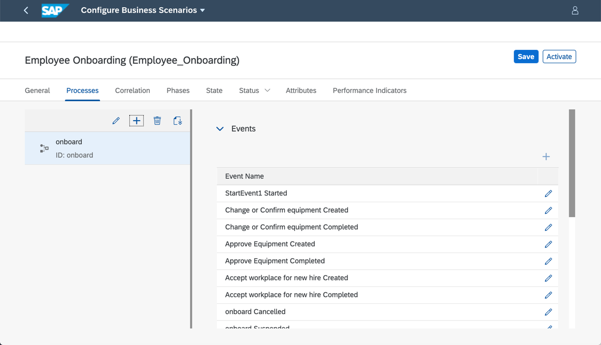

[DONE]
[ACCORDION-END]

[ACCORDION-BEGIN [Step 3: ](Configure business scenario)]

1. Switch to the **General** tab.

2. In the **Instances Label** field, enter `Onboardings` and in the **Instance Label** field enter `Onboarding`.

    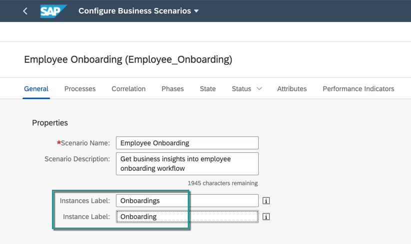

[DONE]
[ACCORDION-END]

[ACCORDION-BEGIN [Step 4: ](Configure status)]

1. Switch to the **Status** tab.

2. In the **Sub-Status** section, select **At Risk** and choose **+**.

    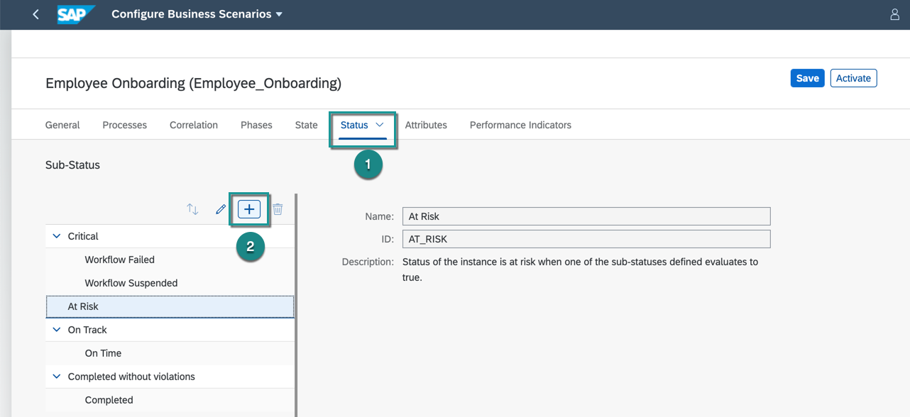

3. In the **Name** field for the risk status, enter **`Approval Pending`** or anything of your choice.

    

4. In the properties, enter the following:

    |  Field Name      | Value
    |  :-------------- | :-------------
    |  **Expression Type** | `Event A occurred and not Event B`
    |  **Event A**         | `Approve Equipment Created`
    |  **Event B**         | `Approve Equipment Completed`

    !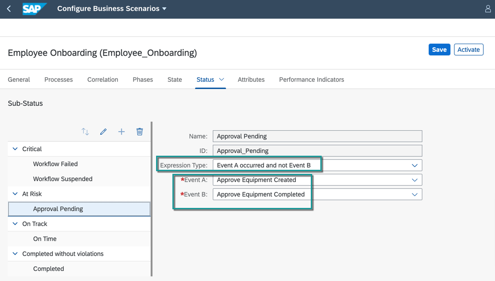

[DONE]
[ACCORDION-END]

[ACCORDION-BEGIN [Step 5: ](Activate the business scenario)]

To activate the business scenario, choose **Activate**.

>Activate operation saves and activates the scenario. Only an activated business scenario can be consumed.

!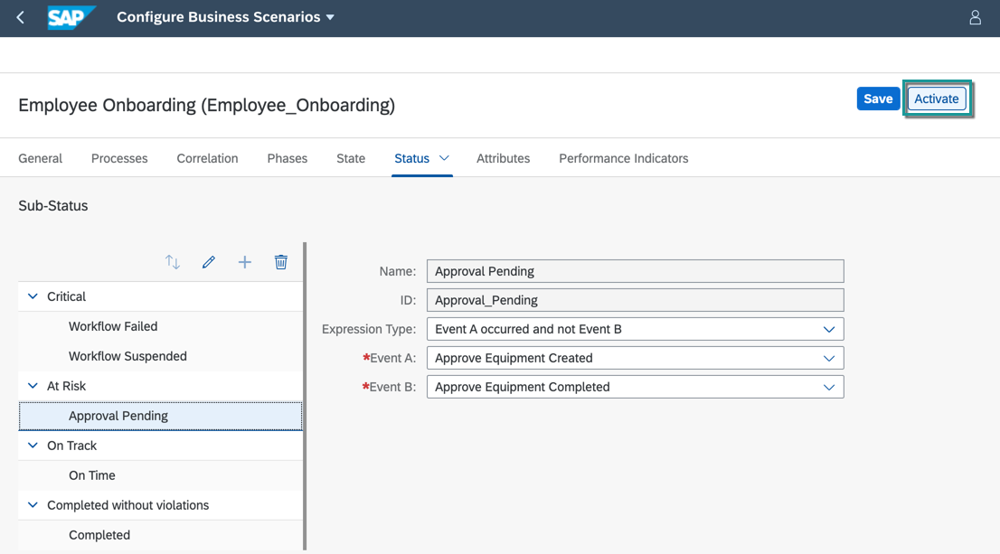

[VALIDATE_7]
[ACCORDION-END]
---
