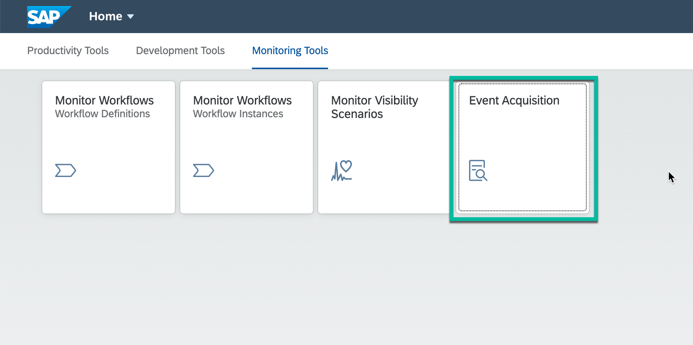
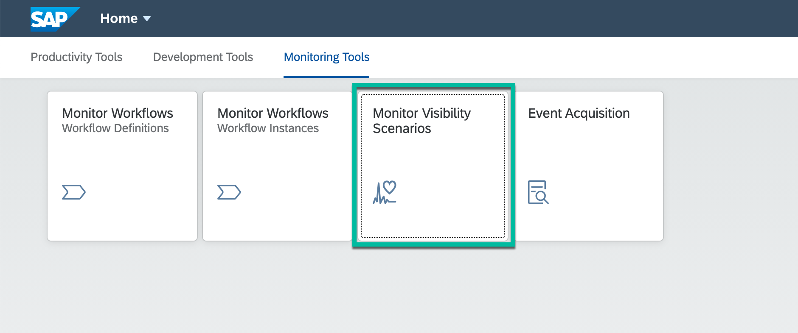
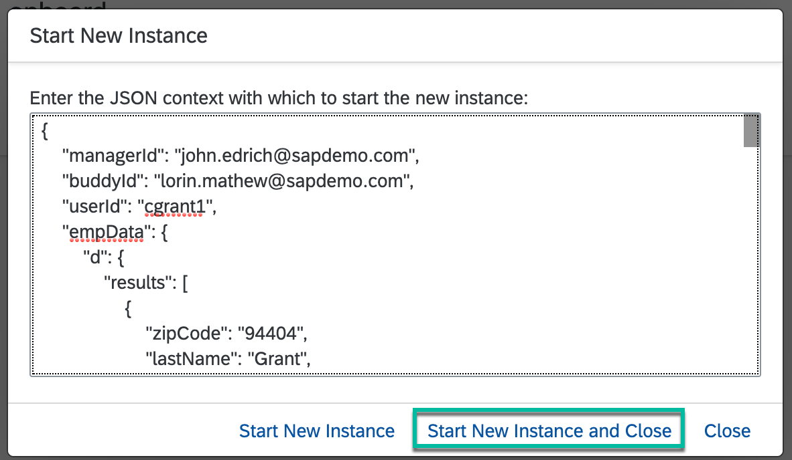
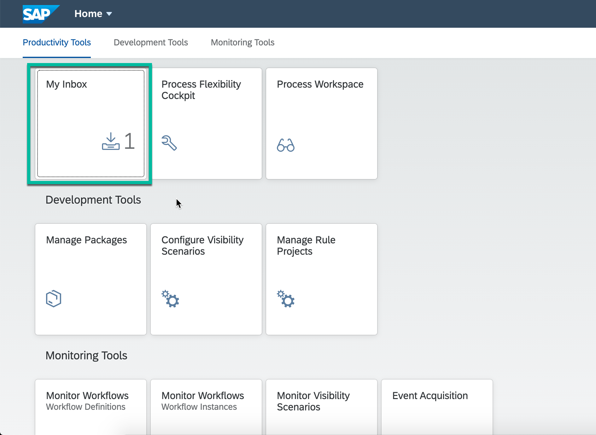
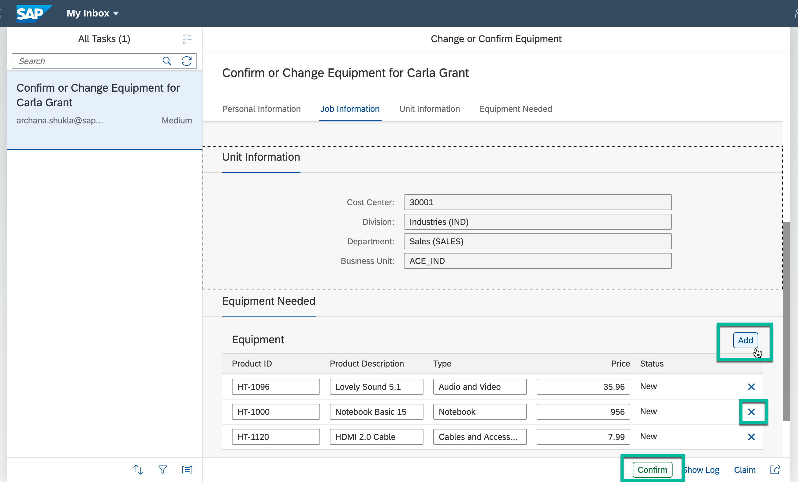

## Details
### You will learn
  - How to start the workflow from Monitor Workflow application
  - How to track and view workflow progress from Process Visibility Workspace
---

[ACCORDION-BEGIN [Step 1: ](Set up sample events for workflow)]
First, we will import sample events & data, process these events and view them in workspace using different process visibility applications. This is mainly done to give you a demo-ready workspace with pre-filled data. Later, you will run the `employee onboarding` workflow and see the process workspace being updated automatically in real time.

1. Download the events `EmployeeOnboardingEvents.json` file from [here](https://github.com/SAP-samples/cloud-process-visibility/releases/download/1.0.0/Employee_OnboardingEvents.json).

2. In the Workflow Management Fiori launchpad, click the **Event Acquisition** tile.

    >You got the workflow management application link in the last step of the setup tutorial. The link would be like:  

    > `https://<subdomain>.cockpit.workflowmanagement.cfapps.<eu10 or us10>.hana.ondemand.com/cp.portal/site#Shell-home`

    

3. To import the sample events from the downloaded events file, choose **Import**.

    

4. **Browse** to the downloaded events file location, select the file and click **Import**

    

5. Once the events are imported successfully, choose **Filter**, select **Process Definition ID** and enter `onboard` to see all the imported events.

    

    

    All the sample events are displayed.

    

[DONE]
[ACCORDION-END]

[ACCORDION-BEGIN [Step 2: ](Process the Employee Onboarding events)]

1. In the Workflow Management Fiori Launchpad, click the **Monitor Visibility Scenarios** tile.

    

2. Select `Employee Onboarding` scenario and click **Process Data**.

    !

3. **Refresh** to see the processing details.

    !

[DONE]
[ACCORDION-END]

[ACCORDION-BEGIN [Step 3: ](View the process visibility workspace)]

1. In the Workflow Management Fiori launchpad, click the **Process Workspace** tile.

    

2. Click `Employee Onboarding` scenario to open the process workspace.

    

3. The process visibility workspace for `Employee Onboarding` scenario is displayed with sample data.

    

[DONE]
[ACCORDION-END]

[ACCORDION-BEGIN [Step 4: ](Execute the workflow sample application)]

Now, you will run the workflow and see how the new events and data are automatically processed and shown in process workspace in real time.

1. In the Workflow Management Fiori launchpad, open the **Monitor Workflow - Workflow Definitions** tile to see all deployed workflow definitions.

    

2. Select the `onboard` workflow, and choose **Start New Instance**.

3. The start context is already filled. Choose **Start New Instance and Close**.

      

4. Choose **Show Instances** to see all workflow instances of the onboard workflow definition.

    !

5. Go back to the Workflow Management Fiori launchpad homepage. The **My Inbox** tile shows one open task.

    

6. Click the **My Inbox** to display the `Confirm or Change Equipment` workflow task.

    - You can add or delete the equipment, by choosing the **Add** and **Cross**  in **Equipment Needed** section.

    - To complete the task, choose **Confirm**. The task then disappears from the list.

    

[DONE]
[ACCORDION-END]

[ACCORDION-BEGIN [Step 5: ](View process visibility workspace)]

1. In the Workflow Management Fiori launchpad, open **Monitor Visibility Scenarios** application, click **Process Data** and **Refresh** to see the new batch of processed events.

    !

    > If *Schedule Job* in *ON* then the events are automatically processed at an interval of 5 minutes.

2. Go back to Workflow Management Fiori launchpad, choose the **Process Workspace** tile and open `Employee Onboarding` scenario.

    > You will notice that the **Open Instances** number has changed which means the workflow instance has been processed and its progress can be tracked from this process visibility workspace.

        

[DONE]
[ACCORDION-END]

[ACCORDION-BEGIN [Step 6: ](Continue with the workflow execution)]

1. Go back to **My Inbox** application, click **Approve** to approve the `Approve Equipment` task:

    - If you do not see the task, refresh the **My Inbox** tile to see the `Approve Equipment` task.

    The `Approve Equipment` task shows the equipment configured by the buddy. As a manager, you can either approve or reject the proposed equipment for the new hire. To complete the task, choose `Approve`.

    

2. **Refresh** the tasks list and execute the **Accept Workplace** task:

    > As a buddy, click the **Accept Workplace** to complete the task. The workflow status is set to **Completed**.

    

3. In the Workflow Management Fiori launchpad, open the **Monitor Workflow - Workflow Instances** tile, choose the filter button, select the **Status** option and choose the **Completed** status.

    

    >Now, you see the completed workflow instance. You can choose to see the **Execution Log**.

    

[VALIDATE_1]
[ACCORDION-END]

[ACCORDION-BEGIN [Step 7: ](View process visibility workspace for completed workflow)]

1. In the Workflow Management Fiori launchpad, choose **Monitor Visibility Scenarios** to process the new set of events.

    !

2. Go back to the homepage, choose **Process Workspace** tile and open the `Employee Onboarding` scenario.

    >You will see that the **Completed Instances** and **Cycle Time** numbers have changed.

    

Congratulations. With this, you have successfully completed the mission on **Automating and Extending Employee Onboarding** process using Workflow Management services. In this mission, you learned about Workflow, Business Rules and Process Visibility services of **SAP Workflow Management** and how they come together to help you automate processes and decisions, together with providing an out-of-box visibility into the workflows.

[VALIDATE_6]
[ACCORDION-END]

---
