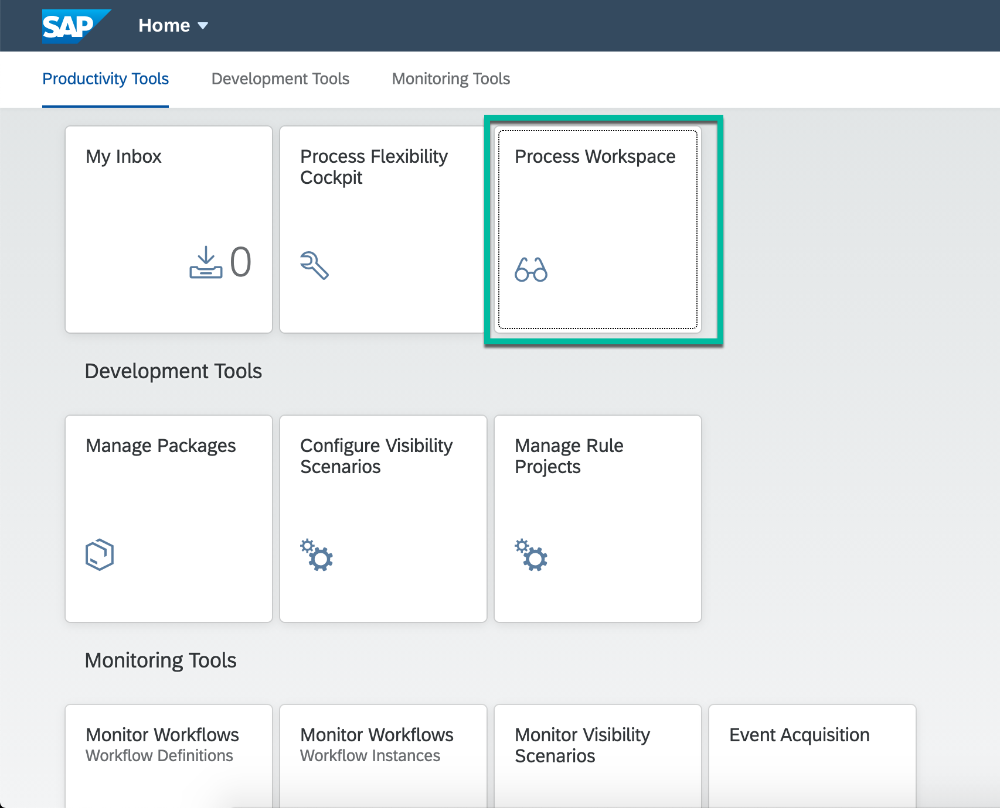
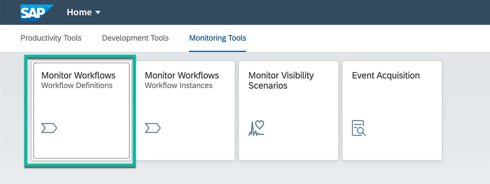
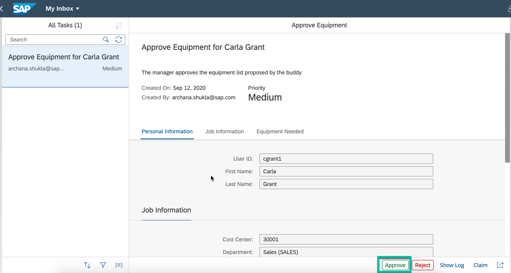
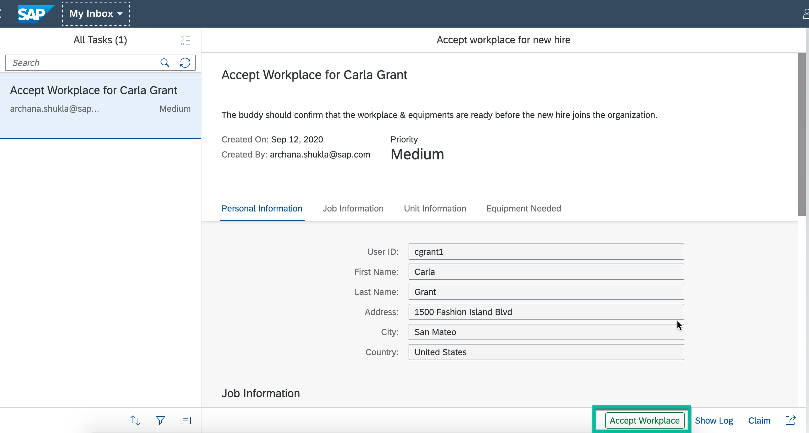

## Details
### You will learn
  - How to start the workflow from Monitor Workflow application
  - How to track and view workflow progress from Process Visibility Workspace
---

[ACCORDION-BEGIN [Step 1: ](Set up sample events for workflow)]

1. Download the events `EmployeeOnboardingEvents.json` file from [here](https://github.com/SAP-samples/cloud-process-visibility/releases/download/1.0.0/Employee_OnboardingEvents.json).

2. In the SAP Fiori launchpad, open the **Event Acquisition** application.

    >You would have gotten the launchpad link in the last step of the setup tutorial. The link would be like:  

    > `https://trial-userid-dev-bpmservicesflp-approuter.cfapps.eu10.hana.ondemand.com/cp.portal/site#Shell-home`

    

3. To import the sample events from the downloaded events file, choose **Import**.

    

4. **Browse** to the downloaded events file location, select the file and click **Import**

    

5. Once the events are imported successfully, choose **Filter** and enter `onboard` as **Process Definition ID** to see all the imported events.

    

    

    All the sample events are displayed.
    

[DONE]
[ACCORDION-END]

[ACCORDION-BEGIN [Step 2: ](Process the Employee Onboarding events)]

1. In the SAP Fiori launchpad, choose the **Monitor Scenarios** tile.

    

2. Select `Employee Onboarding` scenario and click **Process Data**.

    

3. **Refresh** to see the processing details.

    

[DONE]
[ACCORDION-END]

[ACCORDION-BEGIN [Step 3: ](View the process visibility workspace)]

1. In the SAP Fiori launchpad, choose the **Process Workspace** tile.

    

2. Click `Employee Onboarding` scenario to open the process workspace.

    

3. The process visibility workspace for `Employee Onboarding` workflow is displayed.

    

[DONE]
[ACCORDION-END]

[ACCORDION-BEGIN [Step 4: ](Execute the workflow sample application)]

1. In the SAP Fiori launchpad, open the **Monitor Workflow - Workflow Definitions** tile to see all deployed workflow definitions.

    

2. Select the `onboard` workflow, and choose **Start New Instance**.

3. The JSON context is already filled. Choose **Start New Instance**.

    > JSON context is filled as you have defined the same in workflow properties while enhancing sample workflow application.

    >Make sure you enter a valid SuccessFactors user ID. For testing use your SAP Cloud Platform trial user email ID as `buddyId` and `managerId`.

    

4. Choose **Show Instances** to see all workflow instances of the onboard workflow definition.

    

5. Go back to the SAP Fiori launchpad homepage. The **My Inbox** tile shows one open task.

    

6. Open the **My Inbox** to display the `Confirm or Change Equipment` workflow task.

    - You can add new equipment, by choosing the **+** button.

    - To complete the task, choose **Confirm**. The task then disappears from the list.
    

[DONE]
[ACCORDION-END]

[ACCORDION-BEGIN [Step 5: ](View process visibility workspace)]

1. In the SAP Fiori launchpad, open **Monitor Scenarios** application, click **Process Data** and **Refresh** to see the new batch of processed events.

    

    > In productive scenarios, you can switch on the *Schedule Job* so that the events will be automatically processed at an interval of 5 minutes.

2. Go back to SAP Fiori launchpad, choose the **Process Workspace** tile and open `Employee Onboarding` scenario.

    > You will notice the **Open Instances** number has changed which means the workflow instance has been processed and its progress can be tracked from this process visibility workspace.

        

[DONE]
[ACCORDION-END]

[ACCORDION-BEGIN [Step 6: ](Continue with the workflow execution)]

1. Go back to **My Inbox** application, execute the `Approve Equipment` task:

    - If you have assigned the the same user for `buddyId` and `managerId`, refresh the **My Inbox** tile to see the `Approve Equipment` task.

    - If you have used two different users, log off and log on using the manager user ID. Then access the **My Inbox** tile.

    - If you do not see the task then refresh the tasks list.

    The `Approve Equipment` task shows the equipment configured by the buddy. As the manager you can either approve or reject the proposed equipment for the new hire. To complete the task, choose `Approve`.

    

2. **Refresh** the tasks list and execute the **Accept Workplace** task:

    - If you have assigned the the same user for `buddyId` and `managerId`, refresh the **My Inbox** tile to see the `Accept Workplace` task.

    - If you have used two different users, log off and log on using the buddy user ID. Then access the **My Inbox** tile.

    As the buddy choose **Accept** to complete the task. The workflow status is set to **Completed**.

    

3. In the SAP Fiori launchpad, open the **Monitor Workflow - Workflow Instances** tile, choose the filter button, add the Completed status.

    

    >Now, you see the completed workflow instance. You can choose to see the **Execution Log**.

    

[VALIDATE_1]
[ACCORDION-END]

[ACCORDION-BEGIN [Step 7: ](View the process visibility workspace for completed workflow)]

1. In the SAP Fiori launchpad, choose **Monitor Scenarios** and the process the new set of events.

    

2. Choose the **Process Workspace** tile and open `Employee Onboarding` scenario.

    >You will see that the **Completed Instances** and **Cycle Time** numbers have changed.

    

[VALIDATE_6]
[ACCORDION-END]

---
