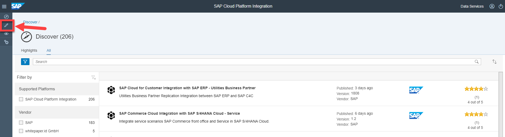
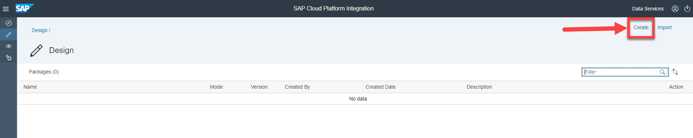
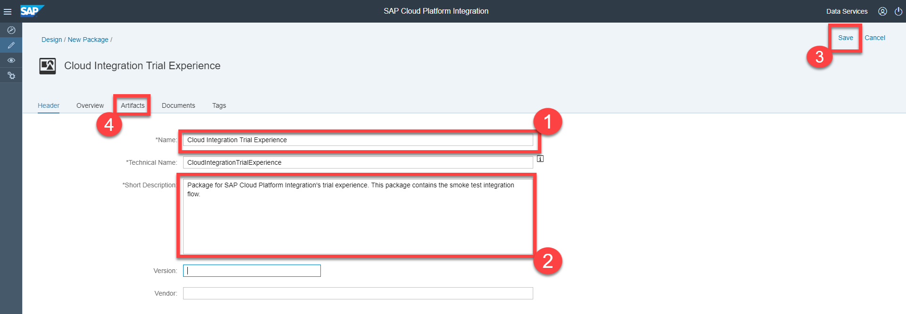
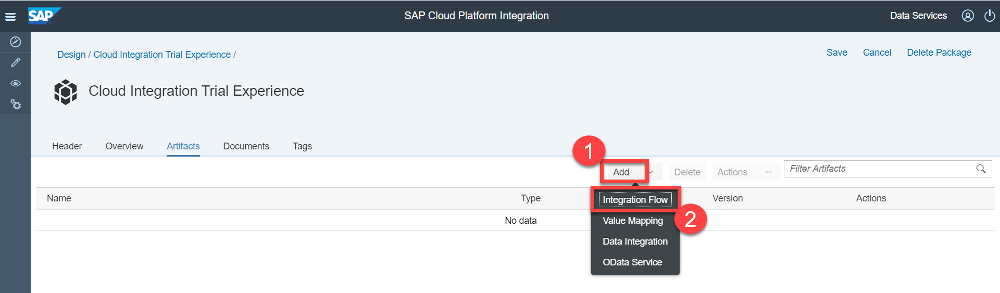
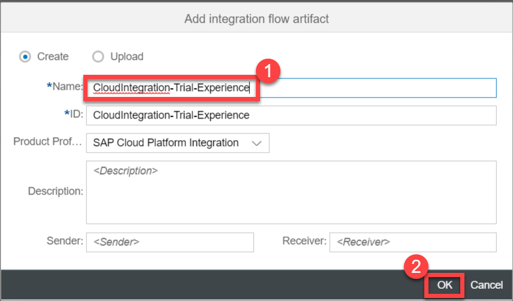
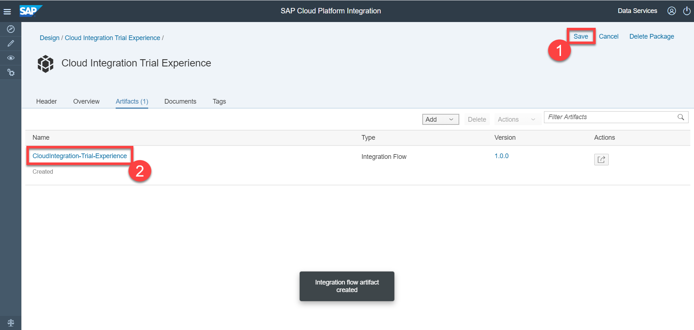

## Prerequisites
- You have provisioned and logged into your SAP Cloud Platform Integration tenant. For more information see [Set Up Your SAP Cloud Platform Integration Tenant](cp-starter-integration-cpi-onboard-subscribe)

## Details
### You will learn
  - How to create an integration package and integration flow

---

[ACCORDION-BEGIN [Step 1: ](Access your workspace)]

Click the **Discover** tab (pencil icon) to access your workspace. This is where you will create your integration package and integration flow.

This is the space where you will work on your integration flows and where you can access all your integration projects.

[DONE]
[ACCORDION-END]

[ACCORDION-BEGIN [Step 2: ](Create integration package and integration flow)]

1. Choose **Create** to create a new integration package.

    >An integration flow should be associated with an integration package.

    

    In the **Header** tab, provide a **Name** and **Short Description** for your integration package.

    >The **Technical Name** gets populated automatically based on the name that you provide.

    Choose **Save** and then choose **Artifacts** to navigate to the artifacts tab. In this tab, you will create your first integration flow.

    

2. Choose **Add** > **Integration Flow**.

    

    Enter the **Name** for integration flow and choose **OK**.

    

3. Save the integration package by choosing **Save** and open the integration flow by selecting it.

    You can then edit the integration flow to add the required steps to create your integration scenario.

    

[VALIDATE_6]
[ACCORDION-END]

---
