## Prerequisites
 - You have provisioned your SAP Integration Suite tenant. For more information, see [Set Up Integration Suite Trial](cp-starter-isuite-onboard-subscribe).

## Details
### You will learn
  - How to design and deploy an integration flow using the web-based integration flow designer
  - How to design an integration flow to fetch data from an online web shop that is available as an OData service

[ACCORDION-BEGIN [Step 1: ](Access your Cloud Integration workspace)]

    In the Integration Suite home page, click on the **Design, Develop, and Operate Integration Scenarios** tile. Alternatively, in the provisioning app, use the URL available under the **Cloud Integration** section.
    In the Cloud Integration application, click the **Design** tab (pencil icon) to access your workspace.
    This is where you will design your integration package and integration flow.

  

[DONE]
[ACCORDION-END]

  [ACCORDION-BEGIN [Step 2: ](Create an integration package and integration flow)]

  1. Choose **Create** to create a new integration package.

    >An integration flow should be associated with an integration package.

      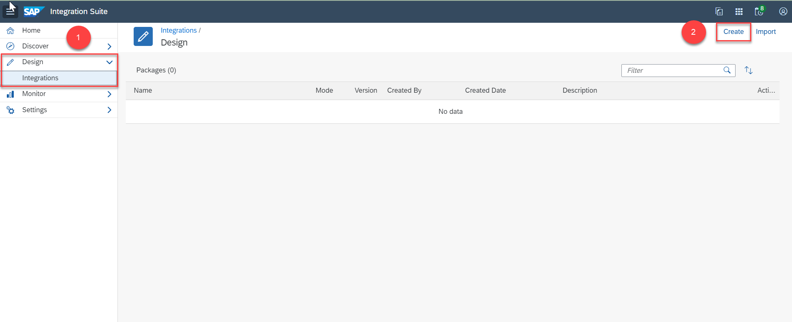

      In the **Header** tab, provide a **Name** and **Short Description** for your integration package.

    >The **Technical Name** gets populated automatically based on the name that you provide.

      Choose **Save** and then choose **Artifacts** to navigate to the artifacts tab. In this tab, you will create your first integration flow.

      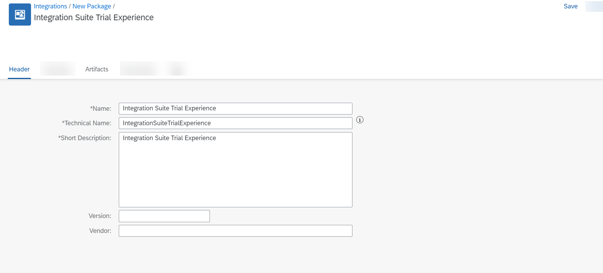

  2. Choose **Add** > **Integration Flow**.

      !

      Enter a **Name** for the integration flow and choose **OK**.

      !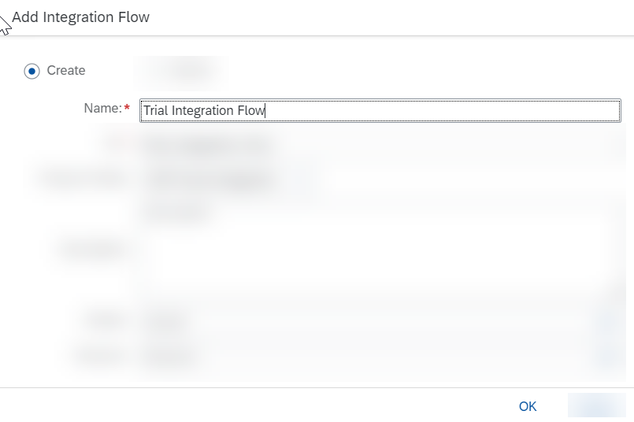

  3. Choose **Save** and open the integration flow by selecting it.

      You can then edit the integration flow to add the required steps to create your integration scenario.

      

[DONE]
[ACCORDION-END]

[ACCORDION-BEGIN [Step 3: ](Edit the integration flow)]
1. Access your integration package by choosing **Design** > **(Integration package name)**.

2. Access your integration flow by choosing **Artifacts** > **(Integration flow name)**.

3. Start editing the integration flow by choosing **Edit**.

    !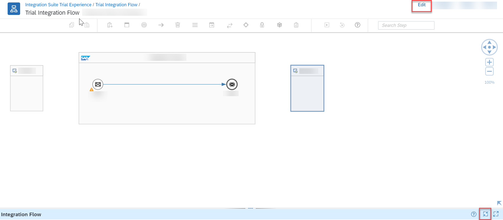

[DONE]
[ACCORDION-END]

[ACCORDION-BEGIN [Step 4: ](Connect sender channel with HTTPS adapter)]

1. Create the sender channel by clicking the arrow icon on **Sender** and dragging it to the **Start Message** step.

    !

2. In the **Adapter Type** prompt, select the **HTTPS** adapter.

    !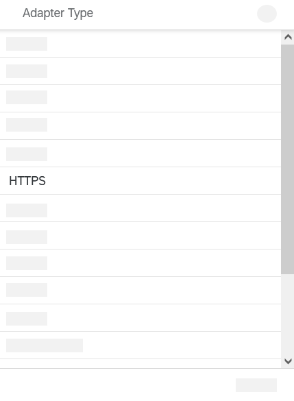

3. Select the **Connection** tab. In the **Address** field, enter **`/products/details`**.

    Optionally, you can enter any value of your choice, but ensure that you use **"/"** symbol before specifying the endpoint name. Deselect the **CSRF Protected** checkbox (this will be selected by default).

    !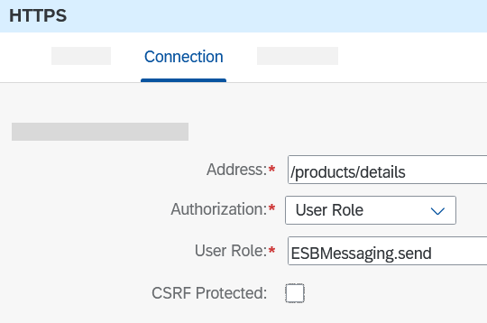

[DONE]
[ACCORDION-END]

[ACCORDION-BEGIN [Step 5: ](Add JSON to XML converter)]

1. From the palette (the grey bar on the top containing integration flow steps), choose **Message Transformers > Converter > JSON to XML Converter**.

    You add this converter because the input to the integration flow is sent in JSON format. After the input is converted into XML, the message is sent as header information to the OData service to fetch the required product details.

2. Connect the converter to the message path by clicking on the message path.
    >**TIP:** When you place your cursor on the message processing path, you see it change to green color.

    !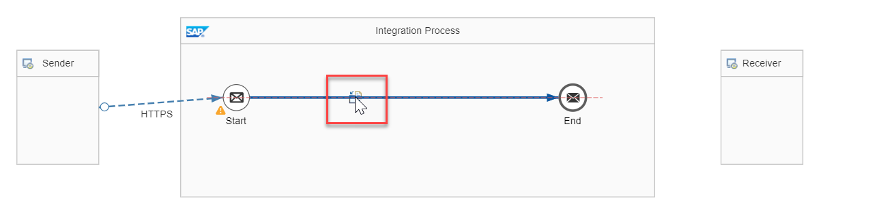

[DONE]
[ACCORDION-END]

[ACCORDION-BEGIN [Step 6: ](Add and configure content modifier)]

1. Choose **Message Transformers** > **Content Modifier** and add it to the message path, as you did for the **JSON to XML Converter**.

    !

2. Configure the **Content Modifier** by selecting **Message Header > Add** and entering the following parameters:

    |  Field Name     | Description
    |  :------------- | :-------------
    |  **Name**           | **`productIdentifier`**
    |  **Type**           | Select **`XPath`** from the dropdown list
    |  **Data Type**    | **`java.lang.String`**
    |  **Value**          | **`//productIdentifier`**

    !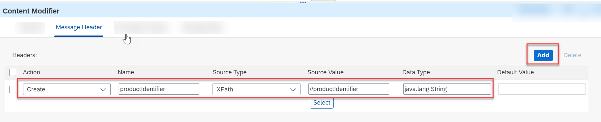

[DONE]
[ACCORDION-END]

[ACCORDION-BEGIN [Step 7: ](Add request reply step)]

From the palette, choose **Call** > **External Call** > **Request Reply**. Connect it to the message path, similar to the previous steps.

!

[DONE]
[ACCORDION-END]

[ACCORDION-BEGIN [Step 8: ](Connect request reply to receiver)]

1. Move the **Receiver** step below the **Request Reply** step by selecting it and dragging it to the desired position on the editor. You do this to ensure that your integration flow is elegantly designed.

    >**TIP:** Use the pan and zoom controls (highlighted in yellow) for resizing the canvas. Use the guidelines to ensure that **Receiver** is aligned with the **Request Reply** step.

    !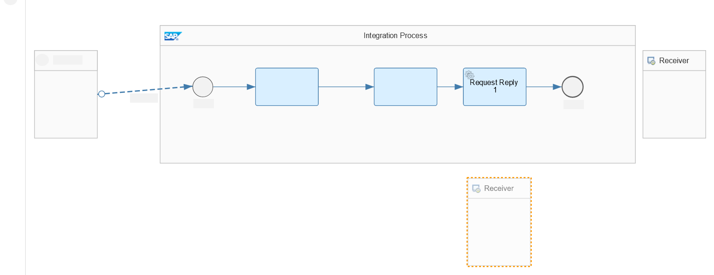

2. Connect the **Request Reply** to **Receiver** by dragging the arrow icon on **Request Reply** to the **Receiver**.

    !

3. In the **Adapter Type** prompt, select **OData**. In the **Message Protocol** prompt, select **OData V2**.

    !

    !

4. Select the **Connection** tab. In the **Address** field, enter **`https://refapp-espm-ui-cf.cfapps.eu10.hana.ondemand.com/espm-cloud-web/espm.svc`**. This is the URL of the online web shop from which you will fetch the product details.

    !

5. Select the **Processing** tab and choose **Select** in the **Resource Path** field.

    !

6. Ensure the connection details are the same and choose **Step 2**.

    !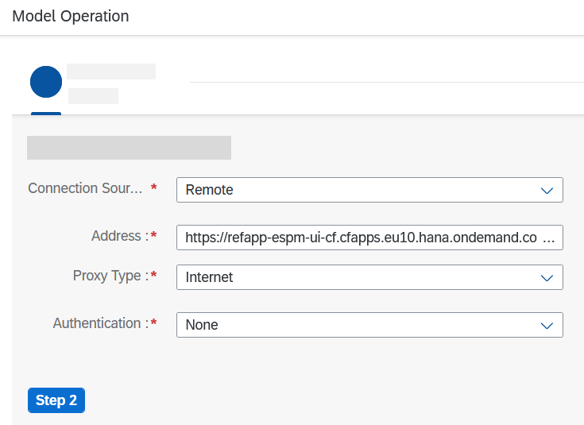

7. Click the **Select Entity** field and choose **Products** from the dropdown list.

    !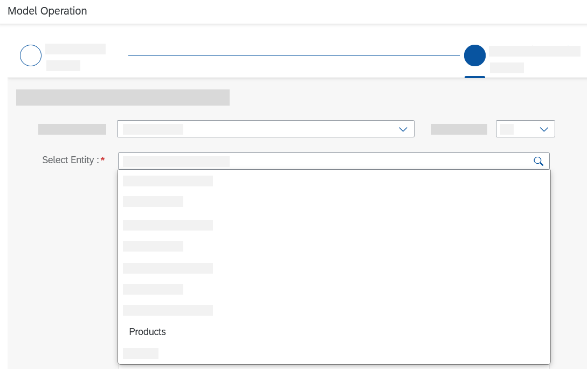

8. Enable the **Select All Fields** checkbox and choose **Step 3**.

    !

9. Choose the **Select Field** icon.

    !

10. Select **Product ID** and choose **OK**.

    !

11. In the dropdown list, select **Equal**. In the value field, enter **`${header.productIdentifier}`**. Choose **Finish**.

    !

Now you have configured the OData adapter to fetch the details of the product based on the product ID that you send as input while making the HTTP call.

[VALIDATE_6]
[ACCORDION-END]

[ACCORDION-BEGIN [Step 9: ](Deploy the integration flow)]

1. Choose **Deploy** to deploy the integration flow. Choose **Yes** in the confirmation dialog for deployment. Once you see the deployment confirmation, choose the **Operations View** tab to access the monitoring view.

    !

2. In the **Monitor** view, under the **Manage Integration Content** section, choose **All** to access all the artifacts that you have deployed. You will also see the integration flow that you have deployed here.

    !

3. Please wait till the integration flow is in status **Started**. Then, select the integration flow and in the **Endpoints** tab, choose the **Copy** icon.

    !

    You will use this endpoint in a subsequent step. You define the integration flow endpoint as application programming interface (API). You can, finally, call the integration flow API using API Management.

[DONE]
[ACCORDION-END]

Give us 55 seconds of your time to help us improve

