## Details
### You will learn
  - How to subscribe to the Process Integration service
  - How to set up your own SAP Cloud Platform Integration tenant


---

[ACCORDION-BEGIN [Step 1: ](Enter trial account and subscribe to Process Integration)]

1. In your web browser, open the [SAP Cloud Platform trial cockpit](https://cockpit.hanatrial.ondemand.com/).

2. Navigate to the trial global account by clicking **Enter Your Trial Account**.

    !

    >If this is your first time accessing your trial account, you'll have to configure your account by choosing a region (select the region closest to you). Your user profile will be set up for you automatically.  

    >Wait till your account is set up and ready to go. Your global account, your subaccount, your organization, and your space are launched. This may take a couple of minutes.

    >Choose **Continue**.

    >

3. From your global account page, choose the `trial` tile to access your subaccount.


4. Select **Subscriptions** > **Process Integration**.

    !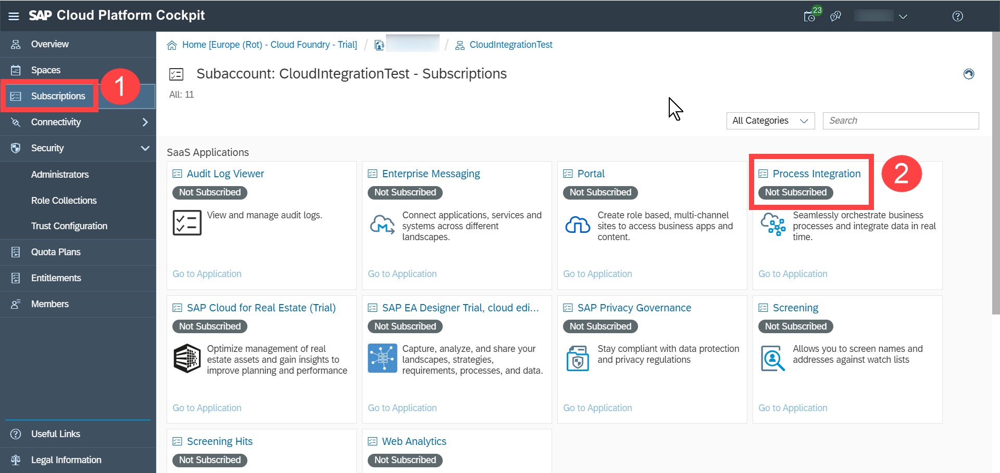

    >**IMPORTANT**:
    If you are creating sub-account for the fist time you need to configure entitlement for Process Integration in your subaccount. For more info, see [Configure Entitlements and Quotas for Subaccounts](https://help.sap.com/viewer/65de2977205c403bbc107264b8eccf4b/Cloud/en-US/5ba357b4fa1e4de4b9fcc4ae771609da.html).
    You need to add **Process Integration Runtime** and **Process Integration Trial** to the service plans.

5. Select **Subscribe**.

    

    Wait for the process to complete. The status changes to **Subscribed** in green.

    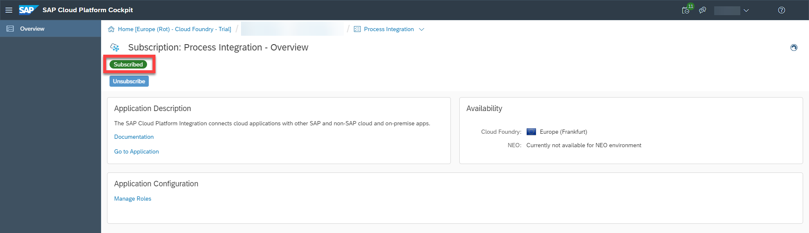

[DONE]
[ACCORDION-END]

[ACCORDION-BEGIN [Step 2: ](Assign required roles)]
>With this step, you define permissions for users accessing SAP Cloud Platform Integration. For different tasks, different role templates are predefined. Each role template contains the permissions for a set of tasks done by a typical persona such like the integration developer. We propose that you define an own role template that contains the most important role templates predefined by SAP.


1. In the breadcrumbs, select your subaccount to navigate to the subaccount level.

    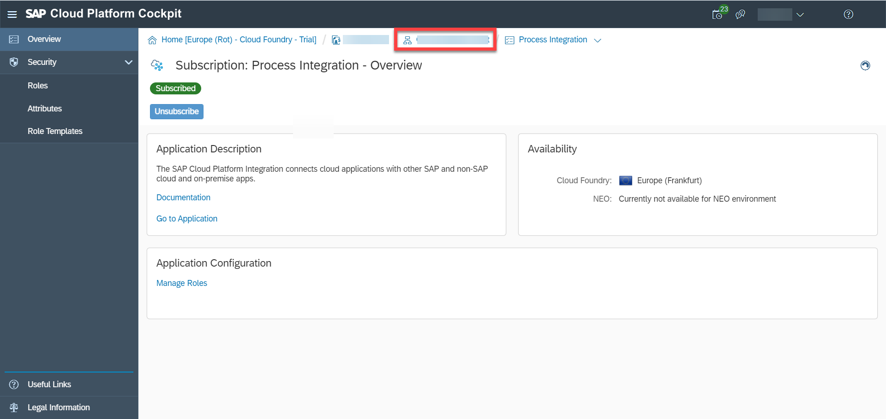

2. Select **Security** > **Role Collections** > **New Role Collection**.

    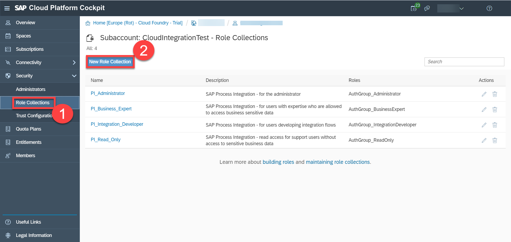

3. In the **Name** field, enter **`Tenant_Administrator`** and choose **Save**. Select the newly created **`Tenant_Administrator`** role collection.
   This newly defined role collection will be used to group all role templates predefined by SAP that you like to assign.

    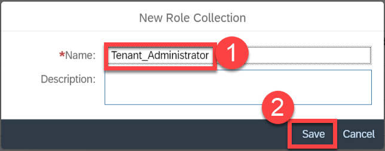

4. Choose **Add Role**. In the **Role Template** dropdown list, select **`AuthGroup_Administrator`** and click on **Save**.

    >**IMPORTANT**: If you have multiple application identifiers, choose the application identifier that starts with 'it'.

    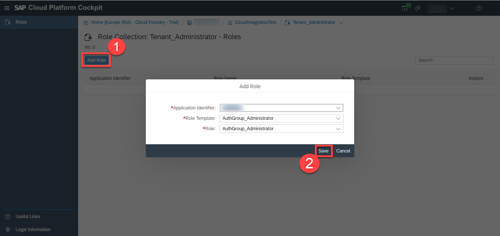

5. Using the same procedure from the previous step, add **`AuthGroup_BusinessExpert`** and **`AuthGroup_IntegrationDeveloper`** role templates to the role collection.


    !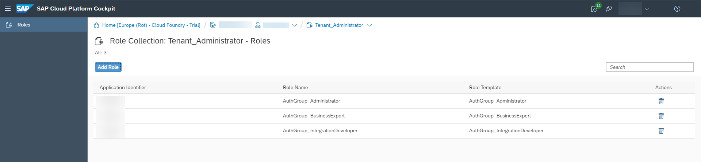

[VALIDATE_7]

[ACCORDION-END]

[ACCORDION-BEGIN [Step 3: ](Configure trust)]

>This newly defined role collection will be used to group all role templates predefined by SAP that you like to assign.

1. Select your subaccount name to navigate to your subaccount level. Select **Security** > **Trust Configuration**.

    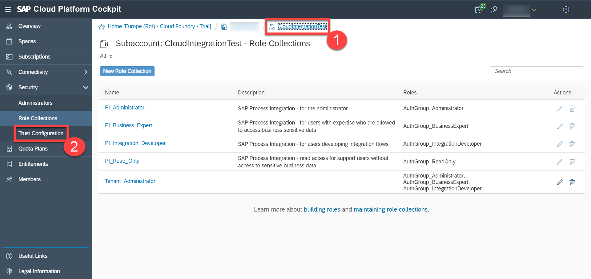

2. Select the default identity provider, **SAP ID Service** or **sap.default**.

    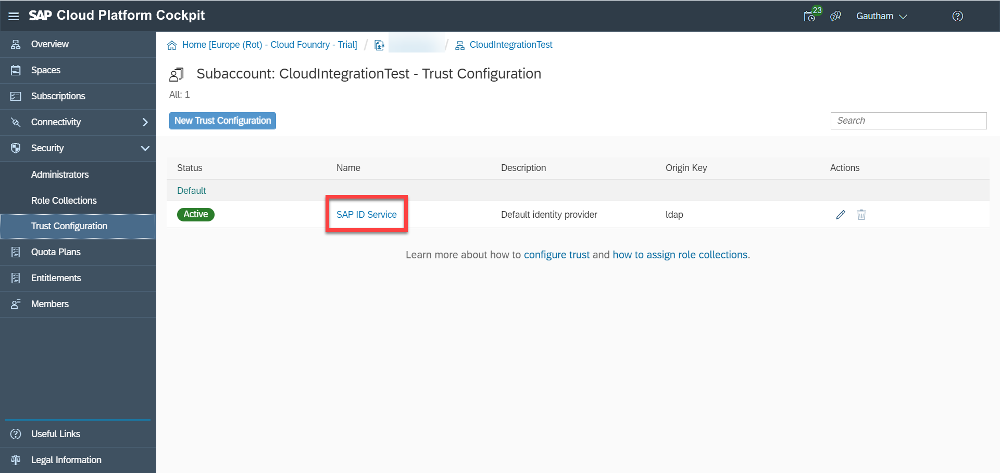

3. In the **E-Mail Address** field, enter your email ID and select **Show Assignments**. Since your user is not a part of the SAP ID Service, you get a prompt asking for the user to be added to SAP ID Service. Choose **Add User**.

    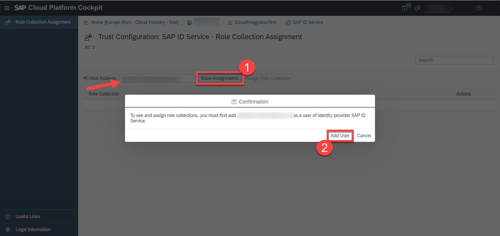

4. Select **Assign Role Collection**. In the **Assign Role Collection** prompt, choose **`Tenant_Administrator`** from the dropdown list and select **Assign Role Collection**.

    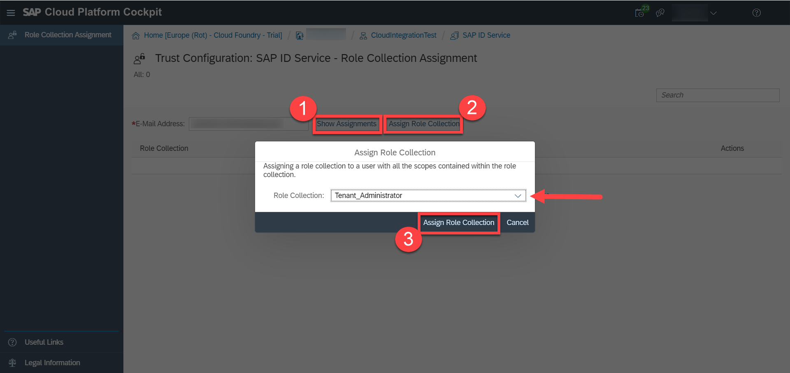

    These roles are required for you to create and model your integration flow.


[DONE]
[ACCORDION-END]

[ACCORDION-BEGIN [Step 4: ](Provision SAP Cloud Platform Integration tenant)]
1. Launch SAP Cloud Platform Integration provisioning application by choosing **`<subaccount-name>`** > **Subscriptions**.

2.  Click **Go to Application** in the **Process Integration** tile.

    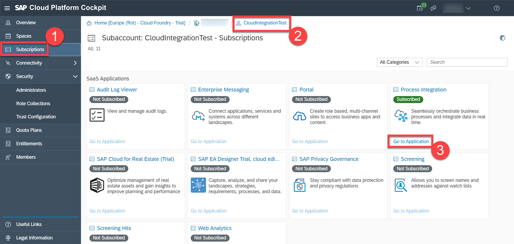

3. Login to the provisioning application by providing the same email ID and password that you used for creating the trial account. Choose **Log On**.

    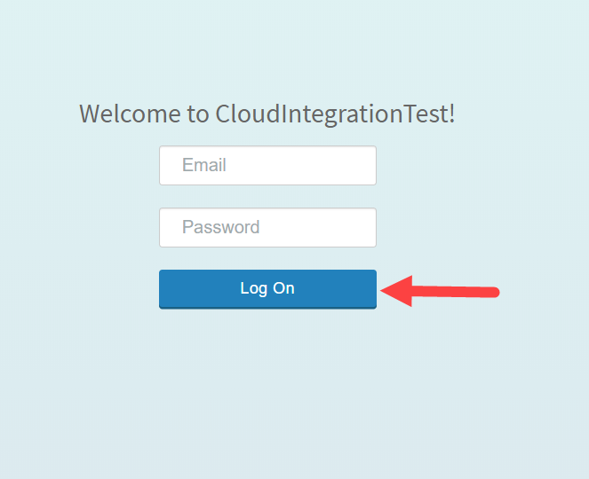

4. Choose **Activate** to provision a SAP Cloud Platform Integration tenant.

    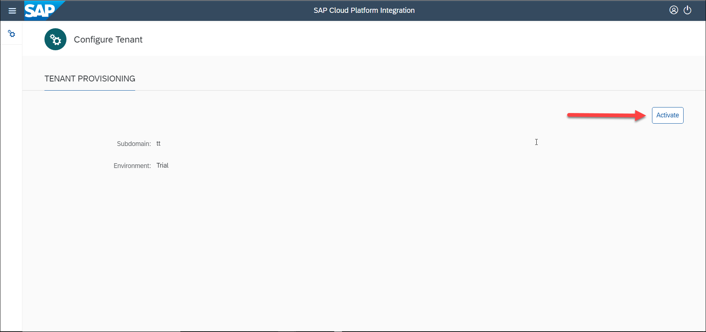

5. You see a tenant URL after the provisioning is complete. This is the URL for your SAP Cloud Platform Integration tenant.

    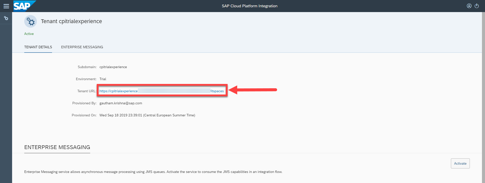

    >**IMPORTANT:** Please wait for the provisioning process to complete before you proceed to the next step. This can take several minutes.
    The service instance and key creation will only work after your tenant has been provisioned.

    Click on the URL to launch the SAP Cloud Platform Integration application. You can now create integration packages and integration flows.

    Bookmark or save this URL. This will be the URL for your SAP Cloud Platform Integration application.


[DONE]
[ACCORDION-END]

[ACCORDION-BEGIN [Step 5: ](Create service instance and key)]
## Details:
In the previous steps, you configured the security settings for human users dealing with SAP Cloud Platform Integration (by assigning role collections for persona such like integration developer and administrator, for example). In other words, you have defined the required permissions for people working with SAP Cloud Platform Integration using the Web UI when creating or testing integration flows.

With the following Step 5, you enable a remote technical system to call SAP Cloud Platform Integration and to process integration flows deployed on the tenant. The responsible service to process integration flows is the Process Integration Runtime, and in order to enable remote systems to call the Process Integration Runtime, you need to define a service instance and a service key.

You can consider a service instance as a technical user associated with the request of the remote system. To be more precise, a service instance is an OAuth client that represents the remote system calling SAP Cloud Platform Integration.
A service key contains the credentials for the service instance that are required to enable the remote system to communicate with SAP Cloud Platform Integration. With the following step, you generate credentials to authorize the remote system to call SAP Cloud Platform Integration with the basic authentication option. Authentication using client certificates is not possible with the trial tenant.


1. Navigate back to your SAP Cloud Platform's subaccount and access your subaccount's space by choosing **Spaces** > **dev**. If you have intentionally specified any other space name, you can choose the space of your choice.

    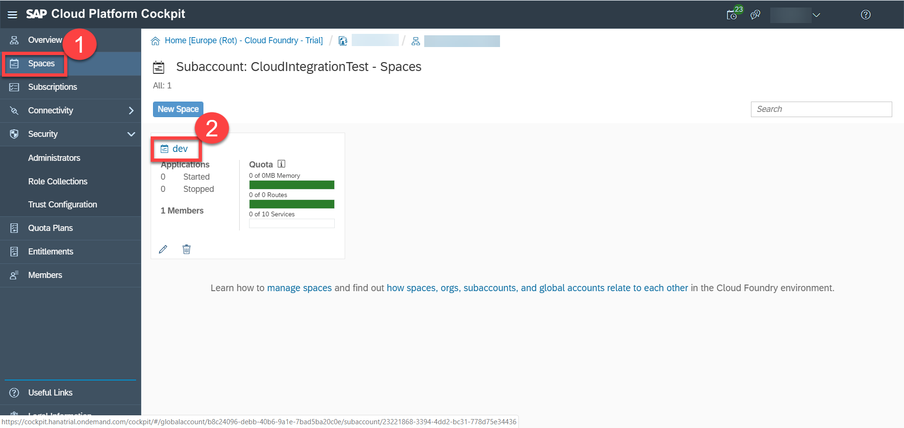

2. Choose **Services** > **Service Marketplace** > **Process Integration Runtime**.

    !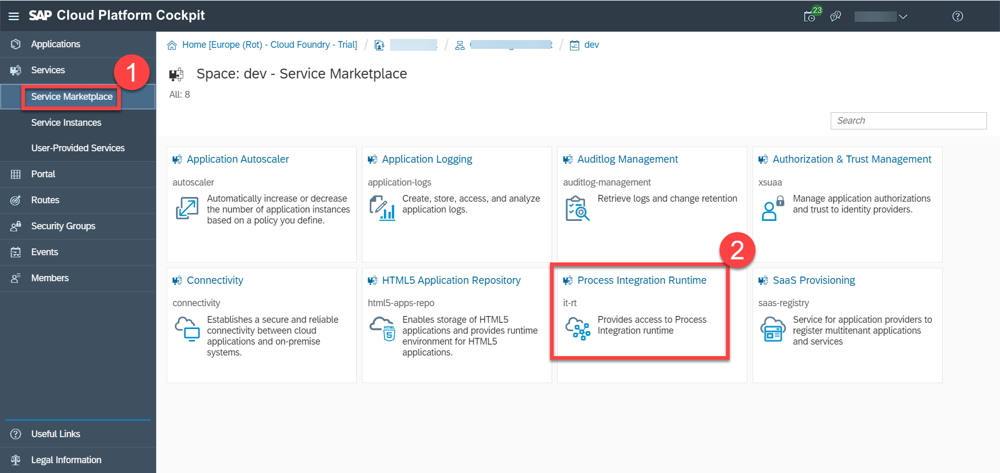

    >**TIP:** If you do not see the **Process Integration Runtime** service in the list, at the subaccount level, choose **Entitlements** > **Configure Entitlements** > **Add Service Plans**. Choose **Process Integration Runtime** and select the **integration-flow** service plan checkbox and choose **Add 1 Service Plan**.

3. Select **Instances** > **New Instance**.

    !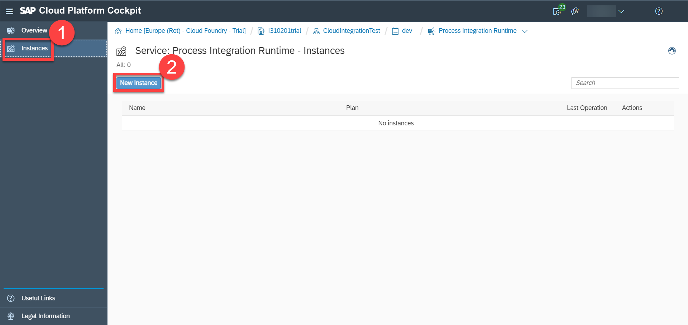

4. Choose **Next** to select the default service plan. In the **Specify Parameters** tab, enter:

    ```JSON
    {
     "roles":[
       "ESBMessaging.send"
     ]
    }
    ```
Service plan integration-flow is the only option which is preset because processing integration flows is what a remote system is doing when calling SAP Cloud Platform Integration.

    !

5. Choose **Next** until you have to specify the instance name. Provide any name of your choice and choose **Finish**.

    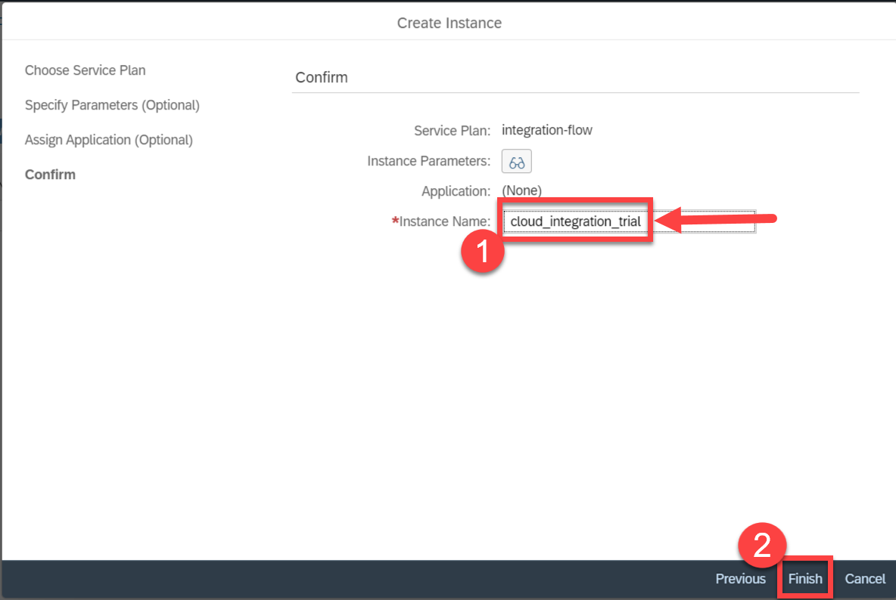

6. Select the newly created service instance.

    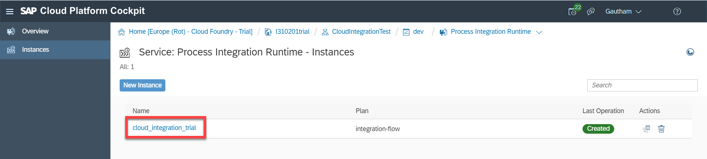

    You create this service instance to enable inbound HTTP calls to your SAP Cloud Platform Integration tenant.

7. Choose **Create Service Key** to create a new service key.

    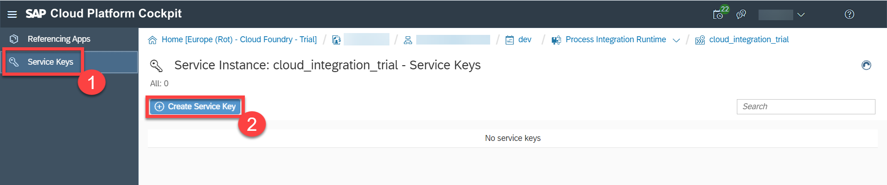

    This service key will provide you the credentials for making inbound HTTP calls to integration flows deployed on your SAP Cloud Platform Integration tenant.

8. Specify a name for the service key and choose **Save**.

    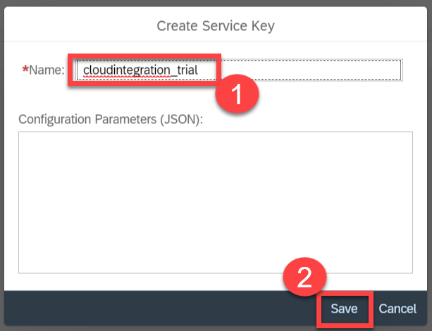

9. Copy the values of **`clientid`** and **`clientsecret`** parameters. These are the credentials that you use to make a request to your integration flow after you deploy it.

    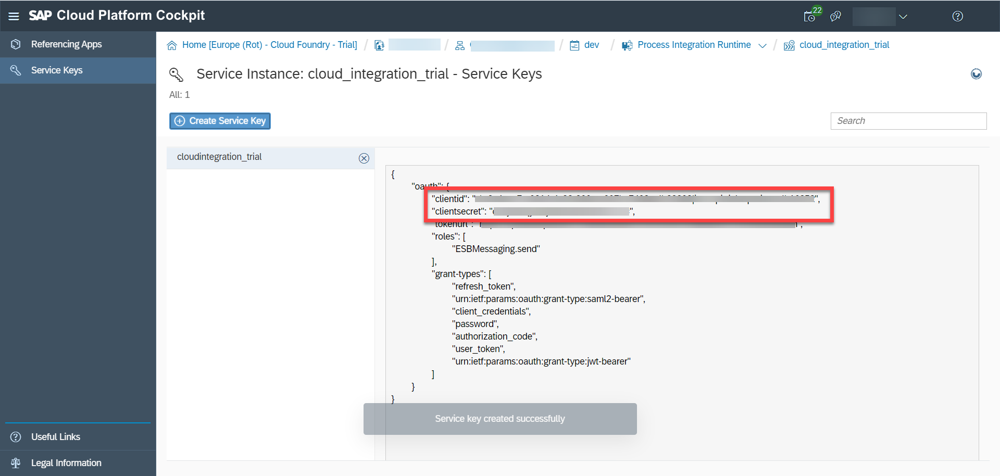

    Make a note of these credentials. You will use it when you make HTTP calls to integration flows deployed on your tenant with HTTP endpoints.


[DONE]
[ACCORDION-END]


--
