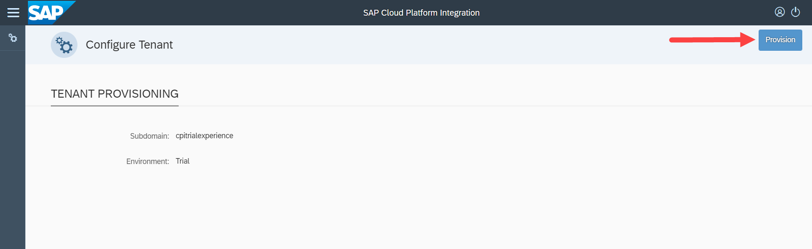

## Prerequisites
 - [Get a Free Trial Account on SAP Cloud Platform](https://developers.sap.com/tutorials/hcp-create-trial-account.html)
 - You have logged in to your SAP Cloud Platform trial account.
 - You have created a subaccount and an associated space.

## Details
### You will learn
  - How to subscribe to the Process Integration service and set-up your own SAP Cloud Platform Integration tenant

To provision your SAP Cloud Platform Integration tenant, you must first subscribe to the process integration service, assign the necessary roles to your user, and then provision your SAP Cloud Platform Integration tenant.

---

[ACCORDION-BEGIN [Step 1: ](Subscribe to Process Integration service)]
1. In your subaccount, select **Subscriptions** > **Process Integration**.

    

2. Select the **Subscribe** button.

    

    Wait for the process to complete. You will see the status change to **Subscribed** in green.

[DONE]
[ACCORDION-END]

[ACCORDION-BEGIN [Step 2: ](Assign required roles)]
1. After you see the **Subscribed** icon that confirms your subscription, select your subaccount to navigate to the subaccount level.

    

2. Select **Role Collections** > **New Role Collection**.

    

3. In the **Name** field, enter **`Tenant_Administrator`** and select **Save**. Select the newly created **`Tenant_Administrator`** role collection.

    

4. Select **Add Role**. In the **Role Template** dropdown list, select **`AuthGroup_Administrator`** and select **Save**.

    

    Similarly, add **`AuthGroup_BusinessExpert`** and **`AuthGroup_IntegrationDeveloper`** role templates and add these to the role collection.

[VALIDATE_7]

[ACCORDION-END]

[ACCORDION-BEGIN [Step 3: ](Configure trust)]

1. Select your subaccount name to navigate to your subaccount level. Select **Trust Configuration**.

    

2. Select the default identity provider, **SAP ID Service**.

    

3. In the **E-Mail Address** field, enter your email ID and select **Show Assignments**. Since your user is not a part of the SAP ID Service, you get a prompt asking for the user to be added to SAP ID Service. Choose **Add User**.

    

4. Select **Show Assignments** > **Assign Role Collection**. In the **Assign Role Collection** prompt, choose **`Tenant_Administrator`** from the dropdown list and select **Assign Role Collection**.

    

    These roles are required for you to create and model your integration flow.


[DONE]
[ACCORDION-END]

[ACCORDION-BEGIN [Step 4: ](Provision SAP Cloud Platform Integration tenant)]
1. Launch SAP Cloud Platform Integration provisioning application by choosing **<subaccount-name>** > **Subscriptions** > **Go to Application** in the **Process Integration** tile.

    

2. Login to the provisioning application by providing the same email ID and password that you used for creating the trial account. Choose **Log On**.

    

3. Choose **Provision** to provision a SAP Cloud Platform Integration tenant.

    

4. You see a tenant URL after the provisioning is complete. This is the URL for your SAP Cloud Platform Integration tenant.

    

    Click on the URL to launch the SAP Cloud Platform Integration application. You can now create integration packages and integration flows.

    Please bookmark or save this URL. This will be the URL for your SAP Cloud Platform Integration application.


[DONE]
[ACCORDION-END]

[ACCORDION-BEGIN [Step 5: ](Create service instance and key)]
1. Access your subaccount's space by choosing **Spaces** > **dev**. If you have intentionally specified any other space name, you can choose the space of your choice.

    

2. Choose **Service Marketplace** > **Process Integration Runtime**.

    

    >**TIP:** If you do not see the **Process Integration Runtime** service in the list, at the subaccount level, choose **Entitlements** > **Configure Entitlements** > **Add Service Plans**. Choose **Process Integration Runtime** and select the **integration-flow** service plan and choose **Add 1 Service Plan**.

3. Select **Instances** > **New Instance**.

    

4. Choose **Next** to select the default service plan. In the **Specify Parameters** tab, enter:

    ```JSON
    {
     "roles":[
       "ESBMessaging.send"
     ]
    }
    ```

    

5. Choose **Next** until you have to specify the instance name. Provide any name of your choice and choose **Finish**.

    

6. Select the newly created service instance.

    

    You create this service instance to enable inbound HTTP calls to your SAP Cloud Platform Integration tenant.

7. Choose **Create Service Key** to create a new service key.

    

    This service key will provide you the credentials for making inbound HTTP calls to integration flows deployed on your SAP Cloud Platform Integration tenant.

8. Specify a name for the service key and choose **Save**.

    

9. Copy the values of **`clientid`** and **`clientsecret`** parameters. These are the credentials that you use to make a request to your integration flow after you deploy it.

    

    Please make a note of these credentials. You will use it when you make HTTP calls to integration flows deployed on your tenant with HTTP endpoints.


[DONE]
[ACCORDION-END]


--
