# Expose Integration Flow Endpoint as API and Test the Flow
<!-- description --> Define the endpoint of the integration flow developed in the last tutorial as an application programming interface (API).

## Prerequisites
 - You have created and deployed an integration flow that reads product details using an OData connection. For more information, see [Design and Deploy Your First Integration Flow](cp-starter-integration-cpi-design-iflow).

## You will learn
  - How to define and expose an integration flow endpoint as an API
  - How to assign a policy to your API
  - How to call your API and execute the integration flow using the API portal
## Context
In this tutorial, you will define the endpoint of the integration flow developed in the last tutorial as an application programming interface (API).

## Intro
In addition, you will assign a policy template to the API to define how the API is called. A policy defines, for example, how an API can be called. In this tutorial, you assign a policy that defines an authentication of the API according to OAuth 2.0 client credentials grant. It is a secure way to control access to an API.

After you have performed these steps, finally, you will call the API to fetch the product details.

---

### Get endpoint of the integration flow

In this step, you copy the endpoint address of the integration flow.

1. Open your integration flow.

2. In the **Deployment Status** tab of the property sheet, choose the URL.

    <!-- border -->

3. In the **Endpoints** tab, choose **Copy** icon.

    <!-- border -->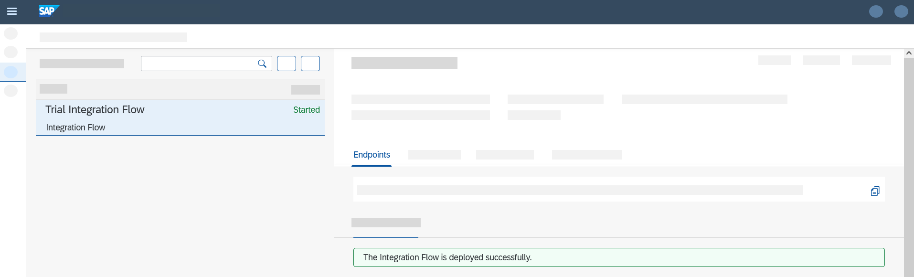

### Define the API

In this step, you define and expose an integration flow endpoint as an application programming interface

1. Choose **Settings** > **APIs** to provision the API Management capability. This provisioning might take a few seconds to complete. After the provisioning is complete, refresh your webpage.

2. Choose **Configure** > **APIs** > **Create** to create an API.

3. On the **Create API** dialog, next to **Select**: choose **URL** and specify the following parameters:
>**IMPORTANT** : Paste only the endpoint URL till **`/http/products`** Otherwise, the scenario will not run appropriately.

    |  Parameter    | Settings
    |  :------------- | :-------------
    |  URL           | Paste the integration flow endpoint address you have copied in **step 1**. It ends with **`/http/products/details`**. **Note:** paste only the endpoint URL till **`/http/products`** instead of **`/http/products/details`**.
    |  Name           | **`RequestProductDetails`**
    |  Title    | **`Product Details API`**
    |  API Base Path          | **`/products`**

    <!-- border -->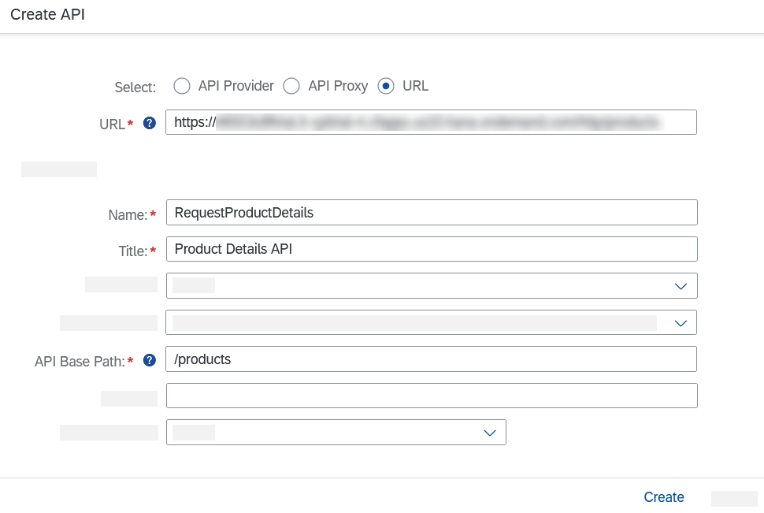

    Select **Create**.

4. On the landing page, choose **Resources** tab and then **Add**.

    <!-- border -->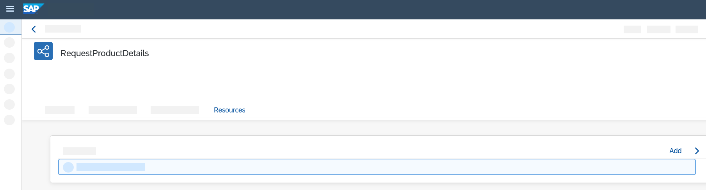

5. In field **Tag** enter **`Product Details`**, and in the field **Path Prefix** enter **`/details`**.  

    <!-- border -->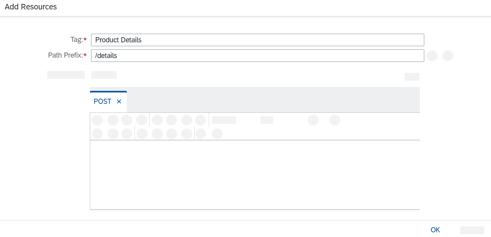

6. Under **Operations**, delete all tabs except the **POST** tab and choose **OK**.

    <!-- border -->

    The API Resource is displayed.

7. Choose **Deploy** to create and activate the API Proxy for your integration flow.

    <!-- border -->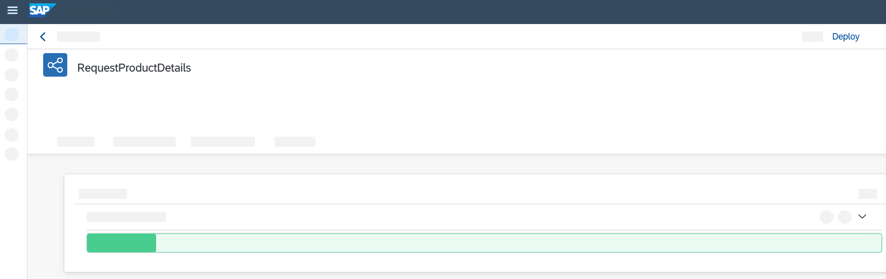

8. Choose the **POST** operation to display more details on the API. A default API definition in Open API specification format is also generated.

9. To update the generated API definition in Open API format, choose **Edit > Edit in API Designer**.

    <!-- border -->

    The API designer is opened.

10. In the editable section on the right part of the screen, make the following changes.

    Change **Payload** to **`productIdentifier`** and add a row as shown in the following screenshot.

    >**TIP**: Instead of copying the example, type it manually.

    <!-- border -->

    <!-- border -->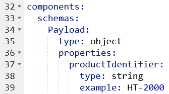

    Choose **Save**.

11. Choose **`RequestProductDetails`** and then the **Resources** tab.

    Choose the **POST** request. You notice the API changes, in particular, the request body contains now one element with a product identifier.

    <!-- border -->

12. When you choose **Try Out** and then **Execute**, since no authentication details have been configured, you get an error message with error code 401 (not authorized).

    <!-- border -->

    With this step, you have successfully created an API Proxy for your integration flow and generated an API documentation for your REST API in **`OpenAPI`** format.

### Copy credentials from service key

 In this step, you'll copy the client ID, client secret, and token URL from the service key that you automatically generated in your SAP BTP account. See: [Set Up Integration Suite Trial](cp-starter-isuite-onboard-subscribe).

1. In your SAP BTP subaccount, navigate to your service instance page. Choose **Services** > **Instances and Subscriptions**.

2. Under the **Instances** section, look out for the service instance that was created. Choose the key under the **Credentials** column to open the service key.

      <!-- border -->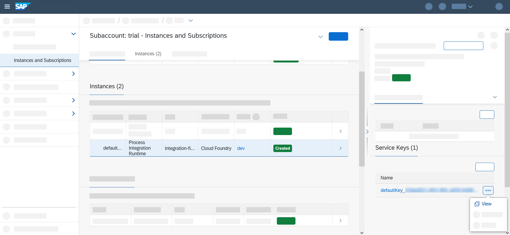

      >**TIP**: In trial accounts, the default name that the booster provides for the service instance is **default-it-rt-integration-flow**. In free tier accounts, the instance name is user-defined.

3. Copy the values of **`clientid`**, **`clientsecret`** and **`tokenurl`** parameters. These are the credentials that you use to make a request to your integration flow.

      <!-- border -->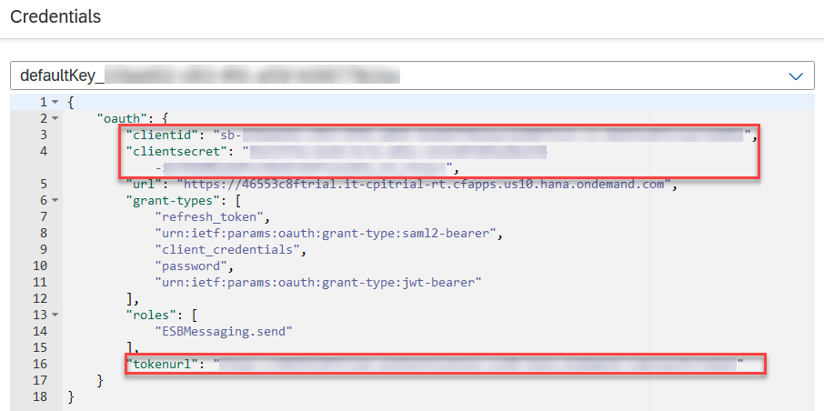

### Assign policy template

In this step, you assign a policy template to your API to specify authentication details for the API call. In particular, you use a policy template that defines that the caller of the API authenticates itself using OAuth 2.0 client credentials grant.

This grant type works in the following way: In a first call, the API client provides the values of **`clientid`** and **`clientsecret`** (from the service key generated in Step 1) to a token service (the URL of the token service is also contained in the service key definition). The token service provides an access token to the API client. In a subsequent call, the API client calls the integration flow endpoint providing the access token. If the access token is valid, the API client is authorized to call the integration flow.

1. Choose **Discover** > **APIs**.

2. Search for the package **Connect to SAP Business Technology Platform Services** and select it.

    <!-- border -->

3. Navigate to **Artifacts** tab.

    <!-- border -->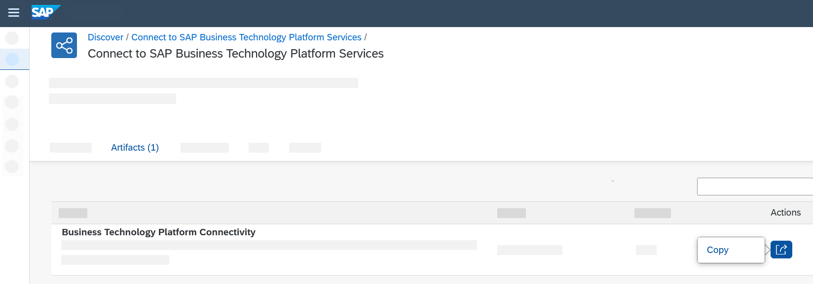

4. Under **Actions**, choose **Copy**.

    <!-- border -->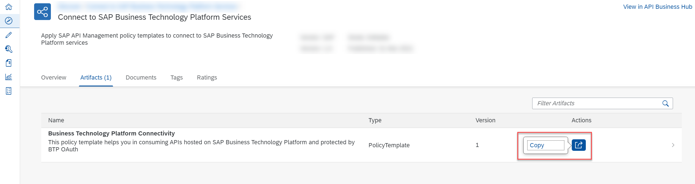

5. After the success message is displayed, navigate to the **Design** > **APIs**.

6. Choose the API that you created in the previous step.

    <!-- border -->

7. Choose **Edit**.

    <!-- border -->

8. Select **Policies**.

    <!-- border -->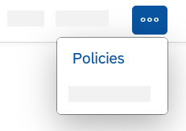

    The Policy Editor opens.

9. Choose **Policy Template --> Apply**.

    <!-- border -->

10. Select the template **`Cloud_Platform_Connectivity`** and choose **Apply**.

    <!-- border -->

11. Open the node **Target Endpoint**.

    <!-- border -->

12. Choose **`PreFlow`**.

    <!-- border -->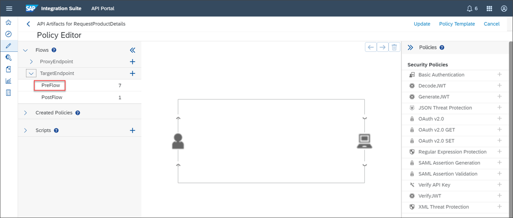

13. In the editor, the OAuth workflow defined by the policy is visualized as a graphical model.

    Now, you need the values copied from the service key: **`clientid`**, **`clientsecret`** and **`tokenurl`**.

14. In the graphical model of the **Policy Editor**, choose the **`getcredential`** shape.

    <!-- border -->

15. Paste the value of **`clientid`** and **`clientsecret`** as shown in the following image.

    <!-- border -->

16. In the Policy Editor, choose the **`getoauthtoken`** shape.

    <!-- border -->

17. Paste the value of **`tokenurl`** as shown in the following screenshot.

    >**Note**: Make sure that you append **`?grant_type=client_credentials`** to the token URL that you pasted.

    <!-- border -->

18. Select **Update**.

    <!-- border -->

19. Select **Save**.

    <!-- border -->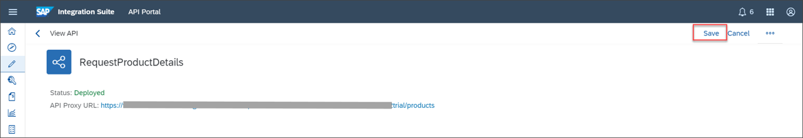

20. Select **Click to Deploy**.

    <!-- border -->

21. Confirm the deployment.

    You have assigned a policy template now.

### Execute API

In this step you try out the API to get product details as a response from the remote component.

1. Go to the **Resources tab**.

    <!-- border -->

2. Choose **Try Out**.

    <!-- border -->

3. Choose **Execute**.

    <!-- border -->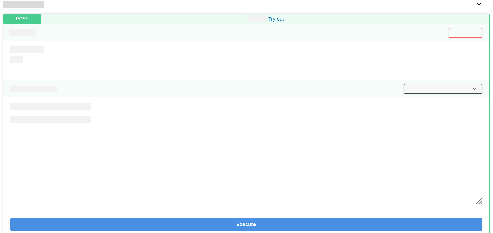

4. As result, you see the response from the **`WebShop`** with the product details for the given product identifier.

    <!-- border -->

### Congratulations!

    You have successfully set up your Integration Suite tenant, designed a simple integration flow that reads data from a remote component, and defined the integration flow endpoint as an API. Finally, you have successfully called the API to get product details as a response from the remote component.

    This scenario showed you how to use Integration Suite, and in particular, its Cloud Integration and API Management capabilities seamlessly integrated, end-to-end.

---

---
