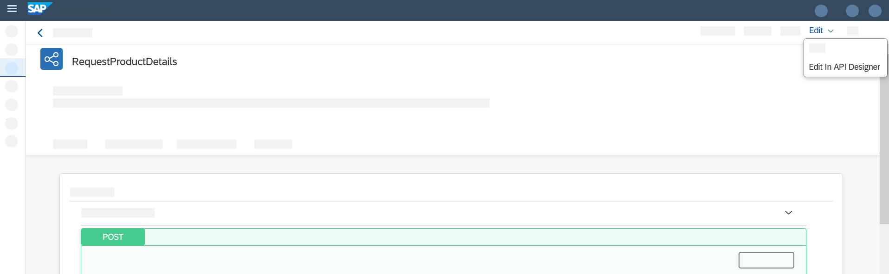
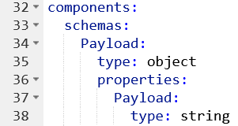
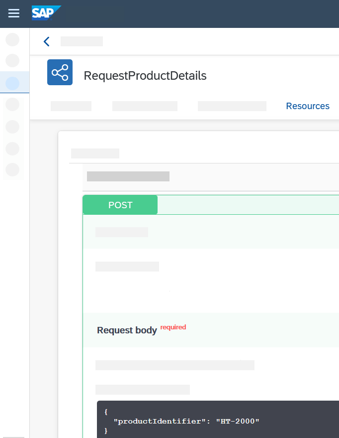
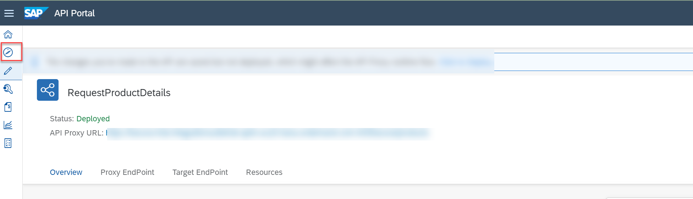
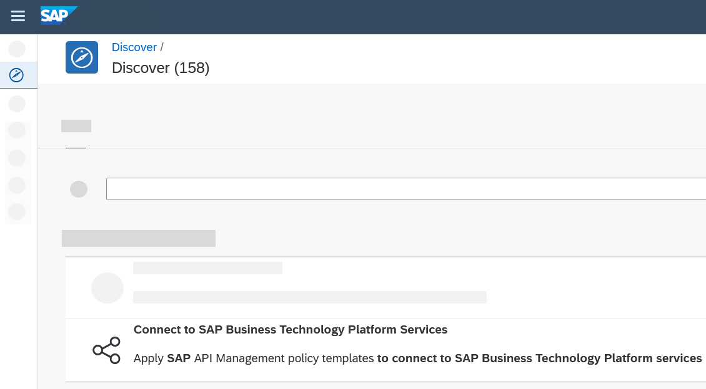
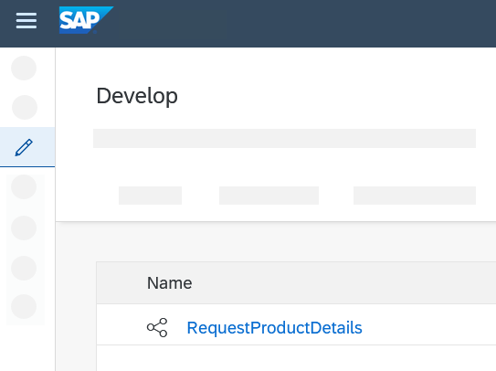
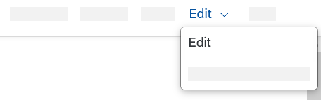
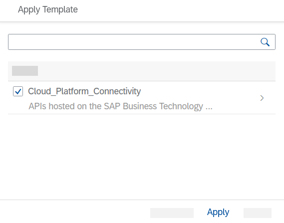
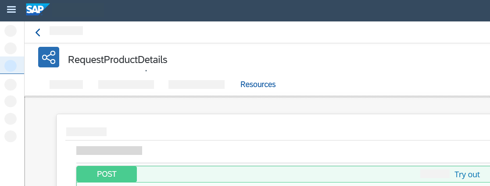

## Prerequisites
 - You have provisioned your SAP Integration Suite tenant and activated **Design, Develop and Operate Integration Scenarios** and **Design, Develop and Manage APIs**. For more information, see [Set Up Integration Suite Trial](cp-starter-isuite-onboard-subscribe).
 - You have created and deployed an integration flow that reads product details using an OData connection. For more information, see [Design and Deploy Your First Integration Flow](cp-starter-integration-cpi-design-iflow).

## Details
### You will learn
  - How to define and expose an integration flow endpoint as an API
  - How to assign a policy to your API
  - How to call your API and execute the integration flow using the API portal

In this tutorial, you will define the endpoint of the integration flow developed in the last tutorial as an application programming interface (API).

In addition, you will assign a policy template to the API to define how the API is called. A policy defines, for example, how an API can be called. In this tutorial, you assign a policy that defines an authentication of the API according to OAuth 2.0 client credentials grant. It is a secure way to control access to an API.

After you have performed these steps, you can use the **Design, Develop and Manage APIs** capability of Integration Suite to finally call the API to fetch the product details.

---

[ACCORDION-BEGIN [Step 1: ](Copy credentials from service key)]

 In this step, you'll copy the client ID, client secret, and token URL from the service key that you automatically generated using a booster in [Set Up Integration Suite Trial](cp-starter-isuite-onboard-subscribe).

1. Navigate to your service instance page which you earlier opened at the end of [Set Up Integration Suite Trial](cp-starter-isuite-onboard-subscribe). You can access this from your subaccount. Choose **Services** > **Instances and Subscriptions**.

2. Under the **Instances** section, look out for the service instance that was created by the booster. Usually the default name that the booster provides is **default-it-rt-integration**. Choose the service instance.

3. Under the **Service Keys** section, open the service key to view its content.

      !

4. Copy the values of **`clientid`**, **`clientsecret`** and **`tokenurl`** parameters. These are the credentials that you use to make a request to your integration flow.

      !

[DONE]
[ACCORDION-END]

[ACCORDION-BEGIN [Step 2: ](Get endpoint of the integration flow)]
In this step, you copy the endpoint address of the integration flow.

1. Go to the Cloud Integration Web UI.

2. In the **Monitor view**, under the **Manage Integration Content** section, choose **All** to access all the artifacts that you have deployed. You will also see the integration flow that you have deployed here.

    !

3. Select the integration flow and in the **Endpoints** tab, choose **Copy** icon.

    !

[DONE]
[ACCORDION-END]

[ACCORDION-BEGIN [Step 3: ](Define the API)]
In this step, you define and expose an integration flow endpoint as an application programming interface

1. Go to your SAP BTP trial subaccount. Select **Instances and Subscriptions**. In the **Subscriptions**, section, find **Integration Suite** and select **Go to Application**.

    !

2. On the Integration Suite welcome page, click **Design, Develop and Manage APIs**.

    !

3. On the home page, under **Quick Actions** click **API**.

    !

4. On the **Create API** dialog, next to **Select**: choose **URL** and specify the following parameters:
>**IMPORTANT** : Copy only the endpoint URL till **`/http/products`** Otherwise, the scenario will not run appropriately.

    |  Parameter    | Settings
    |  :------------- | :-------------
    |  URL           | Paste the integration flow endpoint address you have copied in **step 2**. It ends with **`/http/products/details`**. **Note:** copy only the endpoint URL till **`/http/products`** instead of **`/http/products/details`**.
    |  Name           | **`RequestProductDetails`**
    |  Title    | **`Product Details API`**
    |  API Base Path          | **`/products`**

    !
    Select **Create**.

5. On the landing page, select tile **Resources**.

6. Select **Add**.

    !

7. In field **Tag** enter **`Product Details`**, and in field **Path Prefix** enter **`/details`**.  

    !

8. Under **Operations**, delete all tabs except the **POST** tab and click **OK**.

    !

    The API Resource is displayed.

9. Select **Deploy** to create and activate the API Proxy for your integration flow.

    !

10. Click the **POST** operation to display more details on the API. A default API definition in Open API specification format is also generated.

11. To update the generated API definition in Open API format, select **Edit > Edit in API Designer**.

    !

    The API designer is opened.

12. In the editable section on the right part of the screen, make the following changes.

    Change **Payload** to **`productIdentifier`** and add a row as shown in the following screenshot.

    >**TIP**: Instead of copying the example, type it manually.

    **Before**
    !

    **After**
    !

    Select **Save**. You are navigated to the APIs list view.

13. To view or edit your API Proxy changes, click the name of the API **`RequestProductDetails`**.

    !

14. Go to tab **Resources**, and click the **POST** request.

    !

    You notice the API changes, in particular, the request body contains now one element with a product identifier.

    !

15. When you click **Try Out** and then **Execute**, since no authentication details have been configured, you get an error message with error code 401 (not authorized).

    !

    With this step, you have successfully created an API Proxy for your integration flow and generated an API documentation for your REST APIs in **`OpenAPI`** format.

[DONE]
[ACCORDION-END]

[ACCORDION-BEGIN [Step 4: ](Assign policy template)]
In this step, you assign a policy template to your API to specify authentication details for the API call. In particular, you use a policy template that defines that the caller of the API authenticates itself using OAuth 2.0 client credentials grant.

This grant type works in the following way: In a first call, the API client provides the values of **`clientid`** and **`clientsecret`** (from the service key generated in Step 1) to a token service (the URL of the token service is also contained in the service key definition). The token service provides an access token to the API client. In a subsequent call, the API client calls the integration flow endpoint providing the access token. If the access token is valid, the API client is authorized to call the integration flow.

1. In API Portal, in the navigation area, navigate to section **Discover**.

    !

2. Search for the package **Connect to SAP Business Technology Platform Services**. Choose the package.

    !

3. Navigate to **Artifacts** tab.

    !

4. Under **Actions**, select **Copy**.

    !

5. After a success message is displayed, select section **Develop**.

    !

6. Select your API proxy.

    !

7. Choose **Edit**.

    !

8. Select **Policies**.

    !

    The Policy Editor opens.

9. Choose **Policy Template --> Apply**.

    !

10. Select the template **`Cloud_Platform_Connectivity`** and click **Apply**.

    !

11. Open the node **Target Endpoint**.

    !

12. Click **`PreFlow`**.

    !

13. In the editor, the OAuth workflow defined by the policy is visualized as a graphical model.

    Now, you need the values from the service key that you copied in **Step 1: Copy credentials from service key**. You need the values of **`clientid`**, **`clientsecret`** and **`tokenurl`**.

14. In the graphical model of the **Policy Editor**, click the **`getcredential`** shape.

    !

15. Paste the value of **`clientid`** and **`clientsecret`** as shown in the following image.

    !

16. In the Policy Editor, click the **`getoauthtoken`** shape.

    !

17. Paste the value of **`tokenurl`** as shown in the following screenshot.

    !

18. Select **Update**.

    !

19. Select **Save**.

    !

    In this step you have assigned a policy template.

[VALIDATE_4]
[ACCORDION-END]

[ACCORDION-BEGIN [Step 5: ](Execute API)]

In this step you try out the API to get product details as a response from the remote component.

1. Go to the **Resources tab**.

    !

2. Click **Try Out**.

    !

3. Click **Execute**.

    !

4. As result, you see the response from the **`WebShop`** with the product details for the given product identifier.

    !

[DONE]
[ACCORDION-END]

---

Congratulation!

You have successfully set up an Integration Suite trial, designed a simple integration flow that reads data from a remote component, and defined the integration flow endpoint as an API. Finally, you have successfully called the API to get product details as a response from the remote component.

This scenario showed you how to use Integration Suite, and in particular, its Cloud Integration and API Management capabilities seamlessly integrated, end-to-end.

---
