## Prerequisites
- You have provisioned a Cloud Integration tenant.
- You have set up connectivity from your Cloud Integration tenant with your Gmail account. Refer to the tutorial[Establish Connectivity between Cloud Integration and Gmail Account.](cp-starter-isuite-establish-connectivity)
- You have the URL of the [web shop](https://refapp-espm-ui-cf.cfapps.eu10.hana.ondemand.com/webshop/index.html)


## Details
### You will learn
  - How to design an integration flow
  - How to fetch the product details using a scenario

---

[ACCORDION-BEGIN [Step 1: ](Design your integration flow)]
1. Choose the Design tab and select Create to create a new integration package.

    !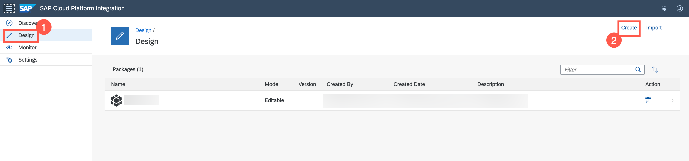

2. Enter a **Name** and **Short Description** for your integration package. Optionally, you can also specify a **Version** and **Vendor**, but we will not use it for this exercise. Then, choose **Save**.

    !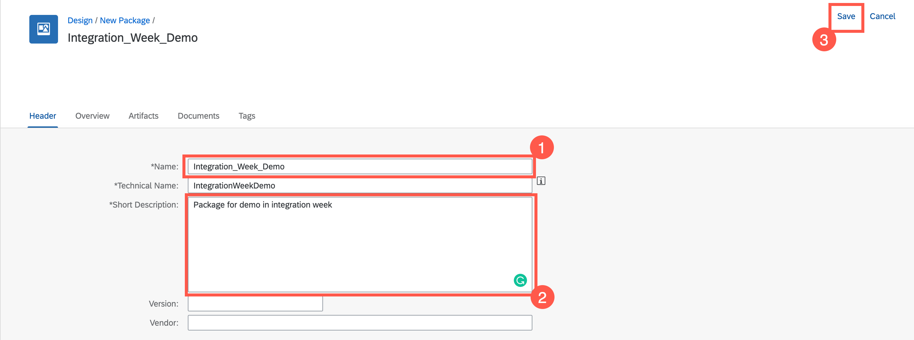

3. Navigate to the **Artifacts** tab. In the **Add** dropdown, select an **Integration Flow**. This action will add a new integration flow to the integration package you just created.

    !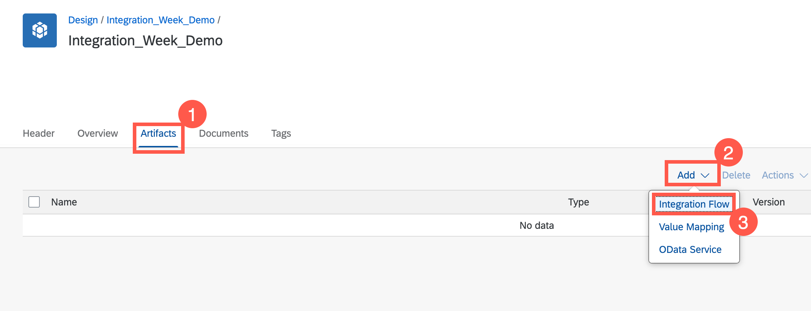

4. Provide a **Name** and **Description** (optional) for your integration flow and choose **OK**.

    !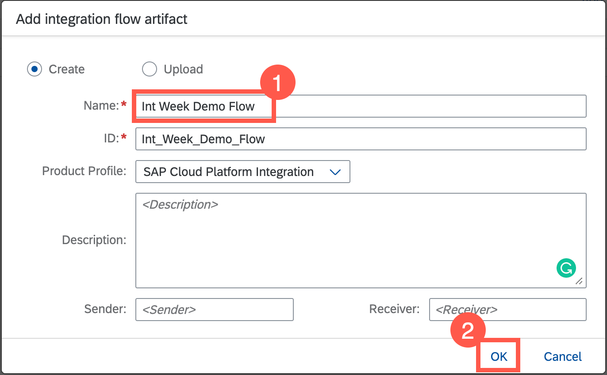

5. Select the integration flow and choose **Edit** to start editing the flow.

    !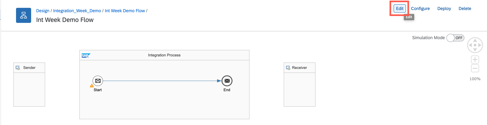

6. Using the connector icon, connect the **Sender** to the **Start Message** step.

    !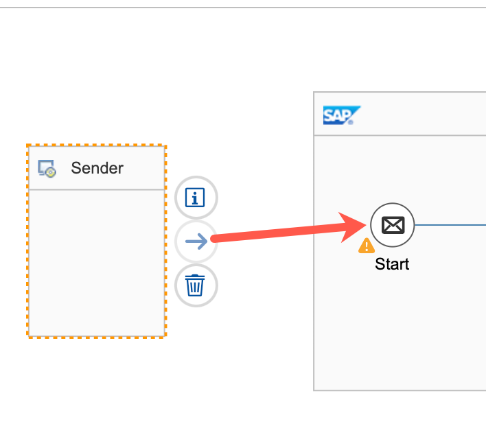

7. In the **Adapter Type** dialog, select **HTTPS**. Here, you are assigning the **HTTPS** adapter to the sender channel.

    !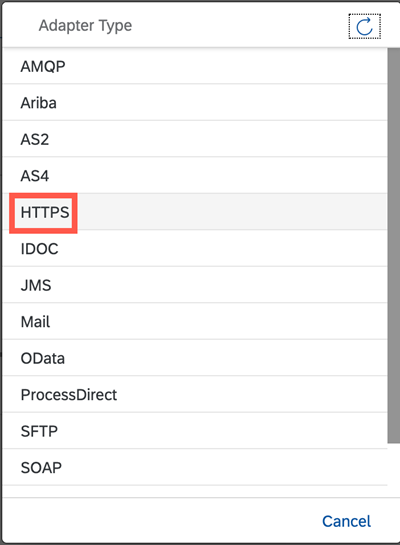

8. In the adapter properties sheet, choose the **Connection** tab. In the **Address** field, enter a "/" followed by a value of your choice to give a unique identifier to the HTTP endpoint. This will be the endpoint you will call using Postman.  Also, disable the **CSRF Protected** checkbox.

    !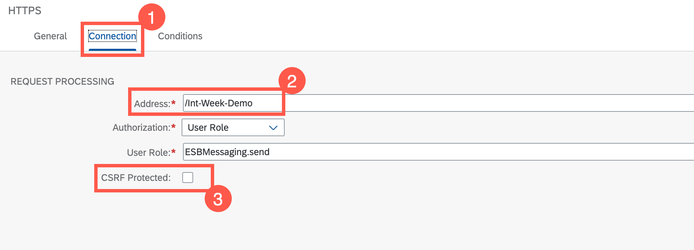

9. Resize the **Integration Process** to ensure it has enough space to accommodate all integration flow steps by using the handles indicated below.

    !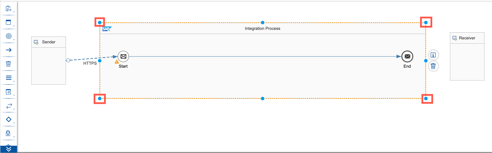

[DONE]
[ACCORDION-END]


[ACCORDION-BEGIN [Step 2: ](Add JSON to XML converter)]
1. From the palette, select the **JSON to XML Converter** and add it in the integration flow.

    !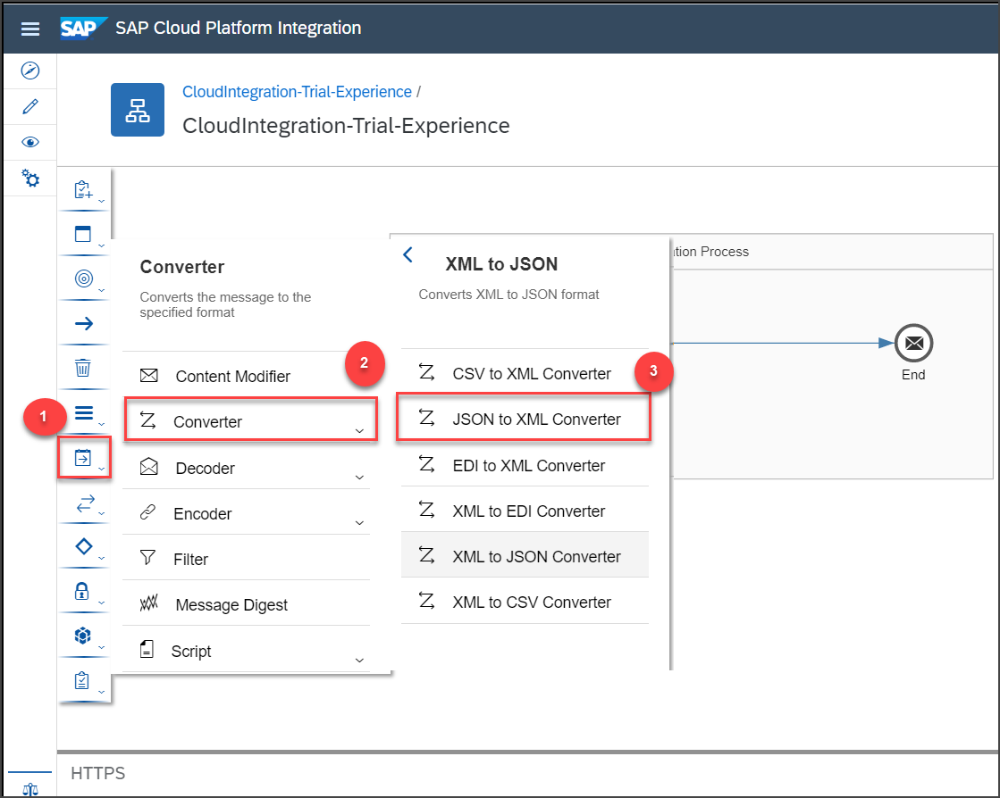

    Add it in the integration flow.

    !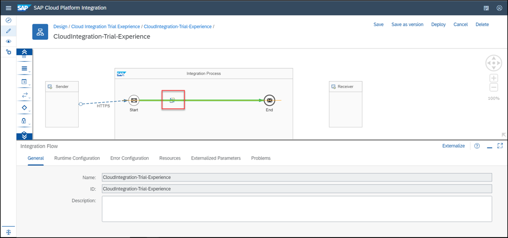

2. Add the Content Modifier to the integration flow. You use this step to read the product ID you provided as input and set it as a header value.

    !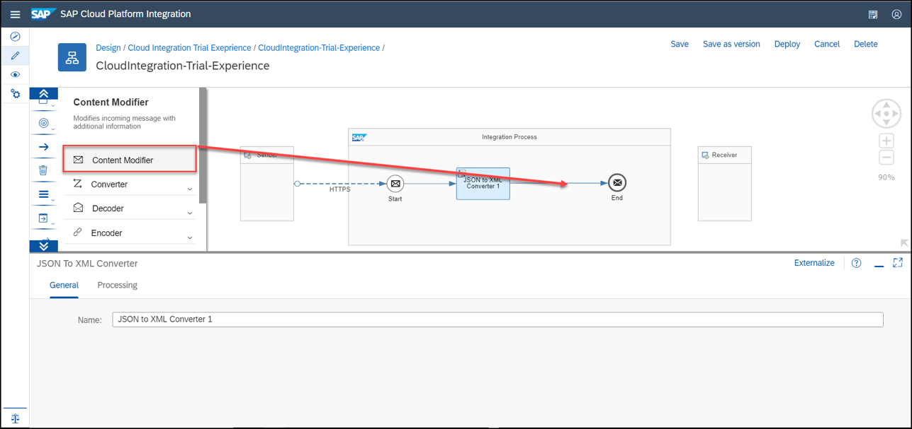

3. In the properties sheet for the **Content Modifier**, select the **Message Header** tab and create a new header by choosing **Add**.

    Enter the name as **product id**, select **X Path** in the **Type** dropdown, enter the **Data Type** as `java.lang.String` and Value as `//productIdentifier`.

    !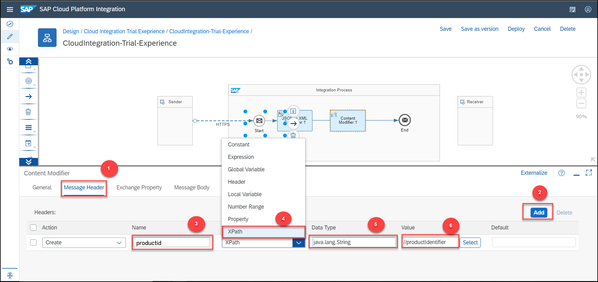


4. From the palette, choose **Call > External Call > Request Reply** and add it to the integration flow. You will use this step to call to the web shop and request product details.

    !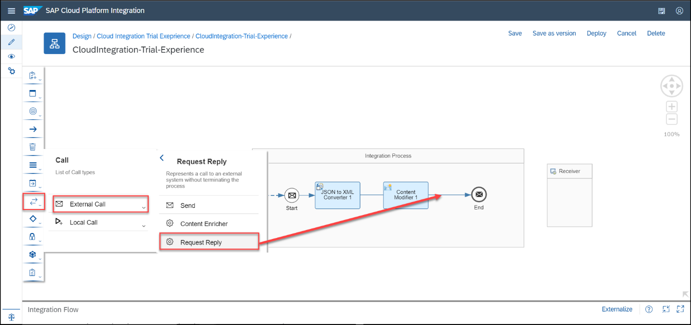

5. Connect the Request-Reply step to the receiver.

    !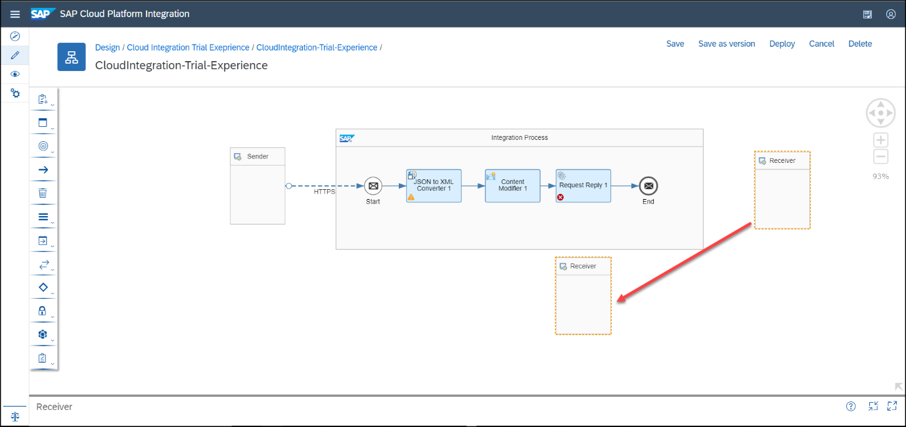

    !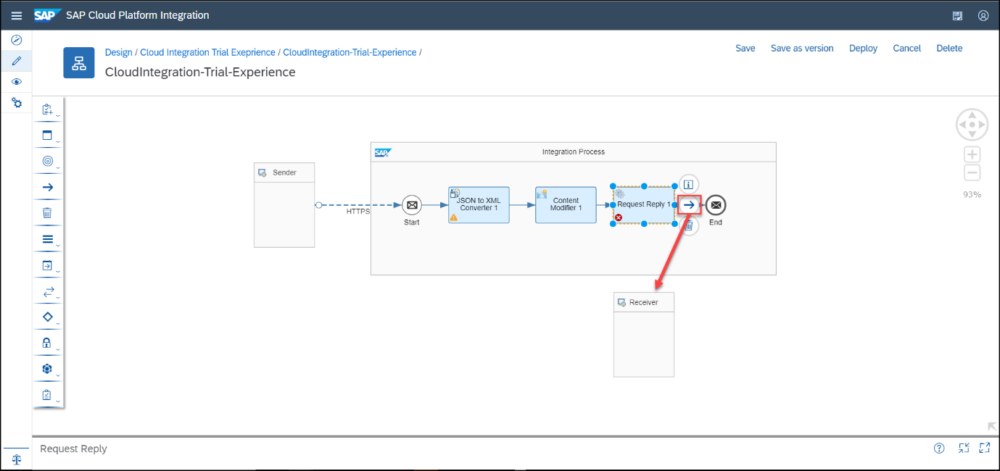

[DONE]
[ACCORDION-END]


[ACCORDION-BEGIN [Step 3: ](Connect OData adapter)]

1. In the **Adapter Type** prompt, select **OData** as the adapter and **OData V2** as the message protocol.

    !

2. In the **Connection** tab, enter the Address as `https://refapp-espm-ui-cf.cfapps.eu10.hana.ondemand.com/espm-cloud-web/espm.svc`. This is the URL of the OData service of the web shop.

    !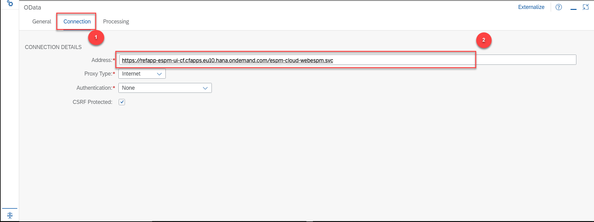

3. Select the **Processing** tab and click **Select** in the **Resource Path** field.

    !

4. Choose **Step 2**.

    !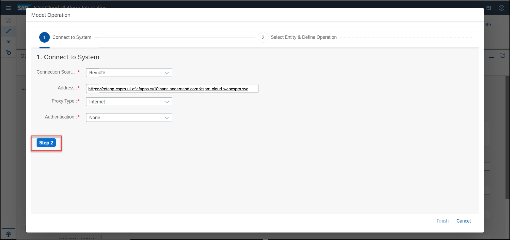

5. Click on **Select Entity** and choose **Products** from the dropdown. Here, you are choosing to fetch the entity **Products**.

    !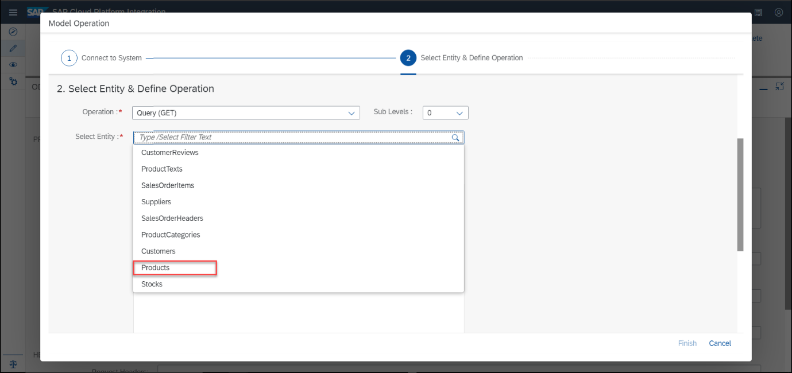

6. Enable the **Select All Fields** checkbox and choose **Step 3**.

    !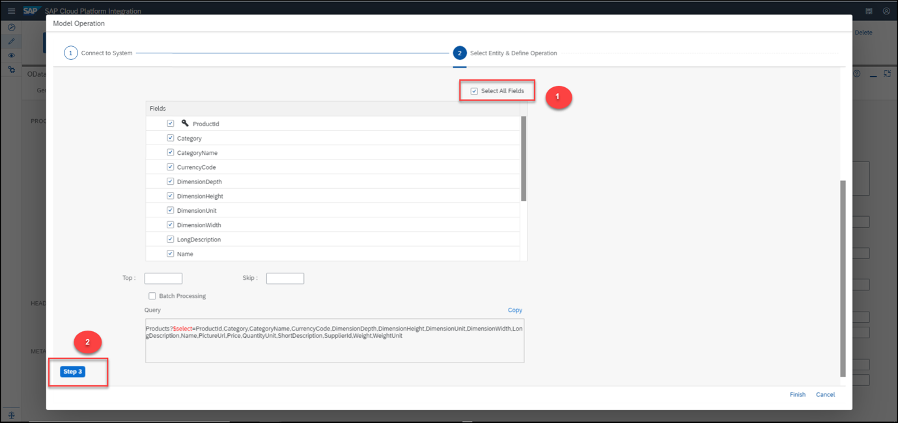

7. Choose **Select Field** icon and select **Product ID**. Click on **OK**.

    !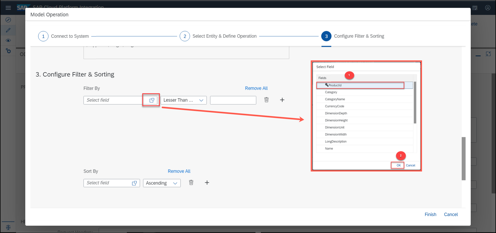

8. In the dropdown list, choose **Equal**. In the value field, enter `${header.productid}`.

    !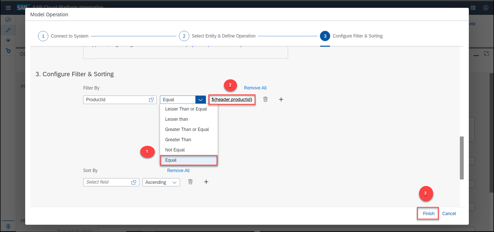

9. Add a **Parallel Multicast** step by choosing **Routing** > **Multicast** > **Parallel Multicast**.

    !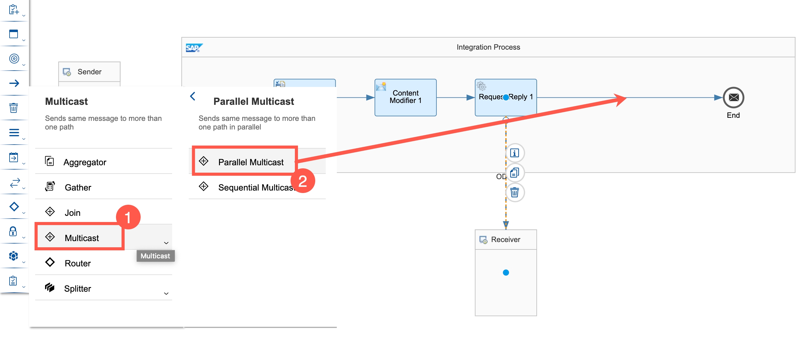


[DONE]
[ACCORDION-END]


[ACCORDION-BEGIN [Step 4: ](Configure content modifier)]

1. Select a **Content Modifier** from **Converter** in palette and add it below the **Parallel Multicast** step.

    Connect the **Parallel Multicast** to the **Content Modifier**.

    !

2. Click **Content Modifier** > **Exchange Property**.

    Choose **Add**.

    !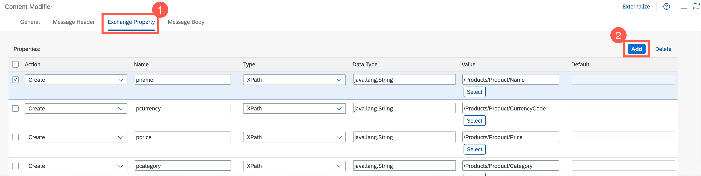

    Add four exchange properties based on the values in following table.

    | **Action**   | **Name**      | **Type**    | **Data Type** | **Value** |
    | :------- | :-------- | :------ | :-------- | :------- |
    | Create   | **`pname`** | **`XPath`** | **`java.lang.String`** | **`/Products/Product/Name`** |
    | Create   | **`pcurrency`** | **`XPath`** | **`java.lang.String`** | **`/Products/Product/CurrencyCode`** |
    | Create   | **`pprice`** | **`XPath`** | **`java.lang.String`** | **`/Products/Product/Price`** |
    | Create   | **`pcategory`** | **`XPath`** | **`java.lang.String`** | **`/Products/Product/Category`** |

3. Add a **Content Modifier** and connect it to the previous **Content Modifier**.

    !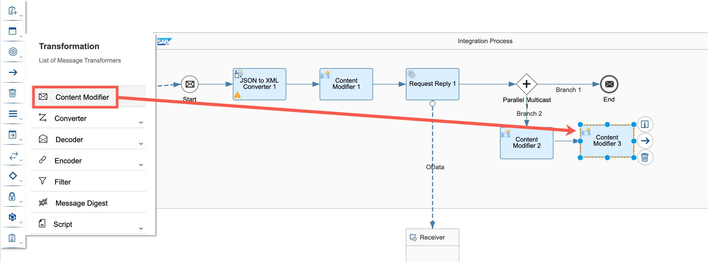

4. Select the **Message Body** tab and enter the following expression.

    !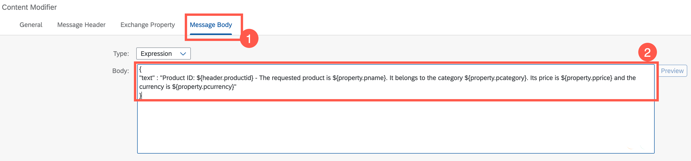

    ```JSON
    {
    "text" : "Product ID: ${header.productid} - The requested product is ${property.pname}. It belongs to the category ${property.pcategory}. Its price is ${property.pprice} and the currency is ${property.pcurrency}"
    }

    ```


[DONE]
[ACCORDION-END]


[ACCORDION-BEGIN [Step 5: ](Add request reply step)]

1. Add a **Request Reply** step by choosing **Call** > **External Call** > **Request Reply**.

    !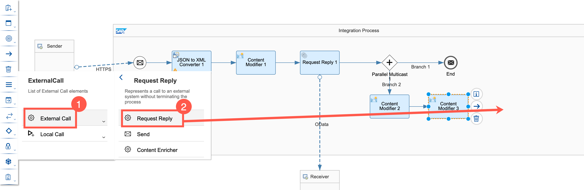

2. Connect the **Request Reply** step to **Content Modifier 3** and add a **Receiver** outside the Integration Process.

    !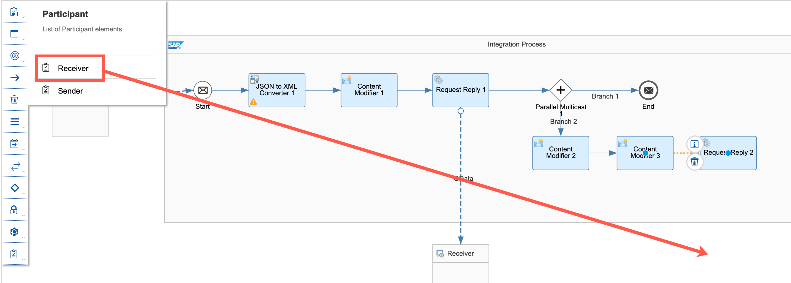

3. Connect **Request Reply 2** with **Receiver 1**.

    !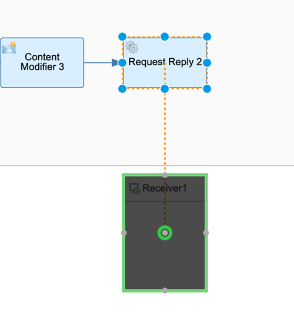

4. In the **Adapter Type**, choose **Open Connectors**.

    !

5. Select the receiver channel and click on **Connection** tab. In the **Base URI** tab, enter the base URI you copied while setting up your open connectors instance.

    !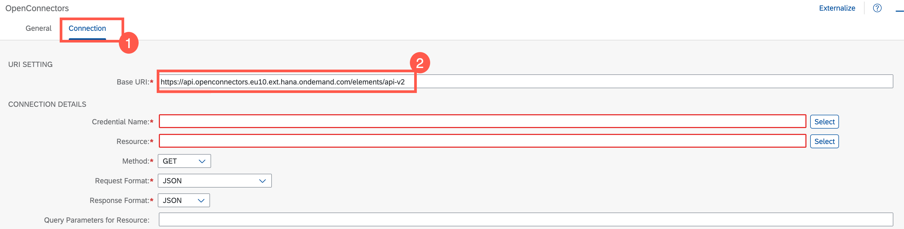

    >If you missed copying these details, you can access your Open Connectors Slack instance and execute a ping test. You will see the Base URI there.

6. In the **Credential Name** field, click on **Select**. In the dialog, select the credential name that you deployed before you started designing the integration flow.

    !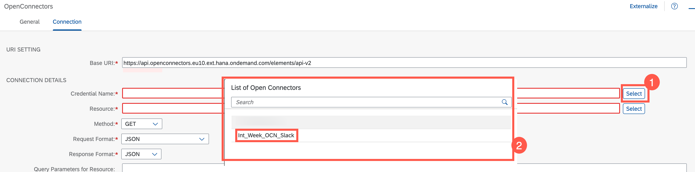

7. Click on **Select** in the **Resource** field. In the List of Resources, select `/channels/{channelId}/messages`. This is the API resource for posting a message in your Slack channel.

    !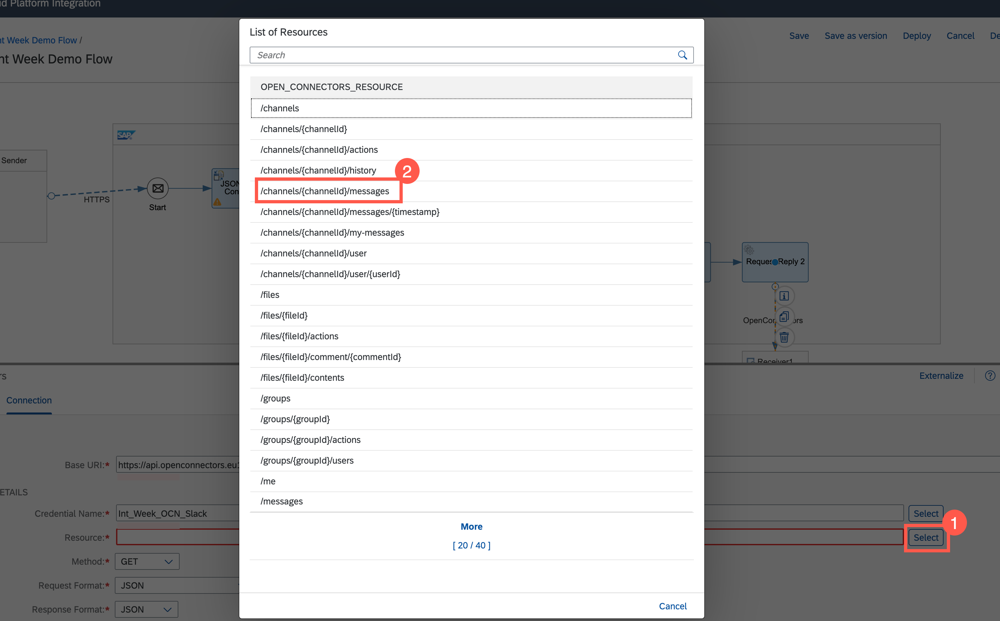

8. Replace the `{channelId}` value with the channel ID of your slack channel.

    For example, if your Slack workspace URL is `https://app.slack.com/client/ACBDEFGHIJK/12345678901`, **12345678901** is your `{channelId}`.

9. In the **Method** dropdown, choose **POST**.

    !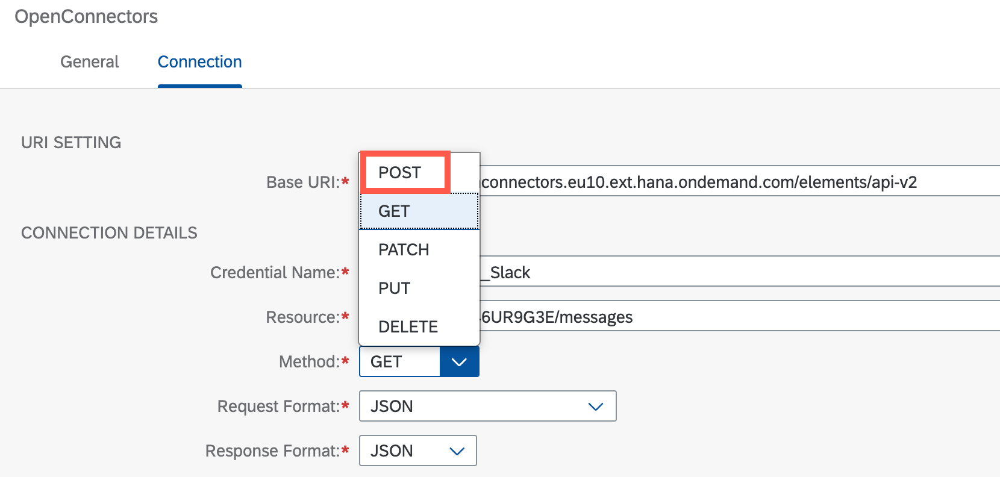

10. Add **End Message** step and connect it to **Request Reply 2**.

    !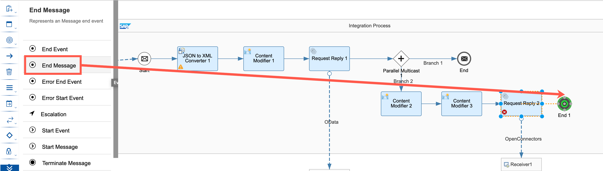

[DONE]
[ACCORDION-END]

[ACCORDION-BEGIN [Step 6: ](Add a receiver)]

1. Add a **Receiver**.

    !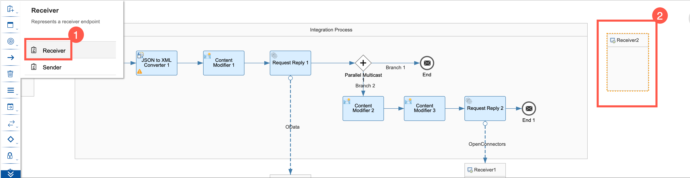

2. Connect End to **Receiver 2**. In the **Adapter Type** dialog, choose **Mail**.

    !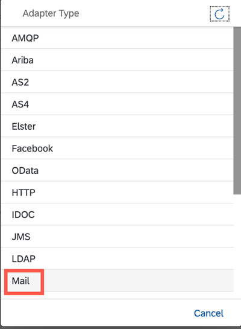

3. Select the **Connection** tab.

    In **Address**, enter `smtp.gmail.com:587`.

    In **Authentication**, choose **Plain User/Password**.

    In **Credential Name**, enter the name of the credentials you deployed at the beginning of the session.

    !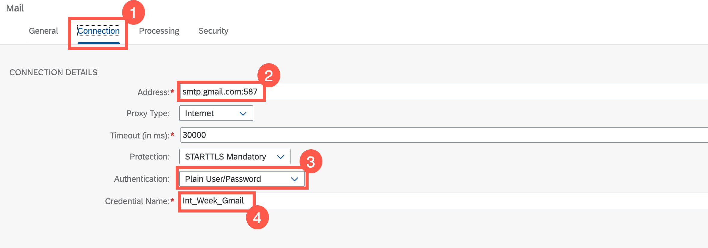

4. Select the **Processing** tab.

    In the **From** and **To** fields, enter your email address.

    In **Subject**, enter `Product with request ID ${header.productid}`.

    In **Mail Body**, enter `${in.body}`.

    !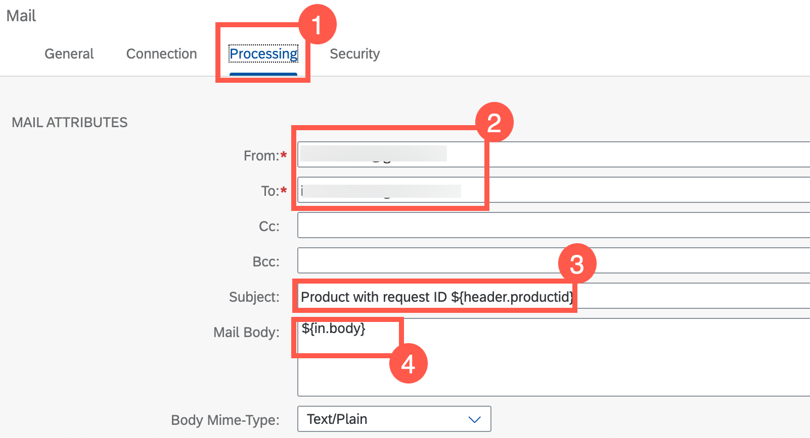

5. Click **Save** and then click **Deploy**.

[DONE]
[ACCORDION-END]


[ACCORDION-BEGIN [Step 7: ](Deploy your integration flow)]

1. Navigate to the **Operations View** and click **All** under **Manage Integration Content**.

    !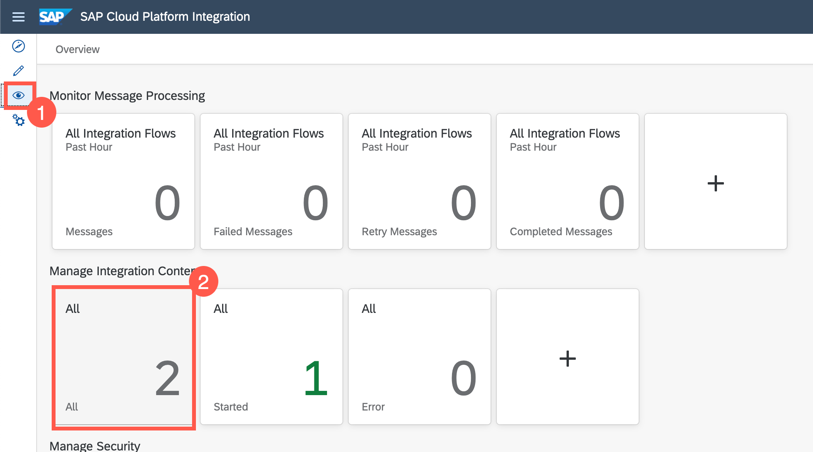

2. Wait till your Integration Flow changes to **Started** state and copy the **Endpoint**.

    !

3. Open Postman and click **+** icon.

    !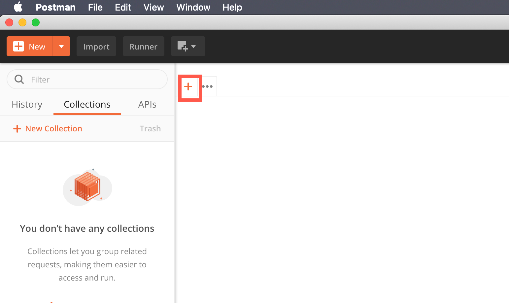

4. Enter the copied integration flow endpoint and choose **POST** request.

    !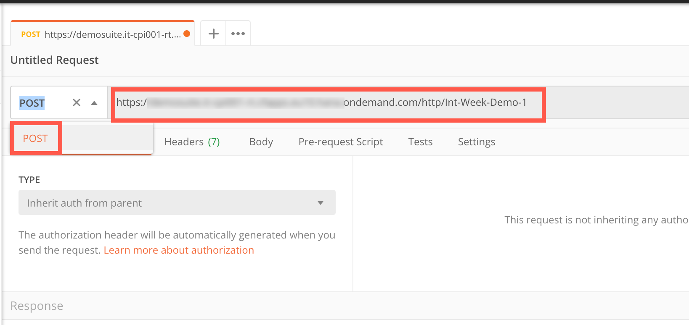

5. Select the **Authorization** tab and choose **Basic Auth** from the dropdown list.

    !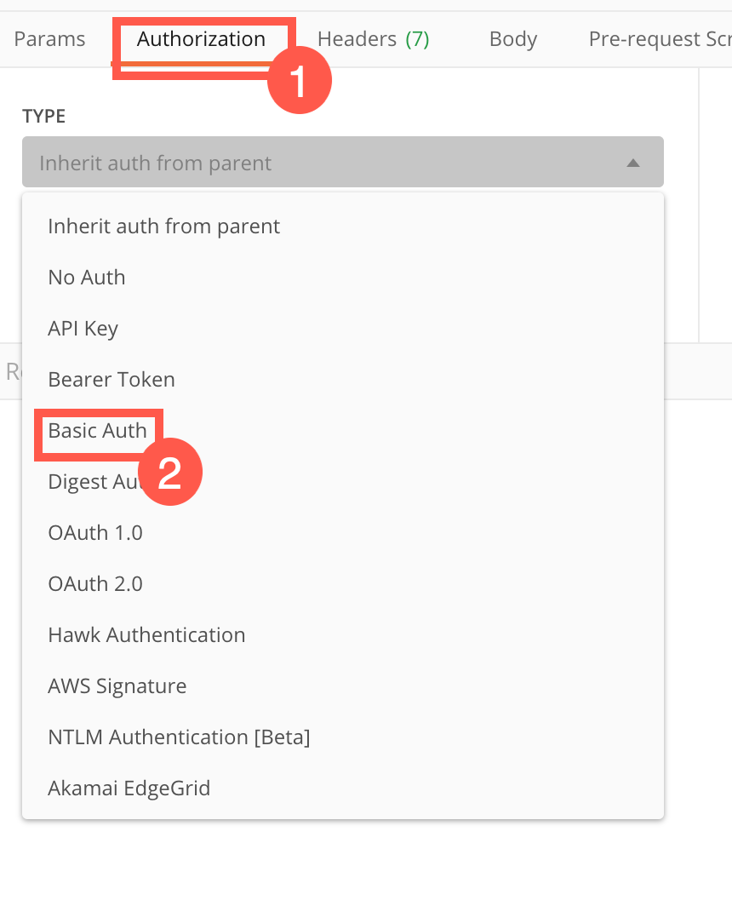

6. In the **Username** and **Password**, enter the `clientid` and `clientsecret` from your service key.

    !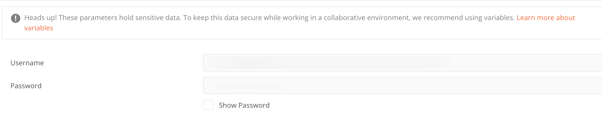

7. Select **Body > raw > JSON**.

    !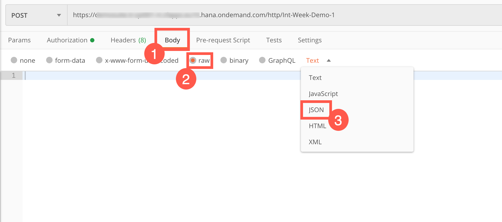

    Add the following:

    ```JSON
    {
  "productIdentifier": "HT-2000"
    }
    ```

You should see the details of your product posted in your Slack channel and your email account.  


[VALIDATE_2]
[ACCORDION-END]

---
