## Prerequisites
- You have created a **trial account on SAP Cloud Platform:** [Get a Free Trial Account on SAP Cloud Platform](hcp-create-trial-account)

## Details
### You will learn
-	How to start your SAP Cloud Platform Integration Suite trial
-	How to subscribe to the service and assign user roles
-	How to provision and activate the capabilities

SAP Cloud Platform Integration Suite combines the integration capabilities such as Process Integration, API Management, Integration Advisor, and Open Connectors into a cohesive and simplified toolkit for enterprise integrations. To provide a comprehensive integration experience, these services are not available separately, but only as part of the Integration Suite service plan.

The Integration Suite includes all integration capabilities in simple service plans. To know more on these plans, see [Integration Suite](https://discovery-center.cloud.sap/#/serviceCatalog/f810c887-8d25-4942-9849-354837951066) service catalog.

This part of the series lets you experience few capabilities offered by SAP Integration Suite. For the complete series, see [Request Product Details with an Integration Scenario](mission.cp-starter-integration-cpi.html).

> **IMPORTANT**: Trial accounts are not intended for productive usage or team development. See: [Trial Scope](https://help.sap.com/viewer/51ab953548be4459bfe8539ecaeee98d/sap.cp.integration.suite/en-US/5cc6987511104c418b7cb4c25f3d9cb0.html). If you're using Integration Suite from a production account for your proof of concepts or real-time business cases, refer to the [product documentation](https://help.sap.com/viewer/51ab953548be4459bfe8539ecaeee98d/sap.cp.integration.suite/en-US/3dcf507f92f54597bc203600bf8f94c5.html) on SAP Help Portal for step-by-step explanation of the initial set up and further information.

[ACCORDION-BEGIN [Step 1: ](The Use Case)]

Using this scenario, you design and execute an integration flow that reads product details from a public product catalog (`WebShop`) for a given product identifier. Product details include data such as the product name and price, for example. To accomplish the scenario, you use SAP Cloud Platform Integration Suite, and in particular, its capabilities *Cloud Integration* and *API Management*.

You use *Cloud Integration* to design and deploy an integration flow. When you have finished designing, you use the API Explorer tool of *API Management* to expose the integration flow endpoint as an API.

  - You also define how to access the API in terms of authentication by assigning a dedicated predefined policy template.
  - Using this policy template, you define API access based on the OAuth client credentials grant method.
  - Finally, you use API Management to call the API and get the product details in a response.

  !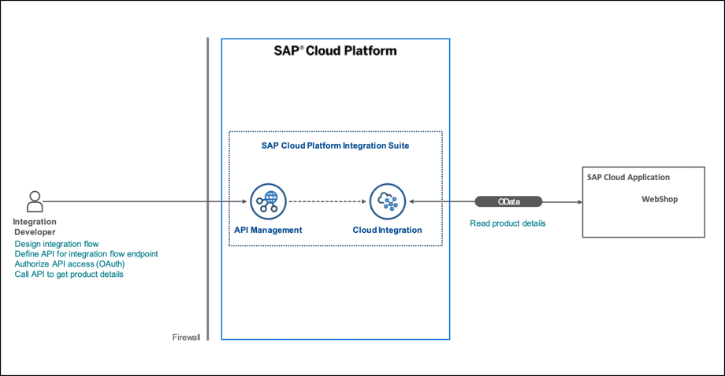

[DONE]
[ACCORDION-END]

[ACCORDION-BEGIN [Step 2: ](Enter your trial account)]

>**WHERE TO START**: If you have already activated Cloud Integration (Process Integration) or API Management services in your existing trial account, we recommend you to perform one of the following options:

> **Option 1**: If you are unable to activate **`Integration Suite`** service in an existing subaccount, create a **`New Subaccount`** and then proceed to **Step 3**. For a new subaccount, you need to assign entitlements by adding service plans and the quotas. For more information, see [Configure Entitlements and Quotas for Subaccounts](https://help.sap.com/viewer/ea72206b834e4ace9cd834feed6c0e09/Cloud/en-US/c90f3d522ee04e65bd87cdec8808e5ce.html).

> **Option 2**: To continue with the same subaccount, unsubscribe from Process Integration and API Management services, and then proceed to **Step 3**.

> If you are new to SAP Cloud Platform or Integration Suite, continue with the tutorial.

1. In your web browser, open the [SAP Cloud Platform trial cockpit](https://cockpit.hanatrial.ondemand.com/).

2. Navigate to the trial global account by clicking **Enter Your Trial Account**.

    !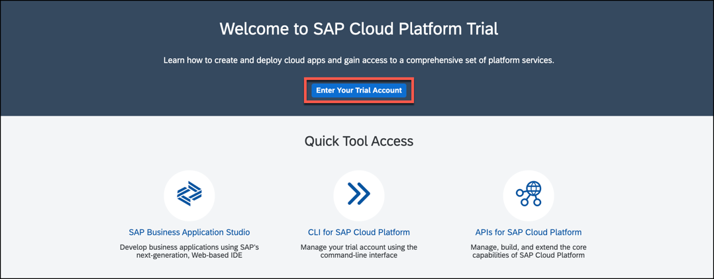

3. Choose the region that is closest to you. Click **Create Account** to create a subaccount.

    !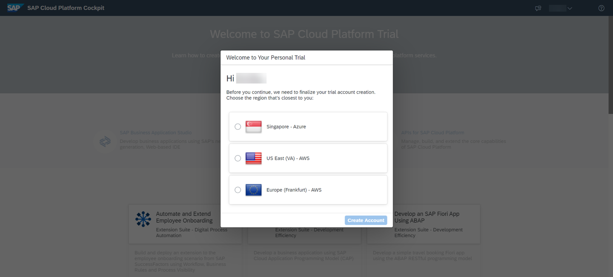

4. Choose **Continue**.

    !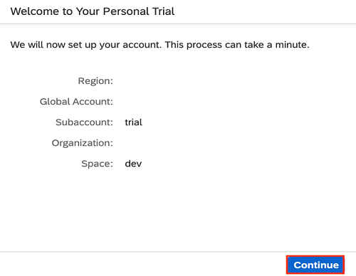

5. From your global account page, choose the **trial** tile to access your subaccount.

    !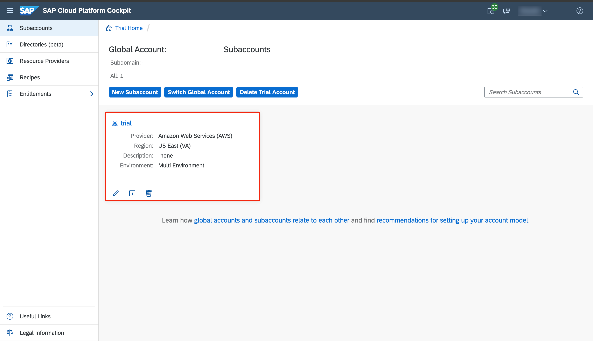

[DONE]
[ACCORDION-END]

[ACCORDION-BEGIN [Step 3: ](Subscribe to the service)]
1. Select **Services > Instances and Subscriptions**.

2. Choose **Create**.

    !

3. In the **New Instance or Subscription** dialog, choose **Integration Suite** from the list of services.

    >If Integration Suite is not visible in the **Services** list, you need to assign Integration Suite Trial entitlements. To assign entitlements, see [Manage Entitlements on SAP Cloud Platform Trial](cp-trial-entitlements).

    >- In the tutorial referred above, after **Step 3.5**, there is a list of available services on the left pane.

    >- Filter for Integration Suite service and select the service.

    >- Select the service plan, add it to your subaccount, and continue with this  tutorial.

4. Choose the default plan which is **trial** and click **Create**.

    !

5. You are subscribed to the service now. Click **Go to Application** in the **Integration Suite** overview page. Now you are directed to the **Integration Suite Launchpad**.

    !

[DONE]
[ACCORDION-END]

[ACCORDION-BEGIN [Step 4: ](Provision the capabilities)]
>**IMPORTANT**: Ensure that you unsubscribe from the standalone services (like Open Connectors, Process Integration or APIM service ) if you have already subscribed to it.  If the standalone subscription exists, you will be unable to activate respective capability via the Integration Suite.

>**Navigational Steps**: Go to Service Marketplace, search for the service name and click `unsubscribe`.

1. In the Integration Suite Launchpad, choose **Add Capabilities** to activate the capabilities offered by Integration Suite.

    !

    For this tutorial, you must select **Design, Develop and Operate Integration Scenarios** and **Design, Develop and Manage APIs click** capabilities.
    Click **Next**.

    !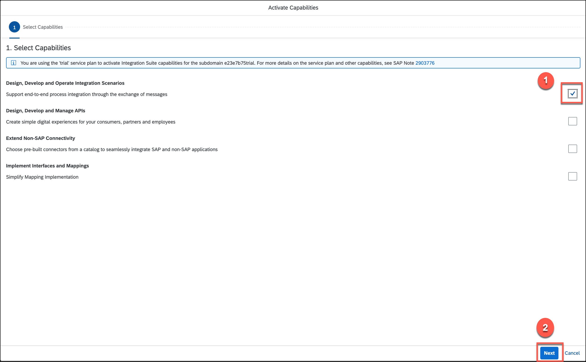

    You do not have to select anything here. Click **Next**.

    !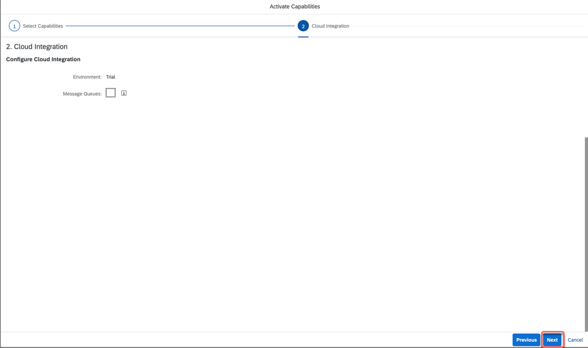

    Click **Next**.

    !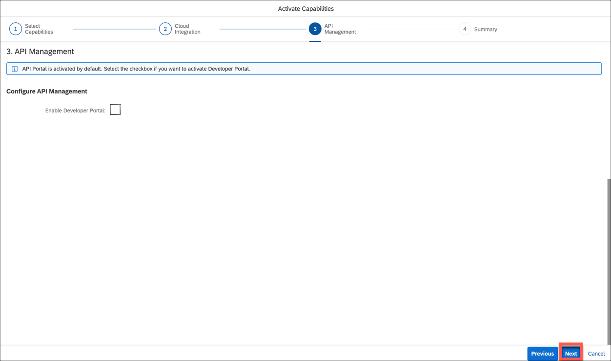

2. Click **Activate** to provision the selected capabilities.

    >For some capabilities, you would be given a choice to select additional functionalities that you need to choose based on your business requirement.

    !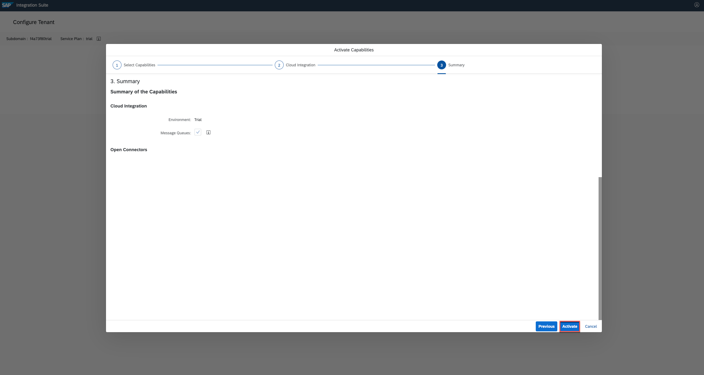

    The activation may take a while and you will notice the dialog shown here.
    >**IMPORTANT**: Before you proceed to **Step 4.5**, please wait for all the capabilities to be activated.

    !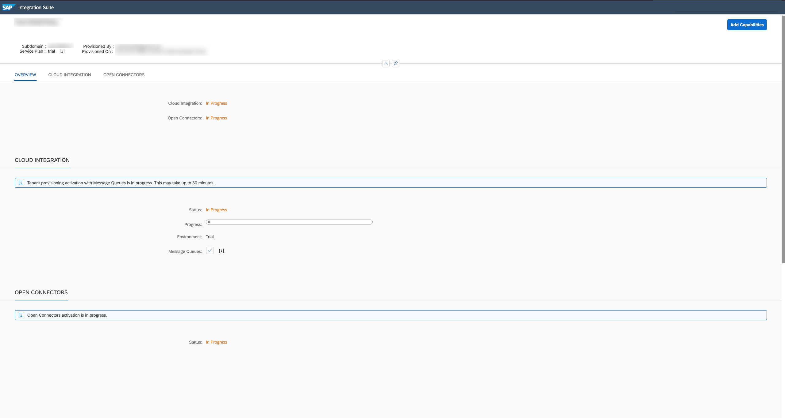

    >**IMPORTANT**: From the **Provisioning** application you can navigate back to the Integration Suite Launchpad by choosing the **Integration Suite** button on the header.

3. After successful activation, you can view the activated capability tiles on the launchpad. Click on the relevant tile to access the capability.  

    !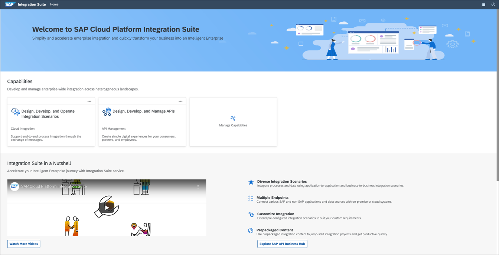

    >To know more about resources offered by the Integration Suite Launchpad, see [Working with Integration Suite Launchpad](https://help.sap.com/viewer/51ab953548be4459bfe8539ecaeee98d/sap.cp.integration.suite/en-US/a53dce3b57ba4915b055343f783300a5.html).

    >To access each capability's tile, you must assign capability-specific roles which is explained in the next step.

[DONE]
[ACCORDION-END]

 [ACCORDION-BEGIN [Step 5: ](Assign roles for the capabilities)]
 In this step, you assign yourself or other users the necessary roles to access and use the activated capabilities.

 1. Navigate to your SAP Cloud Platform subaccount. Go to **Security > Trust Configuration** and click **`Default identity provider`**.

    !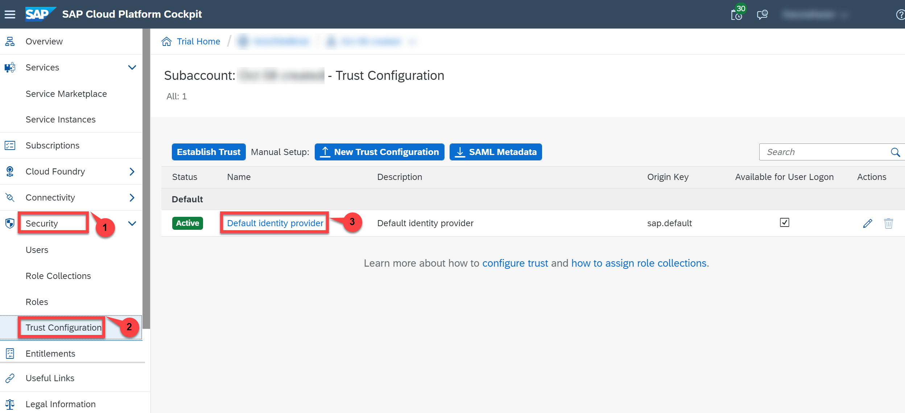

 2. Enter the user's e-mail address and click on **Show Assignments** to see the role collections that are currently assigned to this user. Then click **Assign Role Collection** and select relevant roles based on the activated capability.
>**IMPORTANT**: For this starter scenario to work, assign the role collections only for **`Cloud Integration`** and **`API Management`** capability.

    !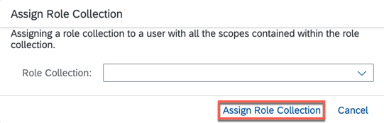

    The table here shows the roles relevant to the Integration Suite capabilities that you must assign to the role collections for accessing the relevant capability:

    | **Capability** | **Role Collection** | **Tasks** |
    | ---------- | --------------- | ----- |
    | Cloud Integration | **`PI_Business_Expert`** | Monitoring integration flows and the status of integration artifacts. Reading the message payload and attachments. |
    |  | **`PI_Administrator`** | Monitoring integration flows and the status of integration artifacts. Deploying security content. Deploying integration content (such like integration flows, for example). Deleting messages from transient data store. |
    |  | **`PI_Integration_Developer`** | Create Integration Flows. Monitoring integration flows and the status of integration artifacts. Deploying integration content (such like integration flows, for example). |
    | API Management | **`APIPortal.Administrator`** | Access the API portal user interface (UI) and services. |
    |                | **`APIManagement.Selfservice.Administrator`** | Get onboard to API Portal and access its settings page. |
    | Integration Advisor | **`trial-content-developer`** | Access Integration Content advisor to create and deploy interfaces and mappings. |
    | Open Connectors | **`OpenConnectors_User`** | To view and access the Open Connectors capability. |

    >**IMPORTANT**: After assigning the role collections, clear the browser cache and reload the page. Try logout and login to get the roles activated. If you are still facing any issues, please send an email to <a href="mailto:cpitrialfeedback@sap.com">CPI trial feedback</a>. Include the **URL** of the **subaccount** in which you are facing access issues to help the trial experience team investigate and resolve the issue.

[VALIDATE_1]
[ACCORDION-END]

[ACCORDION-BEGIN [Step 6: ](Verify the activated capabilities)]

1. After providing necessary authorization, go to the **Integration Suite Launchpad** application and choose **Manage Capabilities** tile.

    !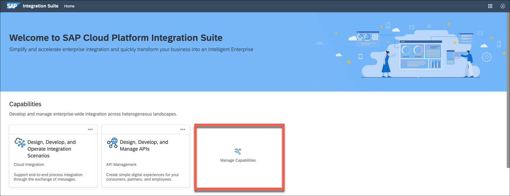

2. Click on the URLs of all the activated capabilities and verify if you can successfully access them.

    !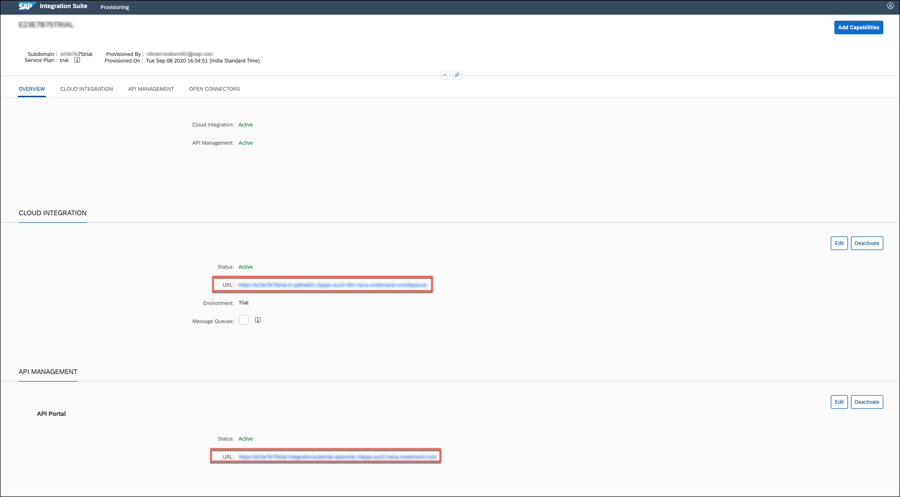

[DONE]
[ACCORDION-END]

---
