## Prerequisites
- [Get a Free Trial Account on SAP Cloud Platform](hcp-create-trial-account)

## Details
### You will learn
-	How to start your SAP Cloud Platform Integration Suite trial
-	How to subscribe to the service and assign user roles
-	How to provision and activate the capabilities


This tutorial series lets you experience the capabilities offered by SAP Cloud Platform Integration Suite.

> **IMPORTANT**: The Integration Suite trial account is intended for personal exploration and not for production use or team development. It allows restricted use of the platform resources and services.

>**WHERE TO START**:
>If you have already activated Cloud Integration (Process Integration) service in your existing trial account. We recommend you to do either of the following:

> **Option 1**: Unsubscribe to Process Integration service then proceed to **Step 2**.

> **Option 2**: If you are unable to activate Integration Suite service, create a New Subaccount and then proceed to **Step 2**.

> For a new subaccount you need to assign entitlements by adding service plans and the quotas. For more information, see [Configure Entitlements and Quotas for Subaccounts](https://help.sap.com/viewer/ea72206b834e4ace9cd834feed6c0e09/Cloud/en-US/c90f3d522ee04e65bd87cdec8808e5ce.html).

---

[ACCORDION-BEGIN [Step 1: ](Enter your trial account)]

1. In your web browser, open the [SAP Cloud Platform trial cockpit](https://cockpit.hanatrial.ondemand.com/).

2. Navigate to the trial  global account by clicking **Enter Your Trial Account**.

      !

3. Click **Create Account** to create a subaccount in the selected geographical region.

    !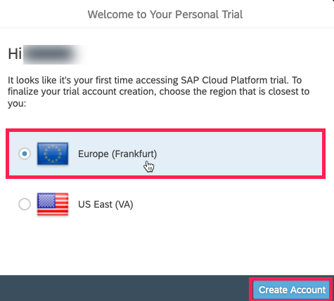

4. Choose **Continue**.

    !

5. From your global account page, choose the `trial` tile to access your subaccount.

    !

[DONE]
[ACCORDION-END]

[ACCORDION-BEGIN [Step 2: ](Subscribe to the service)]
1. Select **Subscriptions > Integration Suite**.

    >If the Integration Suite tile is not visible under **Subscriptions**, you need to assign Integration Suite Trial entitlements. To assign entitlements, see [Manage Entitlements on SAP Cloud Platform Trial](https://developers.sap.com/tutorials/cp-trial-entitlements.html).

    >- In the tutorial, after **Step 3.5**, there is a list of available services on the left pane.

    >- Filter for Integration Suite service and select the service.

    >- Select the service plan and add it to your subaccount.

    >- Perform your tasks from **Step 3.1** onwards as mentioned in the tutorial.

    !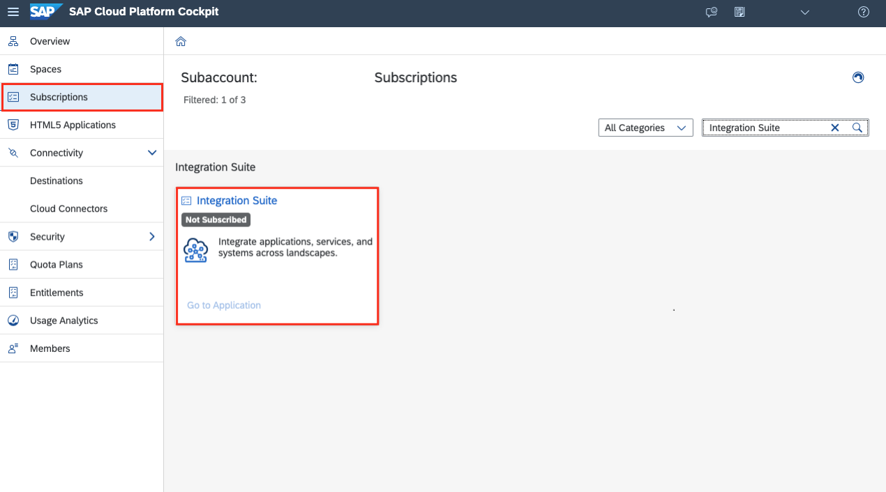    

2. Select **Subscribe**.
    >**IMPORTANT**: Trial accounts are not intended for production use and has certain limitations. To know more, see [Trial Scope](https://help.sap.com/viewer/51ab953548be4459bfe8539ecaeee98d/sap.cp.integration.suite/en-US/5cc6987511104c418b7cb4c25f3d9cb0.html).

  !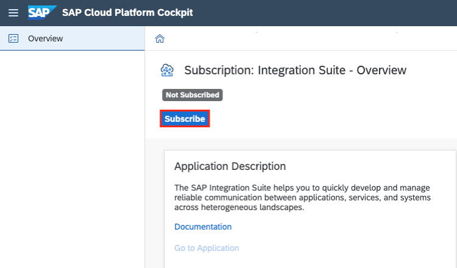


[DONE]
[ACCORDION-END]


[ACCORDION-BEGIN [Step 3: ](Configure administrator access)]

In this step, you authorize a user to access the Integration Suite Provisioning application and to activate its capabilities. The assigned user will also be able to add users to the access activated Integration Suite capabilities.

1. Go to **Security > Trust Configuration** and click **`sap.default`**.

    !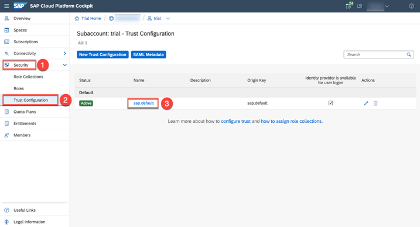

2. Enter the user's e-mail address and click **Show Assignments**. In the confirmation dialog, click **Add User**.

    !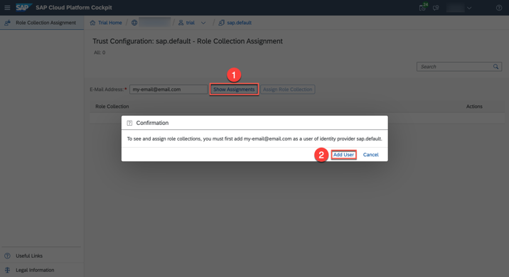

3. Click  **Assign Role Collections** and select **Integration Provisioner** role collection.

    !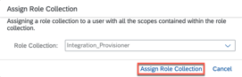

[DONE]
[ACCORDION-END]


[ACCORDION-BEGIN [Step 4: ](Provision the capabilities)]
>**IMPORTANT**: Ensure that you unsubscribe to the standalone services (like Open Connectors, Process Integration or APIM service )if you have already subscribed to it.  If the standalone subscription exists, you will be unable to activate respective capability via the Integration Suite.

1. Launch SAP Cloud Platform Integration provisioning application by choosing your subaccount, and then **Subscriptions**.

2. Click **Go to Application** in the **Integration Suite** overview page.

    !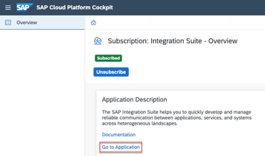

3. Now you are directed to the **Integration Suite Launchpad**. Choose **Add Capabilities** to activate the capabilities offered by Integration Suite.

    !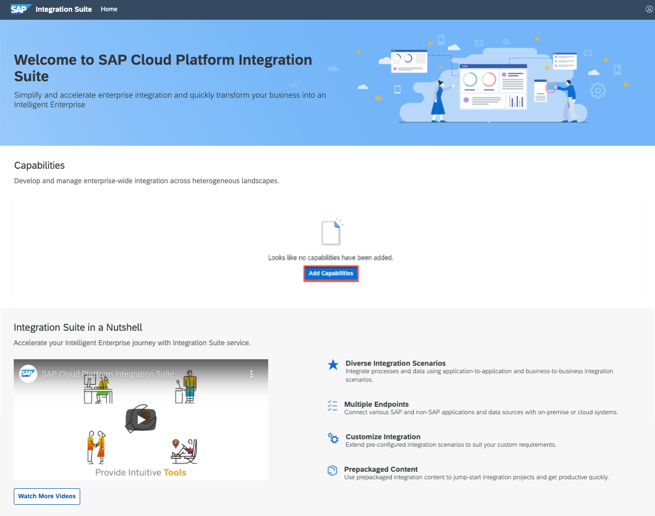

    Let's assume you have made your selection, so you now have to click **Next**.

    !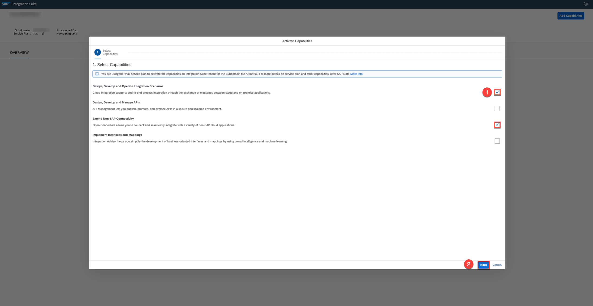

4. Click **Activate** to provision the selected capabilities.

    >For some capabilities you would be given a choice to select additional functionalities that you need to choose based on your business requirement.

    !

    The activation may take a while and you will notice the dialog shown here.

    !

    >**IMPORTANT**: From the **Provisioning** application you can navigate back to the Integration Suite Launchpad by choosing the **Integration Suite** button on the header.

5. After successful activation, you can view the activated capability tiles on the launchpad. Click on the relevant tile to access the capability.  

    !

    >To know more about resources offered by the Integration Suite Launchpad, see [Working with Integration Suite Launchpad](https://help.sap.com/viewer/51ab953548be4459bfe8539ecaeee98d/sap.cp.integration.suite/en-US/a53dce3b57ba4915b055343f783300a5.html).

    >To access the capability tile, you must assign capability-specific roles to the user. Continue with the next step.

[DONE]
[ACCORDION-END]

 [ACCORDION-BEGIN [Step 5: ](Assign roles for the capabilities)]
 In this step, you assign users to the trial account for them to access and use the activated capability.

 1. Go to **Security > Trust Configuration** and click **`sap.default`**.

    !

 2. Enter the user's e-mail address and click on **Show Assignments** to see the role collections that are currently assigned to this user. Then click **Assign Role Collection** and select relevant roles based on the activated capability.
>**IMPORTANT**: For this starter scenario to work, assign the role collections only for *Cloud Integration* capability.

    !

    The table here shows the roles relevant to the Integration Suite capabilities that you must assign to the role collections for accessing the relevant capability:

    | **Capability** | **Role Collection** | **Tasks** |
    | ---------- | --------------- | ----- |
    | Cloud Integration | `PI_Business_Expert` | Monitoring integration flows and the status of integration artifacts. Reading the message payload and attachments. |
    |  | `PI_Administrator` | Monitoring integration flows and the status of integration artifacts. Deploying security content. Deploying integration content (such like integration flows, for example). Deleting messages from transient data store. |
    |  | `PI_Integration_Developer` | Create Integration Flows. Monitoring integration flows and the status of integration artifacts. Deploying integration content (such like integration flows, for example). |
    | API Management | `APIPortal.Administrator` | Access the API portal user interface (UI) and services. |
    |                | `APIManagement.Selfservice.Administrator` | Get onboard to API Portal and access its settings page. |
    | Integration Advisor | `trial-content-developer` | Access Integration Content advisor to create and deploy interfaces and mappings. |
    | Open Connectors | `OpenConnectors_User` | To view and access the Open Connectors capability. |

    >**IMPORTANT**: If you are facing access issues after assigning the role collection, please send an email to <a href="mailto:cpitrialfeedback@sap.com">CPI trial feedback</a>. Please include the **URL** of the **subaccount** in which you are facing access issues to help the trial experience team investigate and resolve the issue.

  3. After giving authorization to a user. Go to the **Integration Suite Launchpad** application and click the tile to launch the capability.

[VALIDATE_1]
[ACCORDION-END]


[ACCORDION-BEGIN [Step 6: ](Create service instance and key (For Cloud Platform Integration capability only))]

1. Navigate back to your SAP Cloud Platform's subaccount and access your subaccount's space by choosing **Spaces** > **dev**. If you have intentionally specified any other space name, you can choose the space of your choice.

    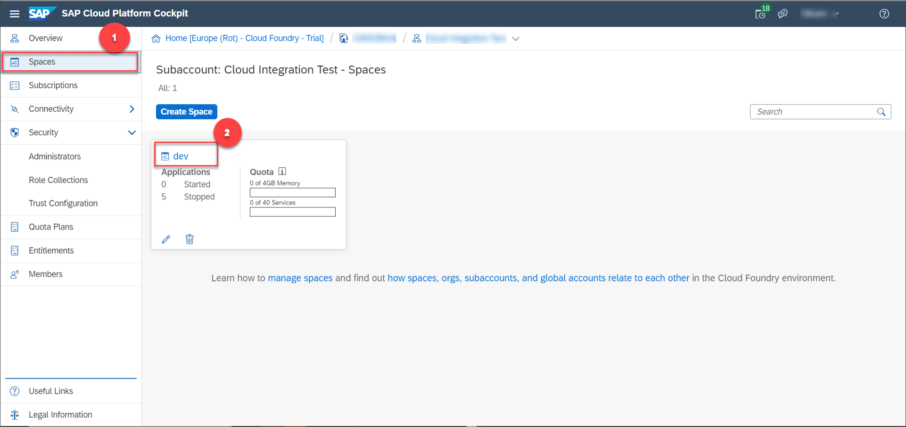

2. Choose **Services** > **Service Marketplace** > **Process Integration Runtime**.

    !

    >**TIP:** If you do not see the **Process Integration Runtime** service in the list, at the subaccount level, choose **Entitlements** > **Configure Entitlements** > **Add Service Plans**. Choose **Process Integration Runtime** and select the **integration-flow** service plan checkbox and choose **Add 1 Service Plan**.

3. Select **Instances** > **New Instance**.

    !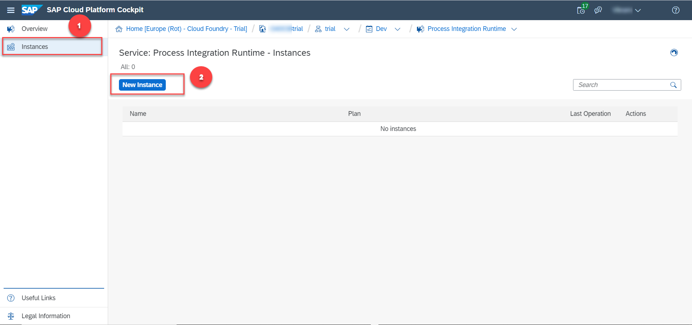

4. Choose **Next** to select the default service plan. In the **Specify Parameters** tab, enter:

    ```JSON
    {
     "roles":[
       "ESBMessaging.send"
     ]
    }
    ```
Service plan integration-flow is the only option which is preset because processing integration flows is what a remote system is doing when calling SAP Cloud Platform Integration.

    !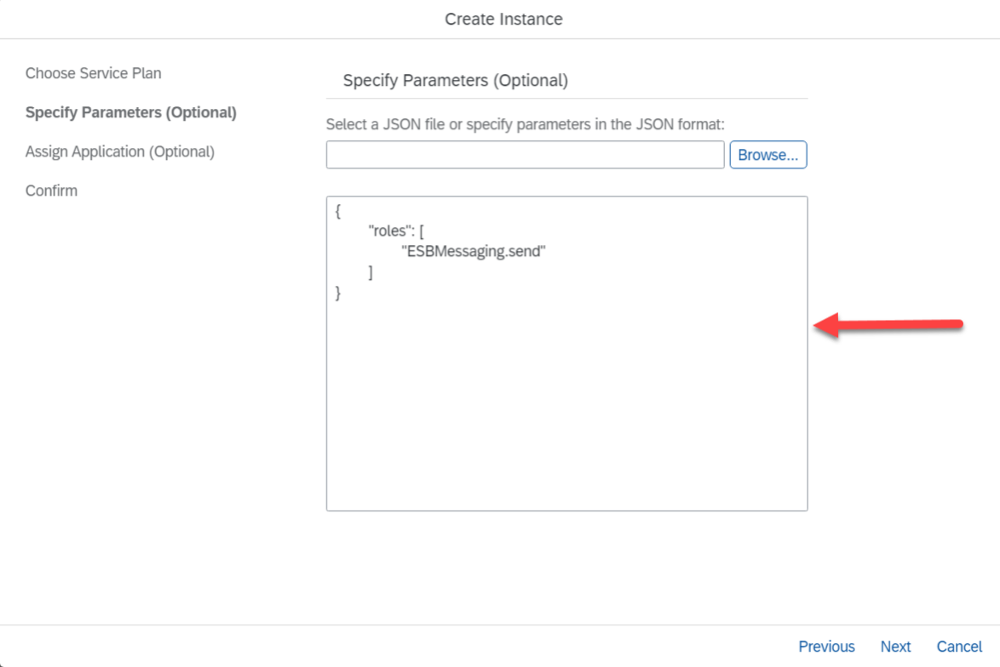

5. Choose **Next** until you have to specify the instance name. Provide any name of your choice and choose **Finish**.

    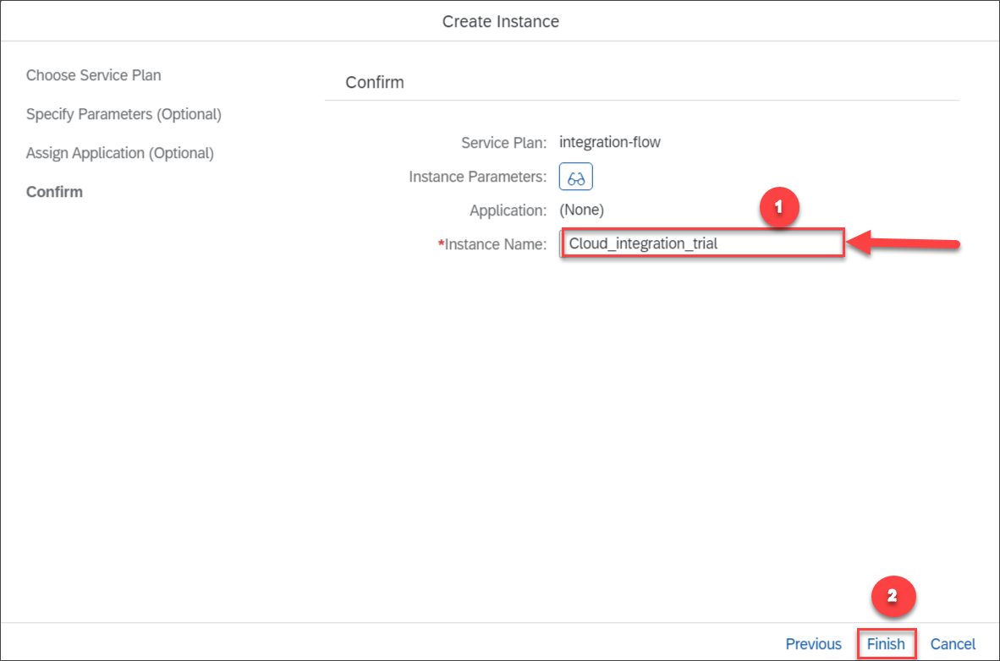

6. Select the newly created service instance.

    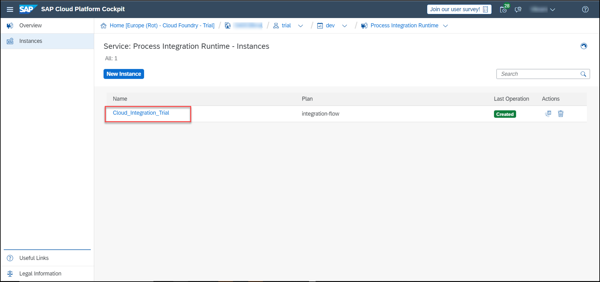

    You create this service instance to enable inbound HTTP calls to your SAP Cloud Platform Integration tenant.

7. Choose **Create Service Key** to create a new service key.

    

    This service key will provide you the credentials for making inbound HTTP calls to integration flows deployed on your SAP Cloud Platform Integration suite tenant.

8. Specify a name for the service key and choose **Save**.

    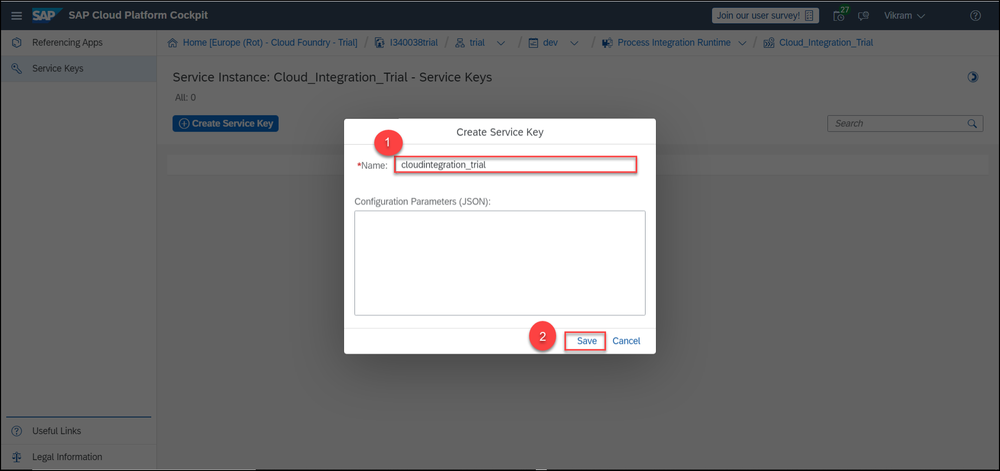

9. Copy the values of **`clientid`** and **`clientsecret`** parameters. These are the credentials that you use to make a request to your integration flow after you deploy it.

    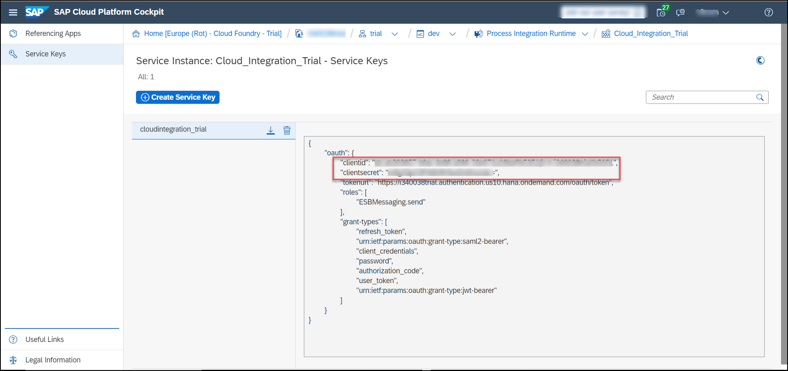

    Make a note of these credentials. You will use it when you make HTTP calls to integration flows deployed on your tenant with HTTP endpoints.


[DONE]
[ACCORDION-END]


---
