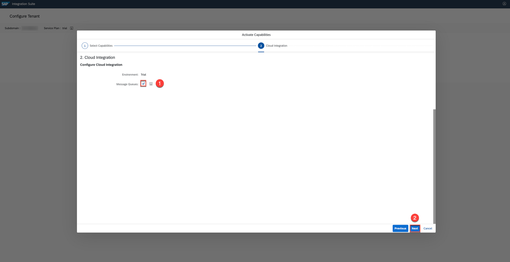
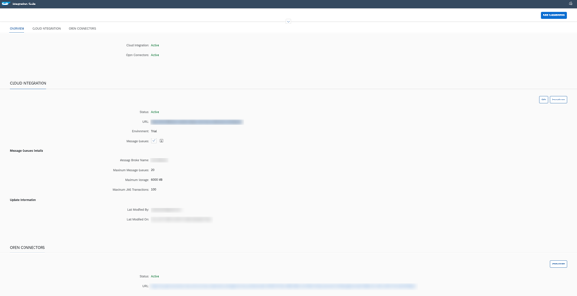
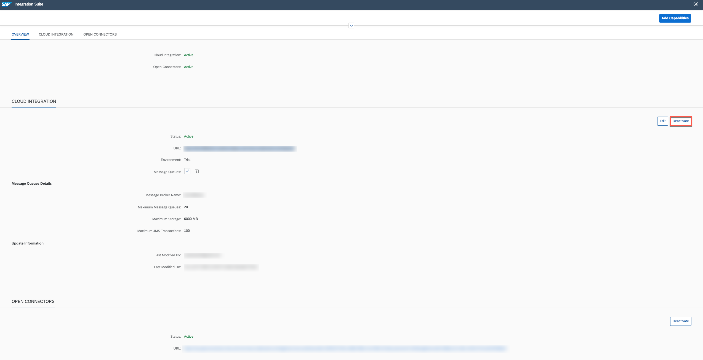

## Details
### You will learn
-	How to start your SAP Cloud Platform Integration Suite trial
-	How to subscribe to the service and assign user roles
-	How to provision and activate the capabilities
-	How to access and deactivate the capabilities

---

[ACCORDION-BEGIN [Step 1: ](Welcome to SAP Cloud Platform Trial)]

Before you start using this learning material, you must sign up for a free trial account on SAP Cloud Platform. Let's learn about it from the tutorial [Get a Free Trial Account on SAP Cloud Platform](https://developers.sap.com/tutorials/hcp-create-trial-account.html). So now you've signed up for a trial on SAP Cloud Platform. This learning material help to onboard trial users to experience the capabilities offered by SAP Cloud Platform Integration Suite.

If you already have access to SAP Cloud Platform trial, start your learning from **Step 2**.
>**IMPORTANT**:
The Cloud Platform Integration Trial account is intended for personal exploration, and not for production use or team development. They allow restricted use of the platform resources and services.

[DONE]
[ACCORDION-END]

[ACCORDION-BEGIN [Step 2: ](Enter Your Trial Account)]

1. In your web browser, open the [SAP Cloud Platform trial cockpit](https://cockpit.hanatrial.ondemand.com/).

2. Navigate to the trial global account by clicking **Enter Your Trial Account**.

      !

3. Click **Create Account** to create a subaccount in the selected geographical region.

    !

4. Choose **Continue**.

    !

5. From your global account page, choose the `trial` tile to access your subaccount.

    !

[DONE]
[ACCORDION-END]

[ACCORDION-BEGIN [Step 3: ](Subscribe to the Service)]

Navigate to your subaccount and click Subscriptions. Where you can find **Integration Suite** service tile.

1. Select **Subscriptions** > **Integration Suite**.
>**IMPORTANT**:
 If the above tile is not visible in the Subscriptions for your trial subaccount. Then you need to assign Integration Suite Trial entitlements. To know more about entitlements and quotas on a trial account, view the tutorial course on [Manage Entitlements on SAP Cloud Platform Trial](https://developers.sap.com/tutorials/cp-trial-entitlements.html).

    !

2. Select **Subscribe**.
!

[DONE]
[ACCORDION-END]

[ACCORDION-BEGIN [Step 4: ](Configure Administrator Access)]
>Do this step to authorizes a user to access the Integration Suite Provisioning application and to activate its capabilities. The assigned user will also be able to add users to the access activated Integration Suite capabilities.

1. Go to **Security** > **Trust Configuration** and click **sap.default**, as shown in the following image.
!
2. Enter the users e-mail address and click on **Show Assignments**. In the confirmation dialog, click **Add User**.
!
3. Click  **Assign Role Collections** and select **Integration Provisioner** role collection.
!

[DONE]
[ACCORDION-END]

[ACCORDION-BEGIN [Step 5: ](Provision the Capabilities)]

1. Launch SAP Cloud Platform Integration provisioning application by choosing **`<subaccount-name>`** > **Subscriptions**.

2. Click **Go to Application** in the **Integration Suite** tile.

    !

3. Now you are directed to the Provisioning application. Where you find the list of capabilities and choose the relevant capabilities you wish to activate. Let us assume you have made your selection and now you have to click **Next**.
    !
    !

4. After configuring now click **Activate** to provision the selected capabilities.
>**IMPORTANT**:
 For some capabilities you would be given a choice to select additional functionalities that you need to choose based on your business requirement.
    !

5. The activation may take a while and you will notice the dialog shown here.
    !

6. After the activation is successful you will see the **Status** of the capability as **Active** and the *URL*  displayed.
>**Note**:
 To access the URL, you must assign roles to the user. Continue with the next step.
 !

[VALIDATE_1]

[ACCORDION-END]

 [ACCORDION-BEGIN [Step 6: ](Assign User)]
 In this step, you assign users to the trial account for them to access and use the capability.

 1. Go to **Security** > **Trust Configuration** and click **sap.default**, as shown here.

    !

 2. Enter the users e-mail address and click on **Show Assignments** to see the role collections that are currently assigned to this user. Then click **Assign Role Collections** and select relevant roles based on the activated capability.

    !

The table here shows the roles relevant to the Integration Suite capabilities that you must assign to the role collections for accessing the relevant capability:

| Capability | Role Collection | Tasks |
| ---------- | --------------- | ----- |
| Cloud Integration | PI Business Expert | Monitoring integration flows and the status of integration artifacts. Reading the message payload and attachments. |
|  | PI Administrator | Monitoring integration flows and the status of integration artifacts. Deploying security content. Deploying integration content (such like integration flows, for example). Deleting messages from transient data store. |
|  | PI Integration Developer | Create Integration Flows. Monitoring integration flows and the status of integration artifacts. Deploying integration content (such like integration flows, for example). |
| API Management | API Portal Administrator | Access the API portal user interface (UI) and services. |
|                | API Management Self service Administrator | Get onboarded to API Portal and access its settings page. |
| Integration Advisor | icadev-content-developer | Access Integration Content advisor to create and deploy interfaces and mappings. |
| Open Connectors | Integration Suite Open Connectors Consumer | Access pre build connectors to integrate with non-SAP applications. |

After giving authorization to a user. Go to the **Integration Suite Provisioning** application and click on the URL to launch the capability. Refer **Step 5**.

[DONE]
[ACCORDION-END]

 [ACCORDION-BEGIN [Step 7: ](Deactivate Capabilities)]
Now you might see a need to deactivate a capability. Go to the Integration Suite **Provisioning** application.  and click on the URL to launch the capability. In this page, under the relevant capability section  click on **Deactivate**.

!

[DONE]
[ACCORDION-END]

---
