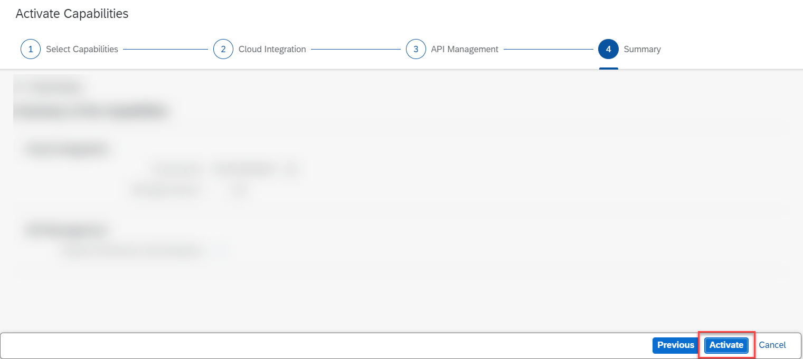
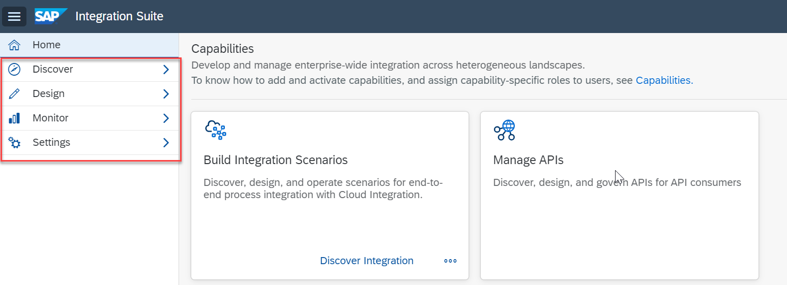

## Prerequisites
- You have created a **trial account on SAP Business Technology Platform:** [Get a Free Trial Account on SAP BTP](hcp-create-trial-account)

## Details
### You will learn
-	How to start your SAP Integration Suite trial
-	How to subscribe to the service and assign user roles
-	How to provision and activate the capabilities

SAP Integration Suite combines the integration capabilities such as Cloud Integration (Process Integration), API Management, Integration Advisor, and Open Connectors into a cohesive and simplified toolkit for enterprise integrations. To provide a comprehensive integration experience, these services are not available separately, but only as part of the Integration Suite service plan.

The Integration Suite includes all integration capabilities in simple service plans. To know more on these plans, see [Integration Suite](https://discovery-center.cloud.sap/#/serviceCatalog/f810c887-8d25-4942-9849-354837951066) service catalog.

This part of the series lets you experience few capabilities offered by SAP Integration Suite. For the complete series, see [Request Product Details with an Integration Scenario](mission.cp-starter-integration-cpi).

> **IMPORTANT**: Trial accounts are not intended for productive usage or team development. See: [Trial Scope](https://help.sap.com/viewer/51ab953548be4459bfe8539ecaeee98d/sap.cp.integration.suite/en-US/5cc6987511104c418b7cb4c25f3d9cb0.html). If you're using Integration Suite from a production account for your proof of concepts or real-time business cases, refer to the [product documentation](https://help.sap.com/viewer/51ab953548be4459bfe8539ecaeee98d/sap.cp.integration.suite/en-US/3dcf507f92f54597bc203600bf8f94c5.html) on SAP Help Portal for step-by-step explanation of the initial set up and further information.

[ACCORDION-BEGIN [Step 1: ](The Use Case)]

Using this scenario, you design and execute an integration flow that reads product details from a public product catalog (`WebShop`) for a given product identifier. Product details include data such as the product name and price, for example. To accomplish the scenario, you use SAP Integration Suite, and in particular, its capabilities *Cloud Integration* and *API Management*.

You use *Cloud Integration* to design and deploy an integration flow. When you have finished designing, you use the API Explorer tool of *API Management* to expose the integration flow endpoint as an API.

  - You also define how to access the API in terms of authentication by assigning a dedicated predefined policy template.
  - Using this policy template, you define API access based on the OAuth client credentials grant method.
  - Finally, you use API Management to call the API and get the product details in a response.

  !

[DONE]
[ACCORDION-END]

[ACCORDION-BEGIN [Step 2: ](Enter your trial account)]

>**WHERE TO START**: If you are new to SAP BTP or SAP Integration Suite, skip this note and continue with the tutorial.

> If you have already activated Cloud Integration (Process Integration) or API Management services in your existing trial account, we recommend you to perform one of the following options:

> **Option 1**: If you are unable to activate **`Integration Suite`** service in an existing subaccount, create a **`New Subaccount`** and then proceed to **Step 3**. For a new subaccount, you need to assign entitlements by adding service plans and the quotas. For more information, see [Configure Entitlements and Quotas for Subaccounts](https://help.sap.com/viewer/ea72206b834e4ace9cd834feed6c0e09/Cloud/en-US/c90f3d522ee04e65bd87cdec8808e5ce.html).

> **Option 2**: To continue with the same subaccount, unsubscribe from Cloud Integration and API Management services, and then proceed to **Step 3**.

> If you have already activated Integration Suite in your existing trial account, proceed to **Step 4**. You can consume only one Integration Suite tenant per trial account.

1. In your web browser, open the [SAP BTP trial cockpit](https://cockpit.hanatrial.ondemand.com/).

2. Navigate to the trial global account by clicking **Enter Your Trial Account**.

    !

3. Choose the region that is closest to you. Click **Create Account** to create a subaccount.

    !

4. Choose **Continue**.

    !

5. From your global account page, choose the **trial** tile to access your subaccount.

    !

[DONE]
[ACCORDION-END]

[ACCORDION-BEGIN [Step 3: ](Subscribe to the service)]
1. Select **Services > Instances and Subscriptions**.

2. Choose **Create**.

    !

3. In the **New Instance or Subscription** dialog, choose **Integration Suite** from the list of services.

    >If Integration Suite is not visible in the **Services** list, you need to assign Integration Suite Trial entitlements. To assign entitlements, see [Manage Entitlements on SAP BTP Trial](cp-trial-entitlements).

    >- In the tutorial referred above, after **Step 3.5**, there is a list of available services on the left pane.

    >- Filter for Integration Suite service and select the service.

    >- Select the service plan, add it to your subaccount, and continue with this tutorial.

4. Choose the default plan which is **trial** and click **Create**.

    !

5. You are subscribed to the service now. Click **Go to Application** in the **Integration Suite** overview page. Now you are directed to the **Integration Suite Launchpad**.

    !

[DONE]
[ACCORDION-END]

[ACCORDION-BEGIN [Step 4: ](Provision the capabilities)]
>**IMPORTANT**: Ensure that you unsubscribe from the standalone services (like Open Connectors, Cloud Integration or API Management services) if you have already subscribed to it.  If the standalone subscription exists, you will be unable to activate respective capability via the Integration Suite.

>**Navigational Steps**: Go to Service Marketplace, search for the service name and click `unsubscribe`.

1. In the Integration Suite Launchpad, choose **Add Capabilities** to activate the capabilities offered by Integration Suite.

    !

    For this tutorial, you must select **Design, Develop and Operate Integration Scenarios** and **Design, Develop and Manage APIs click** capabilities.
    Click **Next**.

    !

    You do not have to select anything here. Click **Next**.

    !

    Select the **Enable API Business Hub Enterprise** checkbox. Click **Next**.

    !

2. Click **Activate** to provision the selected capabilities.

    >For some capabilities, you would be given a choice to select additional functionalities that you need to choose based on your business requirement.

    !

    The activation takes a while to complete.
    >**IMPORTANT**: Before you proceed to **Step 5**, please wait for all the capabilities to be activated.

    !

    >**IMPORTANT**: From the **Provisioning** application you can navigate back to the Integration Suite Launchpad by choosing the **Integration Suite** button on the header.

    >To know more about resources offered by the Integration Suite Launchpad, see [Working with Integration Suite Launchpad](https://help.sap.com/viewer/51ab953548be4459bfe8539ecaeee98d/sap.cp.integration.suite/en-US/a53dce3b57ba4915b055343f783300a5.html).

    >To access each capability's tile, you must first assign capability-specific roles which is explained in the next step.

[DONE]
[ACCORDION-END]

[ACCORDION-BEGIN [Step 5: ](Automatically assign roles and create service instances using Booster)]

 In this step, you execute a booster that will assign you the necessary roles to access and use the activated capabilities, and create service instance of Process Integration Runtime.

 A **Booster** is a set of guided and interactive steps that enable you to select, configure, and consume services on SAP BTP to achieve a specific technical goal. In this case, the Integration Suite booster will help you with assigning roles and creating service instances.

 A **service instance** defines how a service of SAP BTP (in our case, the **Process Integration Runtime** service) can be called from a remote component. In the context of Cloud Integration, a service instance is the definition of an OAuth client. The service key generated out of the service instance contains credentials and other information that is required at a later step to call the integration flow.

1. Navigate to the overview page of your SAP BTP global account.

2. Choose **Boosters** on the left navigation pane.

3. From the list of boosters, look out for the tile **Enable Integration Suite**. You can start the booster execution by choosing **Start** on the tile.

    !

    Alternatively, you can open the tile, read the information, and choose **Start** in the booster page.

    !

4. In the **Configure Subaccount** tab, select your subaccount, organization, and space in which you have subscribed for Integration Suite service. Choose **Next**.

    !

5. In the **Select Activated Capabilities** tab, select **Design, Develop, and Operate Integration Scenarios** and **Design, Develop, and Manage APIs**. Choose **Next**.

    !

    >**IMPORTANT**: Make sure that you select only the capabilities that you activated in step 4.

6. In the **Review** tab, check your selections and choose **Finish**.
   You can see that the booster is being processed

    !

7. Upon successful execution of the booster, choose **Go to Application**. Also, choose **Access Service Instance(s)** to view the service instance and service key.

    !

You can also manually do the role assignment and service instance creation without using the booster. For more information, see [Configure User Access](https://help.sap.com/viewer/51ab953548be4459bfe8539ecaeee98d/sap.cp.integration.suite/en-US/2c6214a3228e4b4cba207f49fda92ed4.html) and [Create Service Instances](https://help.sap.com/viewer/368c481cd6954bdfa5d0435479fd4eaf/Cloud/en-US/883f025c30a64373b4e4102238a39fd4.html).

[VALIDATE_1]
[ACCORDION-END]

[ACCORDION-BEGIN [Step 6: ](Verify the activated capabilities)]

1. In the **Integration Suite Launchpad** application, choose **Manage Capabilities** tile.

    !

2. Click on the URLs of all the activated capabilities and verify if you can successfully access them.

    !

[DONE]
[ACCORDION-END]

---
