# Set Up Integration Suite Trial
<!-- description --> Get onboarded to SAP Integration Suite trial account.

## Prerequisites
- You have created a **trial account on SAP Business Technology Platform:** [Get a Free Trial Account on SAP BTP](hcp-create-trial-account)

## You will learn
-	How to start your SAP Integration Suite trial
-	How to subscribe to the service and assign user roles
-	How to provision and activate the capabilities

## SAP Integration Suite
SAP Integration Suite combines the integration capabilities such as Cloud Integration (Process Integration), API Management, Integration Advisor, Trading Partner Management, Integration Assessment, and Open Connectors into a cohesive and simplified toolkit for enterprise integrations. To provide a comprehensive integration experience, these services are not available separately, but only as part of the Integration Suite.

## Intro
The Integration Suite includes all integration capabilities in simple service plans. To know more on these plans, see [Integration Suite](https://discovery-center.cloud.sap/#/serviceCatalog/integration-suite/?region=all&tab=service_plan) service catalog.

This part of the series lets you experience few capabilities offered by SAP Integration Suite. For the complete mission, see [Request Product Details with an Integration Scenario](mission.cp-starter-integration-cpi).

> **IMPORTANT**: Trial accounts are not intended for productive usage or team development. If you're using Integration Suite from a production account for your proof of concepts or real-time business cases, refer to the [product documentation](https://help.sap.com/viewer/51ab953548be4459bfe8539ecaeee98d/sap.cp.integration.suite/en-US/3dcf507f92f54597bc203600bf8f94c5.html) on SAP Help Portal for step-by-step explanation of the initial set up and further information.

## The Use Case
Using this scenario, you design and execute an integration flow that reads product details from a public product catalog (`WebShop`) for a given product identifier. Product details include data such as the product name and price, for example. To accomplish the scenario, you use the SAP Integration Suite capabilities *Cloud Integration* and *API Management*.

You use *Cloud Integration* to design and deploy an integration flow. Then, you use *API Management* to expose the integration flow endpoint as an API.

  - You define how to access the API in terms of authentication by assigning a dedicated predefined policy template.
  - Using this policy template, you define API access based on the OAuth client credentials grant method.
  - Finally, you invoke the API and get the product details in a response.

  <!-- border -->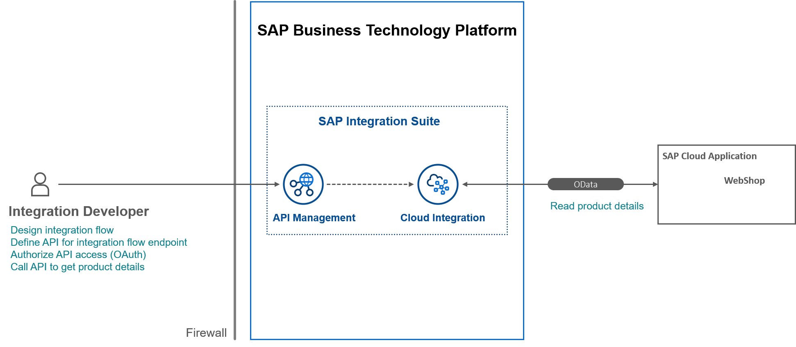

### Enter your trial account

>**WHERE TO START**:

> - **Are you new to SAP BTP Trial?** - skip the rest of the note and continue with this tutorial.

> - You already have a SAP BTP trial account but new to SAP Integration Suite:

>     - If you have already activated Cloud Integration (Process Integration) or API Management services in a subaccount:
          - **Option 1**:
          Create a **`New Subaccount`** and then proceed to **Step 2** of this tutorial.
          For a new subaccount, you must assign entitlements by adding service plans and the quotas. For more information, see [Configure Entitlements and Quotas for Subaccounts](https://help.sap.com/viewer/ea72206b834e4ace9cd834feed6c0e09/Cloud/en-US/c90f3d522ee04e65bd87cdec8808e5ce.html).          
          - **Option 2**:
          To continue with an existing subaccount, unsubscribe from Cloud Integration and API Management services, and then proceed to **Step 2**.

> - If you have already subscribed to Integration Suite in your existing trial account, proceed to **Step 3**. You can consume only one Integration Suite tenant per trial account.

1. In your web browser, open the [SAP BTP trial cockpit](https://cockpit.hanatrial.ondemand.com/).

2. Navigate to the trial global account by choosing **Go To Your Trial Account**.

    <!-- border -->

3. From your global account page, choose the appropriate subaccount's tile to navigate.

    <!-- border -->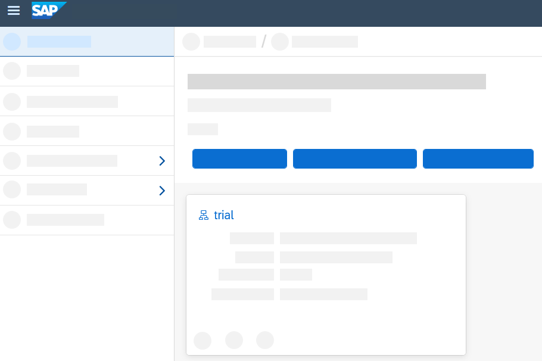

### Subscribe to the service

1. Select **Services > Instances and Subscriptions**.

2. Choose **Create**.

    <!-- border -->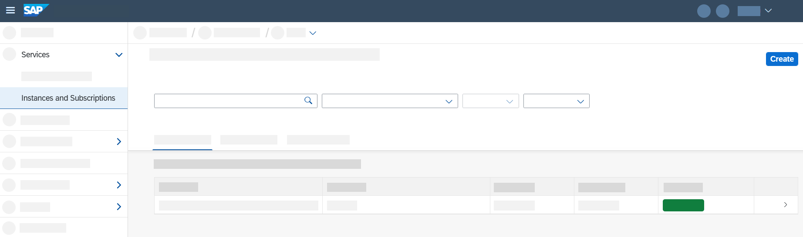

3. In the **New Instance or Subscription** dialog, choose **Integration Suite** from the list of services.

    >If Integration Suite is not visible in the **Services** list, you need to assign Integration Suite Trial entitlements. To assign entitlements, see [Manage Entitlements on SAP BTP Trial](cp-trial-entitlements).

    >- In the tutorial referred above, after **Step 3.5**, there is a list of available services on the left pane.

    >- Filter for Integration Suite service and select the service.

    >- Select the service plan, add it to your subaccount, and continue with this tutorial.

4. Choose the default plan which is **trial** and then choose **Create**. You are subscribed to the service now.

    <!-- border -->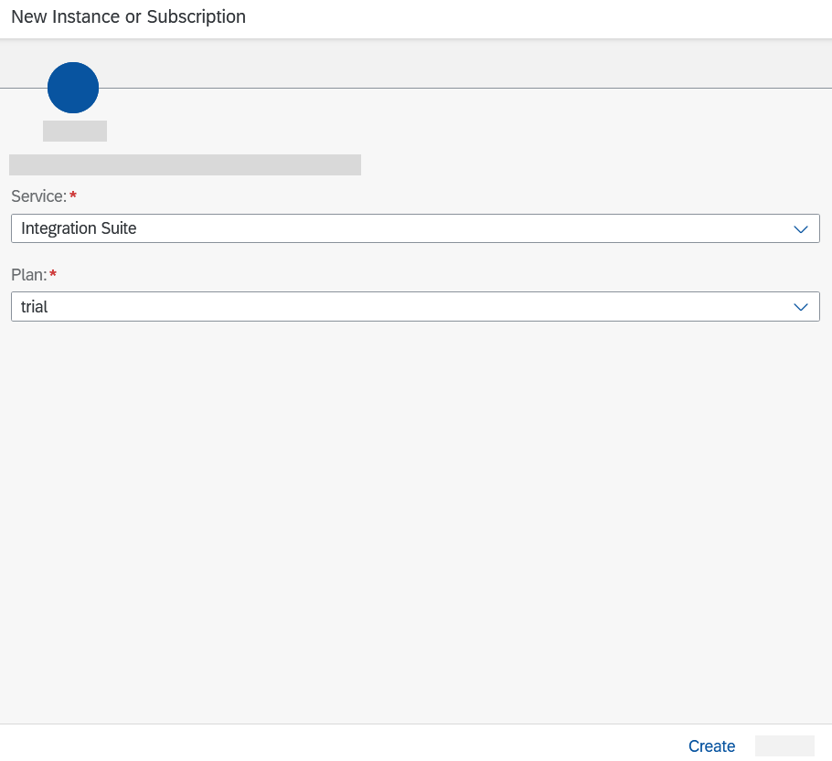

5. Select **Security > Users**. Choose the entry against your name. In the **Role Collections** section, choose **Assign Role Collection**.

    <!-- border -->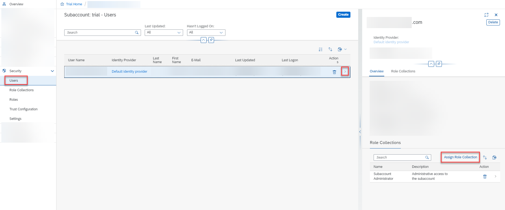

6. In the dialog that appears, select **Integration_Provisioner**. Choose **Assign Role Collection**.

    <!-- border -->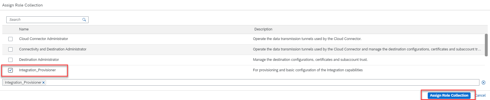

7. Click **Go to Application** in the **Integration Suite** overview page. Now you are directed to the Integration Suite home page.

    <!-- border -->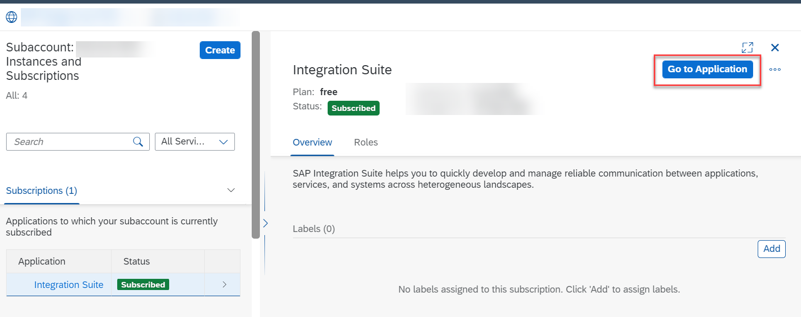

### Activate the capabilities

>**IMPORTANT**: Ensure that you unsubscribe from the standalone services (like Cloud Integration, or API Management) if you have already subscribed to them in the same subaccount.  If the standalone subscription exists, you will be unable to activate respective capability via the Integration Suite.

>**Navigational Steps**: Go to **Instances and Subscriptions** and delete the subscriptions.

1. In the Integration Suite home page, choose **Add Capabilities** to activate the capabilities offered by Integration Suite.

    <!-- border -->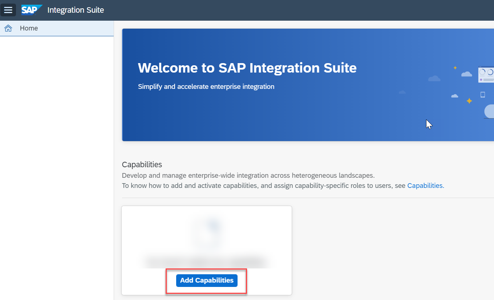

    For this tutorial, you must select the **Build Integration Scenarios** and **Manage APIs** capabilities. Choose **Next**.

    <!-- border -->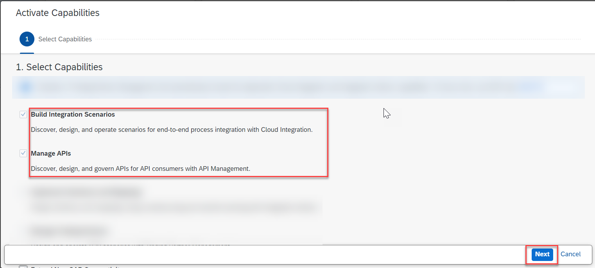

    You do not have to select anything here. Choose **Next**.

    <!-- border -->

    Select the **Enable API Business Hub Enterprise** checkbox. Choose **Next**.

    <!-- border -->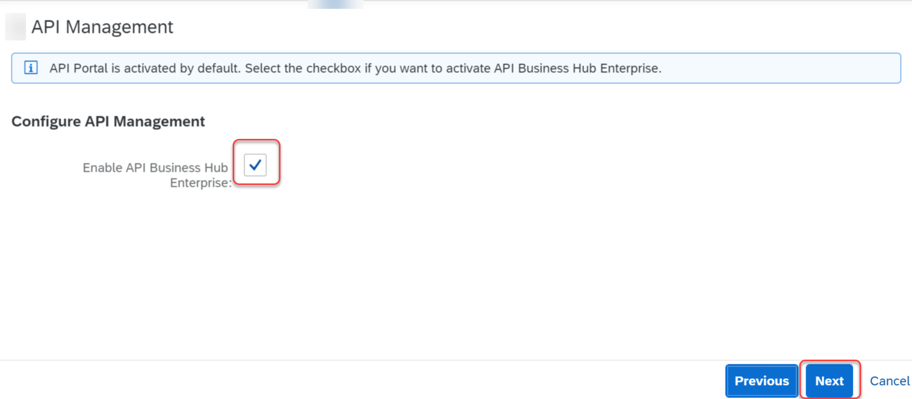

2. Choose **Activate** to provision the selected capabilities.

    >For some capabilities, you would be given a choice to select additional functionalities that you need to choose based on your business requirement.

    <!-- border -->

    The activation takes a while to complete.
    >**IMPORTANT**: Before you proceed, please wait for the capabilities to be activated.

    <!-- border -->

    >To access the features of each capability, you must first assign capability-specific roles which is explained in the next step.

### Automatically assign roles and create service instances using Booster

 In this step, you execute a booster that will assign you the necessary roles to access and use the activated capabilities, and create service instance of Process Integration Runtime.

 A **Booster** is a set of guided and interactive steps that enable you to select, configure, and consume services on SAP BTP to achieve a specific technical goal. In this case, the Integration Suite booster will help you with assigning roles and creating service instances.

 A **service instance** defines how a service of SAP BTP (in our case, the **Process Integration Runtime** service) can be called from a remote component. In the context of Integration Suite, a service instance is the definition of an OAuth client. The service key generated out of the service instance contains credentials and other information that is required at a later step to call the integration flow.

1. Navigate to the overview page of your SAP BTP global account.

2. Choose **Boosters** on the left navigation pane.

3. From the list of boosters, look out for the tile **Enable Integration Suite**. You can start the booster execution by choosing **Start** on the tile.

    <!-- border -->

    Alternatively, you can open the tile, read the information, and choose **Start** in the booster page.

    <!-- border -->

4. In the **Configure Subaccount** tab, select your subaccount, organization, and space in which you have subscribed for Integration Suite service. Choose **Next**.

    <!-- border -->

5. In the **Select Activated Capabilities** tab, select **Design, Develop, and Operate Integration Scenarios** and **Design, Develop, and Manage APIs**. Choose **Next**.

    <!-- border -->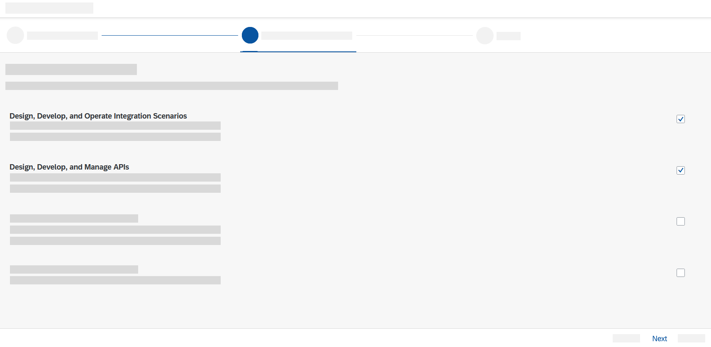

    >**IMPORTANT**: Make sure that you select only the capabilities that you activated in step 3.

6. In the **Review** tab, check your selections and choose **Finish**. You can see that the booster is being processed.

    <!-- border -->

7. Upon successful execution of the booster, choose **Go to Application**. Also, choose **Access Service Instance(s)** to view the service instance and service key.

    <!-- border -->

You can also manually do the role assignment and service instance creation without using the booster. For more information, see [Configure User Access](https://help.sap.com/viewer/51ab953548be4459bfe8539ecaeee98d/sap.cp.integration.suite/en-US/2c6214a3228e4b4cba207f49fda92ed4.html) and [Create Service Instances](https://help.sap.com/viewer/368c481cd6954bdfa5d0435479fd4eaf/Cloud/en-US/883f025c30a64373b4e4102238a39fd4.html).

### Verify the activated capabilities

1. Refresh the Integration Suite home page to see capability-specific menu items being added to the left navigation.

    <!-- border -->

---
