## Details
### You will learn  
  - Where services are in the SAP Cloud Platform
  - How to navigate the cockpit
  - How to move between SAP Cloud Platform landscapes

The SAP Cloud Platform Neo environment cockpit is your central point of command when doing cloud development. It is important to understand how to use all the controls at your finger tips to get the most out of the SAP Cloud Platform Neo environment.

> **Note:** This tutorial covers the Neo environment. If you are interested in the most recent environment, please refer to [this tutorial](https://developers.sap.com/tutorials/cp-trial-quick-onboarding.html).

---

[ACCORDION-BEGIN [Step 1: ](Welcome to your cockpit)]

Welcome to your SAP Cloud Platform cockpit for your Neo trial account. In the following steps you will explore many of the options on the left navigation pane, the details of the System Status section, and how to move around using the breadcrumbs.

Before you move on to the next steps, make sure you are on this **Cockpit Overview** page.

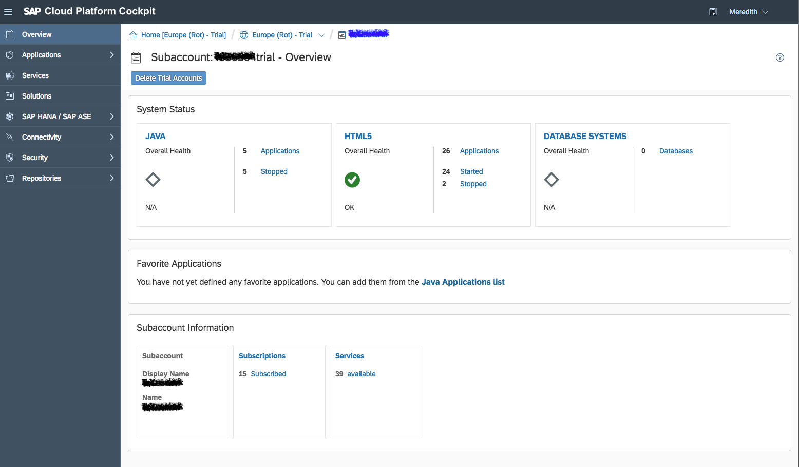

> If not, go to <https://account.hanatrial.ondemand.com> and log in to your SAP Cloud Platform cockpit.

> Scroll down the page and click on "Access Neo Trial" to access the Neo environment.

>    

[DONE]
[ACCORDION-END]

[ACCORDION-BEGIN [Step 2: ](Understanding System Status)]

The System Status section on the Overview page gives you a quick glance at your application health. You can host Java applications, HTML applications, and Database systems on SAP Cloud Platform. The Overall Health will let you know if any of your started applications are experiencing outages. You can also see an overview of how many applications you have, as well as how many are started of stopped.

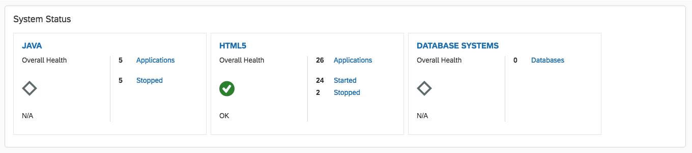

To get more details about the applications, click on the Applications tab on the left navigation pane. Then click on Java Applications.

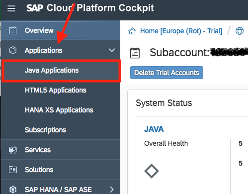

[DONE]
[ACCORDION-END]

[ACCORDION-BEGIN [Step 3: ](Looking into applications)]

From the Java Applications page, you can take initial actions. If you already have an existing Java application that you were developing, you can **deploy you application to your SAP Cloud Platform** here (see #1 in image below). You will also have this option for HTML5 applications and XSA systems.

For applications already deployed to the SAP Cloud Platform, you can take standard actions against the application here (see #2 in image below). By clicking the _play styled icon_, you can **start the application** if it is not already running. Alternatively, you can **stop a running application** by clicking the _circled square icon_. Using the _trash can icon_, you can **delete the application**. And the _star_ will **favorite the application**.

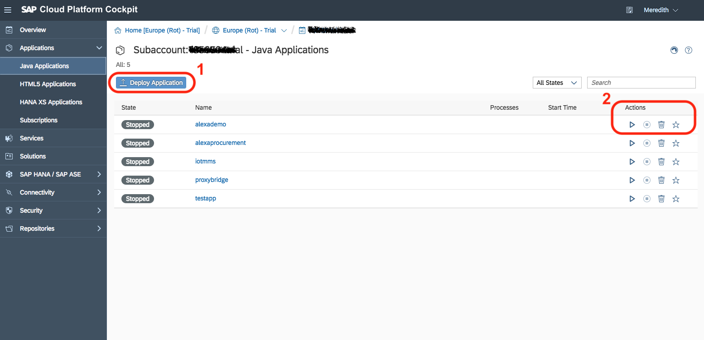

[VALIDATE_3]
[ACCORDION-END]

[ACCORDION-BEGIN [Step 4: ](Dive into an application overview)]
**You can explore more about an application by clicking on its name**. If you are new to the SAP Cloud Platform, you may not have an application available to explore right now which is OK!

Once you click on the name, you are taken to the Application Overview page. This page is a high level look at the single application you clicked on.

Here you will find specific information about your application. You can _monitor resource consumption_, _update the application version_, find the _application URL_, and more. It is your centralized dashboard for an application.

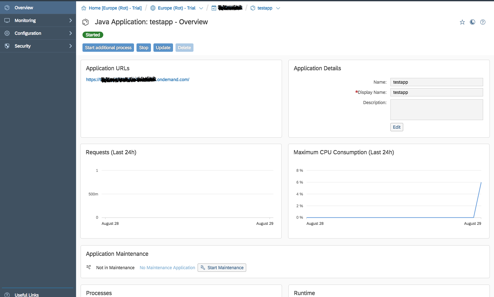

You may have noticed there are **new left menu options**. Here you can dive into the _logs_ of the application under the **Monitoring** tab, configure your _data sources_ under the **Configuration** tab, and update _application permissions_ on the **Security** tab.

Let's take a look at how the Security features might work.

[DONE]
[ACCORDION-END]

[ACCORDION-BEGIN [Step 5: ](Update application security)]

Go ahead a click on **Security**, and then **Roles** to get to the Roles page for the application.

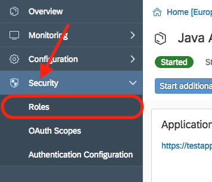

Applications will have different roles. Maybe some of your team needs admin access to the Application Overview, while others may just be developers and only need access to the code. Using the Roles under the Security settings enables you to define how much access each user or group of users needs.

To _assign an individual to a role_, first **select a role** in the Role list. Then **click on the Assign button** next to Individual Users.

In the pop up box, **enter the User ID** (for example: your P number) and click **Assign**.

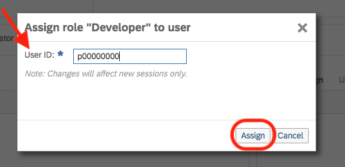

Now that user will have access next time the refresh their session.

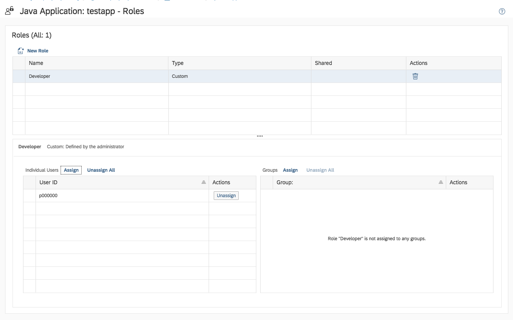

This is very helpful with productive accounts, but you might not find yourself using it with you trial account. But if you never need to share an application with a colleague or teammate, remember this!

[DONE]
[ACCORDION-END]

[ACCORDION-BEGIN [Step 6: ](Navigating using the breadcrumbs)]

Now you may be asking yourself how do you get back to the cockpit since the left menu changed. Don't worry! Those handy _breadcrumbs_ at the top of the screen are helpful with **navigation**.

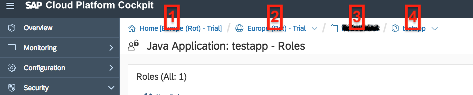

The first item ( **#1** ) in your breadcrumbs list is the **trial home**. This lets you know that you are in your trial account. If you click this link, you will get back to the trial home where _you can select your Neo account or Cloud Foundry account_. This is handy for switching between the two when you need to set things up.

The second item ( **#2** ) is your **region**. This is where your data center for your SAP Cloud Platform is. By click on this, you can quickly switch between regions. This is also _handy for moving over to a previously set up Cloud Foundry landscape, or moving into your companies productive accounts_.

The third item ( **#3** ) is your `subaccount`. This will take you back to _your Cockpit Overview page_. If you ever get too deep in the weeds, this is a safe space to come back to!

And in this case the fourth item ( **#4** ) is the **Java Applications**. Your breadcrumb list will reflect which left menu item you clicked into. By clicking on the arrow next to the application name, you will see a list of _your other Java Applications to quickly navigate between them_.

Go ahead and navigate back to your SAP Cloud Platform cockpit.

[VALIDATE_6]
[ACCORDION-END]

[ACCORDION-BEGIN [Step 7: ](What are services?)]
The SAP Cloud Platform provides an abundance of services for you to use. Future tutorials cover some of these in depth, but sometimes it is fun to peruse what is available.

To see the list of services available in the Neo environment, click the **Services** tab in the left menu.

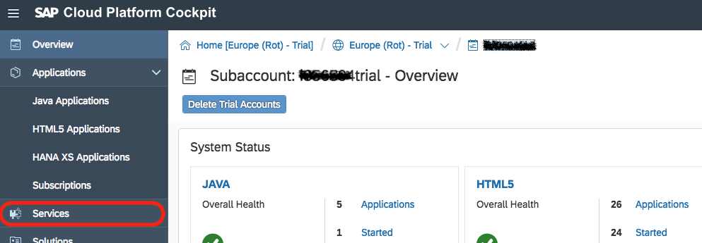

On the **Services page**, you can explore a service by **clicking on the tile**. Select any service and click on it.

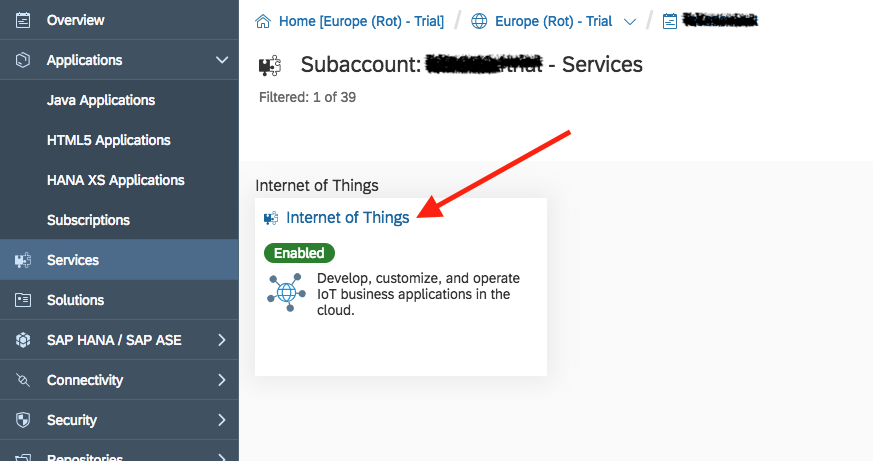

On a Service Overview page, you will find a couple standard things.

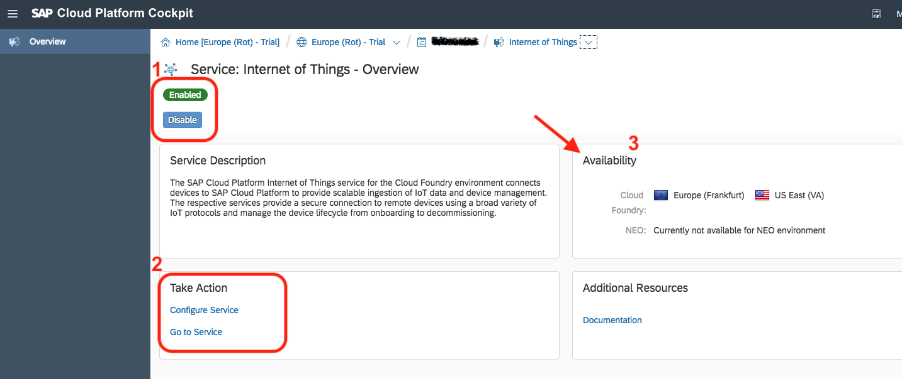

The 1st ( **#1** ) is the _service status_. It will generally either be enabled or disabled. **To change the state, just click the button**. It can be helpful to disable a service when you are not using it in a productive account as leaving it Enabled may impact billing.

The 2nd ( **#2** ) is the _Actions_ you can take on a service. Once the service is enabled, you will have a **Go to Service** option to launch the service. You can also configure the service if you need additional destinations and data sources or updated permissions for the service. Some services will have more actions as they may have multiple portals to utilize all the features.

The last thing ( **#3** ) to take note of is the _Availability_. If you are wondering why you may not see a service in your company's productive account, it may be related to the availability in that region. Not all services are available in all regions and on all landscapes.

[DONE]
[ACCORDION-END]

[ACCORDION-BEGIN [Step 8: ](Storing your code)]
Head back to your SAP Cloud Platform cockpit.

Another handy developer tool to note is the **Repositories**. Repositories are helpful for code maintenance and migration. If you click on the **Repositories** tab in the _left menu_, you will find a couple different types of repos you can store on SAP Cloud Platform.

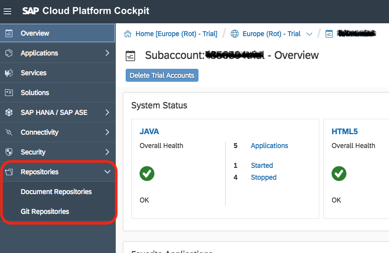

**Click on Git Repositories** to navigate to the repos page. If you have used GitHub or another code management tool before, you will find the experience is similar.

In the repos page, you will find a listing of all your repositories, the availability to create new ones, and usage data for the repos.

If you have repos, **click on a repo name**.

When cloning new repos from other environments, you will find a hand tool in the Git Repo overview for a specific repo. You are able to quickly clone the application into SAP Web IDE, SAP's cloud based development environment. You will learn more about SAP Web IDE in future tutorials.

Additionally, you'll find information here about your disk usage, URLs for the repo, and the deployed application if applicable.

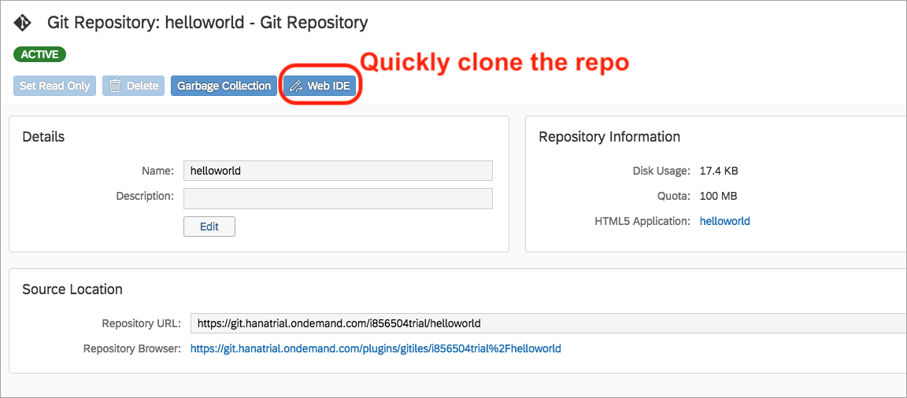

Don't forget to utilize this tool as it has integrations across many of the SAP Cloud Platform services and other SAP tools!

[DONE]
[ACCORDION-END]

[ACCORDION-BEGIN [Step 9: ](Quick overview of database systems)]

Back in your SAP Cloud Platform cockpit, check out the **SAP HANA/SAP ASE** section of the left menu. When you click the SAP HANA/SAP ASE tab, you will find 3 types of data management: Database Systems, Databases & Schemas, and Service Requests.

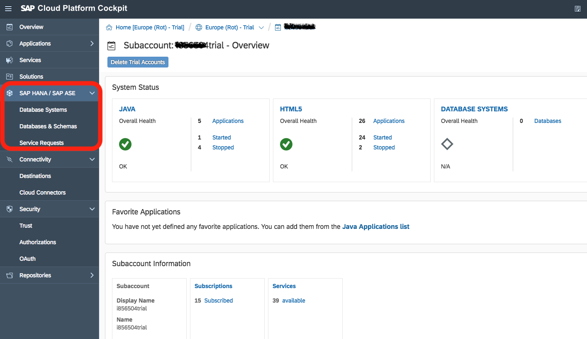

[DONE]
[ACCORDION-END]

[ACCORDION-BEGIN [Step 10: ](Quick overview of connectivity)]

Back in your SAP Cloud Platform cockpit, check out the **Connectivity** section of the left menu. When you click the Connectivity tab, you will find 2 types of connectivity: Destinations and Cloud Connectors.

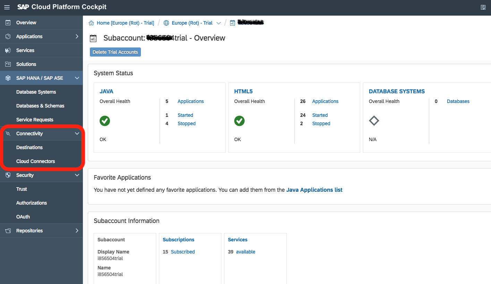

**Destinations** will assist you in _connecting to external cloud-based systems_, whether they are SAP systems or not, and using that system for data across your SAP Cloud Platform. It handles a lot of the heavy lifting around authentication, permissions, and same-origin policies on most browsers. It also validates with the source that you can use this data point in your applications by handling the cross origin validation. You will find this very useful when making _API calls_.

**Cloud Connectors** will assist you in _connecting to your on premise SAP systems_. You will find this handy when you want to get your data off your on premise SAP software or product, and use it for _extension building in the cloud_.

[DONE]
[ACCORDION-END]

[ACCORDION-BEGIN [Step 11: ](Quick overview of security)]

Back in your SAP Cloud Platform cockpit, check out the **Security** section of the left menu. When you click the Security tab, you will find 3 things you can manage: Trust, Authorization, and OAuth.

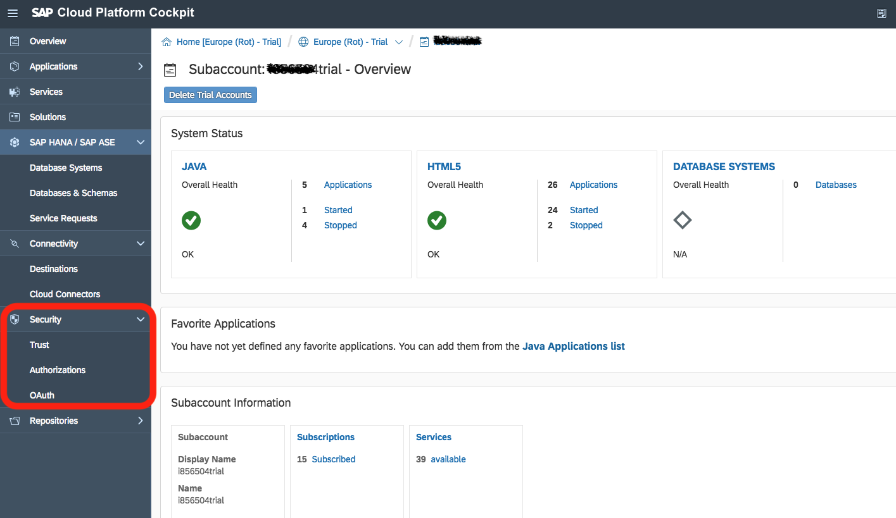

[DONE]
[ACCORDION-END]

---
