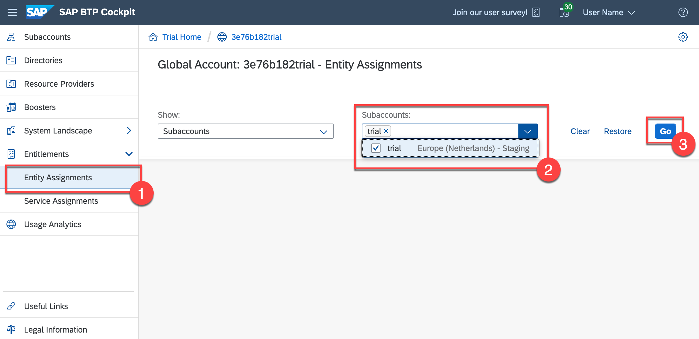
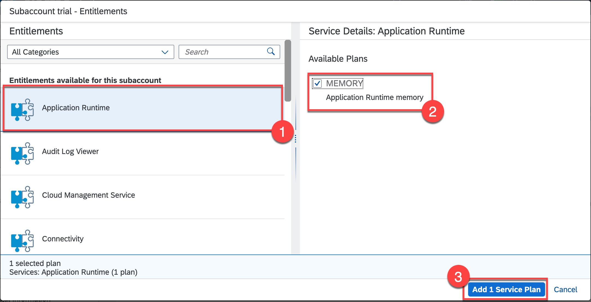
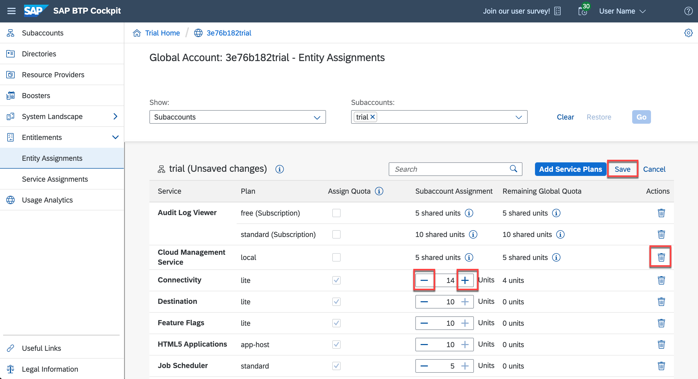

## Prerequisites
- You must have registered for a trial account on SAP Business Technology Platform: [Get a Free Account on SAP BTP Trial](hcp-create-trial-account)

## Details
### You will learn
  - How to add missing entitlements to your trial subaccount
  - How to move entitlements from one subaccount to another
---

[ACCORDION-BEGIN [Step 1: ](Entitlements and quota)]

Before you get started, you should understand the difference between entitlements and quota, because you'll encounter these 2 terms quite often.

- **Entitlements** are your right to provision and consume a resource. They refer to **what** you're entitled to use (e.g., which services and service plans).

- **Quota** is the numeric quantity that defines the maximum allowed consumption of that resource. In other words, **how much** of a service plan you're entitled to use.

Entitlements and quotas are managed at the global account level, distributed to directories and subaccounts, and consumed by the subaccounts.

When you remove quotas or entitlements from a subaccount, they become available again at global account level and can be assigned to other subaccounts.

[DONE]
[ACCORDION-END]

[ACCORDION-BEGIN [Step 2: ](Subaccounts and service plans)]

When you sign up for a trial account, you get a subaccount called **trial** automatically created for you, and all trial entitlements assigned to it by default. If you choose to create an additional subaccount and try things out there, you need to manually move the entitlements from the default subaccount to the new subaccount. You may want to:

  - Move over all trial entitlements.

  - Move over only some of them.

  - Split quota for a service plan between the 2 subaccounts.

Each service has one or more **service plans** available. A service plan is the representation of the costs and benefits for a given variant of a particular service. For instance, a database may be configured with various "T-shirt sizes", each of which is a different service plan.

Some service plans use numeric quota, which means that you can increase or decrease the number of units available in a subaccount. Depending on the service, these units represent different things and may impact the amount of service instances, applications or routes you can have in a subaccount.

There are also service plans where the quota is simply shown as "limited". In that case, you can entitle that service to multiple subaccounts without having to worry about how much of it to distribute to each subaccount. You can think of assigning entitlements for such service plans as "enabling" subaccounts to use them.

<!--Add Directories here as well -->
There are several places in the cockpit where you can view and configure entitlements and quotas for subaccounts:

- at **global account** level

- at **subaccount level**

You can also use **directories** to distribute entitlements. To find out more about directories, see the documentation on [Directories](https://help.sap.com/viewer/65de2977205c403bbc107264b8eccf4b/Cloud/en-US/8ed4a705efa0431b910056c0acdbf377.html#loioa92721fc75524ec09a7a7255997dbd94).

In this tutorial, you'll work on global account level. You have one global account that is your trial account.

[DONE]

[ACCORDION-END]

[ACCORDION-BEGIN [Step 2: ](Add missing entitlements to your subaccount)]

You're most likely here because you did not get all the service plans available on trial automatically entitled to the default **trial** subaccount that was created for you. In this step, you will fix that.

1. Go to the [SAP BTP Trial] (https://cockpit.hanatrial.ondemand.com/cockpit/#/home/trial) homepage and click **Enter Your Trial Account**.

2. Use the side navigation to go to **Entitlements** > **Entity Assignments**.  

3. In the dropdown menus, choose **Show:** > **Subaccounts** and **Subaccounts:** > **trial** and then choose **Go**.

    !

      This loads a table with all the existing entitlements and quota assigned to that subaccount.

4. Click on **Configure Entitlements** to enter edit mode for that subaccount.

5. Once in edit mode, you can change quotas for existing service plans, add new service plans to the subaccount or remove service plans from that subaccount to make them available again at global account level.

    Right now, you want to add missing entitlements, so choose **Add Service Plans**.

    !

6. In the dialog that opens, you have a list of all services available on trial on the left. You have to go through each of these services and make sure you add any missing service plans to your subaccount.

    To do so, start from the top and select a service from the list. On the right you will see all the service plans available for that service. If the plan is not already selected and greyed out, select it, then move on to the next service until you have checked all of them.
    If you have been directed to this tutorial because you are missing a specific entitlement, now is the time to add the service plan you need.

7. Once you're done, choose **Add <x> Service Plans** at the bottom of the dialog to confirm your selection.

    

8. You're still in edit mode for the subaccount, so choose **Save** to confirm changes made to the subaccount entitlements and exit edit mode.

You can now use all these services available on trial in your subaccount.

[DONE]
[ACCORDION-END]

[ACCORDION-BEGIN [Step 3: ](Move entitlements across subaccounts)]

When you sign up for a trial account, you get a subaccount called **trial** automatically created for you, and all trial entitlements assigned to it by default.
If you choose to create an additional subaccount and try things out there, you need to manually move the entitlements from the default subaccount to the new subaccount. You may want to move over all trial entitlements, only some of them, or even split quota for a service plan between the 2 subaccounts.

1. Go to the [SAP BTP Trial](https://cockpit.hanatrial.ondemand.com/cockpit/#/home/trial) homepage and click **Enter Your Trial Account**.

2. Use the side navigation to go to **Entitlements** > **Entity Assignments**.

3. In the dropdown menu, select both subaccounts and choose **Go**.

    You will see 2 tables, one for each subaccount.

4. First, you need to remove entitlements from the default subaccount to make them available at global account level again and be able to reassign them. Choose **Configure Entitlements** above the table for the **trial** subaccount to enter edit mode.

    >You can only edit one subaccount at a time.

5. Once you're in edit mode, you have 2 options: completely remove a service plan from the subaccount or remove some of the quota for a specific service plan.

    **To completely remove a service plan:** Click on the trashcan icon under **Actions** for that specific service plan.

    **To remove quota for a service plan:** In the **Quota** column, choose the **+/-** buttons to adjust the amount you want to keep in the default subaccount.

    !

6.	When you're done removing all the service plans and/or quotas from the default subaccount, choose **Save** to exit edit mode for the **trial** subaccount.

7. Now that the entitlements and quotas you removed are free at global account level, you can assign them to your new subaccount. Enter edit mode for this subaccount by choosing **Configure Entitlements** above its table.

8. Similar to **Step 2**, choose **Add Service Plans** and in the dialog select all the services and plans you want to add to your new subaccount.

Don't forget to increase the quota to the amount you need.

9. When you're done adding everything, choose **Save** to confirm your changes and exit edit mode for that subaccount.

You've now changed the entitlements and quota distribution across your 2 subaccounts and are ready to deploy applications and create service instances in your new subaccount.

[DONE]
[ACCORDION-END]
