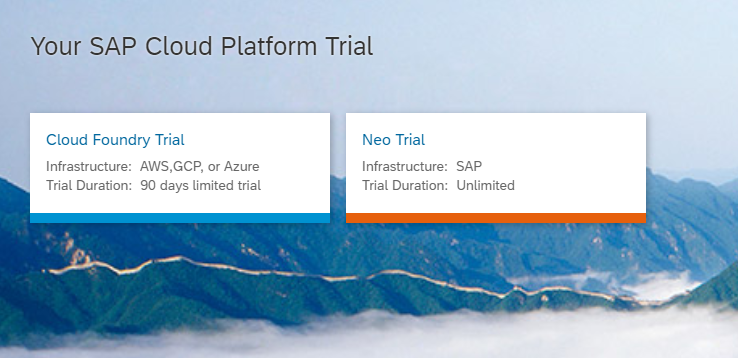
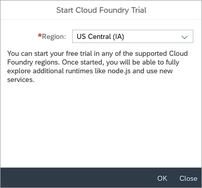
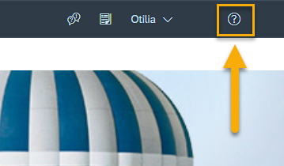
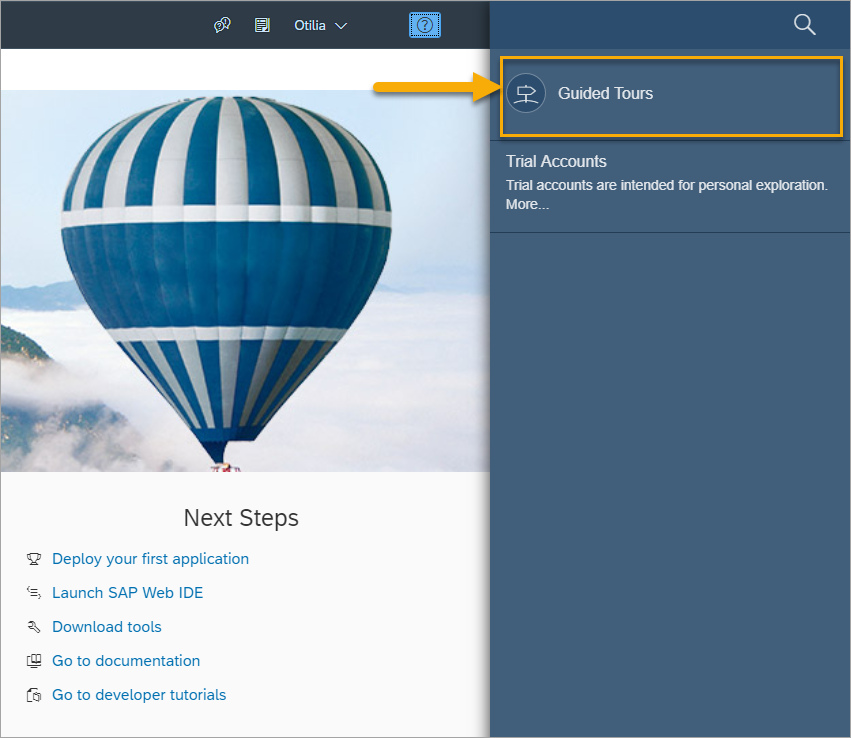

## Prerequisites
 - You must have registered for a trial account on SAP Cloud Platform.
 Get it on the [SAP Cloud Platform website](https://cloudplatform.sap.com/index.html).

## Details
### You will learn
  - What SAP Cloud Platform trial offers
  - The relationship between global accounts, subaccounts, organizations and spaces
  - How to create a trial account in the Cloud Foundry environment
  - How to use services in the Cloud Foundry environment
  - How to navigate the cockpit
  - How to use the cockpit in-app help if you get stuck

---

[ACCORDION-BEGIN [Step 1: ](Introduction to SAP Cloud Platform trial)]

So you've signed up for a trial on SAP Cloud Platform but are not quite sure where to start? This tutorial is here to help! Let's first learn a bit about what SAP Cloud Platform is and what you should expect from your trial.

SAP Cloud Platform is an enterprise platform-as-a-service (enterprise PaaS) that provides application development services and capabilities which let you build, extend, and integrate business applications in the cloud.

A trial account on SAP Cloud Platform enables you to experience it for free, offering access to a comprehensive set of platform services, as well as early access to beta functionality.

Trial accounts are intended for personal exploration, and not for production use or team development. They allow restricted use of the platform resources and services:

 | Cloud Foundry Trial
---|---
**Data centers** | Runs on third-party data centers from AWS, Azure and Google Cloud Platform
**Trial duration** | Limited to 90 days
**Strengths** | Allows you to use multiple programming languages such as Java, Node.js and community/bring-your-own language options

You can find the regions available on trial [here](https://help.sap.com/viewer/65de2977205c403bbc107264b8eccf4b/Cloud/en-US/350356d1dc314d3199dca15bd2ab9b0e.html) and then you can look for those regions in [this table](https://help.sap.com/doc/aa1ccd10da6c4337aa737df2ead1855b/Cloud/en-US/3b642f68227b4b1398d2ce1a5351389a.html) to see what services are available in trial.

[DONE]
[ACCORDION-END]

[ACCORDION-BEGIN [Step 2: ](Global accounts, subaccounts, organizations and spaces)]

Now that you know what to expect from your trial account, let's learn about how things are structured on SAP Cloud Platform.

SAP Cloud Platform uses two levels of accounts:  **global accounts** and **subaccounts**. Your global account and subaccounts in SAP Cloud Platform are the way in which all of your activities in SAP Cloud Platform are structured.

A **global account** is the realization of a contract you made with SAP (be it enterprise or trial). It's region-independent, and it's used to manage subaccounts, members, and quotas. You receive quotas to use platform resources per global account and then distribute the quotas to the subaccount for actual consumption. A global account can contain one or more subaccounts in which you deploy applications and use services.

**Subaccounts** let you structure a global account according to your project's requirements with regards to members, authorizations, and quotas. Subaccounts in a global account are independent from each other. Each subaccount is associated with a **region**, which is the physical location where applications, data, or services are hosted. The region assigned to your subaccount doesn't have to be directly related to your location. You could be located in the United States, for example, but operate your subaccount in Europe.

### Cloud Foundry

When you register for a trial account on SAP Cloud Platform, your Cloud Foundry trial global account is not automatically created. You must create one yourself from the cockpit (more details on how to do that later).

In addition to global accounts and subaccounts, Cloud Foundry includes another hierarchical level represented by **organizations** and **spaces**.

**Each Cloud Foundry subaccount contains exactly one Cloud Foundry organization.** They have a 1:1 relationship. When you create a Cloud Foundry trial account, you get a global account with one Cloud Foundry subaccount in it, where the organization is created automatically. You have the option of creating additional Cloud Foundry subaccounts within your trial global account, however in those you must create an organization yourself by clicking on the **Enable Cloud Foundry** button.

**In your organization you can then create one or more spaces, where you deploy apps and use services.** Similar to subaccounts, spaces enable you to once again structure and sub-divide quota if you want to. When you create your Cloud Foundry trial global account in the cockpit, one space is also automatically created within your organization. You also have the option of adding additional ones if you like.

[VALIDATE_2]

[ACCORDION-END]

[ACCORDION-BEGIN [Step 3: ](Create a Cloud Foundry trial account)]
As previously mentioned, a Cloud Foundry trial account is not automatically created when you register for a trial on SAP Cloud Platform. To create one, you must do the following:

1. Click on the **Cloud Foundry Trial** tile on the [cockpit homepage](https://cockpit.hanatrial.ondemand.com/cockpit/#/home/trialhome).

    

2. Select a region (data center) for your Cloud Foundry trial subaccount

    

A Cloud Foundry subaccount, organization and space are then automatically created, and you have the option to directly navigate to your space where you can deploy apps and use services.

[VALIDATE_3]

[ACCORDION-END]

[ACCORDION-BEGIN [Step 4: ](Services in the Cloud Foundry environment)]

In the Cloud Foundry environment, you create service instances in your Cloud Foundry space and bind them to applications within that space.

A service instance is a single instantiation of a service running on SAP Cloud Platform. Service instances are created using a specific service plan. A service plan is a configuration variant of a service. For example, a database may be configured with various "t-shirt sizes", each of which is a different service plan.

To integrate services with applications, the service credentials must be delivered to the application. To do so, you can bind service instances to your application to automatically deliver these credentials to your application. Alternatively, you can use service keys to generate credentials to communicate directly with a service instance. As shown in the figure below, you can deploy an application first and then bind it to a service instance:

#### To create a service instance:

1. Navigate to your space in the Cloud Foundry environment where you want to create the instance and choose **Service Marketplace** from the left hand-side navigation.

    

2. Choose the service for which you want to create an instance (let's choose **Application Logging** as an example).

    

3. In the left hand-side navigation, choose **Instances**.

    

4. Click on the **New Instance** button.

    

5. Follow the wizard that appears to finalize the creation of the instance. This includes choosing a service plan and optionally adding parameters and an application to bind the instance to.

    

6. Finally, enter a name for your instance and choose **Finish**.

    

7. Your new instance will appear in the table:

    

8. You can then click on it to bind it to an application or create a service key.

    

[VALIDATE_4]

[ACCORDION-END]

[ACCORDION-BEGIN [Step 5: ](Navigation in the cockpit)]

There are 2 ways of navigating in the cockpit:

- using the left hand-side navigation
- using the breadcrumbs at the top of the page

Remember all that stuff about global accounts, subaccounts we talked about earlier? There are certain actions you can perform at each level - we will refer to the sum of these actions as a **scope**. For example, when you are in a global account you can add global account members, create subaccounts and add entitlements to subaccounts. They represent the **global account scope**.

This scope is reflected in both the left hand-side navigation and the breadcrumbs. This step helps you understand how to use both of them together to navigate through the cockpit in the most efficient way possible.

### Left hand-side navigation

 The left hand-side navigation changes depending on where you are in the cockpit. It reflects the actions possible in that scope. You can see some examples below:

**Cloud Foundry Subaccount Scope:**

**Cloud Foundry Space Scope:**

### Breadcrumbs

You may ask yourself - if the left hand-side navigation changes depending on where you are in the cockpit,  then how can you navigate back? Simple - you use the breadcrumbs at the top.

The breadcrumbs coincide with the hierarchical path you've travelled in order to reach your current scope in the cockpit. For example, to reach an application in the Cloud Foundry environment you will have to go to your global account, then to the subaccount, then to the space and then finally to the application.

The last item in your breadcrumbs always represents the scope you find yourself in at that moment. To go back, simply follow the breadcrumbs to retrace your steps.

Let's have a look at the following screenshot, taken from an application deployed in the Cloud Foundry dev space:

1. **Trial Home** - here you can find your trial homepage

2. **Global account** - this contains all your subaccounts and entitlements

3. The 3rd item represents your **subaccount**.

4. Afterwards, you have your **space** as the 4th item.

5. Finally, you have your **deployed application** - this is the current scope.

[VALIDATE_5]

[ACCORDION-END]

[ACCORDION-BEGIN [Step 6: ](Guided tours in the cockpit)]

One more thing before you go! If you ever get lost in the cockpit, we have a few guided tours ready to help you and make sure you can always get to the page you need. To access them, follow these steps:

1. Navigate to the homepage of your trial account on SAP Cloud Platform (you can just click the first item in your breadcrumbs, it will always take you there).

2. Click on the help icon next to your name in the header, which opens a carousel on the right hand-side of the cockpit.

    

3. In that carousel, you will see a tile called **Guided Tours** - click on it and choose the tour you're interested in from the list.

    

[DONE]
[ACCORDION-END]

That's all you need to know to get started with your SAP Cloud Platform trial. You're all set!

---
