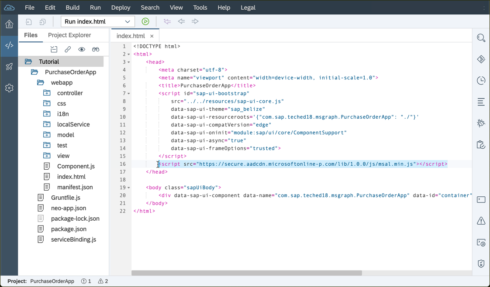
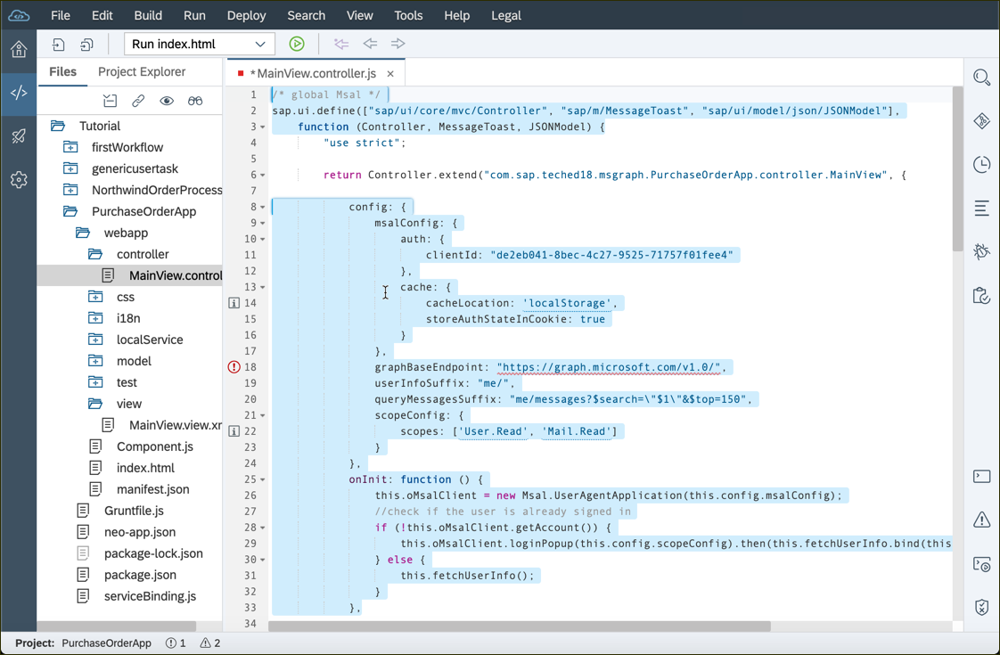
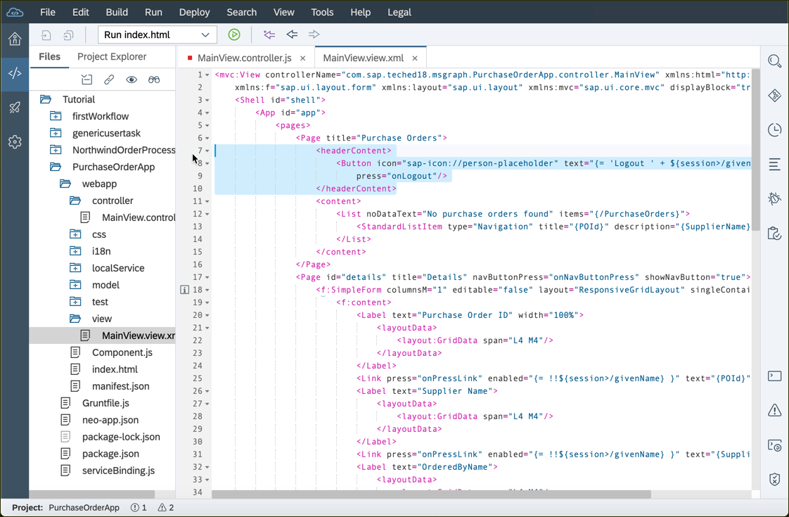
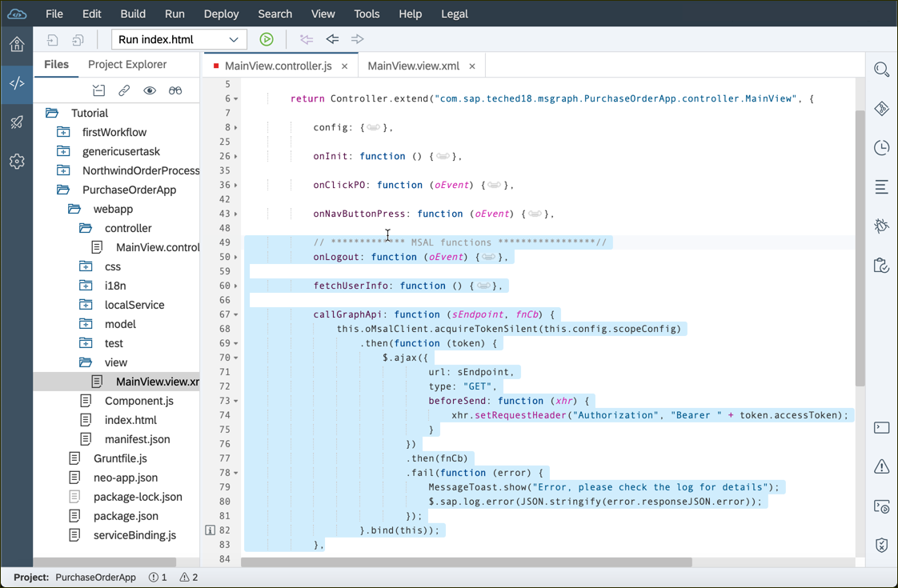
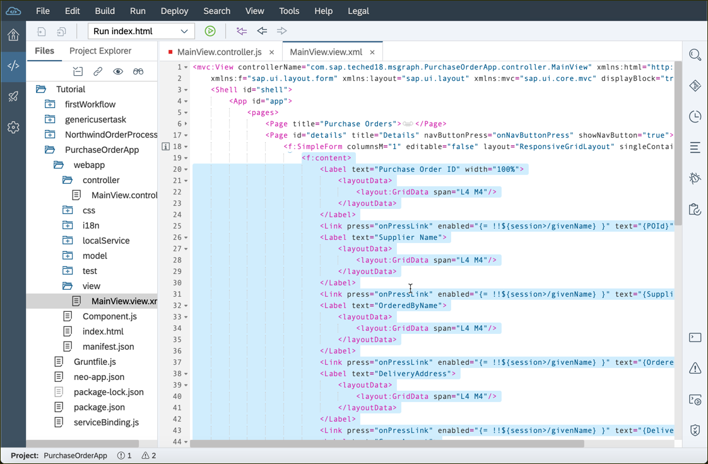
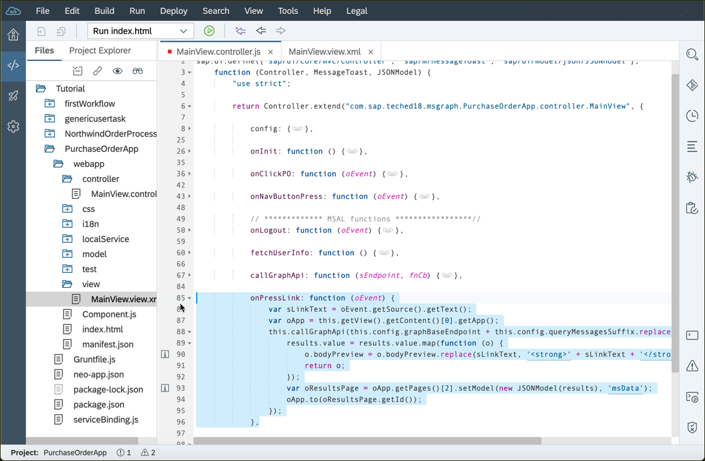
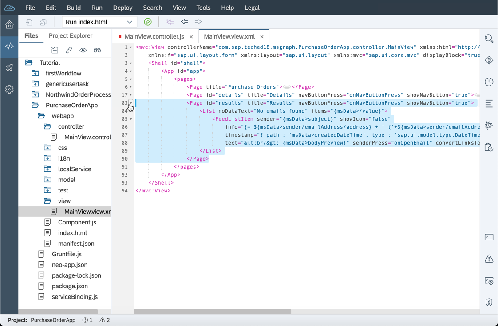
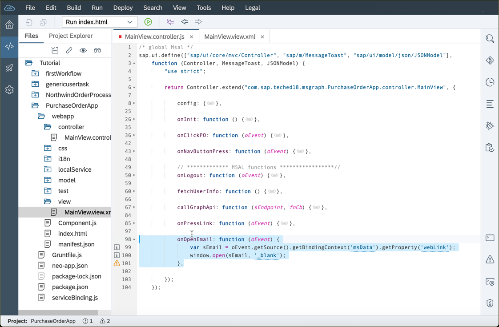

## Details
### You will learn  
  - How to integrate the Microsoft Authentication Library (MSAL) into a SAPUI5 application
  - How to interact with Microsoft Graph
  - How to use the SAPUI5 date formatter in XML views

---


[ACCORDION-BEGIN [Step](Load Microsoft Authentication Library)]

Copy the following line right below the first `script-tag` in the `index.html` file.

```html
<script src="https://secure.aadcdn.microsoftonline-p.com/lib/1.0.0/js/msal.min.js"></script>
```




> You can find the most [recent version](https://www.npmjs.com/package/msal)  of this library at npm and fetch it from this source.

[DONE]
[ACCORDION-END]
[ACCORDION-BEGIN [Step ](Initialize the MSAL client)]

1. Replace the `sap.ui.define` function header (usually the first three lines above the `"use strict"` [directive](https://www.w3schools.com/js/js_strict.asp)) of the `MainView.controller.js` with this code to suppress warning in the SAP Web IDE and to inject more SAPUI5 controls via dependency injection.

    ```JavaScript
    /* global Msal */
    sap.ui.define(["sap/ui/core/mvc/Controller", "sap/m/MessageToast", "sap/ui/model/json/JSONModel"],
    	function (Controller, MessageToast, JSONModel) {
    ```

2. Replace the placeholder /YOUR APP ID/ with the client id you saved in the previous tutorial.
This object contains constants you'll need later. Add this hook right before the `onClickPO` function in the controller:

    ```JavaScript
    config: {
    	msalConfig: {
    		auth: {
    			clientId: "/YOUR APP ID/"
    		},
    		cache: {
    			cacheLocation: 'localStorage',
    			storeAuthStateInCookie: true
    		}
    	},
    	graphBaseEndpoint: "https://graph.microsoft.com/v1.0/",
    	userInfoSuffix: "me/",
    	queryMessagesSuffix: "me/messages?$search=\"$1\"&$top=150",
    	scopeConfig: {
    		scopes: ['User.Read', 'Mail.Read']
    	}
    },

    // INSERT CODE IN SUB-STEP 3 HERE
    ```

3. The `onInit` hook initializes the connection to the Microsoft Graph API once the controller is initialized.

    ```JavaScript
		onInit: function () {
			this.oMsalClient = new Msal.UserAgentApplication(this.config.msalConfig);
			//check if the user is already signed in
			if (!this.oMsalClient.getAccount()) {
				this.oMsalClient.loginPopup(this.config.scopeConfig).then(this.fetchUserInfo.bind(this));
			} else {
				this.fetchUserInfo();
			}
		},
    ```



[VALIDATE_4]
[ACCORDION-END]
[ACCORDION-BEGIN [Step ](Add a login button)]
Add a new button to the header of the first page in the `MainView.view.xml` file.
```XML
<headerContent>
  <Button icon="sap-icon://person-placeholder" text="{= 'Logout ' + ${session>/givenName} }"
    press="onLogout"/>
</headerContent>
```


[DONE]
[ACCORDION-END]
[ACCORDION-BEGIN [Step ](Add a session model)]
1. This previous step used a model named `session`. Open the `manifest.json` file and make sure you use the **Descriptor Editor** to declare the **`session`** model.

    

2. Open the tab **Models** and click the plus button.

    

3. Name the model **`session`** and make sure it's type is **`JSON`**.

    


[VALIDATE_6]
[ACCORDION-END]
[ACCORDION-BEGIN [Step](Authenticate with Microsoft Graph)]
Add the following functions to the `MainView.controller.js` to make use of the imported MSAL library.

1. Add the function to authorize the web app when user clicks the login/logout button.

    ```JavaScript
    //************* MSAL functions *****************//
    onLogout: function (oEvent) {
      var oSessionModel = oEvent.getSource().getModel('session');
      var bIsLoggedIn = oSessionModel.getProperty('/displayName');
      if (bIsLoggedIn) {
        this.oMsalClient.logout();
        return;
      }
      this.fetchUserInfo();
    },
    // INSERT CODE IN SUB-STEP 2 HERE
    ```

2. Copy the following to the controller to read the user information and save them to the session model.

    ```JavaScript
    fetchUserInfo: function () {
      this.callGraphApi(this.config.graphBaseEndpoint + this.config.userInfoSuffix, function (response) {
        this.getView().getModel('session').setData(response);
      }.bind(this));
    },
    // INSERT CODE IN SUB-STEP 3 HERE
    ```

3. This helper function checks whether the user is authorized and redirects him to the Microsoft authorization website if necessary. It also adds the required authorized token to all requests.

    ```JavaScript
    callGraphApi: function (sEndpoint, fnCb) {
      this.oMsalClient.acquireTokenSilent(this.config.scopeConfig)
        .then(function (token) {
          $.ajax({
              url: sEndpoint,
              type: "GET",
              beforeSend: function (xhr) {
                xhr.setRequestHeader("Authorization", "Bearer " + token.accessToken);
              }
            })
            .then(fnCb)
            .fail(function (error) {
              MessageToast.show("Error, please check the log for details");
              $.sap.log.error(JSON.stringify(error.responseJSON.error));
            });
        }.bind(this));
    },
    // INSERT CODE IN STEP 9 HERE
    ```



[DONE]
[ACCORDION-END]
[ACCORDION-BEGIN [Step](Make details searchable)]
Replace the content of the form (of the second page) with the following SAPUI5 controls. This snippet defines links instead of simple text view, which are only enabled if the user has been authorized by the MSAL lib.
```XML
<Label text="Purchase Order ID" width="100%">
  <layoutData>
    <layout:GridData span="L4 M4"/>
  </layoutData>
</Label>
<Link press="onPressLink" enabled="{= !!${session>/givenName} }" text="{POId}"/>
<Label text="Supplier Name">
  <layoutData>
    <layout:GridData span="L4 M4"/>
  </layoutData>
</Label>
<Link  press="onPressLink" enabled="{= !!${session>/givenName} }" text="{SupplierName}"/>
<Label text="OrderedByName">
  <layoutData>
    <layout:GridData span="L4 M4"/>
  </layoutData>
</Label>
<Link press="onPressLink" enabled="{= !!${session>/givenName} }" text="{OrderedByName}"/>
<Label text="DeliveryAddress">
  <layoutData>
    <layout:GridData span="L4 M4"/>
  </layoutData>
</Label>
<Link press="onPressLink" enabled="{= !!${session>/givenName} }" text="{DeliveryAddress}"/>
<Label text="GrossAmount">
  <layoutData>
    <layout:GridData span="L4 M4"/>
  </layoutData>
</Label>
<Text text="{GrossAmount}"/>
<Label text="CurrencyCode">
  <layoutData>
    <layout:GridData span="L4 M4"/>
  </layoutData>
</Label>
<Text text="{CurrencyCode}"/>
<Label text="ItemCount">
  <layoutData>
    <layout:GridData span="L4 M4"/>
  </layoutData>
</Label>
<Text text="{ItemCount}"/>
<Label text="Changed At">
  <layoutData>
    <layout:GridData span="L4 M4"/>
  </layoutData>
</Label>
<Text text="{ChangedAt}"/>
<Label text="DeliveryDateEarliest">
  <layoutData>
    <layout:GridData span="L4 M4"/>
  </layoutData>
</Label>
<Text text="{DeliveryDateEarliest}"/>
<Label text="LaterDeliveryDateExist">
  <layoutData>
    <layout:GridData span="L4 M4"/>
  </layoutData>
</Label>
<Text text="{LaterDeliveryDateExist}"/>
```



[DONE]
[ACCORDION-END]
[ACCORDION-BEGIN [Step](Search emails via the MSAL lib)]
Implement the event handler of the details page, in the `MainView.controller.js` file, which will trigger a search via the MSAL lib. This function will also format the search results and save them in a new model named **`msData`**.
```JavaScript
onPressLink: function (oEvent) {
	var sLinkText = oEvent.getSource().getText();
	var oApp = this.getView().getContent()[0].getApp();
	this.callGraphApi(this.config.graphBaseEndpoint + this.config.queryMessagesSuffix.replace("$1", sLinkText), function (results) {
		results.value = results.value.map(function (o) {
			o.bodyPreview = o.bodyPreview.replace(sLinkText, '<strong>' + sLinkText + '</strong>');
			return o;
		});
		var oResultsPage = oApp.getPages()[2].setModel(new JSONModel(results), 'msData');
		oApp.to(oResultsPage.getId());
	});
},
// INSERT CODE IN STEP 11 HERE
```



[DONE]
[ACCORDION-END]
[ACCORDION-BEGIN [Step](Add a new page to the existing application)]
Add a third page in the `MainView.view.xml` file to display the search results returned by the Microsoft Graph.
```XML
<Page
	id="results"
	title="Results"
	navButtonPress="onNavButtonPress"
	showNavButton="true">
	<List
		noDataText="No emails found"
		items="{msData>/value}" >
		<FeedListItem
			sender="{msData>subject}"
			showIcon="false"
			info="{= ${msData>sender/emailAddress/address} + ' ('+${msData>sender/emailAddress/name} +')'}"
			timestamp="{
        path : 'msData>createdDateTime',
        type : 'sap.ui.model.type.DateTime',
        formatOptions : {
          source : {
          	UTC: true,
            pattern : 'yyyy-MM-dd\'T\'hh\':\'mm\':\'ss\'Z\''
          },
          style: 'full',
          relative: true
        }
      }"
			text="&lt;br/&gt; {msData>bodyPreview}"
			senderPress="onOpenEmail"
			convertLinksToAnchorTags="All">
		</FeedListItem>
	</List>
</Page>
```



[VALIDATE_10]
[ACCORDION-END]
[ACCORDION-BEGIN [Step](Open found emails in a new tab)]
Implement a callback function in the `MainView.controller.js` file to handle a click on the title of a search result, which will open the corresponding email in `Outlook.com`.

```JavaScript
onOpenEmail: function (oEvent) {
  var sEmail = oEvent.getSource().getBindingContext('msData').getProperty('webLink');
  window.open(sEmail, '_blank');
},
```



[DONE]
[ACCORDION-END]
[ACCORDION-BEGIN [Step](Re-deploy the application)]
Deploy the latest version of the application to the SAP Cloud Platform Neo environment. Right click on the project and select the **Deploy**  operation and **SAP Cloud Platform** as the target. You can confirm the default values with the **Deploy** button.

Now you are able to click on a property on the details page to search for this term in your mail account. You will be redirected to the search results page, which will preview the found mails. Click on the subject of an email to open it in the `outlook.com` web application.


> **IMPORTANT:** Please make sure that there are mails in your outlook account (any folder is fine) which match the keywords you might search for. Otherwise your search request will return an empty result set.

[VALIDATE_12]
[ACCORDION-END]


---
