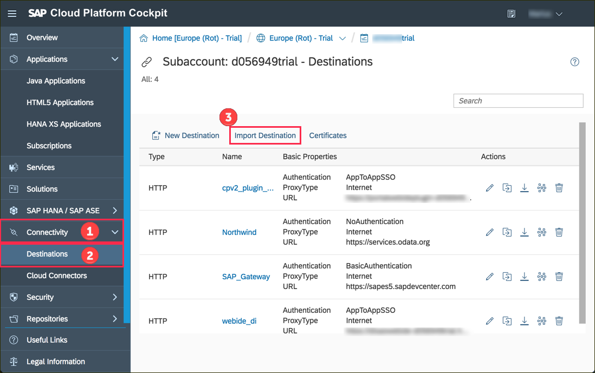
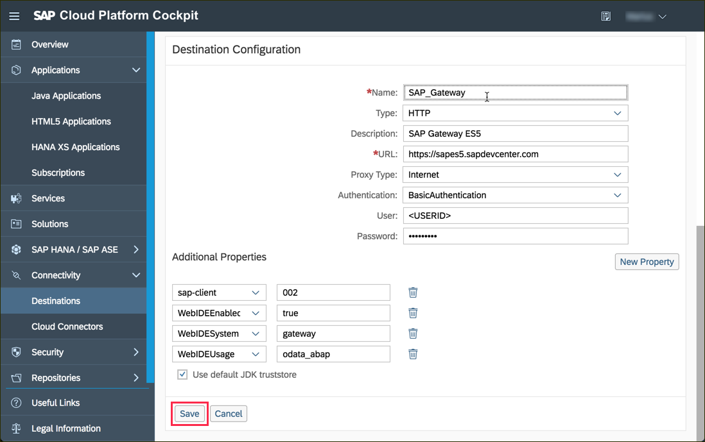
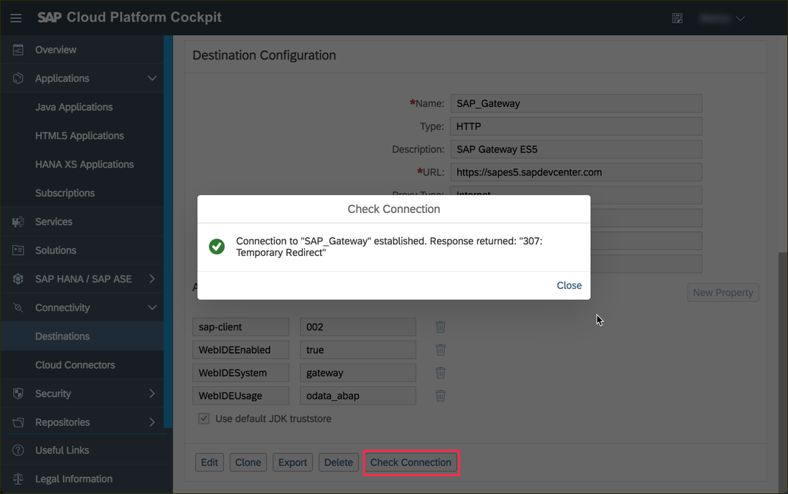

## Prerequisites  
 - [Know the concepts of OData](https://www.sap.com/developer/tutorials/odata-01-intro-origins.html)

## Details
### You will learn  
  - How to create destinations in the SAP Cloud Platform Neo environment

---

[ACCORDION-BEGIN [step ](Test the OData service in a browser)]

1. Log on to the [ES5 System](https://sapes5.sapdevcenter.com) to open a new session.
2. Open the following in a browser:

```
https://sapes5.sapdevcenter.com/sap/opu/odata/sap/SEPMRA_PO_APV/PurchaseOrders?$format=json
```

This shows you the raw data this OData service provides. This service runs in the ES5 system and returns purchase orders in the `JSON` format.

>Browser plugins (e.g., for [Google Chrome](https://chrome.google.com/webstore/search/json%20formatter), [Mozilla Firefox](https://addons.mozilla.org/en-US/firefox/search/?platform=mac&q=json%20formatter) and [Microsoft Edge](https://www.microsoft.com/de-de/search/result.aspx?q=json+formatter) ) can help you to format the data.)

[VALIDATE_1]
[ACCORDION-END]
[ACCORDION-BEGIN [step ](Import a destination from a local file)]
Create a new destination for the ES5 System if you don't have one.

1. Download <a href="https://raw.githubusercontent.com/SAPDocuments/Tutorials/master/tutorials/cp-ui5-ms-graph-create-destination/ES5_Destination.txt" download>this descriptor file</a> (alternatively you can create the destination manually by clicking **New Destination**).
2. Go to the Neo environment in the SAP Cloud Platform cockpit and open the
**Connectivity** dropdown menu in the side panel and select **Destinations**.
3. Click **Import Destination** to import the descriptor file.
    

    You should see the following values the pre-filled form:

    | Field Name     | Value     |
    | :------------- | :------------- |
    | Name      | **`SAP_Gateway`** |
    | Type      | **`HTTP`** |
    | Description | **`SAP Gateway ES5`** |
    | URL      | **`https://sapes5.sapdevcenter.com`** |
    | Authentication | **`BasicAuthentication`** |
    | Proxy Type | **`Internet`** |
    | User      |  \<YOUR USER ID> |
    | Password      |  \<YOUR PASSWORD> |
    You should also see the following additional properties:

    | Property | Value     |
    | :------------- | :------------- |
    | **`WebIDEUsage`** | **`odata_abap`** |
    | **`WebIDEEnabled`** | **`true`** |
    | **`sap-client`** | **`002`** |
    | **`WebIDESystem`** | **`gateway`** |

2. Enter your credentials for the ES5 system and click **Save** to create a new destination in the Neo environment.

    

[DONE]
[ACCORDION-END]
[ACCORDION-BEGIN [step ](Test the destination)]
Hit **Check Connection** to test whether the destination has been created successfully. You should now see a green check mark and the status code "307: Temporary Redirect".

    

[DONE]
[ACCORDION-END]

---
