## Details
### You will learn  
 - How to integrate the Microsoft Authentication Library (MSAL) into an existing SAPUI5 application
 - How to interact with Microsoft Graph
 - How to send byte code to the OneDrive Storage service
 - How to open Excel Online documents in new tabs

---

[ACCORDION-BEGIN [Step : ](Load Microsoft Authentication Library (MSAL))]
Copy the following line below the first `script-tag` in the `index.html` file.

```html
<script src="https://secure.aadcdn.microsoftonline-p.com/lib/0.2.3/js/msal.min.js"></script>
```
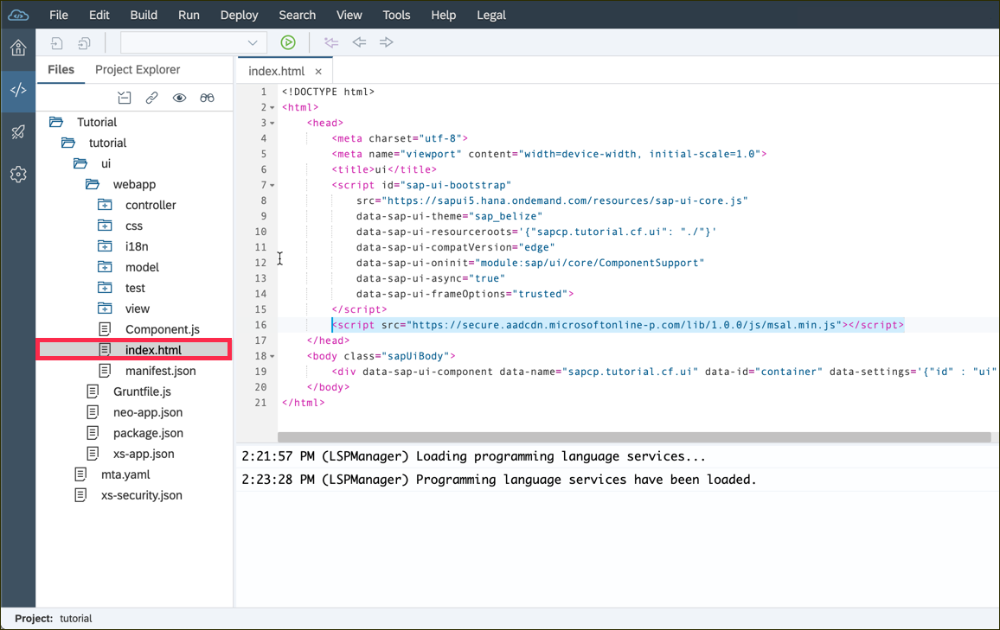
This `<script>` tag will load version 0.2.3 of the MSAL library.
> You can find the most [recent version](https://www.npmjs.com/package/msal)  of this library at npm and fetch it from this source.


[DONE]
[ACCORDION-END]

[ACCORDION-BEGIN [Step : ](Implement the view)]

The following snippet of the view defines a page which includes a smart table control with a custom toolbar. Use this code to replace the content of the `View1.view.xml`:

```xml
<mvc:View controllerName="sapcp.tutorial.cf.ui.controller.View1" xmlns="sap.m" xmlns:smartFilterBar="sap.ui.comp.smartfilterbar"
	xmlns:smartTable="sap.ui.comp.smarttable" xmlns:mvc="sap.ui.core.mvc" xmlns:semantic="sap.f.semantic">
	<Shell id="shell">
		<App id="app" class="sapUiSizeCompact">
			<pages>
				<Page id="page" title="{i18n>title}">
					<content>
						<smartTable:SmartTable entitySet="Orders" tableType="ResponsiveTable" enableAutoBinding="true" useExportToExcel="false"
							class="sapUiResponsiveContentPadding"
							initiallyVisibleFields="CustomerID,EmployeeID,Freight,OrderDate,OrderID,RequiredDate,ShipAddress,ShipCity,ShipCountry,ShipName,ShippedDate,ShipPostalCodeShipRegion,ShipVia">
							<smartTable:customToolbar>
								<OverflowToolbar>
									<ToolbarSpacer/>
									<OverflowToolbarButton id="uploadBtn" icon="sap-icon://upload-to-cloud" tooltip="Export Online" press="onUploadToOneDrive"/>
								</OverflowToolbar>
							</smartTable:customToolbar>
						</smartTable:SmartTable>
					</content>
				</Page>
			</pages>
		</App>
	</Shell>
</mvc:View>
```
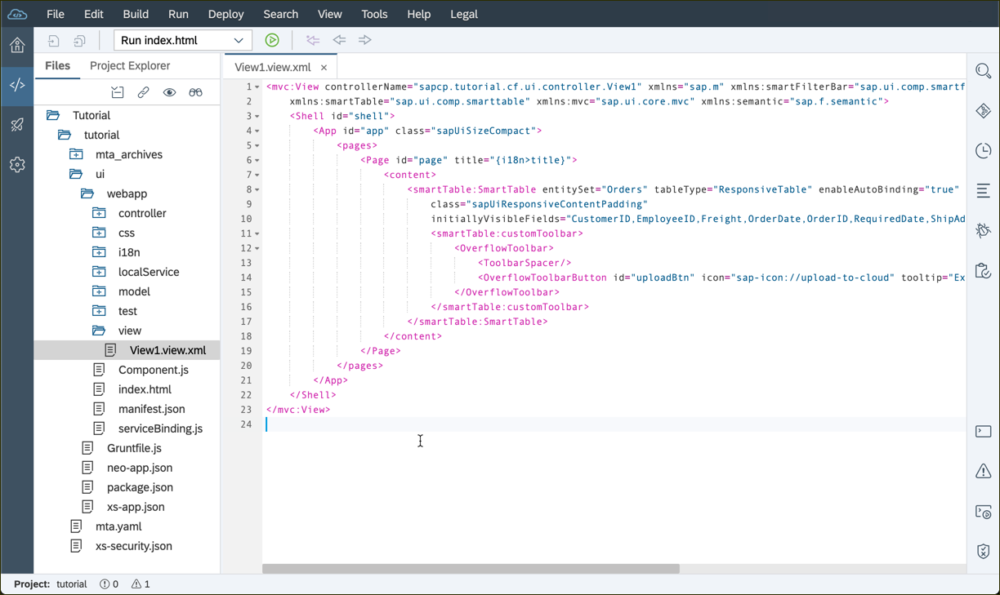

> Caution: The property `controllerName` (here `sapcp.tutorial.cf.ui.controller.View1`) corresponds to your namespace and project name you have defined in the wizard during the creation of the UI5 module. So make sure they fit together. If you have chosen a different namespace and project as shown in the screenshot, please adjust your code accordingly.

[DONE]
[ACCORDION-END]

[ACCORDION-BEGIN [Step : ](Add the Northwind data model)]

The data we want to display in this application originates from the public Northwind [OData service](https://services.odata.org/V2/Northwind/Northwind.svc/). Create a `ODataModel client` to connect the source to the application.

1. Right-click on the UI module (not the project) and click **New** and **OData Service** to open the wizard.

    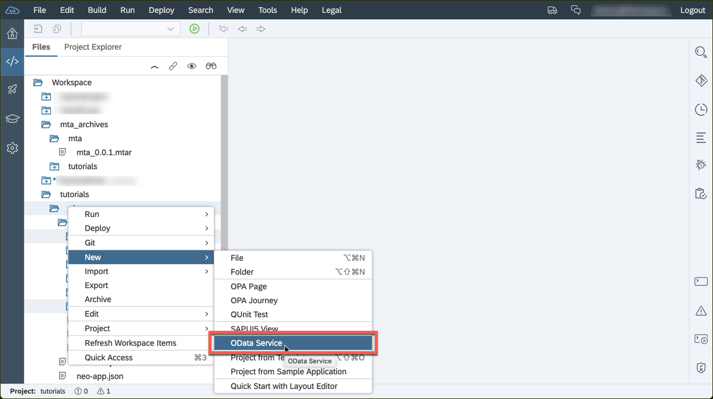

2. Select the source type **Service URL** (left box) and select the Northwind  source from drop-down (top box) and enter the URL path **`/v2/Northwind/Northwind.svc`** in the bottom box. Click enter to check if the wizard can connect to the OData service and confirm with **Next**.

    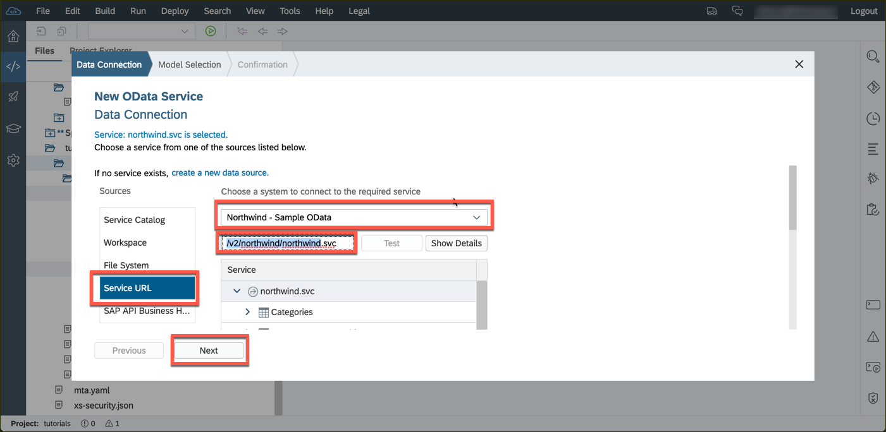

3. Keep the selection of the default model and click **Next**.

    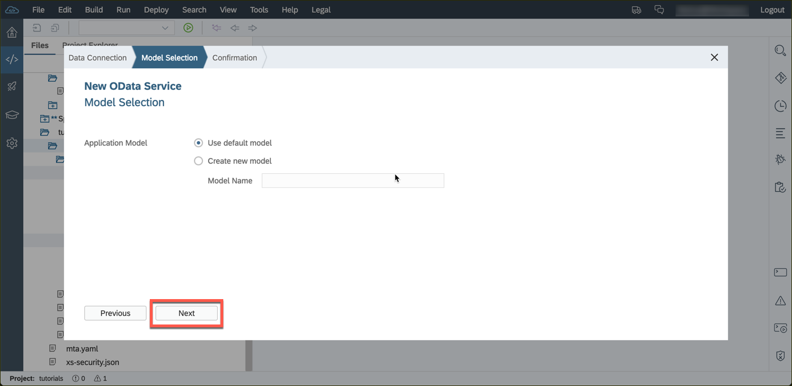

4. Add a new data source and a new default model to the application by clicking **Next**.

    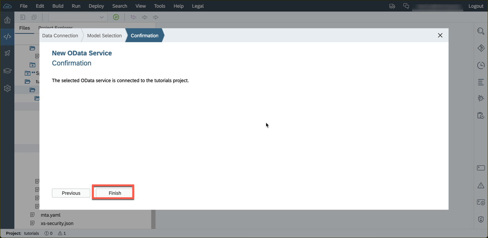

[DONE]
[ACCORDION-END]


[ACCORDION-BEGIN [Step : ](Import supporting SAPUI5 libraries)]

The controller is the place where the program logic happens.
Replace the entire content of the `View1.controller.js` file with this snippet.
```JavaScript
/* eslint-disable sap-no-hardcoded-url */
/* global Msal */

sap.ui.define([
	"sap/ui/core/mvc/Controller", "sap/ui/export/Spreadsheet", "sap/m/MessageToast"
], function (Controller, Spreadsheet, MessageToast) {
	"use strict";

	return Controller.extend("com.plain.controller.View1", {
      //Insert the code of the next step here
	});
});
```
> The header defines `eslint` exceptions, so that the editor will suppress warnings. The first arguments of the `sap.ui.define` function lists the SAPUI5 dependencies.

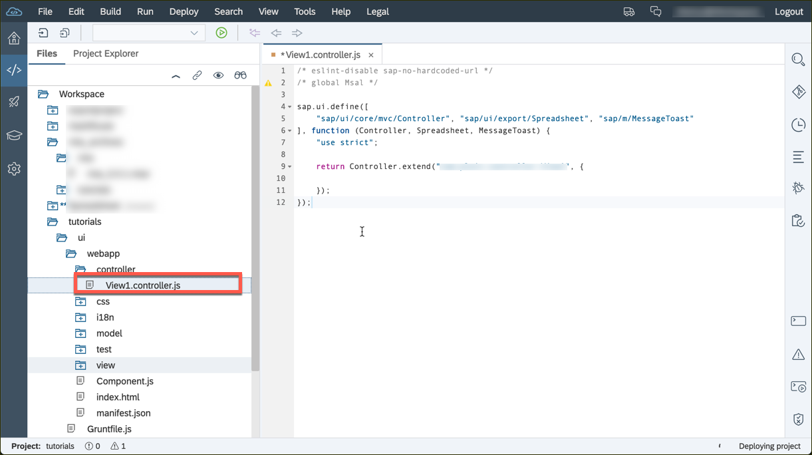


[DONE]
[ACCORDION-END]

[ACCORDION-BEGIN [Step : ](Initialize the MSAL client)]
Replace the placeholder comment of the previous snippet in the `View1.controller.js` file with the following code.

```JavaScript
msalconfig: {
	clientID: "/YOUR SECRET APP ID/",
	redirectUri: location.href,
	graphBaseEndpoint: "https://graph.microsoft.com/v1.0/",
	graphAPIScopes: ['Files.Read.All', 'Files.ReadWrite', 'Files.ReadWrite.All']
},

onInit: function () {
	this.oUserAgentApplication = new Msal.UserAgentApplication(this.msalconfig.clientID, null,
		function (errorDesc, token, error, tokenType) {
			if (errorDesc) {
				var formattedError = JSON.stringify(error, null, 4);
				if (formattedError.length < 3) {
					formattedError = error;
				}
				MessageToast.show("Error, please check the $.sap.log for details");
				$.sap.log.error(error);
				$.sap.log.error(errorDesc);
			}
		}.bind(this), {
			redirectUri: this.msalconfig.redirectUri
		});
	//Previous version of msal uses redirect url via a property
	if (this.oUserAgentApplication.redirectUri) {
		this.oUserAgentApplication.redirectUri = this.msalconfig.redirectUri;
	}
	// If page is refreshed, continue to display user info
	if (!this.oUserAgentApplication.isCallback(window.location.hash) && window.parent === window) {
		var user = this.oUserAgentApplication.getUser();
		var bLoggedIn = Boolean(user);
		if (bLoggedIn) {
			this.oUserAgentApplication.acquireTokenPopup(this.msalconfig.graphAPIScopes);
		} else {
			this.oUserAgentApplication.loginRedirect(this.msalconfig.graphAPIScopes);
		}
	}
},
```
The `msalconfig` object already suggests that it contains the configuration parameter for the Microsoft library. Don't forget to insert your application id from the previous tutorial in the `/YOUR SECRET APP ID/` placeholder!

The `onInit` hook redirects the user to the Microsoft authentication page if the (Microsoft) users is not logged in.


[DONE]
[ACCORDION-END]

[ACCORDION-BEGIN [Step : ](Parse the table configuration)]
The `onUploadToOneDrive` function will be invoked by the export event of the view. This function reads the current filter settings of the table, defines the columns which should be part of the Spreadsheet and defines additional metadata.

Insert this function after the `onInit` function of the previous step.
```JavaScript
onUploadToOneDrive: function () {
  var oSmartTable = this.getView().findAggregatedObjects(true, function (oAggregate) {
    return oAggregate instanceof sap.ui.comp.smarttable.SmartTable;
  })[0];

  var oTable = oSmartTable.getTable();
  var oRowBinding = oTable.getBinding("items");

  var aCols = oSmartTable.getInitiallyVisibleFields().split(',').map(function (sKey) {
    return {
      label: sKey,
      property: sKey,
      type: 'string'
    };
  });

  var oModel = oRowBinding.getModel();
  var oModelInterface = oModel.getInterface();

  var oSettings = {
    workbook: {
      columns: aCols,
      hierarchyLevel: 'Level'
    },
    dataSource: {
      type: "oData",
      dataUrl: oRowBinding.getDownloadUrl ? oRowBinding.getDownloadUrl() : null,
      serviceUrl: oModelInterface.sServiceUrl,
      headers: oModelInterface.getHeaders ? oModelInterface.getHeaders() : null,
      count: oRowBinding.getLength ? oRowBinding.getLength() : null,
      sizeLimit: oModelInterface.iSizeLimit
    }
  };

  new Spreadsheet(oSettings).attachBeforeSave({}, function (oEvent) {
    oEvent.preventDefault();
    this.putToGraph('/me/drive/root:/UploadedFromWebApp/' + oSmartTable.getEntitySet() + '.xlsx:/content',
      new Blob([oEvent.getParameter('data')], {
        type: 'application/vnd.openxmlformats-officedocument.spreadsheetml.sheet'
      }),
      function (data) {
        window.open(data.webUrl, '_blank');
      });
  }.bind(this), {}).build();
},
```
[DONE]
[ACCORDION-END]

[ACCORDION-BEGIN [Step 6: ](Send the bytearray to Microsoft OneDrive)]
This `putToGraph` function takes the bytecode of the export worker and sends it to the Microsoft OneDrive API via an HTTP POST request. It also checks if the Microsoft user has been authenticated and attached the corresponding authorization header to the request.

Insert this function after the `onUploadToOneDrive` function of the previous step.
```JavaScript
putToGraph: function (sEndpoint, payload, fnCb) {
	if (!this.oUserAgentApplication.getUser()) {
		this.oUserAgentApplication.loginRedirect(this.msalconfig.graphAPIScopes);
	} else {
		this.oUserAgentApplication.acquireTokenSilent(this.msalconfig.graphAPIScopes)
			.then(function (token) {
					$.ajax({
							headers: {
								"Authorization": "Bearer " + token
							},
							data: payload,
							processData: false,
							url: this.msalconfig.graphBaseEndpoint + sEndpoint,
							type: "PUT"
						})
						.then(fnCb)
						.fail(function (error) {
							MessageToast.show("Error, please check the log for details");
							$.sap.log.error(JSON.stringify(error.responseJSON.error));
						});
				}.bind(this),
				function (error) {
					if (error) {
						this.oUserAgentApplication.acquireTokenPopup(this.msalconfig.graphAPIScopes);
					}
				}.bind(this));
	}
},
```

[DONE]
[ACCORDION-END]

[ACCORDION-BEGIN [Step : ](Finalize the controller)]

Make sure you entire `MainController.js` file has all required methods and looks like this display. You can use the snippet below the screenshot to replace the entire file if needed.

> You can collapse function in the Web IDE when you click on the small triangle next to the line numbers.

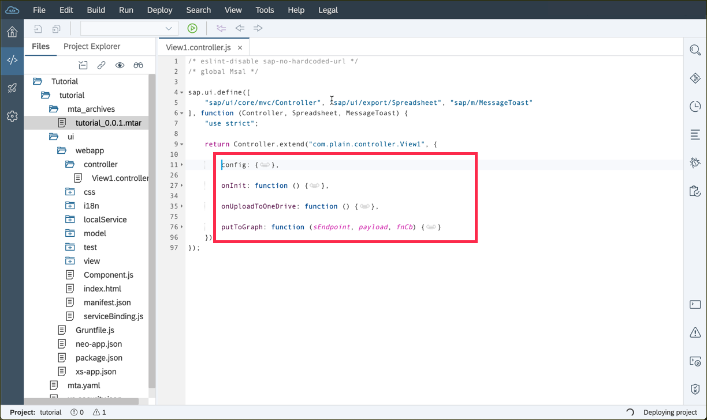

```JavaScript
/* eslint-disable sap-no-hardcoded-url */
/* global Msal */

sap.ui.define([
	"sap/ui/core/mvc/Controller", "sap/ui/export/Spreadsheet", "sap/m/MessageToast"
], function (Controller, Spreadsheet, MessageToast) {
	"use strict";

	return Controller.extend("com.plain.controller.View1", {

		msalconfig: {
			clientID: "/YOUR SECRET APP ID/",
			redirectUri: location.href,
			graphBaseEndpoint: "https://graph.microsoft.com/v1.0/",
			graphAPIScopes: ['Files.Read.All', 'Files.ReadWrite', 'Files.ReadWrite.All']
		},

		onInit: function () {
			this.oUserAgentApplication = new Msal.UserAgentApplication(this.msalconfig.clientID, null,
				function (errorDesc, token, error, tokenType) {
					if (errorDesc) {
						var formattedError = JSON.stringify(error, null, 4);
						if (formattedError.length < 3) {
							formattedError = error;
						}
						MessageToast.show("Error, please check the $.sap.log for details");
						$.sap.log.error(error);
						$.sap.log.error(errorDesc);
					}
				}.bind(this), {
					redirectUri: this.msalconfig.redirectUri
				});
			//Previous version of msal uses redirect url via a property
			if (this.oUserAgentApplication.redirectUri) {
				this.oUserAgentApplication.redirectUri = this.msalconfig.redirectUri;
			}
			// If page is refreshed, continue to display user info
			if (!this.oUserAgentApplication.isCallback(window.location.hash) && window.parent === window) {
				var user = this.oUserAgentApplication.getUser();
				var bLoggedIn = Boolean(user);
				if (bLoggedIn) {
					this.oUserAgentApplication.acquireTokenPopup(this.msalconfig.graphAPIScopes);
				} else {
					this.oUserAgentApplication.loginRedirect(this.msalconfig.graphAPIScopes);
				}
			}
		},

		onUploadToOneDrive: function () {
			var oSmartTable = this.getView().findAggregatedObjects(true, function (oAggregate) {
				return oAggregate instanceof sap.ui.comp.smarttable.SmartTable;
			})[0];

			var oTable = oSmartTable.getTable();
			var oRowBinding = oTable.getBinding("items");

			var aCols = oSmartTable.getInitiallyVisibleFields().split(',').map(function (sKey) {
				return {
					label: sKey,
					property: sKey,
					type: 'string'
				};
			});

			var oModel = oRowBinding.getModel();
			var oModelInterface = oModel.getInterface();

			var oSettings = {
				workbook: {
					columns: aCols,
					hierarchyLevel: 'Level'
				},
				dataSource: {
					type: "oData",
					dataUrl: oRowBinding.getDownloadUrl ? oRowBinding.getDownloadUrl() : null,
					serviceUrl: oModelInterface.sServiceUrl,
					headers: oModelInterface.getHeaders ? oModelInterface.getHeaders() : null,
					count: oRowBinding.getLength ? oRowBinding.getLength() : null,
					sizeLimit: oModelInterface.iSizeLimit
				}
			};

			new Spreadsheet(oSettings).attachBeforeSave({}, function (oEvent) {
				oEvent.preventDefault();
				this.putToGraph('/me/drive/root:/UploadedFromWebApp/' + oSmartTable.getEntitySet() + '.xlsx:/content',
					new Blob([oEvent.getParameter('data')], {
						type: 'application/vnd.openxmlformats-officedocument.spreadsheetml.sheet'
					}),
					function (data) {
						window.open(data.webUrl, '_blank');
					});
			}.bind(this), {}).build();
		},

		putToGraph: function (sEndpoint, payload, fnCb) {
			if (!this.oUserAgentApplication.getUser()) {
				this.oUserAgentApplication.loginRedirect(this.msalconfig.graphAPIScopes);
			} else {
				this.oUserAgentApplication.acquireTokenSilent(this.msalconfig.graphAPIScopes)
					.then(function (token) {
							$.ajax({
									headers: {
										"Authorization": "Bearer " + token
									},
									data: payload,
									processData: false,
									url: this.msalconfig.graphBaseEndpoint + sEndpoint,
									type: "PUT"
								})
								.then(fnCb)
								.fail(function (error) {
									MessageToast.show("Error, please check the log for details");
									$.sap.log.error(JSON.stringify(error.responseJSON.error));
								});
						}.bind(this),
						function (error) {
							if (error) {
								this.oUserAgentApplication.acquireTokenPopup(this.msalconfig.graphAPIScopes);
							}
						}.bind(this));
			}
		}
	});
});
```


[DONE]
[ACCORDION-END]

[ACCORDION-BEGIN [Step : ](Re-deploy the application)]

Re-deploy the application to see the changes in production.

1. Trigger another build process with a right-click on the project and select **Build** twice.

    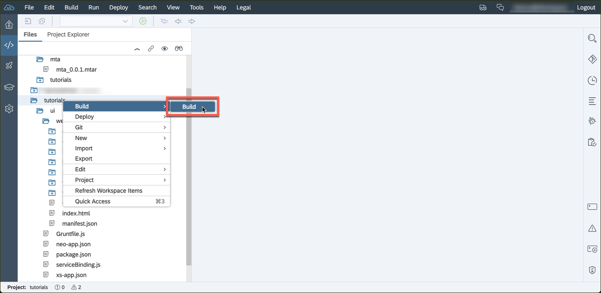

2. Once the build process has completed successfully, right-click on the project and select **Deploy** and **Deploy to SAP Cloud Platform**.

    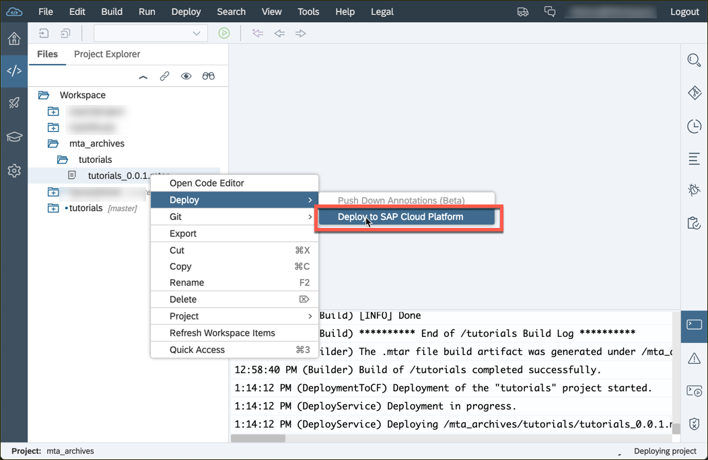


[DONE]
[ACCORDION-END]

[ACCORDION-BEGIN [Step : ](Login to the application)]
The token of your previous deployment might have expired. If necessary, login with the credentials of your SAP ID one more time.

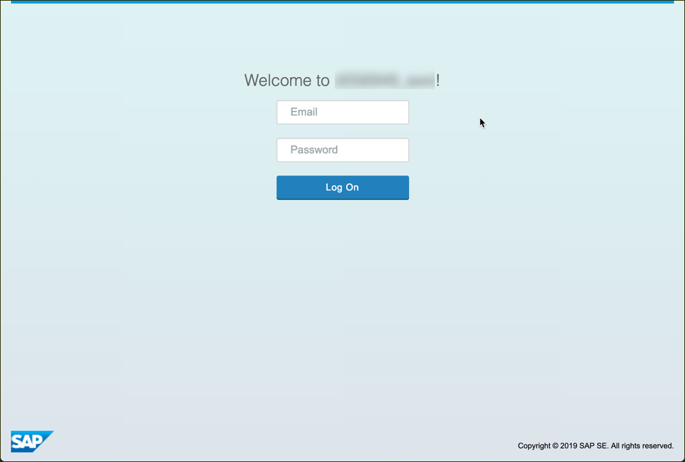

[DONE]
[ACCORDION-END]


[ACCORDION-BEGIN [Step : ](Sign in with your Microsoft account)]
The application will recognize that no Microsoft user has been signed in to it and redirect your to the Microsoft login page.

1. Enter your Office 365 or your personal `@outlook.com` email address here and click **Next** to proceed.

    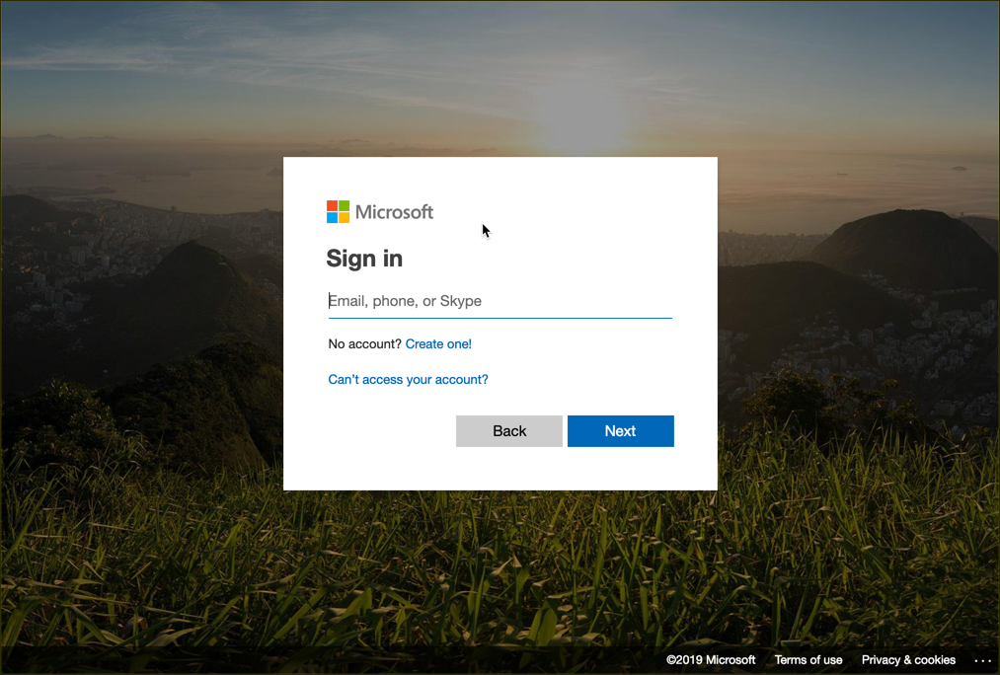

2. When logging in for the first time, you need to grant the defined privileges and click **yes**.

    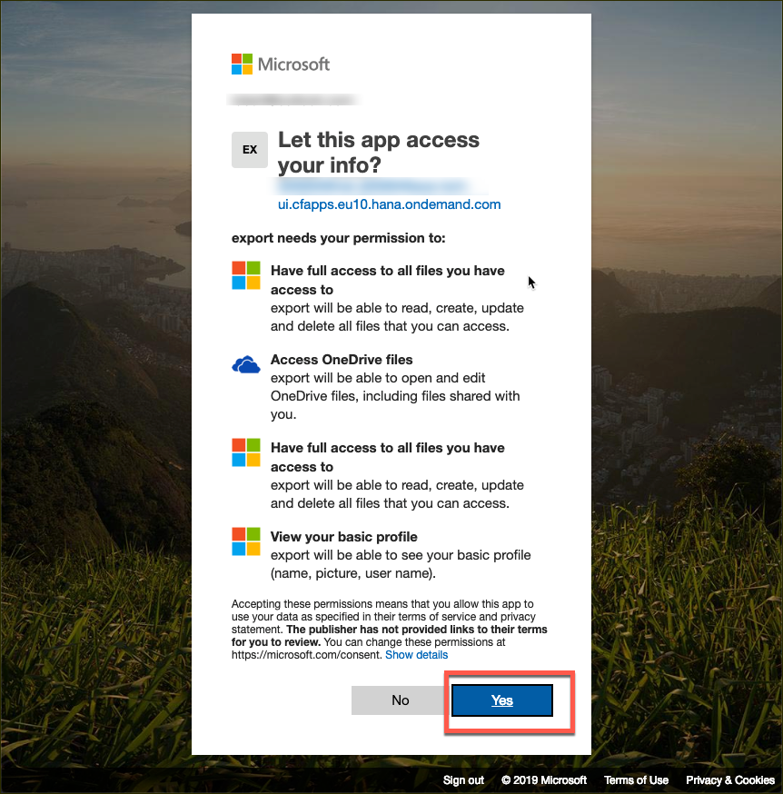

> You (and the users of your application) can revoke the given permissions at <https://myapps.microsoft.com> [for Microsoft Office 365 users] or <https://account.live.com/consent/Manage> [for `outlook.com` users]

[DONE]
[ACCORDION-END]

[ACCORDION-BEGIN [Step 12: ](Download the data via the UI)]
Congrats, you logged in successfully! Now you can export the  data you see in the table.

1. Click the export button above the table.

    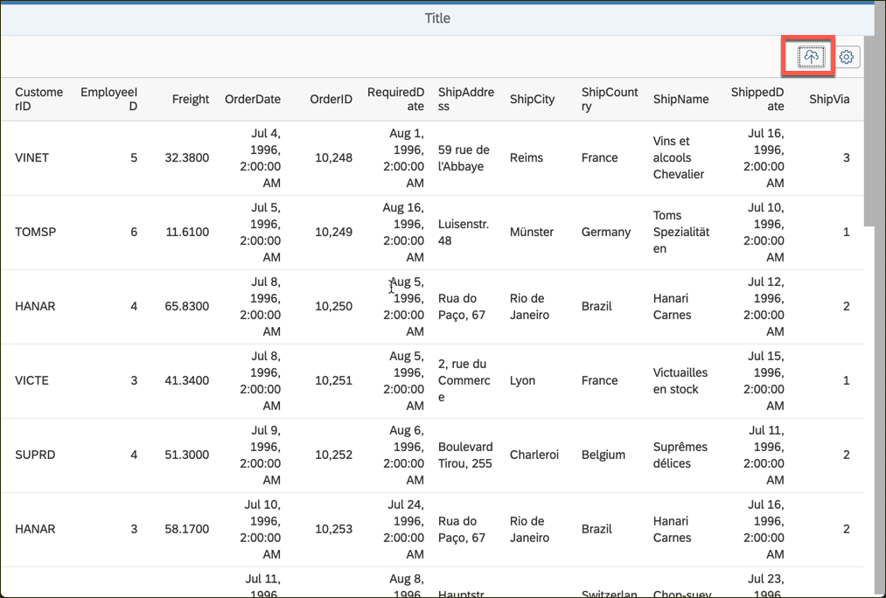

2. Notice the progress popover during the process.

    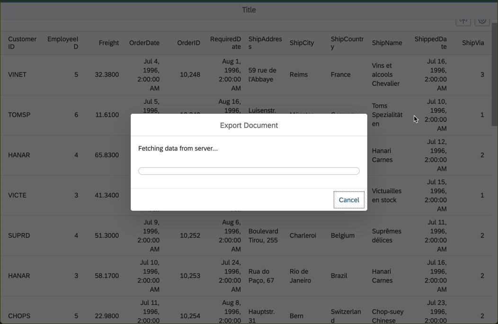

3. Once the process has completed, a new browser window/tab should open and display the data in Excel online.

    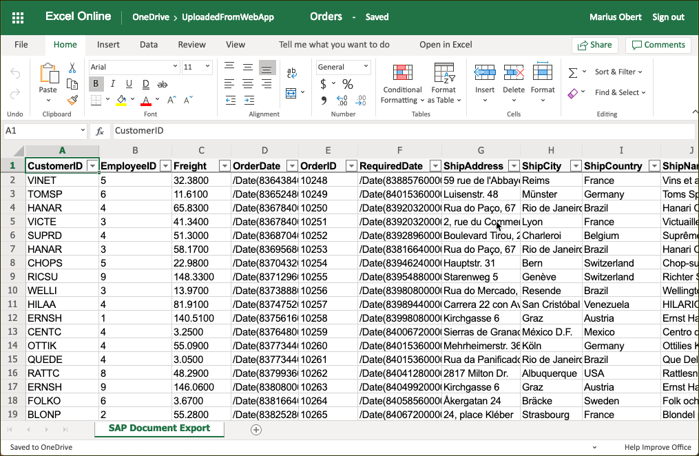

Make sure to unlock the file before exporting it again.

[VALIDATE_1]
[ACCORDION-END]


<!-- [ACCORDION-BEGIN [Step : ](XXXXX)]
[DONE]
[ACCORDION-END] -->


---
