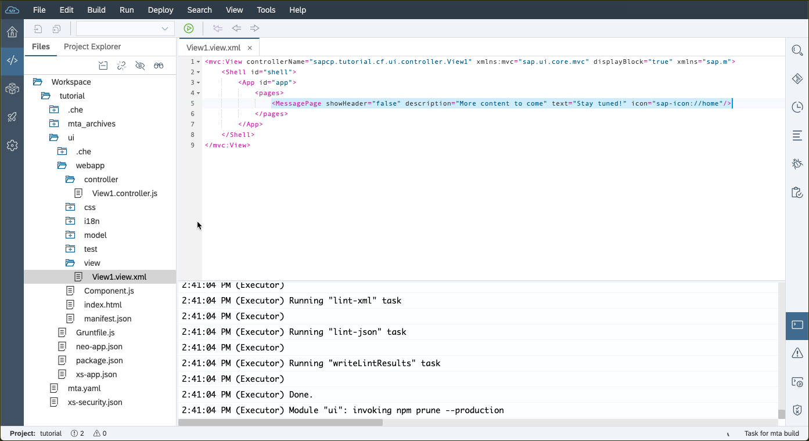
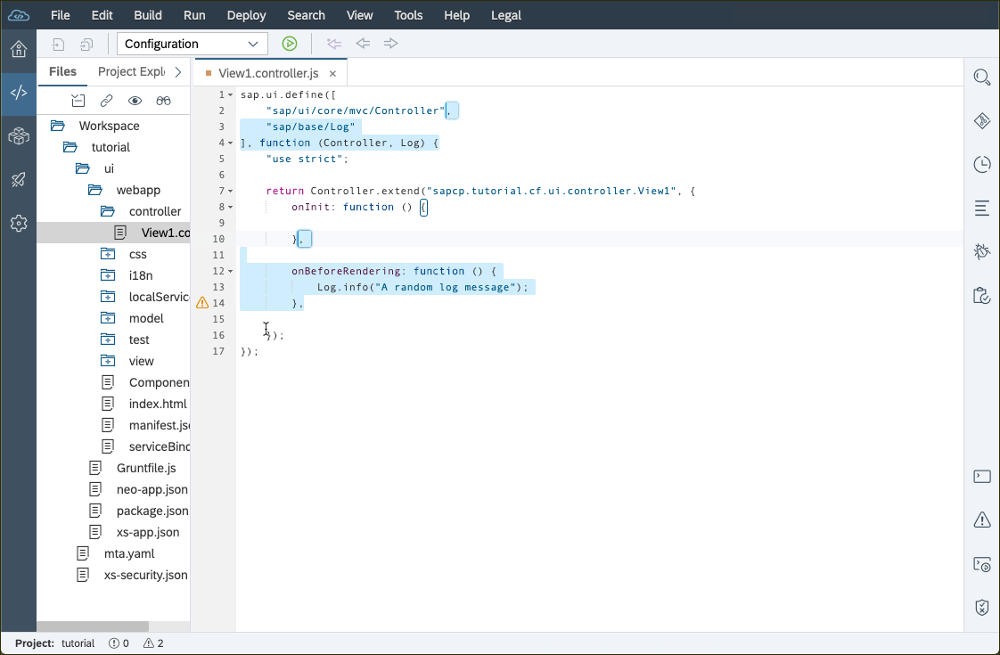
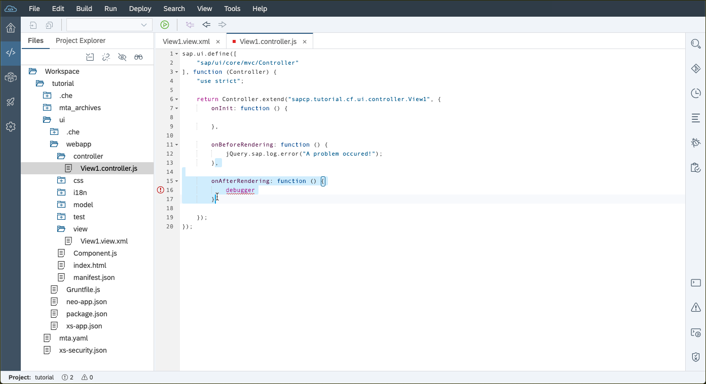
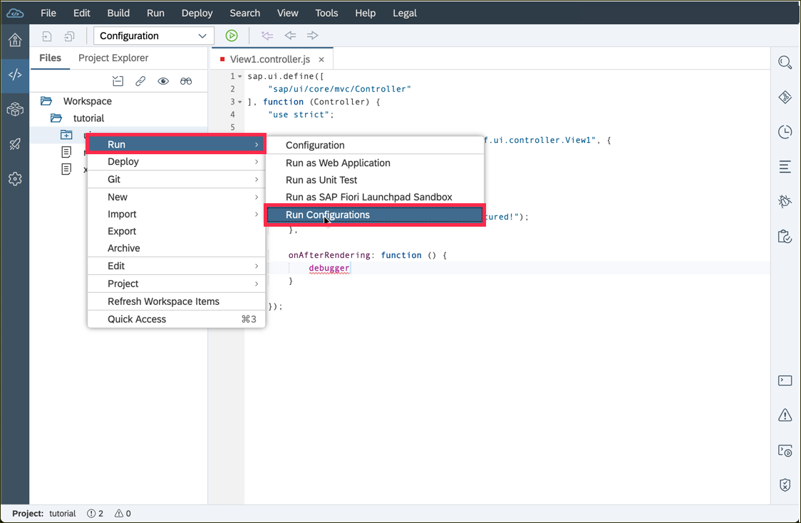
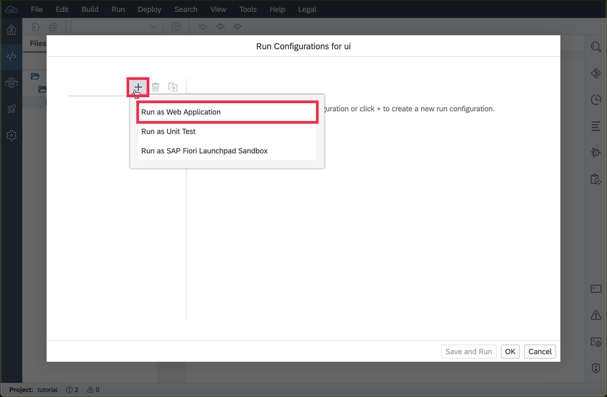
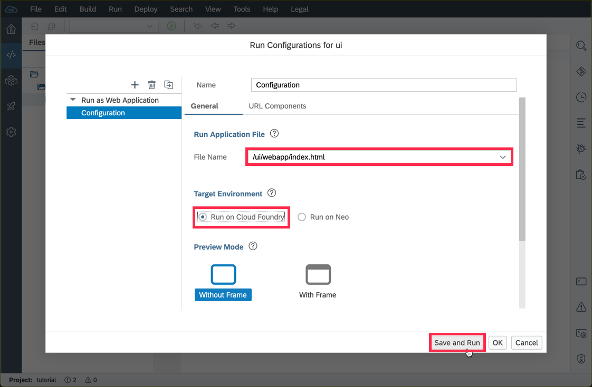
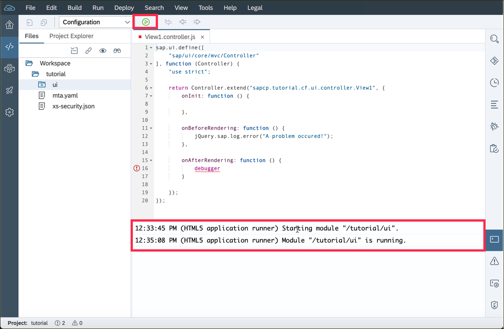
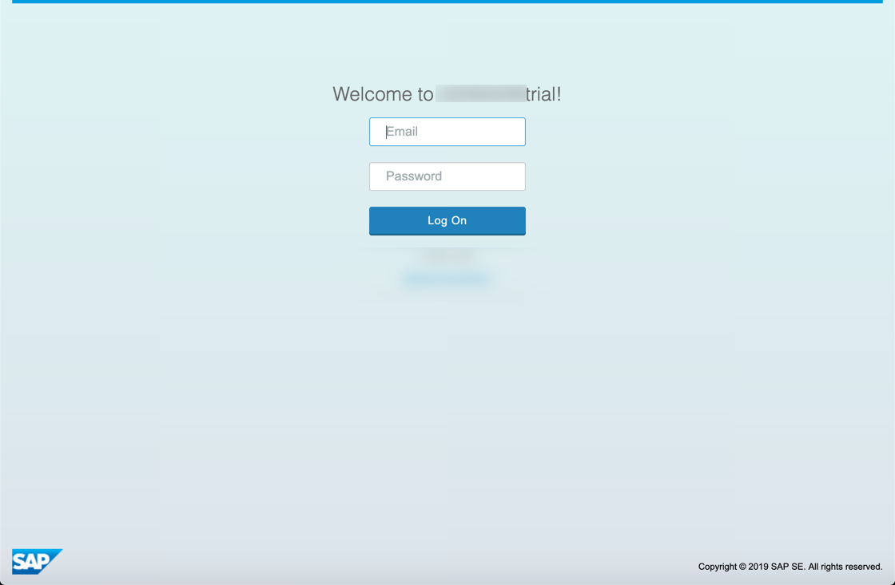
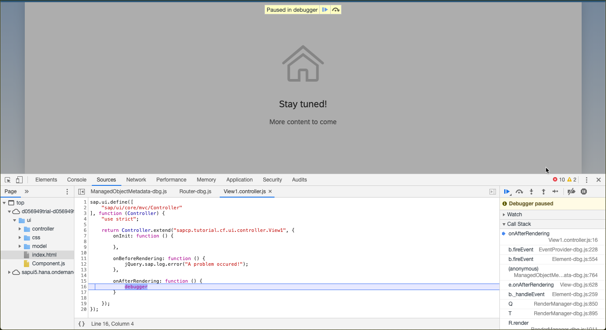

## Details
### You will learn
  - How to do add breakpoints to your JavaScript code
  - How to log data to the console
  - How to use the Google Chrome DevTools

---

[ACCORDION-BEGIN [Step : ](Add a message page)]

Add a simple message page to let the users know you are still working on this app.

Replace the existing page in the file `tutorial/ui/webapp/view/MainView.view.xml` with
```JavaScript
<MessagePage showHeader="false"
  description="More content to come"
  text="Stay tuned!"
  icon="sap-icon://home" />
```





[DONE]
[ACCORDION-END]

[ACCORDION-BEGIN [Step : ](Write a log message to the console)]

Add this `onBeforeRendering` hook to the file `tutorial/ui/webapp/controller/MainView.controller.xml`. This error function allows you to write error messages to the console. Error messages also write the stack trace to the console, which can be used to trace the message back to the line of invocation.
```JavaScript
,

onBeforeRendering: function() {
  jQuery.sap.log.error("A problem occured!");
}
```




> This `onBeforeRendering` method is called every time the View is rendered, before the Renderer is called and the HTML is placed in the DOM-Tree. It can be used to perform clean-up-tasks before re-rendering.


[DONE]
[ACCORDION-END]

[ACCORDION-BEGIN [Step: ](Add a breakpoint)]

Add this `onAfterRendering` hook to the same file to place a breakpoint in your code. A breakpoint will cause your app to stop when the execution thread reaches it. This gives you the chance to inspect the state of you app.
```JavaScript
,

onAfterRendering: function() {
	debugger
}
```




> This `onAfterRendering` method is called every time the View is rendered, after the HTML is placed in the DOM-Tree. It can be used to apply additional changes to the DOM after the Renderer has finished.

[DONE]
[ACCORDION-END]


[ACCORDION-BEGIN [Step: ](Run the latest version)]

Running your application has several advantages over deploying it. Among others, it's faster, doesn't require a "build" step and won't minify your JavaScript code base

1. To run the UI module, **right-click** on the module and select **Run** and **Run Configurations**.

    


2. In the dialog, select **+** and **Run as Web Application** to add a new run configuration for you app.

    


3. Specify the path to your main file with **`ui/webapp/index.html`** and select **Run on Cloud Foundry** to choose the target environment. Confirm your input with **Save and Run** .

    


[DONE]
[ACCORDION-END]
[ACCORDION-BEGIN [Step: ](Keep track of the progress in the console)]

You can see status messages during the start up of the module in the console of the Web IDE.



The initial start up might take a few minutes, but only for the very first time.
After that, your changes can be run almost instantly when you click the green run button next time.

You might be prompted for you SAP Cloud Platform credentials when you try to access the running app. Use the same credentials as for the SAP Cloud Platform cockpit here.




[DONE]
[ACCORDION-END]
[ACCORDION-BEGIN [Step: ](Stop at the breakpoint)]
Open the Chrome DevTools (or the [dev tools of your favorite browser](https://www.lifewire.com/web-browser-developer-tools-3988965)) by clicking **F12**. **Refresh the page** to run the script one more time.

You should now see that the app reached the breakpoint (the dev tools automatically switched to the `Sources` tab).



[DONE]
[ACCORDION-END]

[ACCORDION-BEGIN [Step : ](See the error log message)]

Click **F8** to jump over the breakpoint and switch to the `Console` tab.
Now you should see your error message printed in red. Click on the small triangle on the left side to expand the error message.

Can you spot the line in which you invoked the error message?


[VALIDATE_1]
[ACCORDION-END]

---
