## Details
### You will learn
  - How to create a MTA archive
  - Why there are modules belonging to a MTA archive
  - How to add a UI module to an archive
  - How to build a project for Cloud Foundry
  - How to deploy a project to Cloud Foundry

---

[ACCORDION-BEGIN [Step : ](Create a new Multi-Target Application)]
A MTA project is a wrapper for all modules (microservices) which are part of a Cloud Foundry application.

1. Click on the tile **New Project From Template** to open the wizard.

    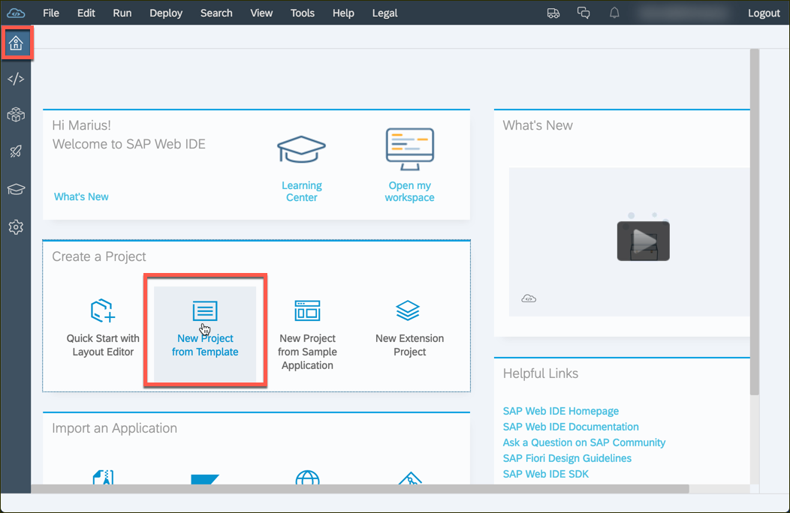

2. Select **Multi-Target Application** and click **Next**.

    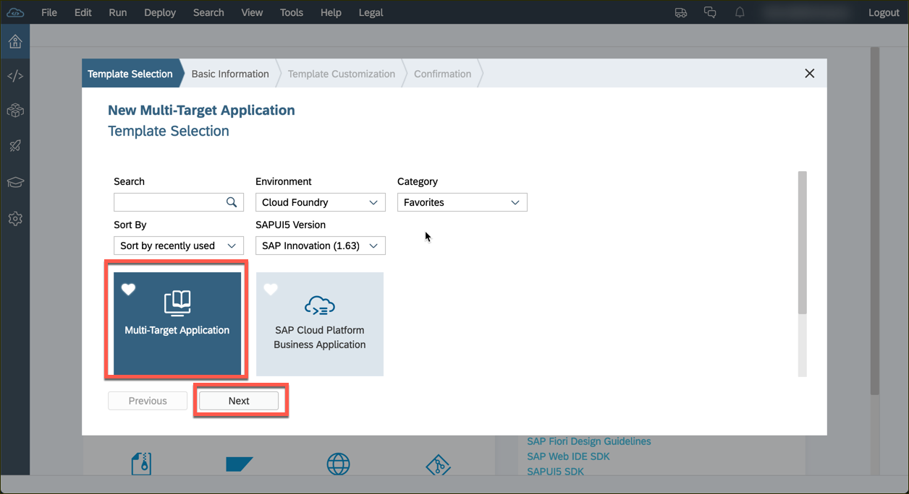

3. Choose **`tutorial`** as the project name and click **Next**.

    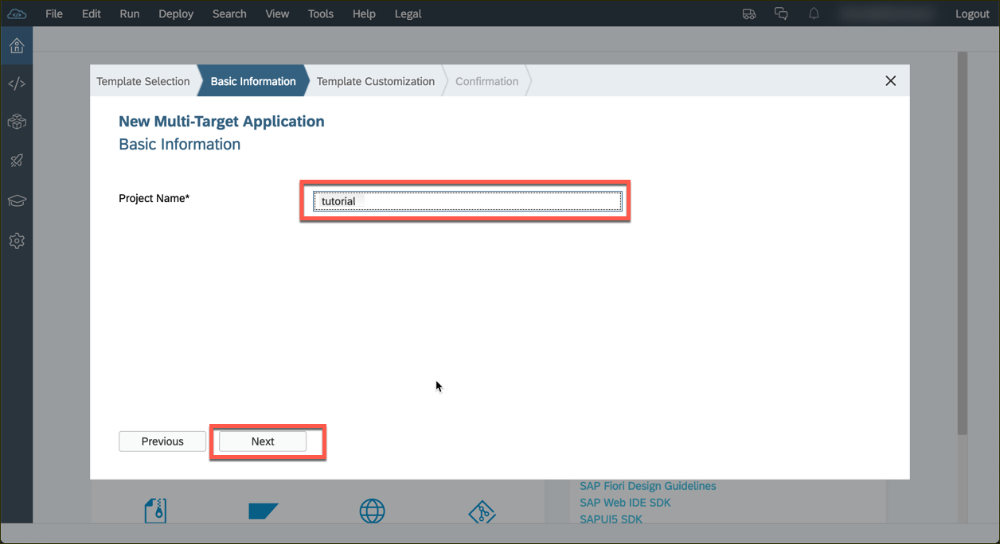

4. Keep the default values on the next screen and click **Finish** to confirm.

    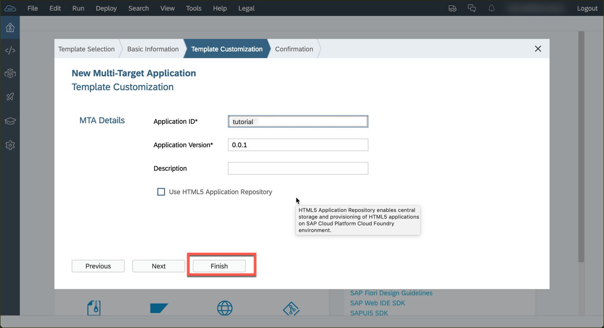

[DONE]
[ACCORDION-END]

[ACCORDION-BEGIN [Step : ](Add a HTML5 module)]
1. Right-click on the newly created project and select and select **New** -> **HTLM5 Module** to create a new module.

    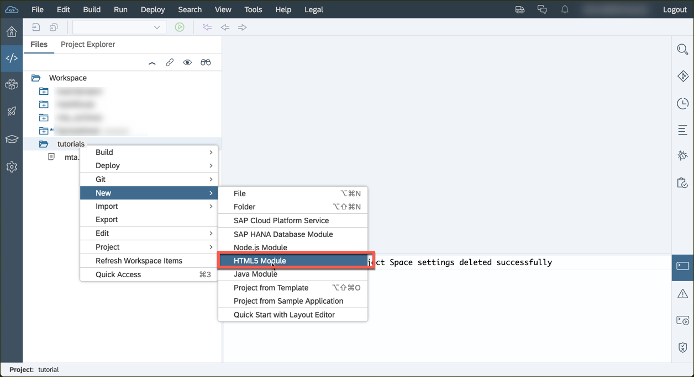

2. Go with the plain **SAPUI5 Application** and click **Next**.

    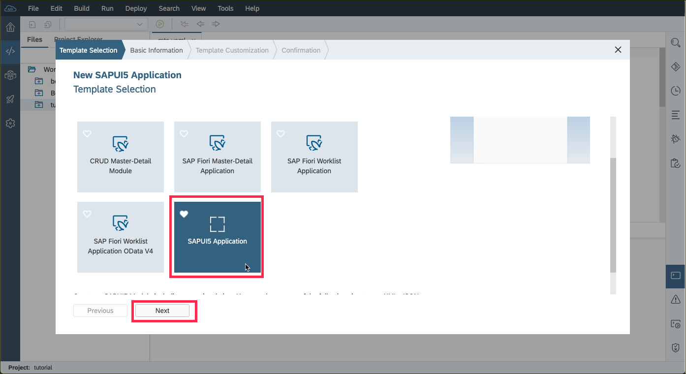

3. Name the module **`ui`**, the namespace **`sapcp.tutorial.cf`** and go to the **Next** screen.

    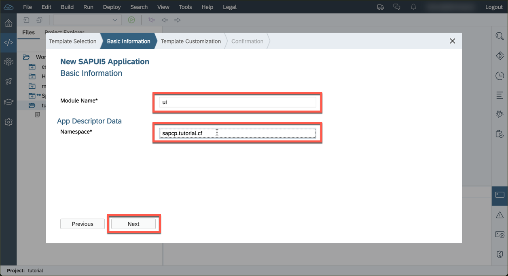

4. Keep the default values on this screen and close the creation of the module with **Finish**.

    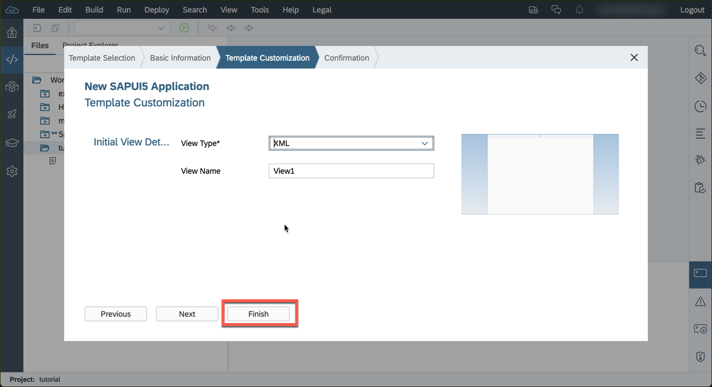

[DONE]
[ACCORDION-END]

[ACCORDION-BEGIN [Step : ](Adjust the quota of the HTML5 module)]

The `mta.yaml` file is the descriptor of each Cloud Foundry Project. The definition of the microservices and their runtime can be found in this descriptor. It also declares used backing services and binds them to the microservices.
Make sure the UI modules has been created properly and the quota for disk and memory are set to at least `512M`.

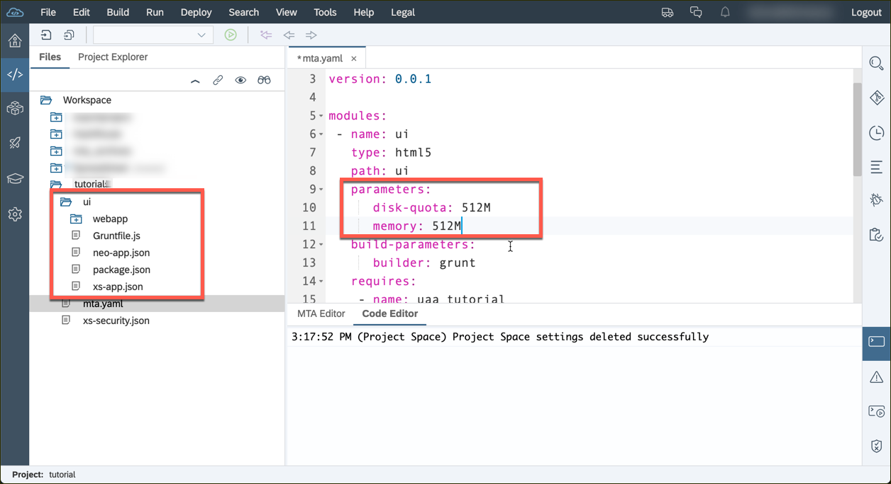

[DONE]
[ACCORDION-END]

[ACCORDION-BEGIN [Step : ](Build the application)]

Build (aka package) the project to a `mtar` archive to be able to deploy it to Cloud Foundry.  

1. Right-click on the project and select **Build** and **Build** to trigger this process.

    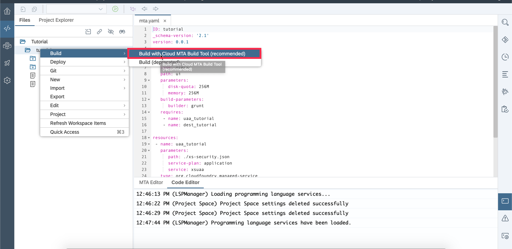

2. Check the console output to make sure the process started.

    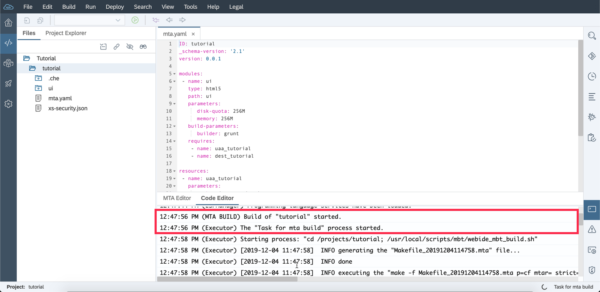

3. Once the build is complete, you can see a message in the log. You should also see the generated `mtar` archive in the project tree.

    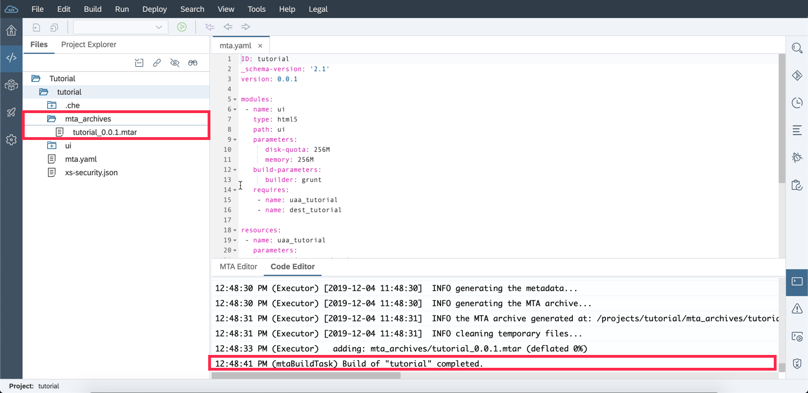

[DONE]
[ACCORDION-END]

[ACCORDION-BEGIN [Step : ](Deploy the mtar to Cloud Foundry)]

Now that you created a `mtar` archive, you are all set to deploy the application.

1. Right-click on the project and select **Deploy** and **Deploy to SAP Cloud Platform**.

    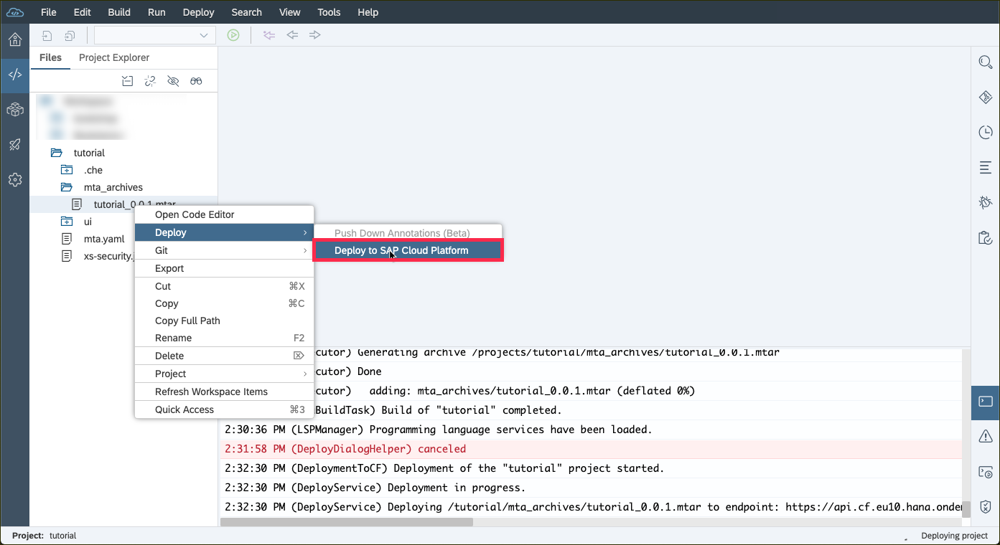

2. Select the proper your **Cloud Foundry API Endpoint**. This endpoint varies with the region you selected for your sub-account. The down-down options for **Organization** and **Space** should be populated automatically then.

    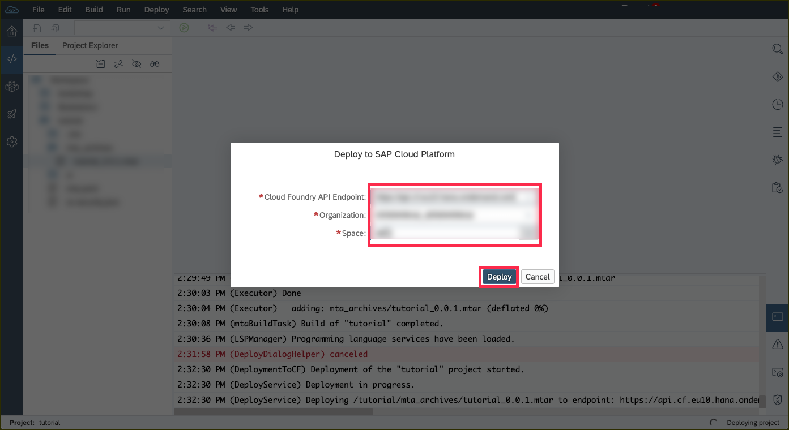

3. You will see a success message in the log once the deployment finished. Click **Open** in the popup (top-right corner) to start your application.

    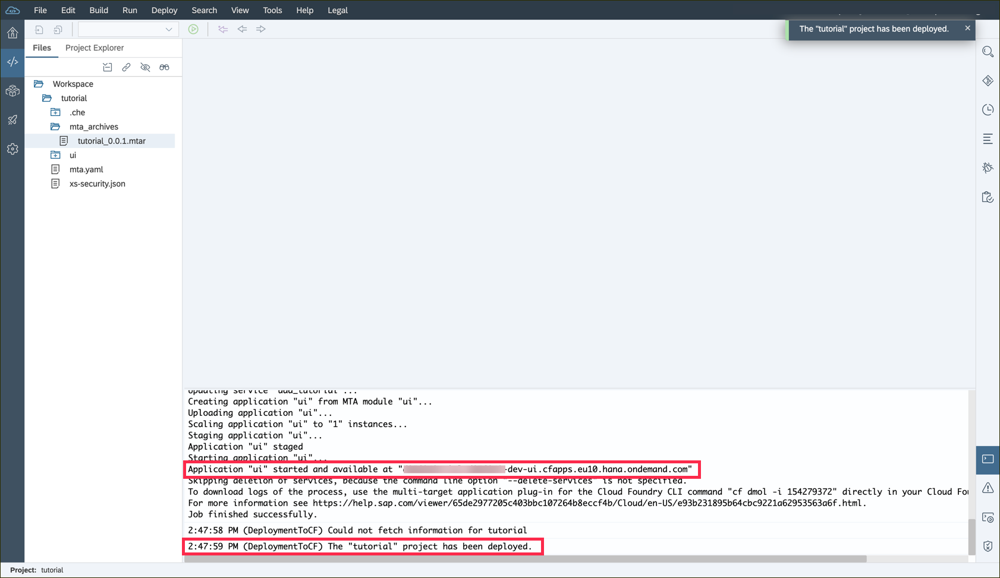

[DONE]
[ACCORDION-END]

[ACCORDION-BEGIN [Step : ](Login to the application)]

Click **Open** in the popup (top-right corner) to start your application.

> You can also see and open running Cloud Foundry application in the SAP Cloud Platform Cloud Cockpit when you navigate to your **Sub-account** -> **Space** -> **Applications**.

You might need to login with the credentials of your SAP ID (the same credentials you use for the SAP Cloud Platform Cockpit and the Web IDE).

This sample application consist of a header and an empty page only. So you should see something like this:

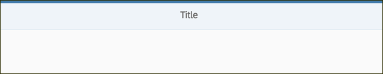

Enter the URL of your running application:

[VALIDATE_1]
[ACCORDION-END]

<!-- [ACCORDION-BEGIN [Step : ](XXXXX)]
[DONE]
[ACCORDION-END]
[ACCORDION-BEGIN [Step : ](XXXXX)]
[DONE]
[ACCORDION-END] -->

---
