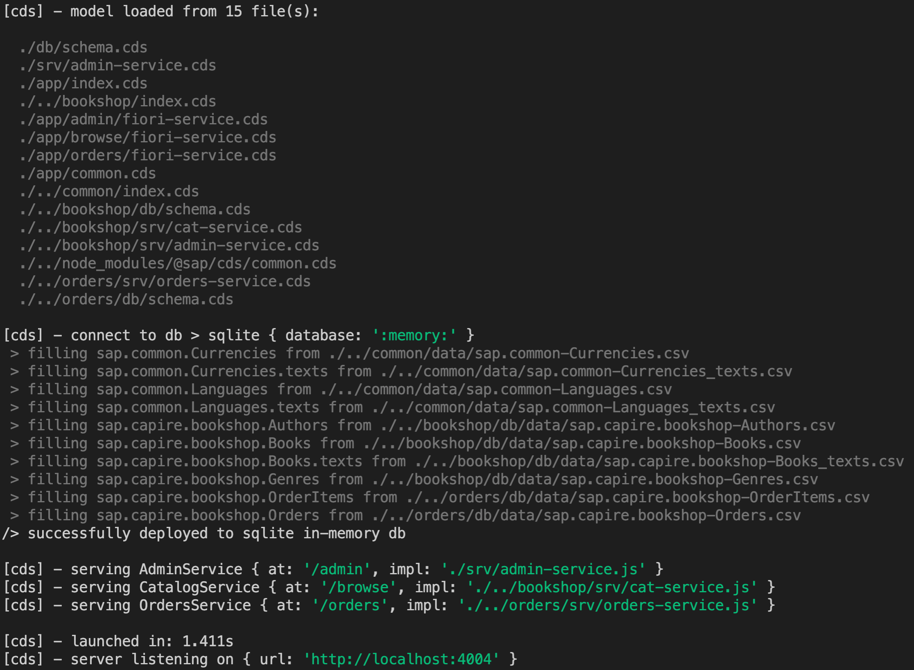
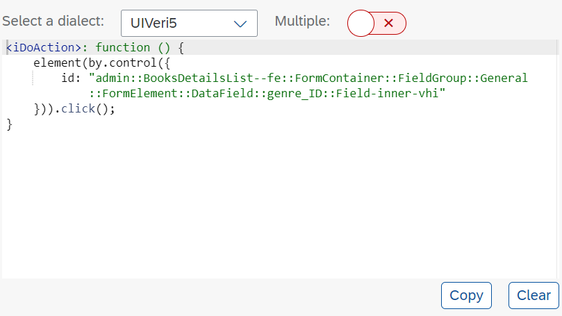

 
## Prerequisites
- You use [SAPUI5](https://sapui5.hana.ondemand.com/#/topic/2535ef9272064cb6bd6b44e5402d531d) in version 1.74 or higher.
- You have installed and configured a local Git client.
- You have installed [Docker](https://www.docker.com/) in version 18.09.6 or higher.
- You have installed [Node.js](https://nodejs.org/en/) in version 12.14.1 or higher.
- You have installed [Visual Studio Code](https://code.visualstudio.com/).
- You have installed UIVeri5 using the following command:
    ```
    npm install @ui5/uiveri5 -g
    ```
- You have installed the `cds` development kit using the following command:
    ```
    npm install -g @sap/cds-dk
    ```
    If you encounter any problems when installing the `cds` development kit, have a look at [this troubleshooting section](https://cap.cloud.sap/docs/advanced/troubleshooting#npm-installation).
- Your Google Chrome version is up to date. See [Update Google Chrome](https://support.google.com/chrome/answer/95414?co=GENIE.Platform%3DDesktop&hl=en).
- If you are located in China, you've configured and downloaded the `chromedriver` that fits your Google Chrome version manually. See [`chromedriver`](https://chromedriver.storage.googleapis.com/index.html).


## Details
### You will learn
- How to create system tests with UIVeri5 using the UI5 Test Recorder for CAP-based projects on SAP Business Technology Platform
- How to create a CI/CD pipeline with project "Piper"
- How to add system tests as automated steps to your CI/CD pipeline

### What Is This Tutorial About?

In this tutorial, you'll create and run automated system tests with UIVeri5 against a simple CAP-based sample application. Your sample application is a bookshop, which has basic functions for managing books such as creating and deleting books.

The tutorial consists of three main stages:


1. Clone the CAP-based sample application and manually go through your test scenario before starting to code it.

2. Create and run system tests with UIVeri5 that add a new book to your bookshop and check if it's displayed in the list.

3. Automate your system tests by integrating them into a CI/CD pipeline.

### About System Tests with UIVeri5

UIVeri5 is an SAP open-source JavaScript testing framework for SAPUI5 applications. It drives a real browser for your deployed app and simulates authentic user scenarios. System tests check both front-end and back-end and make sure that all pieces of an application work well together.

The following graphic shows the positioning of system tests with UIVeri5 compared to other testing methods and tools. The arrow shape illustrates the granularity of the methods: Compared to unit, component, or integration tests, system tests examine less details and focus on crucial workflows, instead.


>For more information about testing with UIVeri5, have a look at these blogs:

>- [UIVeri5: More Stable System Tests for UI5 Applications](https://blogs.sap.com/2019/01/28/uiveri5-more-stable-system-tests-for-ui5-applications/)
>- [UIVeri5 for E2E testing of UI5 apps](https://blogs.sap.com/2019/01/29/uiveri5-for-e2e-testing-of-ui5-apps/)

### About the SAPUI5 Test Recorder

The SAPUI5 Test Recorder is a tool that helps you create integration and system tests. You can use it in any SAPUI5 application to inspect its user interface, view the control properties, and get code snippets for OPA5 and UIVeri5 tests. As of version 1.74, it is part of the SAPUI5 framework.

> For more information about the SAPUI5 Test Recorder, see [Test Recorder](https://sapui5.hana.ondemand.com/#/topic/2535ef9272064cb6bd6b44e5402d531d).

### About CI/CD with Project "Piper"

Project "Piper" is one of SAP's solutions for continuous integration and delivery. It provides pre-configured Jenkins pipelines, which you can use in your own Jenkins master infrastructure and adapt according your needs. Project "Piper" consists of two different parts:

- A [shared library](https://sap.github.io/jenkins-library/), which contains the description of steps, scenarios, and utilities that are required to use Jenkins pipelines
- A [set of Docker images](https://github.com/SAP/devops-docker-images) that can be used to implement best practice processes

> For more information about SAP solutions for CI/CD, see:

> - [Continuous Integration and Delivery by SAP](https://help.sap.com/viewer/product/CICD_OVERVIEW/Cloud/en-US?task=discover_task)
> - [SAP Solutions for Continuous Integration and Delivery](https://help.sap.com/viewer/8cacec64ed854b2a88e9a0973e0f97a2/Cloud/en-US/e9fa320181124fa9808d4446a1bf69dd.html)

---

[ACCORDION-BEGIN [Step 1: ](Set up and run your CAP-based sample application)]

In Visual Studio Code, set up and run your bookshop application.

1. In Visual Studio Code, choose **View** **→** **Command Palette…** **→** **Git:Clone**.

2. As **Repository URL**, enter:

    ```URL
    https://github.com/SAP-samples/teched2020-DEV267.git
    ```
3. Choose **Select Repository Location** and select a folder into which to clone the test repository.

4. When asked if you would like to open the cloned repository, choose **Open**.

    As a result, the project `TECHED2020-DEV267` is loaded into the **EXPLORER** pane and you can see its resources in the outline:

    

5. In Visual Studio Code, choose **Terminal** **→** **New Terminal**.

    

6. Use the following command to install the npm packages:

    ```Shell/Bash
    npm install
    ```

7. To start your bookshop application, execute the following commands:

    ```Shell/Bash
    cd fiori
    cds run
    ```

    The console output should look as follows:

    

8. In your project in the **EXPLORER** pane, choose **`fiori`** **→** **`app`** **→** **`admin`** **→** **`webapp`** **→** **`test`** **→** **`uiveri5`**.

    Here, you can see the files through which you can define system tests with UIVeri5:

    

    >The `target\report` folder is created with the first test execution.


    - (a) The `conf.js` file:

         In this file, you can define, for example, the browser and reporter that are used, the base URL, and the credentials for your login dialog. In this tutorial, you just need to provide the base URL.

    - (b) The `spec.js` file (in this case, it's called `teched.spec.js`):

         In this file, you'll define your test scenario, which comprises steps that are triggered one after the other. Within the test scenario, you'll refer to your page objects.

    - (c) Page objects (in this case, you have `pages/manageBooksPage.js` for the list of books that are added and the button to create a new book, and `pages/newBookPage.js`  to provide the details of the new book):

        Page objects are design patterns that represent a significant part of an app, for example, a view. They group two kinds of elements:

           - Actions, for example, choosing the **Create** button to create a new book
           - Assertions, for example, checking if the newly created book is displayed in the list of books

         Page objects use locators to identify specific elements on the screen. Thereby, they allow test runners to see and do anything a real user would. Page objects reside in the `pages` folder of your project.


9. Open the`conf.js` file.

    In this file, you'll define the base URL of your test application.

10. In this file, add the following line into the `exports.config` property to open the bookshop application:

    ```JavaScript
    baseUrl: "http://localhost:4004/fiori.html#manage-books",
    ```

    Now, your project setup is ready. Make sure that your code looks as follows and choose **File** **→** **Save**.

    


[VALIDATE_6]
[ACCORDION-END]

[ACCORDION-BEGIN [Step 2: ](Walk through the test scenario)]

Manually, familiarize yourself with your test scenario before starting to code it. Later, you'll automate the following steps so that they are automatically executed during your system tests.

1. As your bookshop application runs on your local server, use the following URL to access the bookshop it:

    ```URL
    http://localhost:4004/fiori.html#manage-books
    ```

2. Choose **Create**:

    !

3. Enter the title of your new book, for example, *How to Cook Pancakes*:

    !

4. From the **Genre** drop-down menu, choose **Fiction**.

5. From the **Author** drop-down menu, choose **Emile Bronte**.

6. Choose **Save**.

7. Verify that the **Edit** button is displayed:

    !

8. Choose **Back** to return to the list of books.

9. Verify that the new book has been added to the list.


[DONE]
[ACCORDION-END]


[ACCORDION-BEGIN [Step 3: ](Create a UIVeri5 script for adding a new book)]

Create a UIVeri5 script to test the creation of a new book in your bookshop application.

1. In your project in the **EXPLORER** pane, choose **`fiori`** **→** **`app`** **→** **`admin`** **→** **`webapp`** **→** **`test`** **→** **`uiveri5`** **→** **`teched.spec.js`**.

    The `teched.spec.js` file contains your test scripts, which are divided into two sections:

    - The describe block, which is like a test suite and holds sets of test cases that are called *it*
    - The it block, which comprises the test cases

    You can have multiple *it* blocks in a single spec file.

    In your `teched.spec.js` file, you'll define the steps of your test scenario and within them, refer to your page objects.

2. Implement the `it` function by adding the skeleton of the *create new book* test:

    ```JavaScript
    it("create a new book", function () {

    });
    ```

    Your code should now look as follows:

    

3. As a first step to create a new book, you have to choose the **Create** button. Implement this action as follows in the *it* block:

    ```JavaScript
      When.onTheManageBooksPage.iClickOnCreateNewBook();
    ```

    Here, `iClickOnCreateNewBook()` is a reference to the test function that you'll define in the following.

    Your code should now look as follows:

    

    After each step make sure to save changes by choosing **File** **→** **Save**.

4. From the **EXPLORER** pane, open `pages` **→** `manageBooksPage.js`.

    This file represents the page object for your bookshop application. In page objects, you can define actions that are performed during a test and make assertions:

    

5. In the bookshop application in Google Chrome, press **CTRL** + **SHIFT** + **ALT** + **T** (if you use a Windows system) or **SHIFT** + **CTRL** + **OPTION** + **T** (if you use a Mac system) to open the Test Recorder in a new browser window.

6. In your sample application, right-click on the **Create Button** and choose **Press**.

    As a result, the Test Recorder highlights the entry to indicate its activity:

    !

    Now, the Test Recorder provides a code snippet for your test:

    !

    Please make sure that the dialect *UIVeri5* is selected.

7. Copy the generated code snippet into the action section of your `manageBooksPage.js` and name the function `iClickOnCreateNewBook`.

    

[DONE]
[ACCORDION-END]

[ACCORDION-BEGIN [Step 4: ](Create a UIVeri5 script for adding detailed information to your book)]

Create a UIVeri5 script to test the addition of detailed information to your newly created book.

1. From the **EXPLORER** pane in Visual Studio Code, open `teched.spec.js`.

2. In the describe block, add the following line to declare the variable `bookTitle` and assign the value "How to Cook Pancakes" to it:

    ``` JavaScript
     let bookTitle = "How to Cook Pancakes";
    ```

2. When adding detailed information to a book in the bookshop application, as a first action, you have to enter the title of the book. Implement this action as follows in the *it* block:

    ``` JavaScript
     When.onTheNewBookPage.iEnterTitle(bookTitle);
    ```

    The `bookTitle` variable, which you have declared before, is passed as an argument, here.

    Now, your code should look as follows:

    

4. From the **EXPLORER** pane, open `pages` **→** `newBookPage.js`.

5. In your bookshop application, right-click the **Title** input field and choose **Enter Text**.

    As a result, the Test Recorder highlights the input field to indicate its activity:

    !

    Now, the Test Recorder provides a code snippet for your test:

    !

    Please make sure that the dialect *UIVeri5* is selected.

6. Copy this code snippet into the `actions` section of your `newBookPage.js` and name the function `iEnterTitle`.

    Here, pass the `sTitle` as an argument in the function name and use it in the `sendKeys()` method.

    

7. In the *it* block of your `teched.spec.js`, add the following line to choose a value from the **Genre** drop-down list:

    ``` JavaScript
    When.onTheNewBookPage.iSelectGenre();
    ```
8. In your bookshop application, right-click the **Genre** drop-down menu and choose **Press**.

    As a result, the Test Recorder highlights the drop-down icon to indicate its activity:

    !

    Now, the Test Recorder provides a code snippet for your test:

    !

    Please make sure that the dialect *UIVeri5* is selected.

9. Copy this code snippet into the `actions` section of your `newBookPage.js` and name the function `iSelectGenre`.

10. From the **Genre** pop-up window in your bookshop application, right-click **Fiction** and choose **Press**.

11. Again, the Test Recorder provides a code snippet for your test. Copy it into the `actions` section of your `newBookPage.js` under the same function name (`iSelectGenre`).

12. In the **Genre** pop-up window in your bookshop application, right-click **OK** and choose **Press**.

13. Again, copy the generated code snippet from the Test Recorder into the `actions` section of your `newBookPage.js` under the same function name (`iSelectGenre`).

    Your code should now look as follows:

    

14. In the *it* block of your `teched.spec.js`, add the following line to choose a value from the **Author** drop-down list:

    ```JavaScript
    When.onTheNewBookPage.iSelectAuthor();
    ```

15. Repeat the procedure for selecting the author (that is, copying the generated code snippets from the Test Recorder for choosing the drop-down menu, **Emily Bronte** from the pop-up window, and the **OK** button in the pop-up window into your page object).

    In the end, the code in your `newBookPage.js` should look as follows:

    

16. Now, in the overview window of your newly created book in the bookshop application, right-click the **Save** button and choose **Press**.

17. Copy the generated snippet into the `actions` section of your `newBookPage.js`:

    

18. To ensure that the save action was successful, verify that the **Edit** button is displayed. Add the expected behavior to your `teched.spec.js`:

    

19. In the bookshop application, right-click the **Edit** button and choose **Highlight**.

20. Copy the generated code snippet from the Test Recorder into the `assertions` section in your `newBookPage.js` and name the function `iSeeEditButton`.

    Assign the generated snippet to the variable `var editButton =`.

21. Below, add an expect statement:

    ```JavaScript
    expect(editButton.isPresent()).toBeTruthy();
    ```

    Your page object should now look as follows:

    

22. In the bookshop application, right-click the **<** *(back)* button and choose **Press**.

    

23. Implement the `it` function by adding the skeleton of the *should check book is added* test:

    ```JavaScript
    it("should check book is added", function () {

    });
    ```

24. Again, copy the generated code snippet into your `newBookPage.js` as action `iNavigateBack`.

    Your page object should now look as follows:

    

25. In your bookshop application, choose the **<** *(back)* button.

    As a result, you should see the list of all books, including the one you've added:

    

26. In your `newBookPage.js`, add this fact as an expected behavior:

    ```JavaScript
    Then.onTheManageBooksPage.theBookListContains(bookTitle);
    ```

    Now, your test is complete. Make sure that it looks as follows:

    

27. In the list of books of your bookshop application, right-click the title of the book you've created and choose **Highlight**.

    

28. Copy the generated code snippet into the *assertions* section of your `manageBooksPage.js` and name the function `theBookListContains`.

    Assign the generated snippet to `var book =`.

29. Below, add an expect statement:

    ```JavaScript
    expect(book.isPresent()).toBeTruthy();
    ```

30. In the `theBookListContains`, replace the `bindingPath` with the `Text` property, so that your code looks as follows:

    


31. Right-click your *test\uiveri5* folder in the **EXPLORER** pane and choose **Open in Integrated Terminal**.

32. To run your test, execute the following command:

    ```Bash/Shell
    uiveri5
    ```

    If your test run was successful, your terminal response should look as follows:

    

33. In the **EXPLORER** pane, right-click the `report.html` in the `target/screenshots` folder and choose **Reveal in File Explorer**.

34. Double-click the *report.html* in the file explorer:

    

[DONE]
[ACCORDION-END]

[ACCORDION-BEGIN [Step 5: ](Start the Jenkins build server)]

Start the CX Server as build server for your CI/CD pipeline.

The CX Server is part of project "Piper". It's a lifecycle-management tool to bootstrap a preconfigured Jenkins instance on your own (virtual) server. It uses Docker images and, thanks to its lifecycle-management scripts, can be used out-of-the-box.

>For more information about the CX Server, see:

>- [Infrastructure](https://sap.github.io/jenkins-library/infrastructure/overview/) (project "Piper" documentation)
>- [https://github.com/SAP/devops-docker-cx-server](https://github.com/SAP/devops-docker-cx-server) (CX Server on GitHub)

Depending on your operating system, choose one of the following options:

### Linux and Mac:


1. Create a new directory and initialize the CX Server by executing the following command:

    ```Shell/Bash
    docker run -it --rm -u $(id -u):$(id -g) -v "${PWD}":/cx-server/mount/ ppiper/cx-server-companion:latest init-cx-server
    ```

    As a result, a few files are created in your working directory.

2. Start the Jenkins server through the following two commands:

    ```Shell/Bash
    chmod +x ./cx-server
    ./cx-server start
    ```

3. Open Jenkins in a browser of your choice by entering the IP or domain name of your host machine. For more information, see [Operations Guide for CX Server](https://github.com/SAP/devops-docker-cx-server/blob/master/docs/operations/cx-server-operations-guide.md).

4. Jenkins asks you to log in to create new jobs:

    !

    For the login, use the default credentials. To view them, run one of the following commands:

    ```Shell/Bash
    ./cx-server initial-credentials
    ```

    >**Note:** We recommend to change the default credentials immediately.

### Windows:

1. Configure your Docker settings by in Docker, choosing **Settings**.

2. Choose **General** and deactivate **Use the WSL 2 based engine**. Also, make sure that Docker is running.

    !

2. Choose **Resources** and extend the **Memory** to at least 4GB:

    !

3. Choose **File Sharing** and add a folder from your local file system to which you want to grant file share permissions.

4. Initialize the CX Server by executing the following command. Replace the brackets with the path to the folder to which you've granted file share permissions.

    ```Shell/Bash
    docker run -it -v <PATH TO YOUR FOLDER>:/cx-server/mount/ ppiper/cx-server-companion:latest init-cx-server
    ```

    As a result, a new folder called is created on your local file system. In this folder, you can find the configurations that are used by the CX Server to start the Jenkins instance.

5. In your folder with the file share permissions, start the Jenkins server through the following command:

    ```Shell/Bash
    cx-server.bat start
    ```

6. Open Jenkins in a browser of your choice by entering the IP or domain name of your host machine. For more information, see [Operations Guide for CX Server](https://github.com/SAP/devops-docker-cx-server/blob/master/docs/operations/cx-server-operations-guide.md).

4. Jenkins asks you to log in to create new jobs:

    !

    For the login, use the default credentials. To view them, run the following command:

    ```Shell/Bash
    cx-server initial-credentials
    ```

    >**Note:** We recommend to change the default credentials immediately.


[DONE]
[ACCORDION-END]

[ACCORDION-BEGIN [Step 6: ](Create and run your CI/CD pipeline)]

Create and run a build job for your project in Jenkins.

1. From the navigation pane in Jenkins, choose **New Item**.

2. Enter a name for your build job (for example, *TechEd-2020*), select **Pipeline**, and choose **OK**.

3. For **Definition** in the **Pipeline** section, choose **Pipeline script from SCM**.

4. For **SCM**, choose **Git**.

5. In your repository in GitHub, choose **Code**, copy your repository URL for HTTPS, and select branch "*/main"

    !

6. In Jenkins, enter your URL as **Repository URL** and choose **Save**.

    ```URL
    https://github.com/SAP-samples/teched2020-DEV267.git
    ```

7. Leave all other fields with their default values and choose **Save**.

    The Jenkins job, which executes UIVeri5 tests, is implemented in the Jenkinsfile, which can be found in the root directory of your project.

    In this file, there is a pipeline step, which first cleans up the workspace from old files and then checks out the repository that you've provided in the previous step. After that, the project "Piper" step prepares the environment by installing the required tools, installing and starting the CAP server, and executing your UIVeri5 tests. After the completion of the tests, it collects the report and publishes it to Jenkins.

8. Choose your pipeline and branch, and choose **Build Now**.

9. To view the status of your build, choose **UIVeri5 Test Report** from the navigation pane:

    !

[DONE]
[ACCORDION-END]

---

**Congratulations!**

You have successfully created different system tests with UIVeri5 for a CAP-based project and integrated them into a continuous integration and delivery pipeline.
