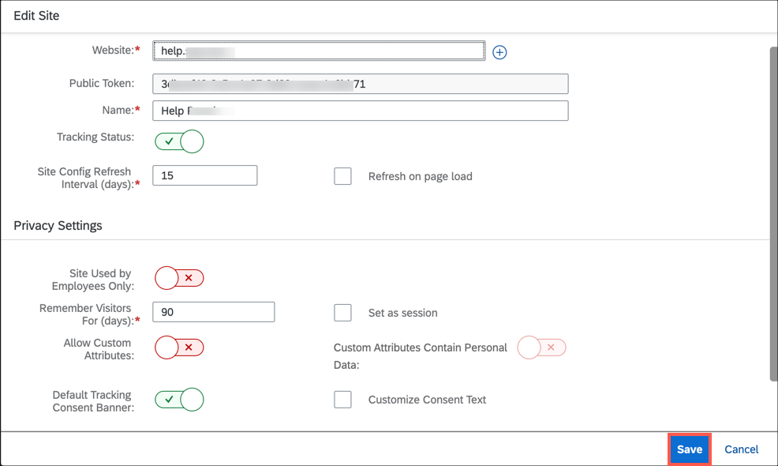

## Prerequisites
[Create a space to register your website](cp-webanalytics-create-space)

## Details
### You will learn
  - How to register a website in the space

The steps in this tutorial are applicable for trial landscape. Few UI elements of Site Management section in SAP Web Analytics either need not be used or left as is for this trial experience.

For production landscape, please follow the instructions provided in the [official help documentation](https://help.sap.com/viewer/e342b49c78c74d4e8ebc00700a791aee/Cloud/en-US/c4b6a7d7a9fe43dc9c9774a1a7151acf.html).

[ACCORDION-BEGIN [Step 1: ](Open SAP Web Analytics)]

Open SAP Web Analytics application. If you're the space admin, you must have received the SAP Web Analytics URL from your customer admin.

>While opening SAP Web Analytics, you will see that there are no sites available for tracking.

[DONE]
[ACCORDION-END]

[ACCORDION-BEGIN [Step 2: ](Register your website)]

> If you don't have a web application, you can create a simple one with **SAP Business Application Studio**. Refer to this [Create an Empty SAPUI5 Project](sapui5-101-create-project).

1. Select **Add Site**.
    !

2. Enter the domain name of your website. Don't include http:// or https:// for the domain name.
3. Enter a meaningful name or description that describes the website.
4. Leave **Tracking Status** as its default, active (green).

[DONE]
[ACCORDION-END]

[ACCORDION-BEGIN [Step 3: ](Configure the privacy settings)]

Under the **Privacy Settings** header, do the following:

1. Leave **Site Used by Employees Only** as its default, inactive (red).
> In the production landscape, you can use this toggle if your website is used by employees only.

2. Enter the number of days to remember the visitors based on your organization's data protection and privacy regulations. Do not enable **Set as session** for trial usage.
>If you enable **Set as session**, a new visitor ID is generated for every visit. Hence, you won't be able to differentiate new and returning visitors.

    |  Field Name       | Value
    |  :-------------   | :-------------
    |  Remember Visitors For (days)             | **90**

3. Leave **Allow Custom Attributes** as its default, inactive (red).
4. Leave **Default Tracking Consent Banner** as its default, active (green).
5. Select **Save**.
6. Read the agreement and select **Agree & Save**.

[VALIDATE_1]
[ACCORDION-END]

---
