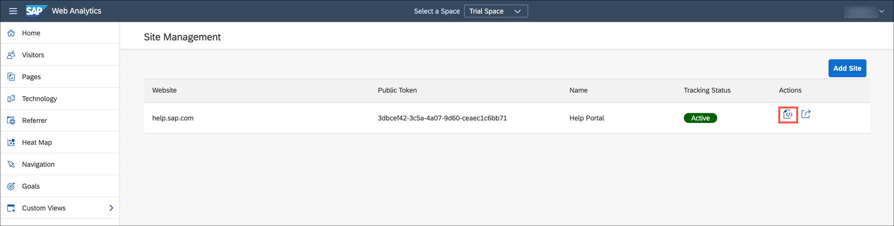
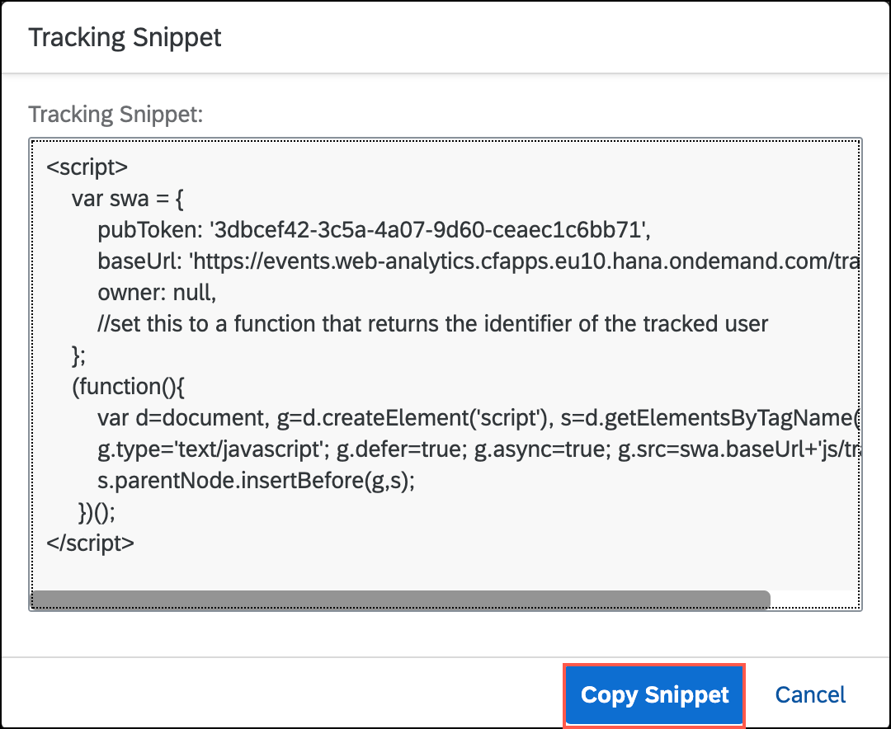

## Prerequisites
[Register Your Website in a Space](cp-webanalytics-add-site)

## Details
### You will learn
  - How to add SAP Web Analytics tracking snippet in your website

A tracking snippet is a code block that is added to your website to allow SAP Web Analytics to start tracking your website. As the website owner, you must add this snippet to the index.html page or the source code of your website home page.

The steps in this tutorial are applicable for trial landscape. Few UI elements of SAP Web Analytics Admin screens need not be used for a trial experience.

For production landscape, please follow the instructions provided in the [official help documentation](https://help.sap.com/viewer/e342b49c78c74d4e8ebc00700a791aee/Cloud/en-US/e88114ccb74847c994a7dff060ca17e1.html).

[ACCORDION-BEGIN [Step 1: ](Copy the tracking snippet)]

1. In the left pane of SAP Web Analytics, select **Administration** and then **Site Management**.

2. Click on the **Snippet** icon for your website.

    !

3. Copy the code block from the Snippet box.

    !

[DONE]
[ACCORDION-END]

[ACCORDION-BEGIN [Step 2: ](Add the tracking snippet to your website)]

1. Locate the **index.html** file in your web application.

2. Open the file and paste the SAP Web Analytics tracking snippet within the **body** tag.

    

3. Save the changes and redeploy your application

4. After successful redeployment, open the application.

5. You'll see a consent banner appearing at the top of the page. Click **Allow** to start tracking.

    

[VALIDATE_1]
[ACCORDION-END]

---
