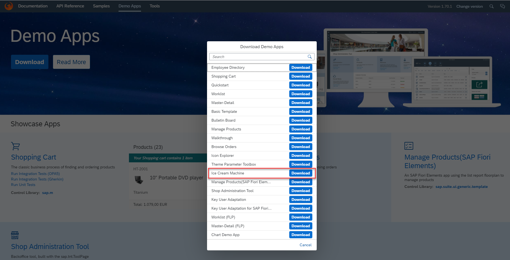
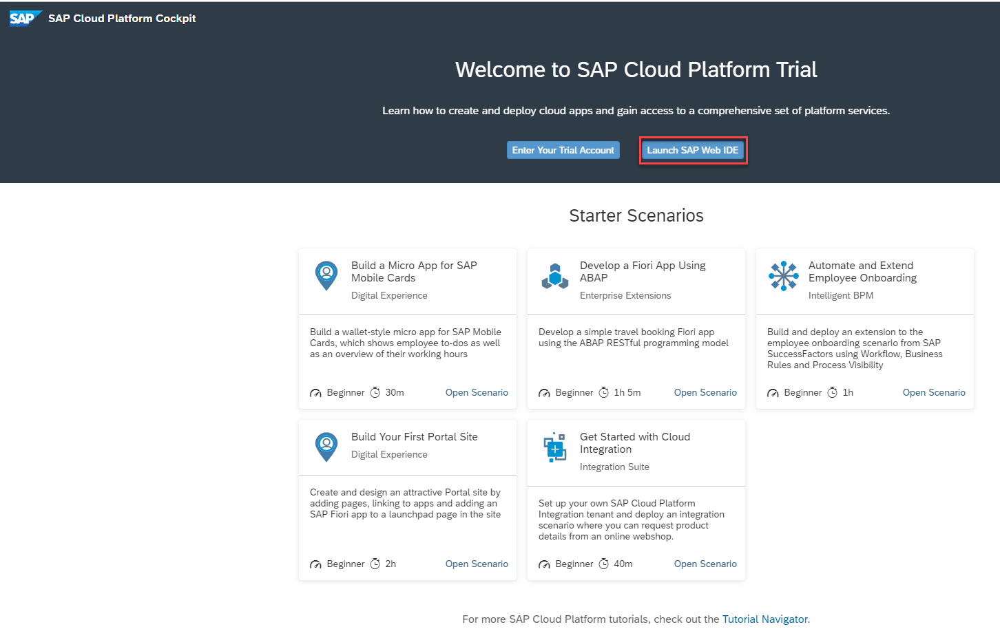
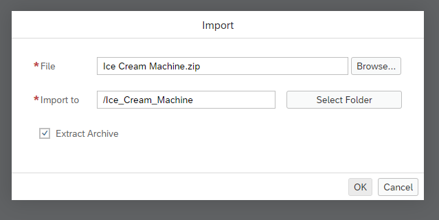
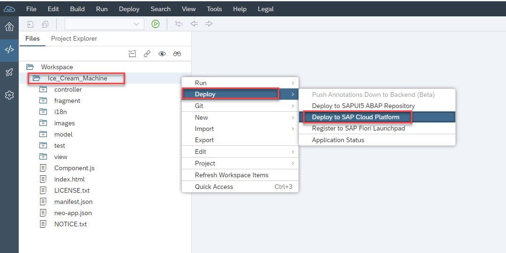
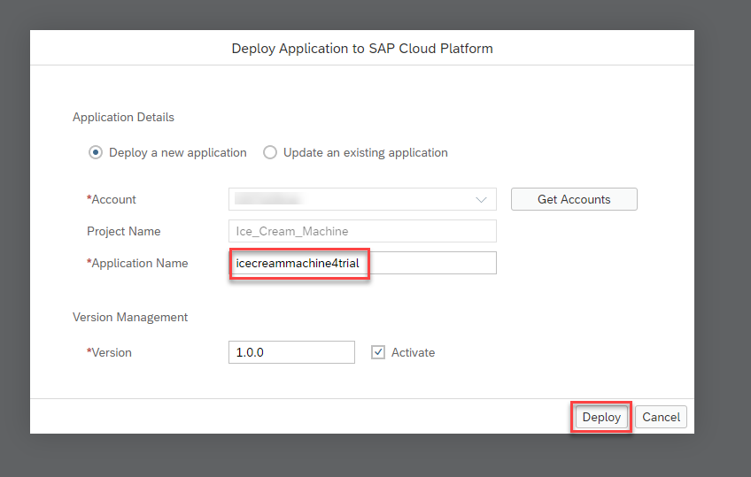
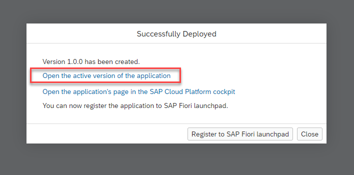
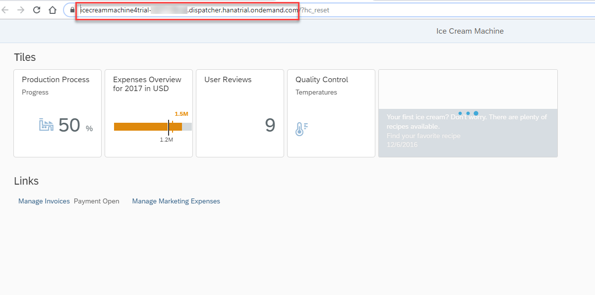

## Details
### You will learn
  - How to create a sample web application using SAP Web IDE

For the purpose of trial experience, we're helping you to create a sample web application.
You can skip this tutorial if you would like to add the SAP Web Analytics tracking snippet to your own website.

[ACCORDION-BEGIN [Step 1: ](Download the application template)]

1. Open the [SAPUI5 toolkit](https://sapui5.hana.ondemand.com/#/demoapps).

2. Select **Download**.

3. In the list of demo apps, download the **Ice Cream Machine** app.

    

    A `.zip` file is downloaded to your local machine.

[DONE]
[ACCORDION-END]

[ACCORDION-BEGIN [Step 2: ](Open SAP Web IDE)]

In the home page of SAP Cloud Platform cockpit trial, select **Launch SAP Web IDE**.

[DONE]
[ACCORDION-END]

[ACCORDION-BEGIN [Step 3: ](Import the SAPUI5 app template)]

1. Select **Open My Workspace** from the home page of SAP Web IDE.

2. Right-click on **Workspace** and select **Import** > **File or Project**.

    

3. Select **Browse** and open the downloaded .zip file (template). Select **OK**.

    

[DONE]
[ACCORDION-END]

[ACCORDION-BEGIN [Step 4: ](Deploy the application to SAP Cloud Platform)]

1. Right-click the app folder and select **Deploy** > **Deploy to SAP Cloud Platform**.

    

2. Provide a name for the sample web application and select **Deploy**.

    

3. After successful deployment, open the application using the link in the popup.

    

4. Copy the URL of the application. Save this URL for future use.

    

[VALIDATE_1]
[ACCORDION-END]

---
