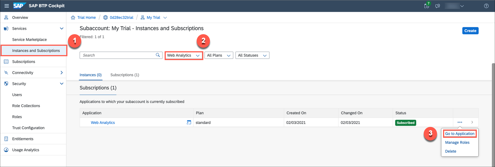
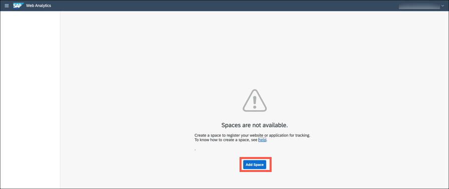
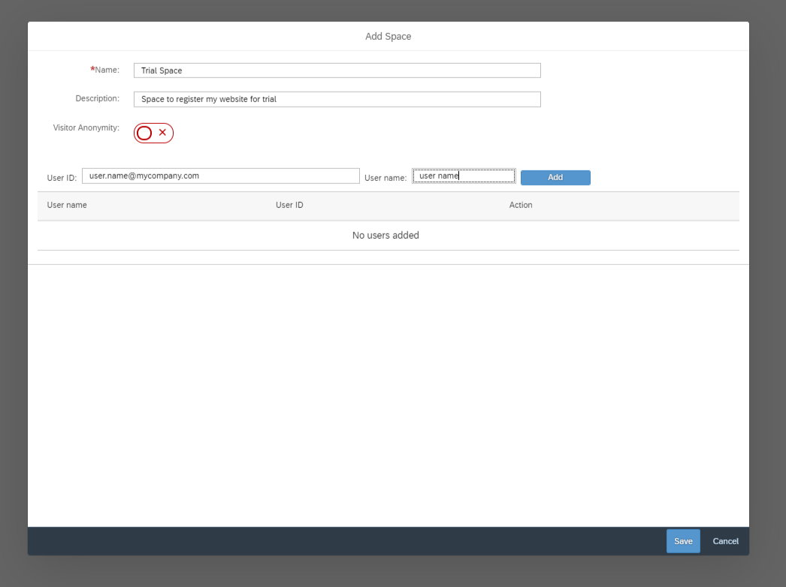

## Prerequisites
[Set Up SAP Web Analytics](cp-webanalytics-setup)

## Details
### You will learn
  - How to create spaces in SAP Web Analytics

The steps in this tutorial are applicable for trial landscape. Few UI elements of SAP Web Analytics Admin screens need not be used for a trial experience.

For production landscape, please follow the instructions provided in the [official help documentation](https://help.sap.com/viewer/e342b49c78c74d4e8ebc00700a791aee/Cloud/en-US/9788e0c77afb4c1da7c1aa4ea5899b40.html).

[ACCORDION-BEGIN [Step 1: ](Open SAP Web Analytics)]

1. Select your subaccount to navigate back to subaccount overview page.
2. In the left pane, select **Instances and Subscriptions**.
3. Choose service **Web Analytics**, select **Go to Application**.
    !
4. Log on with the credentials that you provided in the ID Service. You'll see that there are no spaces available.

[DONE]
[ACCORDION-END]

[ACCORDION-BEGIN [Step 2: ](Create a space in SAP Web Analytics)]

1. Select **Add Space**.
    !

2. Enter a name and optional description for the space.

    |  Field Name       | Value
    |  :-------------   | :-------------
    |  Name             | **``Trial Space``**
    |  Description      | **``Space to register my website for trial``**

3. Enter your e-mail address and name to become the admin for this trial space. Select **Add**.

    !

4. Select **Save**. You will see that there are no sites available for tracking. The next action for the space admin is to register a website for tracking.

In production landscape, the customer admin and space admin could be different persons. In such cases, the customer admin must pass on the Web Analytics application URL to the space admins so that they can manage the websites.

Learn more about managing SAP Web Analytics on [SAP Help Portal](https://help.sap.com/viewer/e342b49c78c74d4e8ebc00700a791aee/Cloud/en-US/9b283b52788247a0b613b478b0842dca.html).

[VALIDATE_1]
[ACCORDION-END]

---
