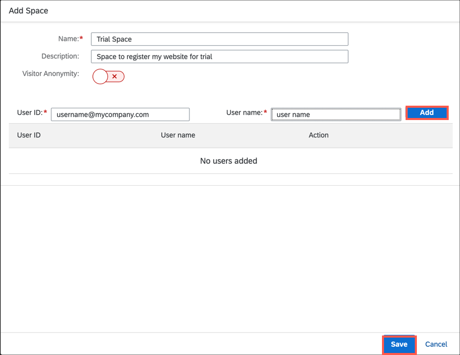

## Prerequisites
[Set Up SAP Web Analytics](cp-webanalytics-setup)

## Details
### You will learn
  - How to create spaces in SAP Web Analytics

The steps in this tutorial are applicable for trial landscape. Few UI elements of SAP Web Analytics Admin screens need not be used for a trial experience.

For production landscape, please follow the instructions provided in the [official help documentation](https://help.sap.com/viewer/e342b49c78c74d4e8ebc00700a791aee/Cloud/en-US/9788e0c77afb4c1da7c1aa4ea5899b40.html).

[ACCORDION-BEGIN [Step 1: ](Open SAP Web Analytics)]

1. Select your subaccount to navigate back to subaccount overview page.
2. In the left pane, select **Subscriptions**.
3. On the **Web Analytics** tile, select **Go to Application**.
4. Log on with the credentials that you provided in the ID Service. You'll see that there are no spaces available.

[DONE]
[ACCORDION-END]

[ACCORDION-BEGIN [Step 2: ](Create a space in SAP Web Analytics)]

1. Select **Add Space**.
2. Enter a name and optional description for the space.

    |  Field Name       | Value
    |  :-------------   | :-------------
    |  Name             | ``Trial Space``
    |  Description      | ``Space to register my website for trial``

3. Enter your e-mail address and name. Select **Add**.

    

4. **Optional**: Enter the e-mail address and name of the user whom you want to assign the space admin role.
>Space admin can register websites for tracking and manage the space. Customer admin and space admin can further add multiple admins to this space.

5. Select **Save**.

[DONE]
[ACCORDION-END]

[ACCORDION-BEGIN [Step 3: ](Give the URL of SAP Web Analytics to your space admin)]

For a trial experience, you are the customer admin and the space admin.

In production landscape, the customer admin and space admin could be different persons. In such cases, the customer admin must pass on the Web Analytics application URL to the space admins so that they can manage the websites.

1. Copy the Web Analytics application URL.
2. Share the URL with the space admin.
>While opening SAP Web Analytics for the first time, the space admin will see that there are no sites available for tracking. The first action for the space admin is to register a website for tracking.

For more information, see [SAP Web Analytics on SAP Help Portal](https://help.sap.com/viewer/e342b49c78c74d4e8ebc00700a791aee/Cloud/en-US/9b283b52788247a0b613b478b0842dca.html).

[VALIDATE_1]
[ACCORDION-END]

---
