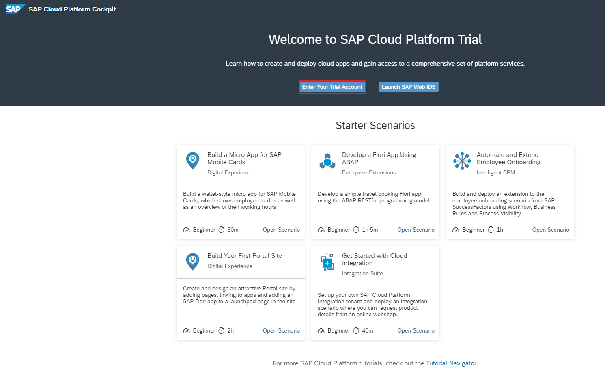

## Prerequisites  
[Get a Free Trial Account on SAP Cloud Platform](hcp-create-trial-account)

## Details
### You will learn
  - How to subscribe to SAP Web Analytics
  - Who are customer admin and space admin
  - Create a customer admin who can set up SAP Web Analytics

SAP Web Analytics is a software as a service (SaaS) offering on the SAP Cloud Platform.

The service lets you collect, report, and analyze the usage data of your website that helps you to identify meaningful patterns from various digital channels. These insights may lead you to implement improvements that can help you optimize the overall user experience of your websites.

A **customer admin** in SAP Web Analytics is an administrator for that particular subscription. For example, the IT department of an organization that subscribes to the service.

As a customer admin for Web Analytics service, within your subscription, you create unique workspaces. In SAP Web Analytics, these workspaces are called **Spaces**.

You can create a space for different departments in your organization. Each space is managed by one or more **space admins**. The space admins can register multiple websites in a space. A customer admin can be a space admin too.

For example, create a space named "E-commerce" to which you register your shopping website for usage tracking.

[ACCORDION-BEGIN [Step 1: ](Open the SAP Cloud Platform Cockpit)]

In the [home page](https://cockpit.hanatrial.ondemand.com/cockpit/#/home/trial) of SAP Cloud Platform cockpit trial, select **Enter Your Trial Account**.

[DONE]
[ACCORDION-END]

[ACCORDION-BEGIN [Step 2: ](Create a subaccount)]

Skip this step if you already have a subaccount with Amazon Web Services (AWS) in Europe (Frankfurt).

1. Select **New Subaccount**.

2. Add the following details and select **Create**. If you want to get a flavor of the beta features, enable the checkbox.

    |  Field Name       | Value
    |  :-------------   | :-------------
    |  **Display Name**     | **`Display name of your choice`**
    |  **Environment**      | **`Cloud Foundry`**
    |  **Provider**         | **`Amazon Web Services (AWS)`**
    |  **Region**           | **`Europe (Frankfurt)`**
    |  **Subdomain**        | **`web-analytics`** (provide a generic value for your organization; this value will be prefixed to the URL that SAP Web Analytics provides for the application)

    

[DONE]
[ACCORDION-END]

[ACCORDION-BEGIN [Step 3: ](Subscribe to SAP Web Analytics)]

1. Open your subaccount.
2. In the left pane, select **Subscriptions**.
3. Look out for **Web Analytics** in the list of services. Select the service to open it.
4. Select **Subscribe**. You'll see that you are now subscribed.

[DONE]
[ACCORDION-END]

[ACCORDION-BEGIN [Step 4: ](Create customer admin role)]

1. Select your subaccount to navigate back to subaccount overview page.

2. In the left pane, select **Security** and then **Role Collections**.

3. Select **New Role Collection**.

4. Add the following details and save.

    |  Field Name       | Value
    |  :-------------   | :-------------
    |  Name             | **SAP Web Analytics Customer Admin**
    |  Description      | **Customer Admin**

    

5. Click the newly created role and select **Add Role**.

6. In the **Application Identifier** drop-down list, select the following values and save. If you've subscribed to multiple cloud services, you might see other entries as well in the list.

    |  Field Name               | Value
    |  :-------------           | :-------------
    |  Application Identifier   | **`SAP-Web-Analytics-ProdTrial!t7479`**
    |  Description              | **`_WebAnalyticsAdmin`**
    |  Description              | **`_WebAnalyticsAdmin`**

    

7. Select **Save**.

[DONE]
[ACCORDION-END]

[ACCORDION-BEGIN [Step 5: ](Assign scope to the customer admin)]

1. Select your subaccount to navigate back to subaccount overview page.
2. In the left pane, select **Security** and then **Trust Configuration**.
3. Select **SAP ID Service**. If you've configured your own ID service with SAP Cloud Platform, select your custom ID service.
4. Enter your e-mail address (or the attribute that you've configured in the custom ID service) so that you can onboard yourself as the customer admin and select **Show Assignments**.
5. If your e-mail address is not part of the ID service, add the same.
6. Select **Assign Role Collection**.
7. In the **Role Collection** dropdown, select the new role that you created for SAP Web Analytics and select **Assign Role Collection**.

[VALIDATE_1]
[ACCORDION-END]

---
