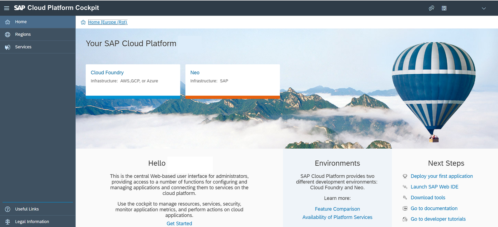
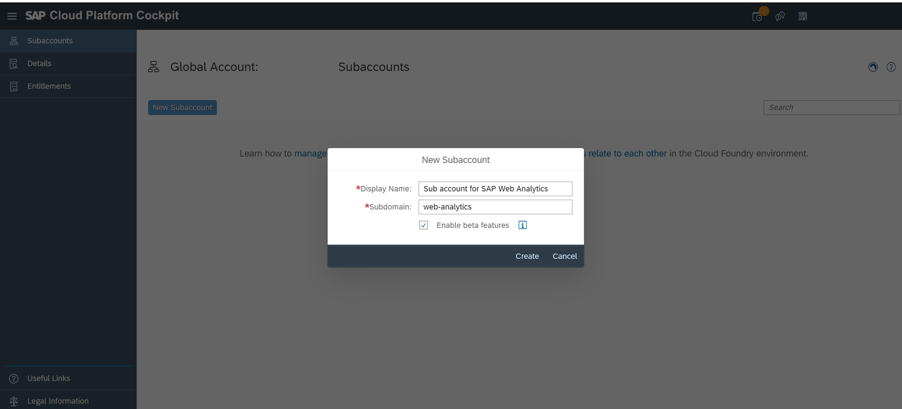
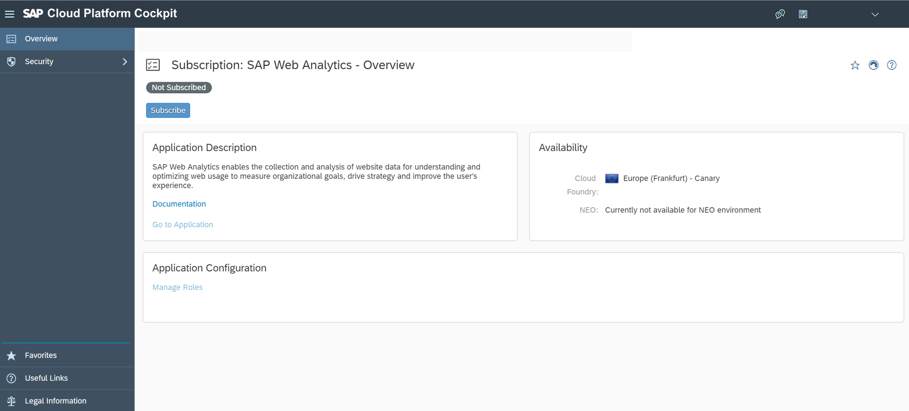
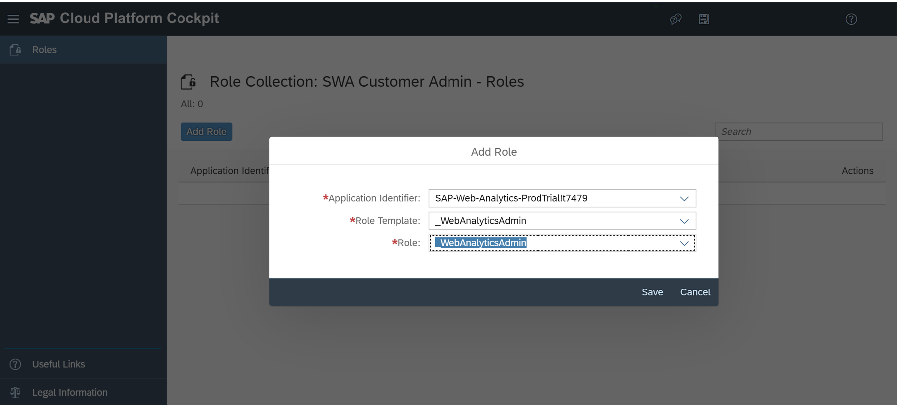

## Prerequisites  
 - You have a SAP Cloud Platform enterprise account.

## Details
### You will learn
  - How to onboard to SAP Web Analytics
  - Create a customer admin who can set up SAP Web Analytics

---

[ACCORDION-BEGIN [Step 1: ](Choose Cloud Foundry)]

In the home page of SAP Cloud Platform cockpit, select **Cloud Foundry**.

[DONE]
[ACCORDION-END]

[ACCORDION-BEGIN [Step 2: ](Create a subaccount)]

Skip this step if you already have a subaccount.

1. Select **New Subaccount**.
2. Add the following details and select **Create**. If you want to get a flavor of the beta features, enable the checkbox.

|  Field Name       | Value
|  :-------------   | :-------------
|  **Display Name**     | **`Subaccount for SAP Web Analytics`**
|  **Subdomain**        | **`web-analytics`** (provide a generic value for your organization; this value will be prefixed to the URL that SAP Web Analytics provides for the application)

[DONE]
[ACCORDION-END]

[ACCORDION-BEGIN [Step 3: ](Subscribe to SAP Web Analytics)]

1. Open your subaccount.
2. In the left pane, select **Subscriptions**.
3. Look out for **SAP Web Analytics** in the list of services. Select the service to open it.
4. Select **Subscribe**. You'll see that you are now subscribed.

[DONE]
[ACCORDION-END]

[ACCORDION-BEGIN [Step 4: ](Create customer admin role)]

1. Select your subaccount to navigate back to subaccount overview page.

2. In the left pane, select **Security** and then **Role Collections**.

3. Select **New Role Collection**.

4. Add the following details and save.

    |  Field Name       | Value
    |  :-------------   | :-------------
    |  Name             | **SAP Web Analytics Customer Admin**
    |  Description      | **Customer Admin**

    

5. Click the newly created role and select **Add Role**.

6. In the **Application Identifier** drop-down list, select the following values and save. If you've subscribed to multiple cloud services, you might see other entries as well in the list.

    |  Field Name               | Value
    |  :-------------           | :-------------
    |  Application Identifier   | **`SAP-Web-Analytics-QA!t197`**
    |  Description              | **`_WebAnalyticsAdmin`**
    |  Description              | **`_WebAnalyticsAdmin`**

    

[DONE]
[ACCORDION-END]

[ACCORDION-BEGIN [Step 5: ](Assign scope to the customer admin)]

1. Select your subaccount to navigate back to subaccount overview page.
2. In the left pane, select **Security** and then **Trust Configuration**.
3. Select **SAP ID Service**. If you've configured your own ID service with SAP Cloud Platform, select your custom ID service.
4. Enter the e-mail address of the user (or the attribute that you've configured in the ID service) you want to onboard as the customer admin and select **Show Assignments**.
5. If the user is not part of the ID service, add the user.
6. Select **Assign Role Collection**.
7. In the **Role Collection** dropdown, select the new role that you created for SAP Web Analytics and select **Assign Role Collection**.

[DONE]
[ACCORDION-END]

[ACCORDION-BEGIN [Step 6: ](Open SAP Web Analytics)]

1. Select your subaccount to navigate back to subaccount overview page.
2. In the left pane, select **Subscriptions**.
3. On the **SAP Web Analytics** tile, select **Go to Application**.
4. Log on with the credentials that you provided in the ID Service. You'll see that there are no spaces available.

[DONE]
[ACCORDION-END]

[ACCORDION-BEGIN [Step 7: ](Create a space in SAP Web Analytics)]

Spaces are unique work spaces that you can create for different departments and LOBs. Within each space, you can add one or more websites that belong to the department. For example, create a space named `E-commerce` to which you can register your shopping website for tracking.

1. Select **Add Space**.
2. Enter a name and optional description for the space.
3. Enter the e-mail address and name of the first user who you want to assign to the space.
>This user becomes the space admin who can register websites for tracking, manage the space and users. Customer admin and space admin can further add multiple admins for the space.

[VALIDATE_1]
[ACCORDION-END]

[ACCORDION-BEGIN [Step 8: ](Inform your space admin)]

Provide the application URL to the space admin. While opening SAP Web Analytics for the first time, the space admin will see that there are no sites available for tracking.

The first action for the space admin is to register a website for tracking.

For more information, see [SAP Web Analytics on SAP Help Portal](https://help.sap.com/viewer/e342b49c78c74d4e8ebc00700a791aee/Cloud/en-US/9b283b52788247a0b613b478b0842dca.html).

[DONE]
[ACCORDION-END]

---
