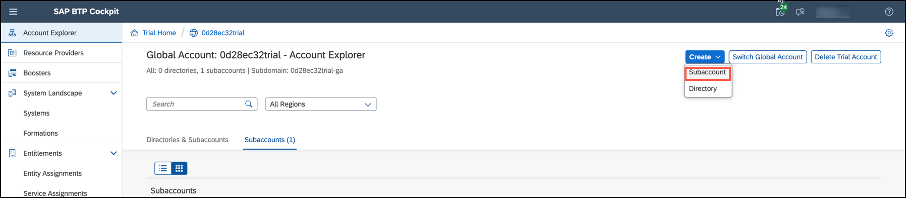
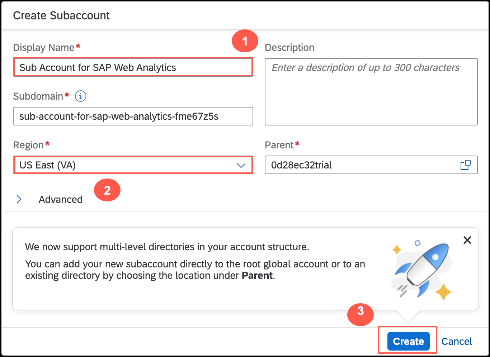
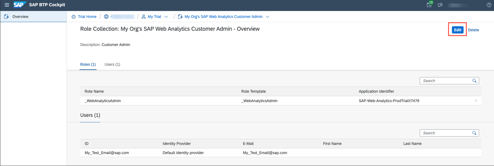
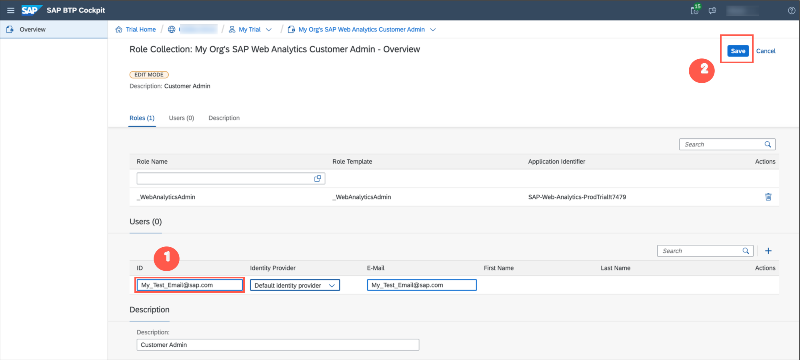

# Set Up SAP Web Analytics
<!-- description --> Subscribe to the trial version of SAP Web Analytics on the SAP Business Technology Platform cockpit.

## You will learn
  - How to subscribe to SAP Web Analytics
  - Who are customer admin and space admin
  - Create a customer admin who can set up SAP Web Analytics

## Prerequisites  
[Get a Free tier Account on SAP BTP](hcp-create-trial-account)

## Intro
SAP Web Analytics is a software as a service (SaaS) offering on the SAP Business Technology Platform (BTP).

The service lets you collect, report, and analyze the usage data of your website that helps you to identify meaningful patterns from various digital channels. These insights may lead you to implement improvements that can help you optimize the overall user experience of your websites.

A **customer admin** in SAP Web Analytics is an administrator for that particular subscription. For example, the IT department of an organization that subscribes to the service.

As a customer admin for Web Analytics service, within your subscription, you create unique workspaces. In SAP Web Analytics, these workspaces are called **Spaces**.

You can create a space for different departments in your organization. Each space is managed by one or more **space admins**. The space admins can register multiple websites in a space. A customer admin can be a space admin too.

For example, create a space named "E-commerce" to which you register your shopping website for usage tracking.

### Open the SAP BTP Cockpit

In the **Home page** of SAP BTP cockpit, select your **Global Account**.

### Create a subaccount

Skip this step if you already have a trial subaccount.

1. Choose **Create** **>** **Subaccount**.
    <!-- border -->

2. Add the following details and select **Create**. If you want to get a flavor of the beta features, enable the checkbox.

    |  Field Name       | Value
    |  :-------------   | :-------------
    |  **Display Name**     | **`Display name of your choice`**
    |  **Region**           | **`US East (VA)`**
    |  **Subdomain**        | **`my-org-name`** (provide a generic value for your organization; this value will be prefixed to the URL that SAP Web Analytics provides for the application)

    <!-- border -->

### Add Entitlements to your Subaccount

1. Open your subaccount.
2. In the left pane, select **Entitlements**.
3. Select **Configure Entitlements** and then **Add Service Plans**.
4. From the list of entitlements, select **Web Analytics** and choose an available plan. Select **Add 1 Service Plan**.
5. Select **Save** to save your entitlements.

    <!-- border -->

### Subscribe to SAP Web Analytics

1. Open your subaccount.
2. In the left pane, select **Service Marketplace**.
3. Look out for **Web Analytics** in the list of services. Select the service to open it.
4. Select **Create** to subscribe to the service.

    <!-- border -->

5. Select the **Service** as **`Web Analytics`** and **Plan** as **`standard`** then choose **Create**.
    <!-- border -->

6. Choose **View Subscription**. You'll see that you are now subscribed.
    <!-- border -->

    <!-- border -->

### Create customer admin role

1. Select your subaccount to navigate back to subaccount overview page.
2. In the left pane, select **Security** and then **Role Collections**.
3. Select **Create New Role Collection**.
4. Add the following details and select **Create**.

    |  Field Name       | Value
    |  :-------------   | :-------------
    |  Name             | **My org's SAP Web Analytics customer admin**
    |  Description      | **Customer admin**

    <!-- border -->

5. Click the newly created role and select **Edit**.
6. In the **Roles** section, select **Add a Role**.
7. In the **Role Name** list, select **Web Analytics Admin**. If you've subscribed to multiple cloud services, you might see other entries as well in the list.

    <!-- border -->

8. Select **Save**.

### Assign scope to the customer admin

1. Select your subaccount to navigate back to subaccount overview page.
2. In the left pane, select **Security** and then **Role Collections**.
3. Choose the role collection **My org's SAP Web Analytics customer admin**.
5. Choose **Edit**.
    <!-- border -->
4. Navigate to the **Users** tab and enter your e-mail address (or the attribute that you've configured in the custom ID service) so that you can onboard yourself as the customer admin. If your e-mail address is not part of the ID service, add the same.
    <!-- border -->
6. Choose **Save**.

---
