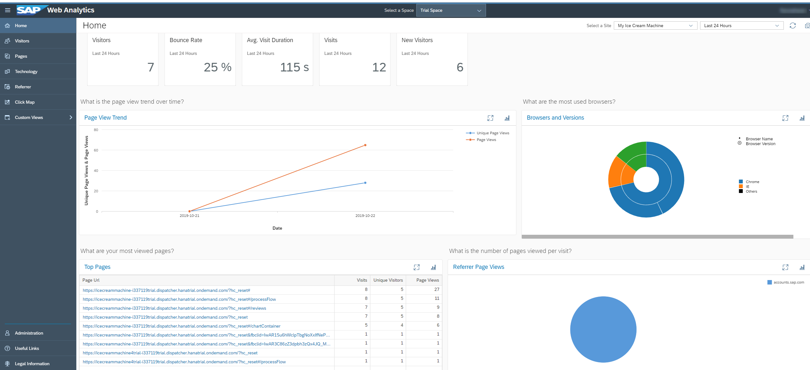

## Details
### You will learn
  - Different dashboards in SAP Web Analytics
  - View your website usage data

[ACCORDION-BEGIN [Step 1: ](Generate data from your website)]

1. Navigate to different pages in your website.

2. Repeat the same actions in different browsers like Chrome, Firefox, Internet Explorer, Microsoft Edge, Safari.

3. Provide access to multiple users so that you generate sufficient usage data.

> Make sure that you and other users give consent for tracking in the SAP Web Analytics consent banner.

[DONE]
[ACCORDION-END]

[ACCORDION-BEGIN [Step 2: ](View website usage data)]

1. Open SAP Web Analytics home dashboard.

    You'll see key performance indicators picked from other dashboards.

    

2. Pick a timeline based on your data generation. For example, if you'd used the website within the last 24 hours, select **Last 24 Hours**.

3. Navigate to other dashboards like Visitors, Pages, Technology, Referrer, and Click Map.

>To learn more about SAP Web Analytics, refer to the [official help documentation](https://help.sap.com/viewer/e342b49c78c74d4e8ebc00700a791aee/Cloud/en-US/).

[VALIDATE_1]
[ACCORDION-END]

---
