## Prerequisites  
 - **Tutorials:** [Sign up for a free trial account on SAP Cloud Platform](https://www.sap.com/developer/tutorials/hcp-create-trial-account.html)

## Details
### You will learn  
  - How to configure a destination
  - How to choose the SAP Web IDE template and create the app

---

[ACCORDION-BEGIN [Step 1: ](Log in to SAP Cloud Platform)]

Go to <https://account.hanatrial.ondemand.com> and log in to your SAP Cloud Platform cockpit.

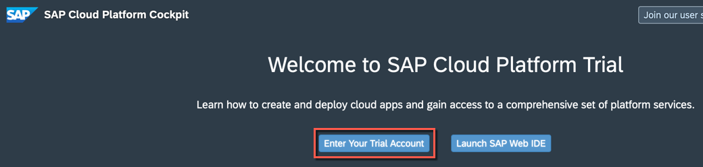

[DONE]

[ACCORDION-END]

[ACCORDION-BEGIN [Step 2: ](Enable mobile service for development and operations)]

Choose **Services** on the left pane, scroll down and then choose **Development & Operations, std**.

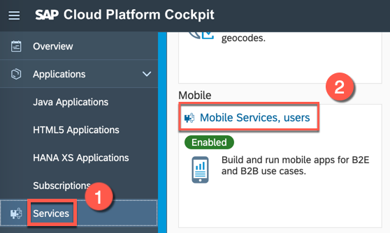

On the **Service: Development & Operations, std - Overview** page, click **Enable**.

Use this service to access the destination that you create, and to build your app as a mobile app using the cloud build service.

[DONE]

[ACCORDION-END]

[ACCORDION-BEGIN [Step 3: ](Create new destination)]

In the left pane, select **Connectivity** > **Destinations**, then click **New Destination** to open a new **Destination Configuration** form.

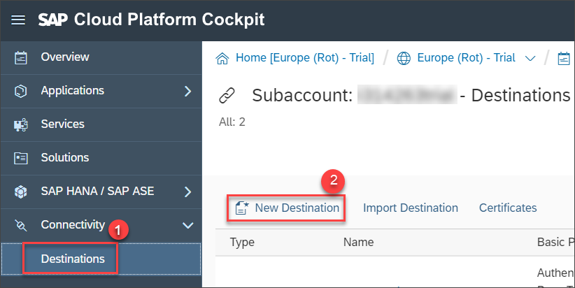

Provide the following configuration values for the new destination:

|  Field Name     | Value
|  :------------- | :-------------
|  Name           | **`MobileServiceSampleData`**
|  Type           | **`HTTP`**
|  Description    | **`Mobile Service Sample OData Service`**
|  URL            | **`https://hcpms-<your account number>trial.hanatrial.ondemand.com/SampleServices/ESPM.svc`**
|  Proxy Type     | **`Internet`**
|  Authentication | **`BasicAuthentication`**

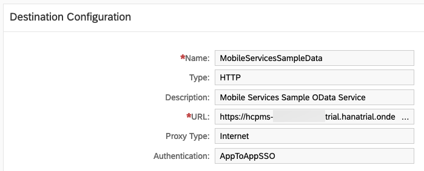

Add the following additional properties by clicking the **New Property** button once for each property:

|  Field Name     | Value
|  :------------- | :-------------
|  **`TrustAll`** | **`true`**
|  **`WebIDEEnabled`** | **`true`**
|  **`WebIDESystem`** |  **`ms`**
|  **`WebIDEUsage`** | **`odata_gen`**

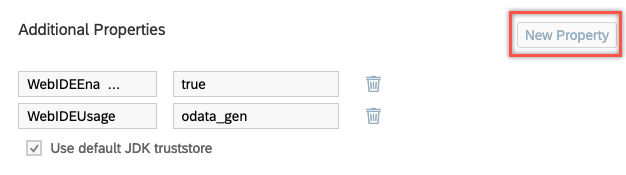

Click **Save**.

[VALIDATE_1]

[ACCORDION-END]

[ACCORDION-BEGIN [Step 4: ](Open SAP Web IDE Full-Stack)]

In the left pane, choose **Services**, scroll down and choose **Web IDE Full-Stack**.

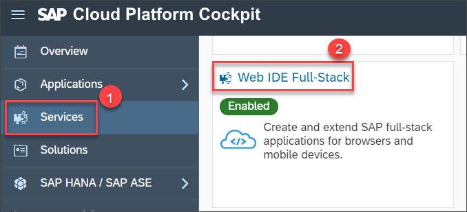

From the **Service: Web IDE Full-Stack - Overview** page, choose **Go to Service** to open Web IDE Full-Stack in a new browser tab.

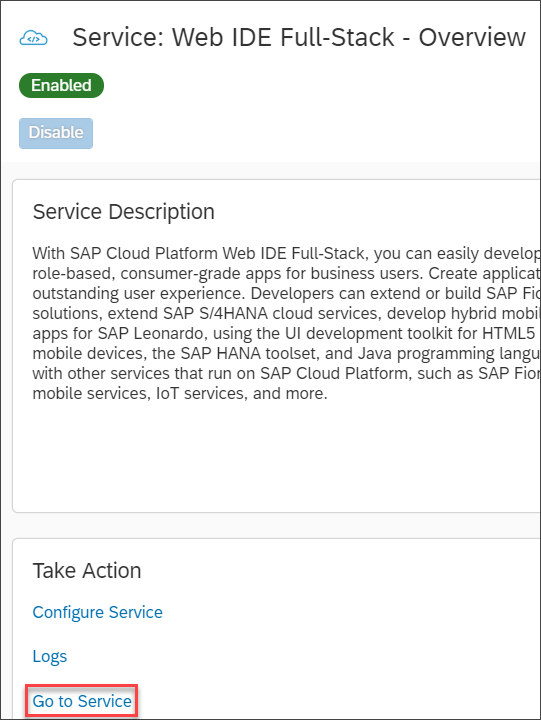

>If you can't select **Go to Service**, it means the **Web IDE Full-Stack** service isn't enabled for your account. On the **Service: Web IDE Full-Stack - Overview** page, choose **Enable** to enable the service and then repeat the above step.

[DONE]
[ACCORDION-END]

[ACCORDION-BEGIN [Step 5: ](Choose a new project template)]

Select **File** > **New** > **Project from Template**.
On the **Template Selection** page, choose **All Categories** from the **Category** list.
From the displayed templates, choose the CRUD Master-Detail Application template and select **Next**.

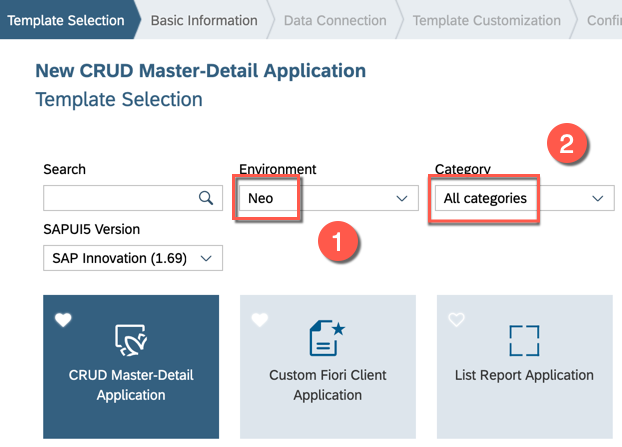

[DONE]
[ACCORDION-END]

[ACCORDION-BEGIN [Step 6: ](Enter basic project information)]

On the **Basic Information** page, provide the following information:

|  Field Name     | Value
|  :------------- | :-------------
|  Project Name           | **`OfflineCRUDDemo`**
|  Title           | **`Offline CRUD Demo App`**
|  Namespace    | **`com.sap.offlinecruddemo`**
|  Description            | **`Demo app to showcase offline capabilities`**

Select **Next**.

[DONE]
[ACCORDION-END]

[ACCORDION-BEGIN [Step 7: ](Configure data connection)]

On the **Data Connection** page, choose **Service URL** as the service source. If you only have one `WebIDEEnabled` destination in SAP Cloud Platform, it is automatically selected. If you don't see the `MobileServiceSampleData` service selected (the destination you created in step 3), click the dropdown menu and select it.

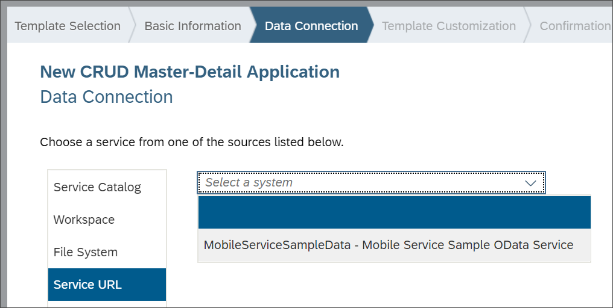

If the `MobileServiceSampleData` service doesn't appear in the dropdown menu, return to your destination in the SAP Cloud Platform cockpit and double-check the entries from step 3. If you make changes, reload Web IDE and repeat the procedure from step 5 in this tutorial.

[DONE]
[ACCORDION-END]

[ACCORDION-BEGIN [Step 8: ](Test the data connection)]

Enter **/** as the relative URL and select **Test**.

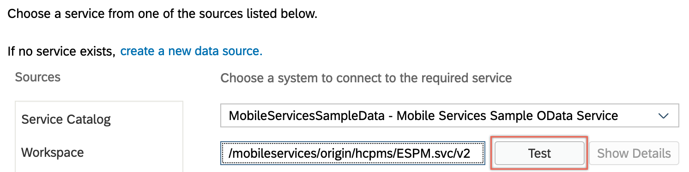

You should see the data from the service.

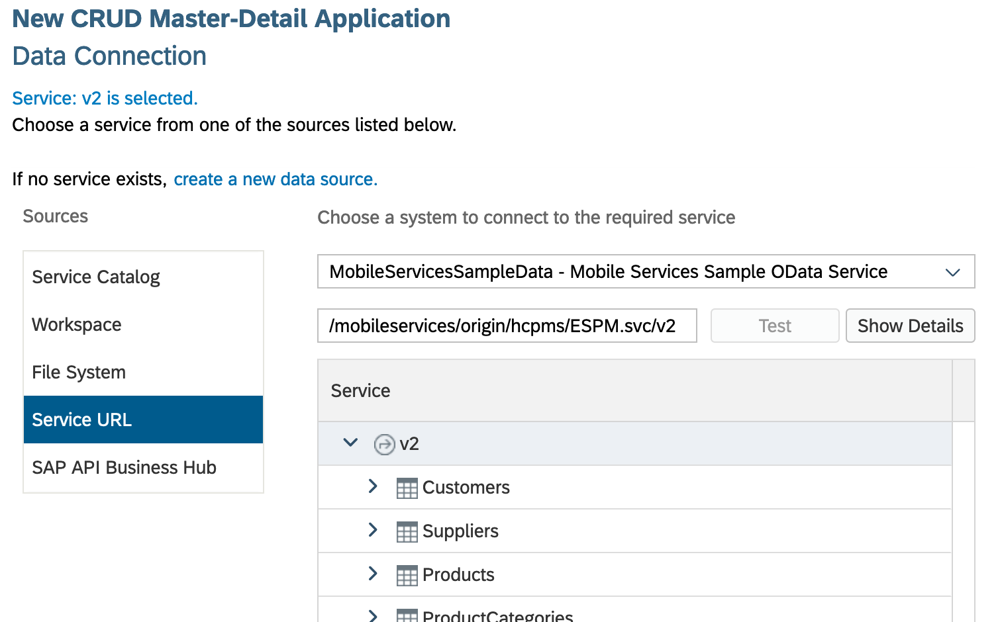

Select **Next**.

[DONE]
[ACCORDION-END]

[ACCORDION-BEGIN [Step 9: ](Customize the template)]

In the **Data Binding - Object** section, enter the following values:

|  Field Name     | Value
|  :------------- | :-------------
|  Object Collection           | **`Suppliers`**
|  Object Collection ID           | **`SupplierID`**
|  Object Title    | **`SupplierName`**
|  Object Unit of Measure     | **`PhoneNumber`**

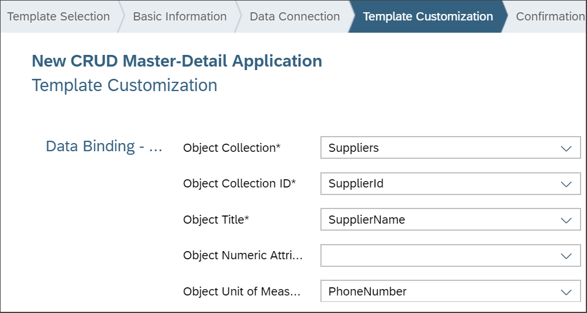

In the **Data Binding - Line Item** section, enter the following values:

|  Field Name     | Value
|  :------------- | :-------------
|  Line Item Collection         | **`Products`**
|  Line Item Collection ID           | **`ProductID`**
|  Line Item Title    | **`Name`**
|  Line Item Numeric Attribute            | **`Price`**
|  Line Item Unit of Measure     | **`CurrencyCode`**

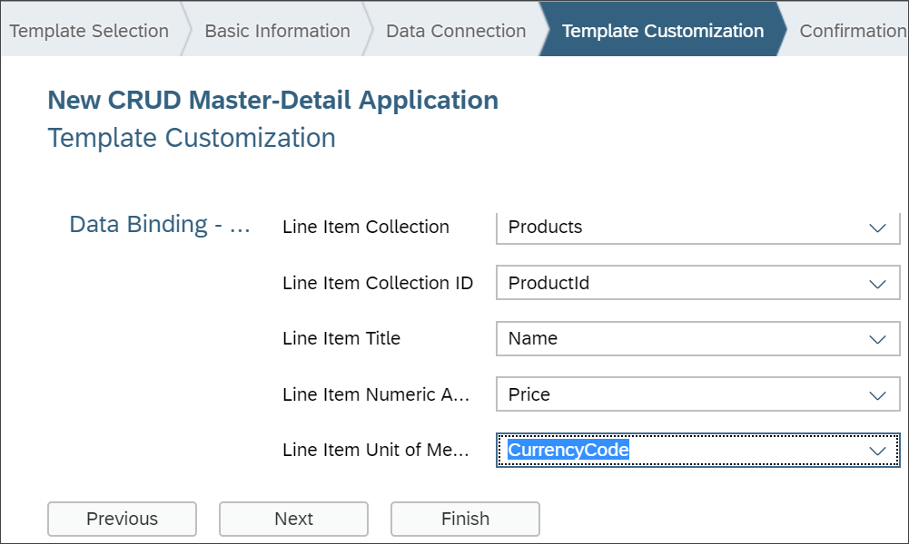

[DONE]
[ACCORDION-END]

[ACCORDION-BEGIN [Step 10: ](Generate the app)]

Select **Finish** to create the new CRUD app. After the app is generated, select the **`OfflineCRUDDemo`** project folder icon to see the project structure.

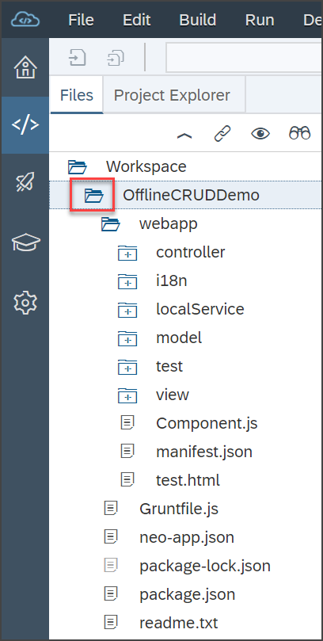

[DONE]
[ACCORDION-END]

[ACCORDION-BEGIN [Step 11: ](Run the app)]

Under the  **`OfflineCRUDDemo`** project folder icon, choose the `test.html` file and select **Run**.

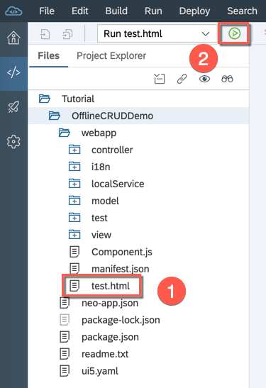

On the **Testing Overview** page, choose **`test/flpSandbox.html`** to launch the app.

Your app opens in a Web IDE preview pane.

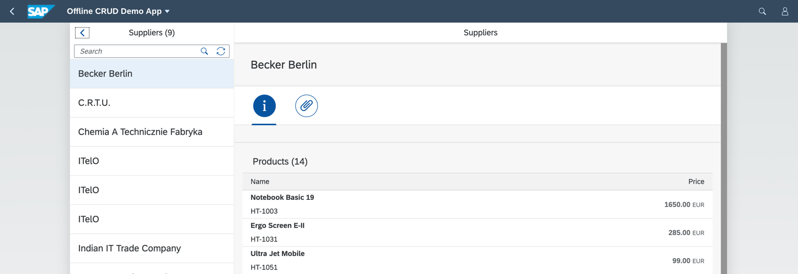
[DONE]
[ACCORDION-END]

---
