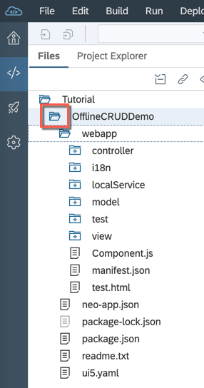
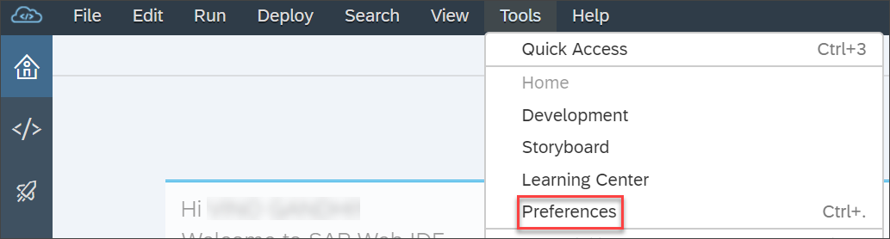
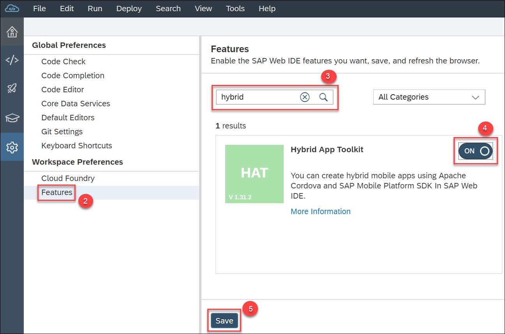
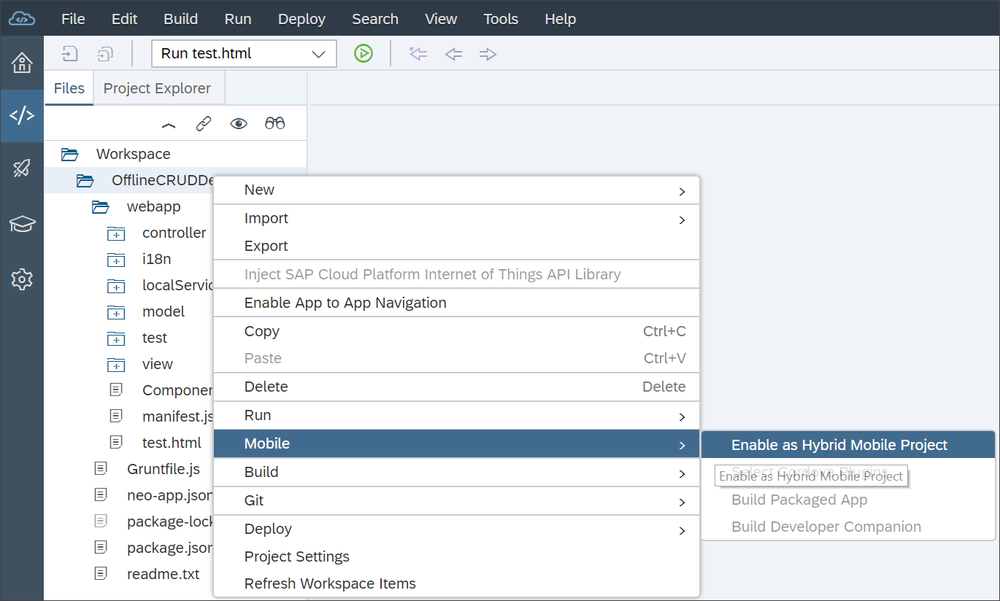
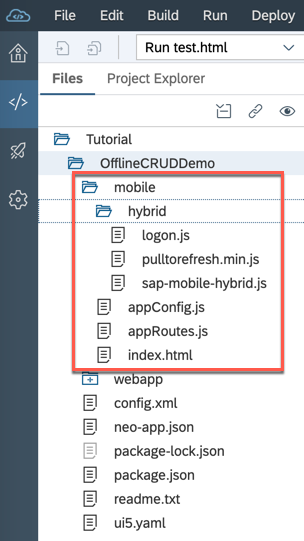
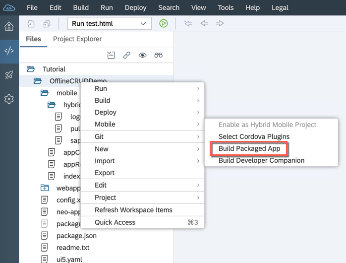
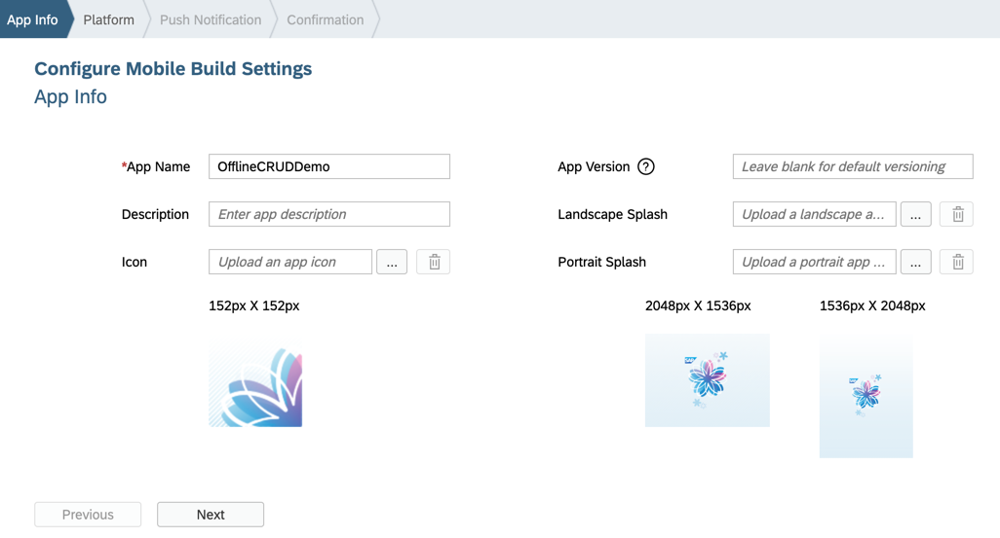
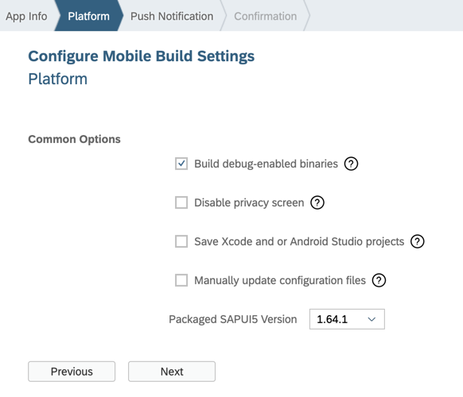
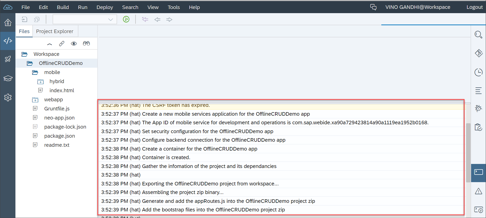
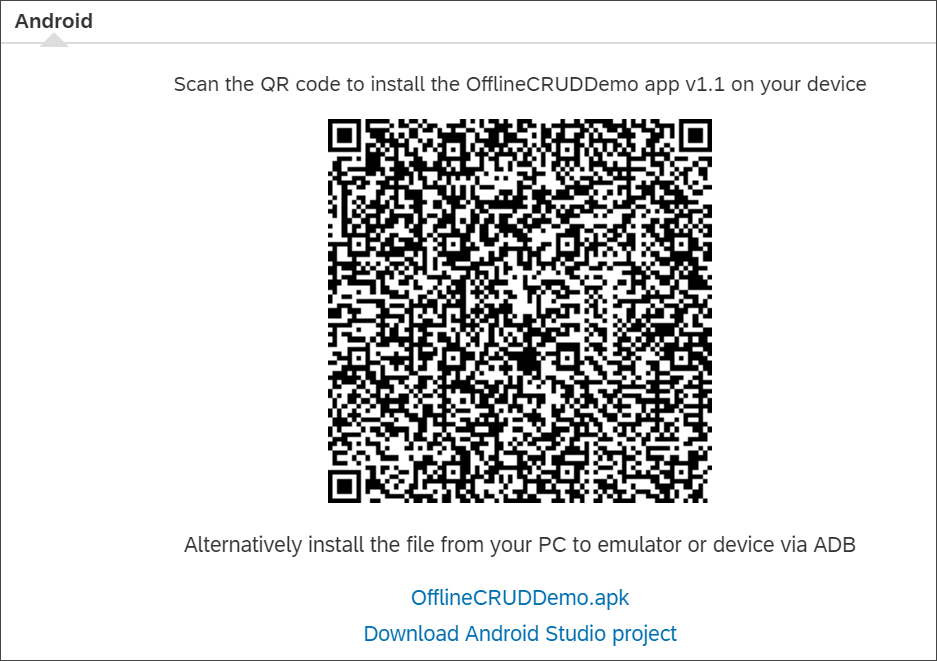

## Prerequisites  
 - **Tutorials:**
 - [Create a signing profile for Android and/or iOS platforms] (https://help.sap.com/viewer/8e5c63b6470a4255861c259f3b2d9b41/Cloud/en-US/4519a29aa8cc4f049692d4c10ddc6099.html)

## Details
### You will learn  
  - How to enable the Hybrid App Toolkit plugin
  - How to enable your app as a hybrid mobile app
  - How to configure the build settings and build the app

---

[ACCORDION-BEGIN [Step 1: ](Open the CRUD app)]

Create a CRUD Master-Detail app as described in the **Create a CRUD Master-Detail App** tutorial.

Open the app in SAP Web IDE.

[DONE]

[ACCORDION-END]

[ACCORDION-BEGIN [Step 2: ](Enable Hybrid App Toolkit plugin)]

1. In the Web IDE workspace, select **Tools** > **Preferences**.

    

2. Under **Workspace Preferences**, choose **Features**.
3. Search for **Hybrid App Toolkit** or scroll down to locate it.
4. Enable it by clicking the slider.
5. Select **Save**.  

Refresh Web IDE to ensure that the plugin's functionality for creating hybrid mobile apps is loaded in Web IDE.

[DONE]
[ACCORDION-END]

[ACCORDION-BEGIN [Step 3: ](Verify the cloud build service)]

By default, the cloud build service that is based on the mobile service for development and operations is used.

(Production landscapes only) If **Mobile Service for SAP Fiori** is enabled for your account, go to **Tools** > **Preferences**. In the left pane, select **Hybrid Application Toolkit** and ensure that the cloud build service is enabled for the mobile service for development and operations.

[DONE]
[ACCORDION-END]

[ACCORDION-BEGIN [Step 4: ](Enable as hybrid mobile app)]

Right-click the project and choose **Mobile** > **Enable as Hybrid Mobile Project**.

This adds a **mobile** folder to your project that contains some source files required to run your app on a device or emulator.

[VALIDATE_1]

[ACCORDION-END]

[ACCORDION-BEGIN [Step 5: ](Choose to build as a packaged app)]

Right-click the project and choose **Mobile** > **Build Packaged App**.

You see the **Configure Mobile Build Settings** wizard.

[DONE]
[ACCORDION-END]

[ACCORDION-BEGIN [Step 6: ](Provide app info)]

The name you entered while creating the app appears on the **App Info** page. You can use the same app name or give a different name. This name is used on the device's homepage.

Also choose an app icon and images for the splash screen, as required.

Click **Next**.

[DONE]
[ACCORDION-END]

[ACCORDION-BEGIN [Step 7: ](Choose the platforms and signing profiles)]

On the **Platform** page, complete the following steps:

1. Choose the platforms for which you want to build the app.
2. For each selected platform, choose a valid signing profile from the dropdown list.
For information about creating a signing profile, see the **Prerequisites** section.
3. Choose a minimum version for the selected operating system.
This helps you to build applications for the specified operating system versions.

[DONE]
[ACCORDION-END]

[ACCORDION-BEGIN [Step 8: ](Choose the build options and SAPUI5 version)]

1. Choose the following build options, as required:

    - The **`Build debug-enabled binaries`** option enables you to debug your applications from a desktop browser.
  You can debug Android applications using Chrome, and iOS applications using Safari. For debug-enabled Android applications, an internal debug signing profile is used.  
  After you finish debugging the application, unselect this option and perform a rebuild to prepare the application for production.

    - The **`Disable Privacy Screen`** option allows information to be shown on the device homepage.  
    The Privacy Screen feature hides app content in the app switcher. Choosing the **`Disable Privacy Screen`** option prevents you from hiding the app content in the app switcher due to which sensitive information can be easily seen.

    - The **`Save Xcode and Android Studio projects`** option saves the project, if you want to download it for troubleshooting purposes. When the cloud build completes, click the link that appears to download the project as a zip file. Open it using `XCode` or Android Studio.

2. Choose an SAPUI5 version from the **`Packaged SAPUI5 Version`** dropdown list.

3. Click **Next**.

[DONE]
[ACCORDION-END]

[ACCORDION-BEGIN [Step 9: ](Enable push notifications)]

**This step is optional.**

If you want your app to support push notifications, choose **Enable receiving push notification**, from the **Push Notification** page.

For information about registering push notification messages for Android and iOS, see [Push Notifications for Mobile Apps](https://help.sap.com/viewer/8e5c63b6470a4255861c259f3b2d9b41/Cloud/en-US/7503960ecdcb423c89c9611862248373.html).

[DONE]
[ACCORDION-END]

[ACCORDION-BEGIN [Step 10: ](Build the app)]

On the **Push Notification** page, choose **Build**.

As the build progresses, build logs appear on the console.

When the build finishes, a popup dialog displays the QR code and hyperlink. You can use either of them to download the app to your device. After you successfully download and install the app, you can run it on your device. After entering your SAP Cloud Platform credentials on the device, you see a standalone app.

If you chose the **Save Xcode and Android Studio projects** option, the link to download the project is also displayed in the popup dialog.

[DONE]
[ACCORDION-END]

---
