## Prerequisites  
 - **Proficiency:** Intermediate


## Details
### You will learn  
In the tutorial you will learn how to create an application that contains a master detail view as well as a full screen view.

### Time to Complete
**15 Min**

---

[ACCORDION-BEGIN [Step 1: ](Open SAP Web IDE)]
1. From the SAP Cloud Platform Cockpit choose the services option in the left hand navigation menu.  
2. Find Web IDE by using the search or by scrolling down to the DevOps area.  
3. Choose the Web IDE Tile which will take you to the Web IDE Overview page.  
4. Choose Go to Service which will launch Web IDE.

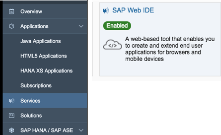

[ACCORDION-END]

[ACCORDION-BEGIN [Step 2: ](Create New Project)]

1.	Choose File -> New -> Project from Template.


[ACCORDION-END]


[ACCORDION-BEGIN [Step 3: ](Choose SAPUI5 Template)]

1.	From the template selection screen, choose SAPUI5 Application and then click [Next].
You will be taken to the Basic information tap

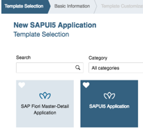

[ACCORDION-END]

[ACCORDION-BEGIN [Step 4: ](Provide Project Details)]
1.	Provide the following value's
• Project Name: `employeerequisition`
•	Namespace: `com.sap.ariba`

Click [Next]

You will be taken to the Template Customization tab


[ACCORDION-END]

[ACCORDION-BEGIN [Step 5: ](Choose View Types)]

1.	Provide the values for the Initial View:
•	View Type: XML
•	View Name: App

Choose [Finish]

The project will be created.

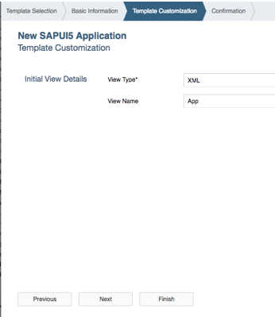

[ACCORDION-END]

[ACCORDION-BEGIN [Step 6: ](Create New UI5 View)]

With the base structure created, we will now create the addition views needed by the app.  

Right click on the `webapp` folder and choose `New -> SAPUI5 View`

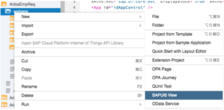

[ACCORDION-END]

[ACCORDION-BEGIN [Step 7: ](Provide View Values)]

1.	Provide the following values:
•	View Type: Leave default
•	Namespace: Leave Default
•	View Name: `SplitApp`


Choose [Next] and then [Finish]

This will create both a view and a corresponding controller.

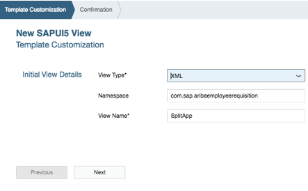


[ACCORDION-END]

[ACCORDION-BEGIN [Step 8: ](Create the Other Views)]

1.	Repeat steps 6 and 7 to create the following views:
•	View Name: Master
•	View Name: Detail
•	View Name: `FullScreen`

Verify that the project structure now resembles the screenshot to the right.

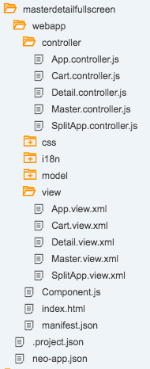

[ACCORDION-END]

[ACCORDION-BEGIN [Step 9: ](Adding a Base Controller )]
In this step, we will create a base controller which can be used to create any functionality that could be shared among other controllers.  

1.	Right click on the `webapp/controller` folder and choose New -> File from the right click menu.  
Provide the name: `BaseController.js`

And choose [OK].

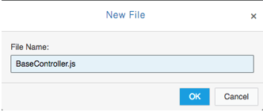

[ACCORDION-END]

[ACCORDION-BEGIN [Step 10: ](Add Base Controller Code)]
1.	Open the file `webapp/controller/BaseController.js`

Replace the contents of the file with

```
/*global history */
sap.ui.define([
		"sap/ui/core/mvc/Controller",
		"sap/ui/core/routing/History"
	], function (Controller, History) {
		"use strict";

		return Controller.extend("com.sap.aribaemployeerequisition.controller.BaseController", {
			/**
			 * Convenience method for accessing the router in every controller of the application.
			 * @public
			 * @returns {sap.ui.core.routing.Router} the router for this component
			 */
			getRouter : function () {
				return this.getOwnerComponent().getRouter();
			},

			/**
			 * Convenience method for getting the view model by name in every controller of the application.
			 * @public
			 * @param {string} sName the model name
			 * @returns {sap.ui.model.Model} the model instance
			 */
			getModel : function (sName) {
				return this.getView().getModel(sName);
			},

			/**
			 * Convenience method for setting the view model in every controller of the application.
			 * @public
			 * @param {sap.ui.model.Model} oModel the model instance
			 * @param {string} sName the model name
			 * @returns {sap.ui.mvc.View} the view instance
			 */
			setModel : function (oModel, sName) {
				return this.getView().setModel(oModel, sName);
			},

			/**
			 * Convenience method for getting the resource bundle.
			 * @public
			 * @returns {sap.ui.model.resource.ResourceModel} the resourceModel of the component
			 */
			getResourceBundle : function () {
				return this.getOwnerComponent().getModel("i18n").getResourceBundle();
			},

			/**
			 * Event handler for navigating back.
			 * It there is a history entry or an previous app-to-app navigation we go one step back in the browser history
			 * If not, it will replace the current entry of the browser history with the master route.
			 * @public
			 */
			onNavBack : function() {
				var sPreviousHash = History.getInstance().getPreviousHash(),
					oCrossAppNavigator = sap.ushell.Container.getService("CrossApplicationNavigation");

					if (sPreviousHash !== undefined || !oCrossAppNavigator.isInitialNavigation()) {
					history.go(-1);
				} else {
					this.getRouter().navTo("master", {}, true);
				}
			}

		});

	}
);
```

(The functions in the file mostly provide shorthand versions of commonly used access functions.)

[ACCORDION-END]

[ACCORDION-BEGIN [Step 11: ](Set the App Controller to Extend the Base Controller)]

1.	Open `webapp/App.controller.js` and change the file to extend from the `BaseController`:
•	Change the path on line 2 to the path of the `BaseController` file.
  Change
  `"sap/ui/core/mvc/Controller"`
  to
  `"com/sap/aribaemployeerequisition/controller/BaseController"`
•	Change the function parameter in line 4 from Controller to `BaseController`
•	Change the returned value in line 6 to extend from `BaseController`.

The above changes will provide the App Controller access to the functions defined within the `BaseController`.  

Your file should now resemble

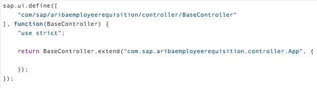

[ACCORDION-END]

[ACCORDION-BEGIN [Step 12: ](Set the Other Controllers to Extend the Base Controller)]

1.	Repeat step 11 to change the path, function parameter and returned value for all of the below controller files:
•	`FullScreen.controller.js`
•	`Master.controller.js`
•	`Detail.controller.js`
•	`SplitApp.controller.js`

[ACCORDION-END]

[ACCORDION-BEGIN [Step 13: ](Review Routes and Open Manifest
)]

Routes, which are defined in `manifest.json`, allow us to navigate between our views.   Routes are based on the URL hash and when a matching hash is found a specific target view will be shown on the screen.  


1.	Open the `webapp/manifest.json` file.  The first time you open this file, it will open in the Descriptor Editor (a visual editor). Switch to the Code Editor by clicking on the Code Editor tab in the bottom left corner of the editor screen.

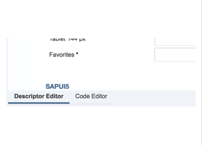

[ACCORDION-END]

[ACCORDION-BEGIN [Step 14: ](Review Manifest Structure)]

1.	The routes are part of the last top-level `"sap.ui5"` object defined. We will add new routes under the resources object.  

Using the menu option Search -> Find, search for "resources"

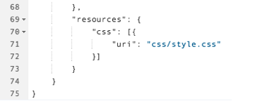

[ACCORDION-END]

[ACCORDION-BEGIN [Step 15: ](Prepare Manifest for Edit)]

Add a comma after the last curly brace of the resources object definition.

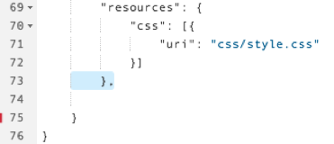

[ACCORDION-END]

[ACCORDION-BEGIN [Step 16: ](Add the Routes to the Manifest)]

1.	Copy the routing object shown below and place it in the `manifest.json` after the comma

```
"routing": {
			"config": {
				"routerClass": "sap.m.routing.Router",
				"viewType": "XML",
				"viewPath": "com.sap.aribaemployeerequisition.view",
				"controlId": "idAppControl",
				"controlAggregation": "pages",
				"bypassed": {
					"target": [
						"master"
					]
				},
				"async": true
			},
			"routes": [
				{
					"pattern": "",
					"name": "master",
					"target": [
						"object",
						"master"
					]
				},
				{
					"pattern": "item/{objectPath}",
					"name": "object",
					"target": [
						"master",
						"object"
					]
				},
				{
					"name": "fullscreen",
					"pattern": "fullscreen",
					"target": [
						"fullscreen"
					]
				}
			],
			"targets": {
				"master": {
					"viewName": "Master",
					"viewLevel": 1,
					"viewId": "master",
					"controlAggregation": "masterPages",
					"controlId": "idSplitAppControl",
					"parent": "splitview"
				},
				"object": {
					"viewName": "Detail",
					"viewId": "detail",
					"viewLevel": 2,
					"controlId": "idSplitAppControl",
					"controlAggregation": "detailPages",
					"parent": "splitview"
				},

				"fullscreen": {
					"viewName": "FullScreen",
					"viewId": "fullscreen"
				},
				"splitview": {
					"viewName": "SplitApp"
				}
			}
		}
```

The file should now resemble

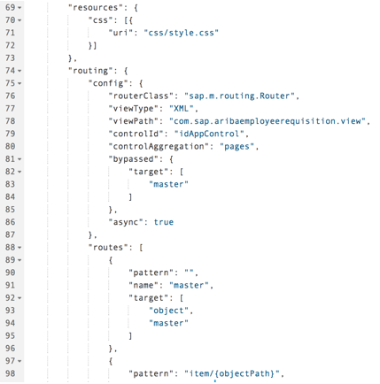


[ACCORDION-END]

[ACCORDION-BEGIN [Step 17: ](Initialize the Router)]

1.	Open the file `/webapp/Component.js` and add the following code to the init function

```
// create the views based on the url/hash
this.getRouter().initialize();
```


[ACCORDION-END]


[ACCORDION-BEGIN [Step 18: ](Edit the App View)]

1.	Open the file `/webapp/view/App.view.xml`
•	Replace the App node with the following

```
<App id="idAppControl" />
```

This view will be used to display the the full screen view.

The id is used by the routing to determine what views are placed within the app view.  In the routing, this is defined with the `controlId` property.  

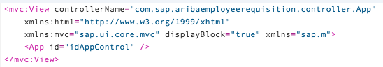

[ACCORDION-END]

[ACCORDION-BEGIN [Step 19: ](Set App View's Busy Properties)]

1.	In the `app.view.xml` file, add the following properties to the view
```
busy="{appView>/busy}"
busyIndicatorDelay="{appView>/delay}"
```

the `busy` and `busyIndicatorDetail` property are used to show a busy indicator when the app is processing data requests


[ACCORDION-END]

[ACCORDION-BEGIN [Step 20: ](Edit SplitApp View)]

1.	Open the file `/webapp/view/SplitApp.view.xml` and replace the App node with the following

```
<SplitApp id="idSplitAppControl" />
```

This view will be used to display the Master-Detail views within it.

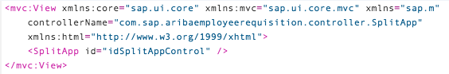


[ACCORDION-END]

[ACCORDION-BEGIN [Step 21: ](Set SplitApp View's Busy Properties)]

1.	Add the following properties to the view
```
busy="{appView>/busy}"
busyIndicatorDelay="{appView>/delay}"
```

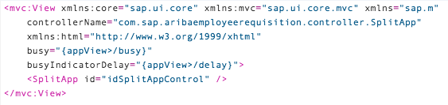

[ACCORDION-END]

[ACCORDION-BEGIN [Step 22: ](Define the Master View)]

1.	Open the file `/webapp/view/Master.view.xml` and replace the contents of the view with

```
<mvc:View xmlns:core="sap.ui.core" xmlns:mvc="sap.ui.core.mvc" xmlns="sap.m" xmlns:semantic="sap.m.semantic"
	controllerName="com.sap.aribaemployeerequisition.controller.Master" xmlns:html="http://www.w3.org/1999/xhtml">
	<semantic:MasterPage id="page" title="{masterView>/title}" navButtonPress="onNavBack" showNavButton="true">
		<semantic:content>
		</semantic:content>
	</semantic:MasterPage>
</mvc:View>
```

[ACCORDION-END]


[ACCORDION-BEGIN [Step 23: ](Define the Detail View)]

1.	Open the file `/webapp/view/Detail.view.xml` and replace the contents of the view with

```
<mvc:View xmlns:core="sap.ui.core" xmlns:mvc="sap.ui.core.mvc" xmlns="sap.m" xmlns:semantic="sap.m.semantic"
	controllerName="com.sap.aribaemployeerequisition.controller.Detail" xmlns:html="http://www.w3.org/1999/xhtml">
		<semantic:DetailPage id="page" navButtonPress="onNavBack" showNavButton="{device>/system/phone}"
		title="{i18n>detailTitle}" busy="{detailView>/busy}" busyIndicatorDelay="{detailView>/delay}">
		<semantic:customHeaderContent>
			<Button press="openFullScreenView" id="cartIcon" text="" icon="sap-icon://cart"/>
		</semantic:customHeaderContent>
		<semantic:content>
		</semantic:content>
	</semantic:DetailPage>
</mvc:View>
```

[ACCORDION-END]

[ACCORDION-BEGIN [Step 24: ](Define the FullScreen View)]

1.	Open the file `/webapp/view/Detail.view.xml` and replace the contents of the view with

```
<mvc:View xmlns:core="sap.ui.core" xmlns:mvc="sap.ui.core.mvc" xmlns="sap.m" xmlns:semantic="sap.m.semantic"
	controllerName="com.sap.aribaemployeerequisition.controller.FullScreen" xmlns:html="http://www.w3.org/1999/xhtml">
	<semantic:FullscreenPage title="{i18n>fullScreenTitle}" showNavButton="true" navButtonPress="onNavButtonPress" id="FullScreenApp">
	</semantic:FullscreenPage>
</mvc:View>
```

[ACCORDION-END]

[ACCORDION-BEGIN [Step 24: ](Add the Code to Navigate to the Fullscreen View)]

1.	Open the file `/webapp/controller/Detail.controller.xml` and add the function to navigate to the full screen view.

```
//navigates to the fullscreen view
openFullScreenView: function(){
  this.getRouter().navTo("fullscreen");
},
```

[ACCORDION-END]

[ACCORDION-BEGIN [Step 25: ](Add the code in the Fullscreen View to navigate to the Master Detail Views)]

1.	Open the file `/webapp/controller/FullScreen.controller.js` and add the function

```
//navigates back to the master/detail views
  onNavButtonPress: function() {
    this.getRouter().navTo("master");
  },
```
Make sure you have saved all of the changes.

[ACCORDION-END]

[ACCORDION-BEGIN [Step 26: ](Test Your Application)]

1.	Right click on your project and choose the option `Run -> Run index.html`

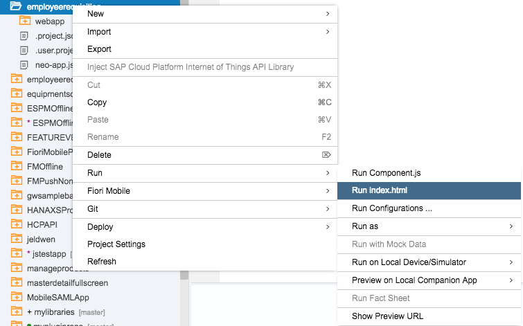

Your app should now load.  Verify that the navigation to the full screen and back to the master detail views work as expected.

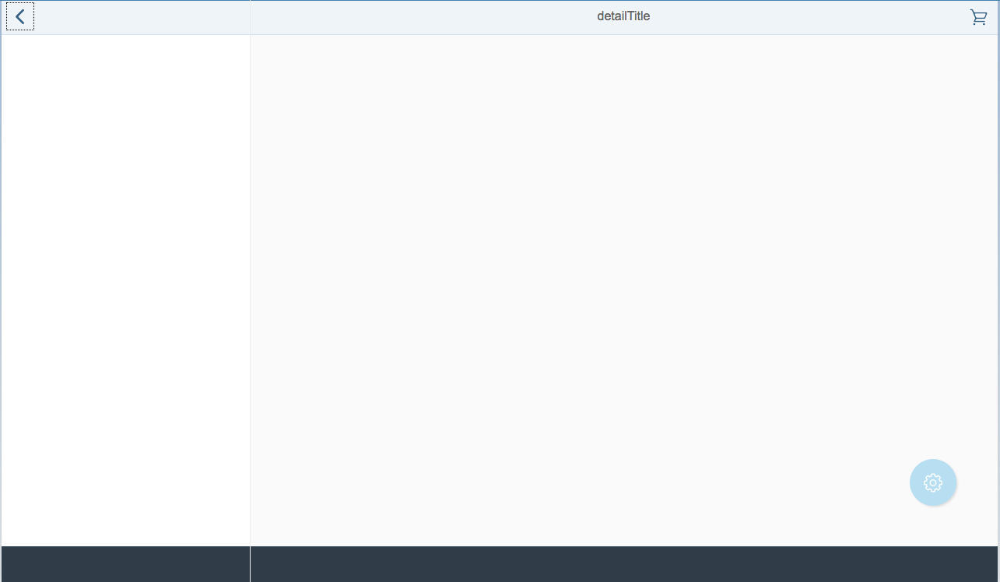

[ACCORDION-END]
