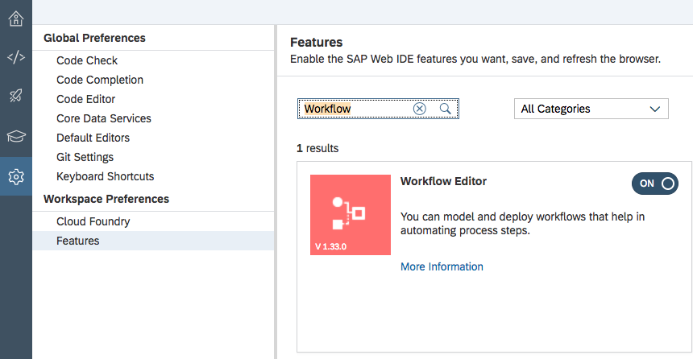
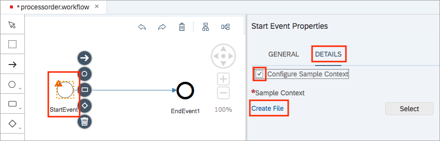
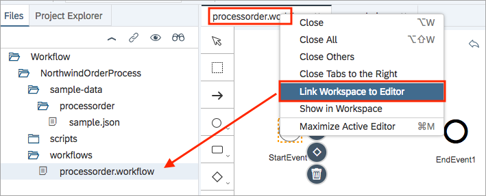
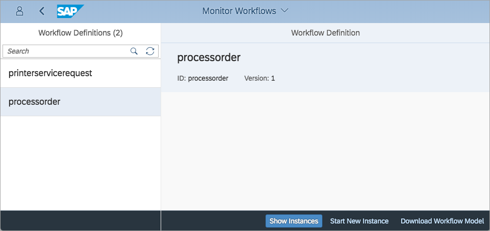
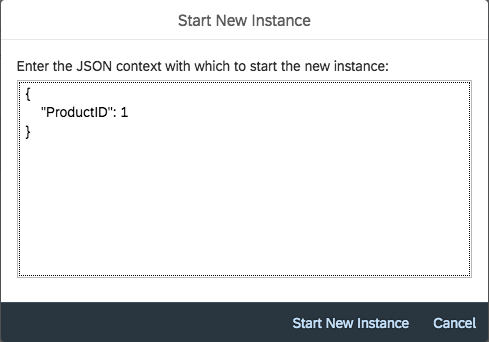
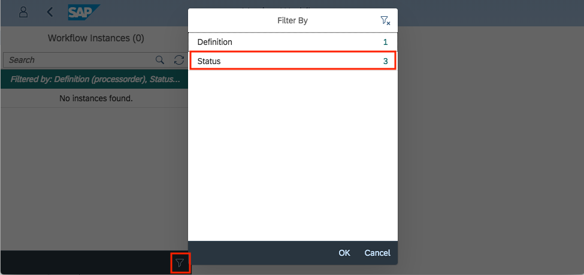
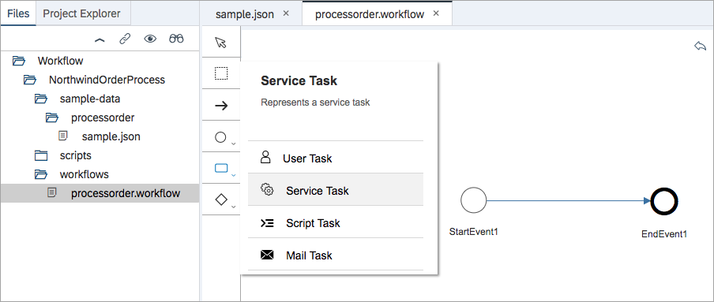
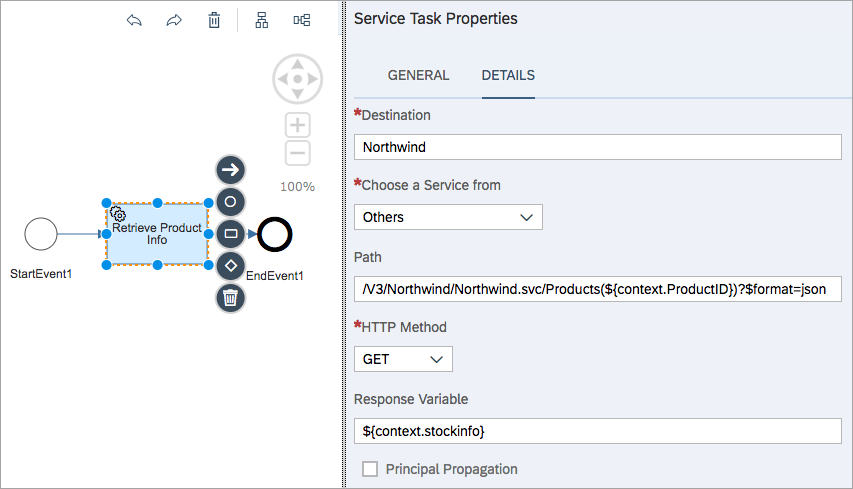
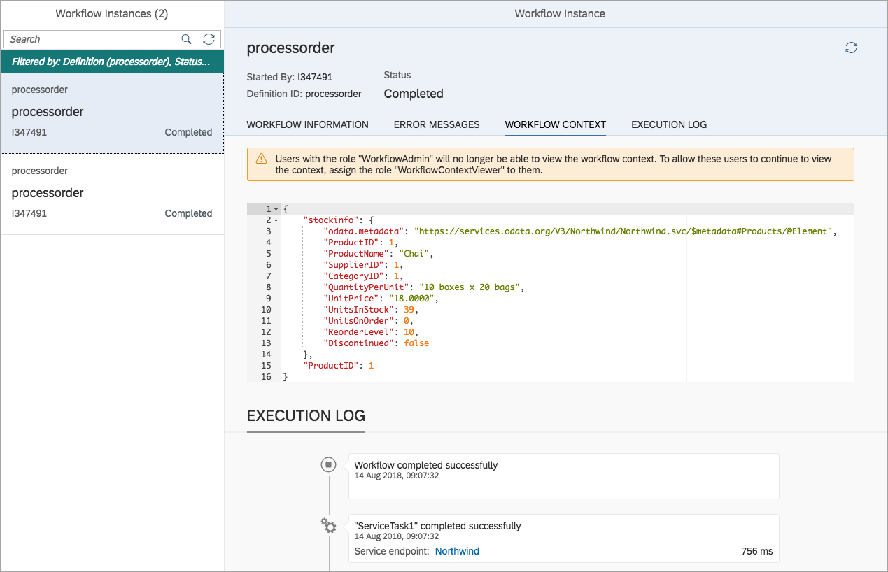

## Prerequisites  
- **Tutorials:** [Create a Destination for the Northwind OData Services](https://developers.sap.com/tutorials/hcp-create-destination.html)

## Details
### You will learn
- What service tasks are and how to use them
- How service tasks and destinations are connected
- How to access properties in a workflow's context

This tutorial assumes you've already completed the tutorials in the group [Get started with SAP Cloud Platform workflows](https://developers.sap.com/group.cp-workflow-service.html). This means you're familiar with general Workflow service concepts, the workflow definition tooling in SAP Web IDE, and you have the `MyInbox` and `Workflow Monitor` apps set up on an SAP Fiori launchpad site on the Portal service.

It also assumes you have set up a Connectivity service destination for Northwind OData services, as described in [Create a Destination for the Northwind OData Services](https://developers.sap.com/tutorials/hcp-create-destination.html).

You will use one of the [Northwind OData services](https://services.odata.org) as the external service in this tutorial, creating a simple workflow that queries for product information in a hypothetical order processing situation.

> In this tutorial and others the general name "SAP Web IDE" is used. Specifically, the "Full Stack" version is implied throughout.

---

[ACCORDION-BEGIN [Step 1: ](Start up SAP Web IDE)]

Access the SAP Web IDE from your trial SAP Cloud Platform cockpit. Use the details in the tutorial [Enable the SAP Web IDE Full Stack](https://developers.sap.com/tutorials/webide-multi-cloud.html) to find out how to access it, or simply invoke it using a URL which will look like this:

`https://webidecp-XYZ.dispatcher.hanatrial.ondemand.com/`

Here, `XYZ` represents your trial subaccount name, such as `p999999trial`.

You can find out more about accessing the SAP Web IDE in the Help Portal, specifically in the "[Open SAP Web IDE](https://help.sap.com/viewer/825270ffffe74d9f988a0f0066ad59f0/CF/en-US/51321a804b1a4935b0ab7255447f5f84.html)" section.

[DONE]
[ACCORDION-END]

[ACCORDION-BEGIN [Step 2: ](Initiate a new project from template)]

Once you start the SAP Web IDE, use menu path

**File** > **New** > **Project from Template**

and you'll be presented with a multi-step wizard.

In the **Template Selection** step, choose the category **Business Process Management**, select the **Workflow Project** application template and proceed with **Next**.


> If you can't find the **Business Process Management** category, check **Preferences** perspective > **Workspace Preferences** > **Features** to make sure you have the Workflow Editor feature turned on.

> 

[DONE]
[ACCORDION-END]

[ACCORDION-BEGIN [Step 3: ](Enter basic information and workflow details)]

There's actually very little you need to provide in the rest of the wizard. In the steps indicated, provide the information as shown, and then select **Finish** to end the wizard.

| Step              | Field        | Value
| :---------------- |:------------ | :-------------
| Basic Information | Project Name | **`NorthwindOrderProcess`**
| Workflow Details  | Name         | **`processorder`**
|                   | Description  | **`Process an incoming order`**

> The value for the **Name** field will become the technical name of the workflow definition, which will form part of the definition's filename and be used to refer to the definition in the `Monitor Workflows` app and when using the [Workflow API](https://api.sap.com/api/SAP_CP_Workflow).

[DONE]
[ACCORDION-END]


[ACCORDION-BEGIN [Step 4: ](Specify sample context data)]

In the tutorial [Add a user task to your workflow](https://developers.sap.com/tutorials/cp-workflow-add-usertask.html), you will have seen the standard sample book data that is presented automatically when initiating a workflow instance in the `Monitor Workflows` app.


This data won't be relevant for all workflow definitions, so it's possible to define sample data at the workflow definition level, which will override this sample book data. Do this now, by selecting the **Start Event** in the definition, choosing the **Details** tab in the properties, checking the **Configure Sample Context** checkbox, and selecting the **Create File** link.



In the **Create New File** dialog box that appears, specify the filename **`sample.json`** and select **Create**. A new file is created within the project, and is opened automatically in the editor. You'll see that it initially contains the standard sample book data.

Replace the contents of this file with the following:

```javascript
{
    "ProductID": 1
}
```

> This is JSON format. Take care to specify everything exactly as shown.

The idea of this simple order scenario is that this workflow definition will be triggered by the receipt of a very simple incoming order, with a JSON payload that specifies the ID of the product required.

Note that the sample data file is created in a special folder, relating to the specific workflow definition. Expand the project's folder structure in the workspace to see it.

Make sure you save the workflow definition and the `sample.json` file. You can use the menu path **File** > **Save All** to achieve this.

[VALIDATE_4]
[ACCORDION-END]

[ACCORDION-BEGIN [Step 5: ](Deploy the definition to the Workflow service)]

At this point the workflow definition doesn't do anything, but we can still check to see that the sample data is available when we want to initiate workflow instances. You should also learn how to find completed workflows in the `Monitor Workflows` apps. As it stands right now, when an instance of the workflow definition is initiated, it will move to a completed state pretty much immediately.

Find the file where the workflow definition is stored -- this is the technical name of the workflow, followed by a workflow extension, i.e., **`processorder.workflow`**. A quick way of finding it in the folder structure is to use the context menu on the workflow definition editor tab and select **Link Workspace to Editor**, whereupon the file will be revealed.



Use the context menu on the filename and select **Deploy** > **Deploy to SAP Cloud Platform Workflow**.

A message will appear noting that deployment was successful. If it was not successful, check for any issues in the Problems view (via main menu path **View** > **Problems**).

[DONE]
[ACCORDION-END]


[ACCORDION-BEGIN [Step 6: ](Initiate a workflow instance)]

It's now time to test out the simple definition by creating an instance of it. The `Monitor Workflows` app in your Fiori launchpad that you set up in the tutorial [Add a user task to your workflow](https://developers.sap.com/tutorials/cp-workflow-add-usertask.html) is what you'll need.

Use the instructions in the first step of this tutorial to get to your default Fiori launchpad site. Alternatively, if the launchpad site was your first site with the Portal service and you chose default settings, your site URL will look like this, and you can go straight to it in the browser:

`https://flpportal-XYZ.dispatcher.hanatrial.ondemand.com/sites`

Here, `XYZ` represents your trial subaccount name, such as `p999999trial`.


Start the **Monitor Workflows - Workflow Definitions** app and select your **`processorder`** definition. In the following screenshot there are two workflow definitions -- all your deployed definitions will be listed here.



> The definition version is incremented each time you deploy it. Here you can see that the `processorder` definition is at version 1.

Select the **Start New Instance** button and note that in the dialog box that's shown, you're presented with an editable version of the sample data you specified in the `sample.json` file.



Choose **Start New Instance** and then select the **Show Instances** button. By default, the list of instances excludes those in "Completed" status, so you may start out with an empty list. Select the filter icon at the bottom of the list and then select the **Status** entry to be able to include **Completed**. Select **OK** when you've done that to dismiss the dialog box.



You should now see the instance displayed. Select the **WORKFLOW CONTEXT** tab as shown to see the data stored in the context of this particular instance; at this point, you won't be surprised to see that the only data in there is the data that was specified when the instance was initiated.

Below the WORKFLOW CONTEXT is the EXECUTION LOG, which shows a trail of every step that the workflow instance has been upon, in reverse order. In this case it was just two steps, representing the start and completion of the workflow.

> If you restart the app, for example by refreshing the browser tab, the filter will of course reset to the defaults, and completed instances will be excluded from the display again.

[VALIDATE_6]
[ACCORDION-END]

[ACCORDION-BEGIN [Step 7: ](Call an external service via a service task)]

It's now time to enhance the workflow definition and add a step to call an external service. The service you'll use is an Northwind OData service that you explored in [Learn about OData fundamentals](https://developers.sap.com/tutorials/odata-01-intro-origins.html):

<https://services.odata.org/V3/Northwind/Northwind.svc/>

This service contains a `Products` entity set which you'll use in this step. The idea is to call this service looking for a particular `Product` entity, using whatever product ID is specified when the workflow instance is instantiated (in the sample data, the value of the `ProductID` property is set to 1). The results of calling the service will be the entity and all its properties, which you'll store in the workflow context.

As an example, look at this URL:

<https://services.odata.org/V3/Northwind/Northwind.svc/Products(1)>

If you select this URL now, you'll see the details of the product with the ID 1. By default this OData service returns entities in the XML format, but you can ask for JavaScript Object Notation (JSON) format using the `$format=json` specification thus:

<https://services.odata.org/V3/Northwind/Northwind.svc/Products(1)?$format=json>

This will return data that looks like this:

```
{
    odata.metadata: "https://services.odata.org/V3/Northwind/Northwind.svc/$metadata#Products/@Element",
    ProductID: 1,
    ProductName: "Chai",
    SupplierID: 1,
    CategoryID: 1,
    QuantityPerUnit: "10 boxes x 20 bags",
    UnitPrice: "18.0000",
    UnitsInStock: 39,
    UnitsOnOrder: 0,
    ReorderLevel: 10,
    Discontinued: false,
}
```

You'll need JSON, rather than XML, as the context storage is JavaScript based.

Back in SAP Web IDE, make sure you're editing the **`processorder.workflow`** definition, and select a new **Service Task** as shown:



Place the Service Task between the start and end events, and modify its **GENERAL** properties thus:

| Field          | Value
| :------------- | :-------------
| Name           | **`Retrieve Product Info`**
| Documentation  | **`Call Northwind service for product information`**

In the **DETAILS** properties tab, specify the following (leave as-is any field not specified here):

| Field              | Value
| :----------------- | :-------------
| Destination        | **`Northwind`**
| Path               | **`/V3/Northwind/Northwind.svc/Products(${context.ProductID})?$format=json`**
| HTTP Method        | **`GET`**
| Response Variable  | **`${context.stockinfo}`**



Use menu path **File** > **Save** to save these values.

Taking the values one at at time, here are the explanations:

- `Northwind` is the name of the destination that you set up in [Create a Destination for the Northwind OData Services](https://developers.sap.com/tutorials/hcp-create-destination.html).
- The path specification is the relative URL for the version 3 Northwind OData service, specifically requesting an individual `Product` entity. The specification of an individual entity is done with a combination of the entity set name (`Products`) followed by the value of the key property, in brackets. Here the value is dynamically inserted from the `ProductID` property in the workflow context. The expression style used (`${context.ProductID}`) is described in the Workflow service documentation in the Help Portal under the [Configure Service Tasks](https://help.sap.com/viewer/f85276c5069a429fa37d1cd352785c25/Cloud/en-US/a8a6267f537841fbb22c159ba2af8835.html) topic. Note the `$format` system query option requesting JSON format in the response - this is so the response can be stored in the context.
- The HTTP Method is `GET`, used for either an OData query or read operation. Because of the specification of a specific entity in the URL, this is a read operation.
- The response data must be stored in the workflow context, and `${context.stockinfo}` states that it should be stored in the context's `stockinfo` property.

> To keep things simple, there is deliberately no error checking in case the ID specified relates to a non-existent product.

**Re-deploy the workflow definition** to the SAP Cloud Platform Workflow service in the same way you did earlier in this tutorial.

[VALIDATE_7]
[ACCORDION-END]

[ACCORDION-BEGIN [Step 8: ](Create a new workflow instance and inspect the results)]

In the same way as you did earlier, go to the **Monitor Workflows - Workflow Definitions** app in your launchpad site and select your `processorder` workflow definition. Note that the version number has been incremented. Start a new instance by clicking **Start New Instance**, leaving the sample data specification of `1` for the `ProductID` as it is.

Switch to the **Monitor Workflows - Workflow Instances** app again, which you can do either by clicking **Show Instances** from where you are, or by selecting the appropriate tile on the launchpad. In the app, add the status **`Completed`** to the filter as you did before, unless it's still there from earlier on in this tutorial.

> Actually both `Monitor Workflow - Workflow Definitions` and `Monitor Workflow - Workflow Instances` are the same app underneath (it's called `bpmworkflowmonitor`). If you're interested to see how this works, look at the hash path in the URL and how it changes between the two modes (`DisplayDefinitions` vs. `DisplayInstances`).

You'll see the previous instance from an earlier step, and also this new instance:



In the new instance, which should be at the top of the list, select the **WORKFLOW CONTEXT** tab again, and you'll see the results of the service call. The product information for `ProductID` 1 has been successfully retrieved from this external service and stored in the context.

[VALIDATE_8]
[ACCORDION-END]
