## Details
### You will learn
- What is required to provide a UI for a user task
- How a simple UI5 app can provide a basic UI for user tasks
- What script tasks are and how to reference the workflow context within them

In the tutorial [Add a user task to your workflow](https://www.sap.com/developer/tutorials/cp-workflow-add-usertask.html) within the beginner tutorial group [Get started with SAP Cloud Platform workflows](https://www.sap.com/developer/groups/cp-workflow-service.html) you added a basic user task to the workflow definition, and in the user interface details you specified dummy entries (`test`) which caused a default task display mechanism to be used in the `MyInbox` app.

In this tutorial, you'll create and deploy a simple UI5 app that can be used in place of this default mechanism. The app has just enough functionality for you to display information from within the contexts of your running workflow instances, and to allow decisions by marking the tasks as **Complete** (which would move the instances on from the user task into the status **Completed**, in the case of this workflow definition).

You'll then reference this deployed UI5 app in the user interface details, instead of providing dummy information.

> In this tutorial and others the general name "SAP Web IDE" is used. Specifically, the "Full Stack" version is implied throughout.

This is what you're aiming for, that is, what a user task will look like in `MyInbox` with this simple UI5 app:

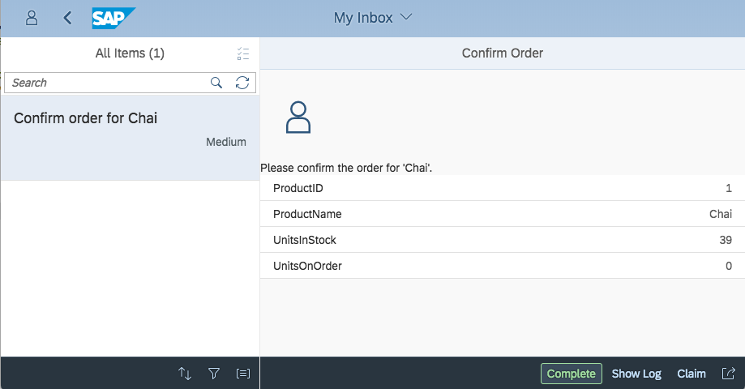

---

[ACCORDION-BEGIN [Step 1: ](Start up SAP Web IDE)]

Access the SAP Web IDE from your trial SAP Cloud Platform cockpit. Use the details in the tutorial [Enable the SAP Web IDE Full Stack](https://www.sap.com/developer/tutorials/webide-multi-cloud.html) to find out how to access it, or simply invoke it using a URL, which will look like this:

`https://webidecp-XYZ.dispatcher.hanatrial.ondemand.com/`

Here, `XYZ` represents your trial subaccount name, such as `p999999trial`.

You can find out more about accessing the SAP Web IDE in the Help Portal, specifically in the "[Open SAP Web IDE](https://help.sap.com/viewer/825270ffffe74d9f988a0f0066ad59f0/CF/en-US/51321a804b1a4935b0ab7255447f5f84.html)" section.

Once you're in SAP Web IDE, ensure you're in the workspace containing your `NorthwindOrderProcess` project that you started working on in the previous tutorial [Create a workflow definition using an external service].

[DONE]
[ACCORDION-END]


[ACCORDION-BEGIN [Step 2: ](Create the skeleton of a new app)]

In this step you'll create the folder for the simple UI5 app that is to be used as the generic UI for user tasks in the workflow. Instead of using the SAP Web IDE's template wizard to get started, just create a new folder at the top level of your workspace, and then add a file within it:

- Create a folder called **`genericusertask`**
- Create a file within that folder called **`neo-app.json`**

Inside the `neo-app.json` file, add the following and save the file:

```javascript
{
  "routes": [
    {
      "path": "/resources",
      "target": {
        "type": "service",
        "name": "sapui5",
        "entryPath": "/resources"
      },
      "description": "SAPUI5 Resources"
    },
    {
      "path": "/test-resources",
      "target": {
        "type": "service",
        "name": "sapui5",
        "entryPath": "/test-resources"
      },
      "description": "SAPUI5 Test Resources"
    },
    {
      "path": "/bpmworkflowruntime",
      "target": {
        "type": "destination",
        "name": "bpmworkflowruntime",
        "entryPath": "/workflow-service"
      },
      "description": "Workflow Runtime REST API"    
    }
  ]
}
```

This file is known as the [Application Descriptor File](https://help.sap.com/viewer/65de2977205c403bbc107264b8eccf4b/Cloud/en-US/aed1ffa3f3e741b3a4573c9e475aa2a4.html) and here contains a list of route mappings, based on the start of relative URL paths. Briefly, the mappings are:

- Requests to URLs starting `/resources` (for UI5 runtime artefacts) or `/test-resources` (for UI5 support artefacts) are routed to the appropriate entry paths within the `sapui5` service
- Requests to URLs starting `/bpmworkflowruntime` are routed to the root of the [Workflow API](https://api.sap.com/api/SAP_CP_Workflow/overview) via the `bpmworkflowruntime` destination

The `bpmworkflowruntime` destination will have been set up automatically for you in the Connectivity service within your trial account when you enabled the Workflow service in [Prepare to create workflows in SAP Cloud Platform](https://www.sap.com/developer/tutorials/cp-workflow-getting-started.html). If you want to check, it should look something like this:

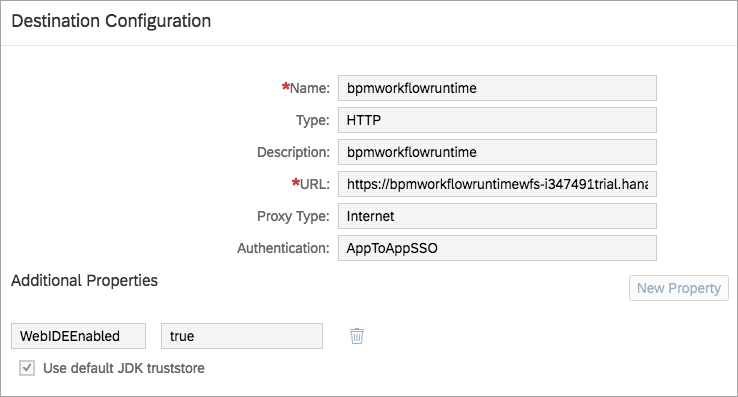

At the end of this step, your `genericusertask` project should look like this:

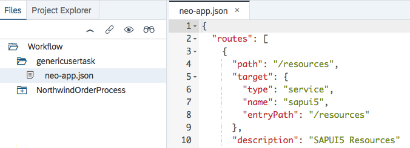

[VALIDATE_2]
[ACCORDION-END]


[ACCORDION-BEGIN [Step 3: ](Define the app's Component.js)]

In a UI5 app, the `Component.js` file is usually the key executable artefact and this is what you'll define next. App artefacts, by convention, are normally found in a folder called `webapp`.

Within the **`genericusertask`** project folder, use the context menu to create a new folder called **`webapp`**, and then within that create a file called **`Component.js`**.

> All the folder and file names are case sensitive, so create them exactly as shown.

Copy the following code into the new `Component.js` file and save it:

```javascript
sap.ui.define([
	"sap/ui/core/UIComponent",
	"sap/ui/Device",
	"sap/ui/model/json/JSONModel"
], function(UIComponent, Device, JSONModel) {
	"use strict";

	return UIComponent.extend("tutorial.genericusertask.Component", {

		metadata: {
			manifest: "json"
		},

		init: function() {
			UIComponent.prototype.init.apply(this, arguments);
			this.getRouter().initialize();

			this.setModel(new JSONModel(Device).setDefaultBindingMode("OneWay"), "device");
			this.setModel(new JSONModel({taskDescription:""}), "app");

			// get task data
			var startupParameters = this.getComponentData().startupParameters;
			var taskModel = startupParameters.taskModel;
			var taskData = taskModel.getData();
			var taskId = taskData.InstanceID;

			// initialize model
			var contextModel = new JSONModel("/bpmworkflowruntime/rest/v1/task-instances/" + taskId + "/context")
				.attachRequestCompleted(function(oEvent) {
					// Create an array of property/value pairs for generic display in the UI
					var oModel = oEvent.getSource(),
						mControl = oModel.getProperty("/genericusertask/control"),
						mSource = oModel.getProperty(mControl.source),
						aFormData = mControl.properties.map(function(sProperty) {
							return {
								property: sProperty,
								value: mSource[sProperty]
							};
						});
					oModel.setProperty("/genericusertask/formItems", aFormData);
				});
			this.setModel(contextModel);

			// Ensure we have access to the Inbox API before continuing
			// (we don't except when running within the My Inbox context, ie
			// when running "for real", rather than in test mode).
			if (startupParameters.inboxAPI) {

				// get the task description
				var appModel = this.getModel("app");
				startupParameters.inboxAPI.getDescription("NA", taskId)
					.done(function(data){
	                	appModel.setProperty("/taskDescription", data.Description);
					})
					.fail(function(errorText){
	                	jQuery.sap.require("sap.m.MessageBox");
	                	sap.m.MessageBox.error(errorText, { title: "Error"});
	        		});

				//add actions
				startupParameters.inboxAPI.addAction({
					type: "Accept",
					label: "Complete"
				}, function() {
					this._completeTask(taskId, true);
				}, this);

			}
		},

		// Taken mostly straight out of the "Book Approval" tutorial for now
		_completeTask: function(taskId) {
			var token = this._fetchToken();
			$.ajax({
				url: "/bpmworkflowruntime/rest/v1/task-instances/" + taskId,
				method: "PATCH",
				contentType: "application/json",
				async: false,
				data: JSON.stringify({
					status: "COMPLETED",
					context: this.getModel().getData()
				}),
				headers: {
					"X-CSRF-Token": token
				}
			});
			this._refreshTask(taskId);
		},

		_fetchToken: function() {
			var token;
			$.ajax({
				url: "/bpmworkflowruntime/rest/v1/xsrf-token",
				method: "GET",
				async: false,
				headers: {
					"X-CSRF-Token": "Fetch"
				},
				success: function(result, xhr, data) {
					token = data.getResponseHeader("X-CSRF-Token");
				}
			});
			return token;
		},

		_refreshTask: function(taskId) {
			this.getComponentData().startupParameters.inboxAPI.updateTask("NA", taskId);
		}


	});
});
```

Very briefly, here's a summary of what's going on in this file, specifically in the section that is invoked when the component starts up (the `init` function):

- Information about the specific workflow instance is retrieved from the startup parameters; this information includes a reference to the instance that this app will be used to display, within the `MyInbox` app.
- A request is then made to the Workflow API to retrieve the context relating to the user task in question.
- This data is then marshalled into a tabular structure of values that can be displayed in a simple form to the user task recipient; the values are for properties that you'll specify in a control block later on in this tutorial.
- The task description is retrieved via the Inbox API (see the SAP Help Portal topic [My Inbox UI Integration API Reference](https://help.sap.com/viewer/f85276c5069a429fa37d1cd352785c25/Cloud/en-US/9c4a1a63663246ef9f3ddbc3c9d1c0a2.html) for more details on this).
- A **Complete** button is added as an action button.

So when the initialization of this app's component is complete, everything is ready to show to the user task recipient, and to enable them to complete the task with the appropriate action button.

Don't forget to save the file!

[DONE]
[ACCORDION-END]


[ACCORDION-BEGIN [Step 4: ](Add the main view for the app)]

The app needs a UI to display the information to the user, in a simple form that you saw in the screenshot at the start of this tutorial.

Create a new file **`Main.view.xml`** in the **`webapp`** folder.

> Filenames are case sensitive, ensure you pay attention when entering this and other filenames.

Into this file, copy the following, and then save the file:

```xml
<mvc:View
	displayBlock="true"
	xmlns:mvc="sap.ui.core.mvc"
	xmlns="sap.m">
	<App id="idAppControl">
		<pages>
			<Page
				showHeader="false">
				<content>
					<ObjectHeader
						icon="sap-icon://person-placeholder" />
					<Text
						text="{app>/taskDescription}" />
					<List
						items="{/genericusertask/formItems}">
						<items>
							<DisplayListItem label="{property}" value="{value}" />
						</items>
					</List>
 				</content>
			</Page>
		</pages>
	</App>
</mvc:View>
```

Briefly, this XML view definition describes the main UI, with a person icon, the user task description, and a list of properties (with their names and values). These properties are marshalled in the `Component.js`, based on some configuration you'll add shortly.

[DONE]
[ACCORDION-END]

[ACCORDION-BEGIN [Step 5: ](Add the app's manifest.json file)]

The app's `manifest.json` file is the third and final artefact that's needed. It contains all the app's configuration settings, including model and routing information. You can read more about the `manifest.json` file in the UI5 documentation, specifically in the [Descriptor for Applications, Components, and Libraries](https://ui5.sap.com/#/topic/be0cf40f61184b358b5faedaec98b2da) section.

Create a file **`manifest.json`** within the **`webapp`** folder, copy the following into it, and save it:

```javascript
{
	"_version": "1.8.0",
	"sap.app": {
		"id": "tutorial.genericusertask",
		"type": "application",
		"applicationVersion": {
			"version": "1.0.0"
		},
		"title": "{{appTitle}}",
		"description": "{{appDescription}}",
		"sourceTemplate": {
			"id": "ui5template.basicSAPUI5ApplicationProject",
			"version": "1.40.12"
		}
	},
	"sap.ui": {
		"technology": "UI5",
		"icons": {
			"icon": "",
			"favIcon": "",
			"phone": "",
			"phone@2": "",
			"tablet": "",
			"tablet@2": ""
		},
		"deviceTypes": {
			"desktop": true,
			"tablet": true,
			"phone": true
		},
		"supportedThemes": [
			"sap_hcb",
			"sap_belize"
		]
	},
	"sap.ui5": {
		"rootView": {
			"viewName": "tutorial.genericusertask.Main",
			"type": "XML"
		},
		"dependencies": {
			"minUI5Version": "1.30.0",
			"libs": {
				"sap.ui.layout": {},
				"sap.ui.core": {},
				"sap.m": {}
			}
		},
		"contentDensities": {
			"compact": true,
			"cozy": true
		},
		"routing": {
			"config": {
				"routerClass": "sap.m.routing.Router",
				"viewType": "XML",
				"async": true,
				"viewPath": "tutorial.genericusertask",
				"controlAggregation": "pages",
				"controlId": "idAppControl"
			},
			"routes": [
				{
					"name": "RouteView1",
					"pattern": "RouteView1",
					"target": [
						"TargetView1"
					]
				}
			],
			"targets": {
				"TargetView1": {
					"viewType": "XML",
					"transition": "slide",
					"clearAggregation": true,
					"viewName": "View1"
				}
			}
		}
	},
	"sap.platform.hcp": {
		"uri": "webapp",
		"_version": "1.1.0"
	}
}
```

Your app folder structure should now look like this:

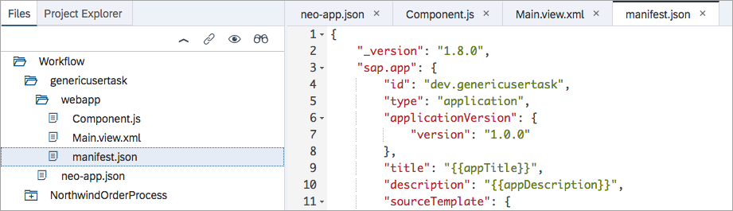

[DONE]
[ACCORDION-END]

[ACCORDION-BEGIN [Step 6: ](Deploy the app to SAP Cloud Platform)]

The app must be deployed to SAP Cloud Platform in order to be able to be referenced and used. Do this now, by using the context menu on the project folder and choosing menu path **Deploy** > **Deploy to SAP Cloud Platform**.

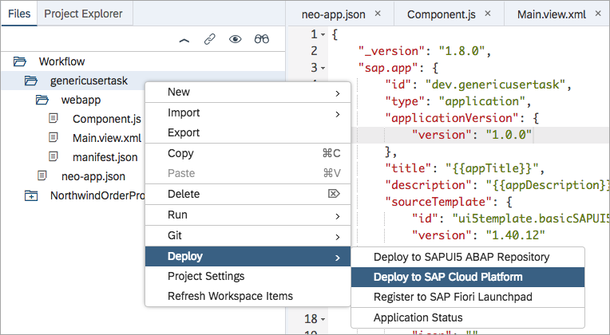

In the **Deploy Application to SAP Cloud Platform** dialog, leave all the settings as they are, and select **Deploy**.

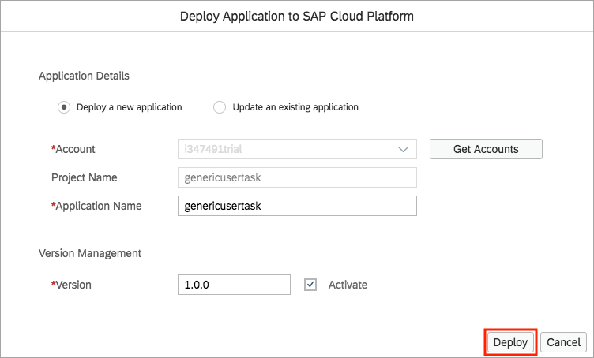

> You may be presented with a **Login to SAP Cloud Platform** dialog box. If so, enter your credentials to continue.

After a short time, you are notified that the deployment is complete.

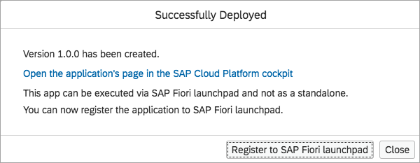

Just select **Close** here. The app does not need to be registered to a launchpad to be usable within the `MyInbox` app.

[DONE]
[ACCORDION-END]


[ACCORDION-BEGIN [Step 7: ](Create a user task in the workflow definition)]

Now that you have the `genericusertask` app deployed to SAP Cloud Platform, you can use it in the specification of a user task in the workflow definition. Find and open the workflow definition file **`processorder.workflow`** in your **`NorthwindOrderProcess`** project.

As a reminder, this is what your workflow definition looks like right now:

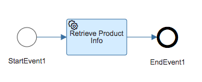

Use the menu in the workflow editor to add a user task. Place it to come after the **Retrieve Product Info** service task in the definition's flow.

> You may want to stretch the end event out to make room for the new user task, as shown in the screenshot.

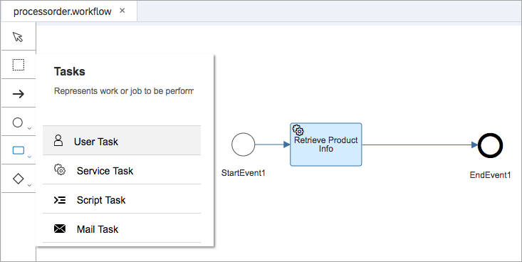

In the user task properties, specify the following (values for properties not mentioned here will be set to some defaults, and you should leave those as they are).

In the **GENERAL** section:

| Field        | Value
|:------------ | :-------------
| Name         | **`Confirm Order`**

In the **DETAILS** section:

| Field        | Value
|:------------ | :-------------
| Subject      | **`Confirm order for ${context.stockinfo.ProductName}`**
| Description  | **`Please confirm the order for '${context.stockinfo.ProductName}'.`**
| Users        | (Your trial user name, e.g. P999999 - use upper case for the initial letter)

> You will have encountered expressions like those in this section in the previous tutorial [Create a workflow definition using an external service]. Find out more about these expressions in the SAP Help Portal, under the [Configure Service Tasks](https://help.sap.com/viewer/f85276c5069a429fa37d1cd352785c25/Cloud/en-US/a8a6267f537841fbb22c159ba2af8835.html) topic.

In the **USER INTERFACE** section:

| Field            | Value
|:--------------   | :-------------
| HTML5 App Name   | **`genericusertask`**
| Component Name   | **`webapp`**
| SAPUI5 Component | **`tutorial.genericusertask`**

Now save the workflow definition.

The values you've specify here relate directly to the app you've just deployed:

- The `genericusertask` name is the name of the app itself, now available in SAP Cloud Platform
- `webapp` is where (i.e. in which folder) the app's component is to be found
- The component's name, including its namespace prefix, is `tutorial.genericusertask` - you can see this name in the `Component.js` file earlier in this tutorial

[DONE]
[ACCORDION-END]


[ACCORDION-BEGIN [Step 8: ](Use a script task to configure the user task settings)]

At this point, if you were to re-deploy the workflow definition as it stands, with the service task and the user task, the workflow would function, and the user task recipient (you) would receive an item in the `MyInbox` app.

However, there would be no detail displayed. It would look like this:

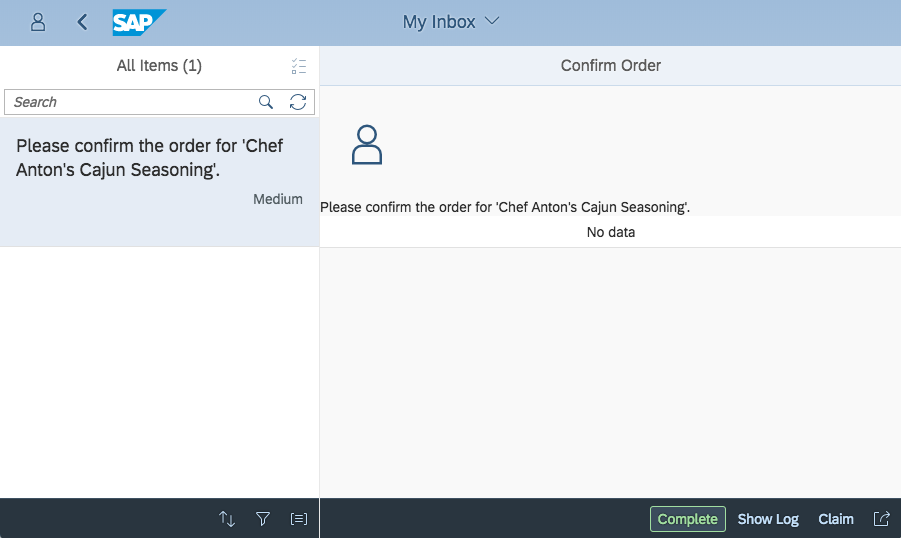

That's because the mechanism in the `init` function inside the app's `Component.js` file is looking to be guided by some simple configuration in the workflow instance's context, specifically in the function attached to the `RequestCompleted` event here:

```javascript
var contextModel = new JSONModel("/bpmworkflowruntime/rest/v1/task-instances/" + taskId + "/context")
    .attachRequestCompleted(function(oEvent) {
        // Create an array of property/value pairs for generic display in the UI
        var oModel = oEvent.getSource(),
            mControl = oModel.getProperty("/genericusertask/control"),
            mSource = oModel.getProperty(mControl.source),
            aFormData = mControl.properties.map(function(sProperty) {
                return {
                    property: sProperty,
                    value: mSource[sProperty]
                };
            });
        oModel.setProperty("/genericusertask/formItems", aFormData);
    });
```

> This code snippet is just for explanation and context - you don't need to copy it again.

So in this step you'll create a script task and insert it to execute *before* the user task.

While editing the **`processorder.workflow`** definition, use the menu in the workflow editor to **add a script task**, inserting it before the "Confirm Order" user task, like this:

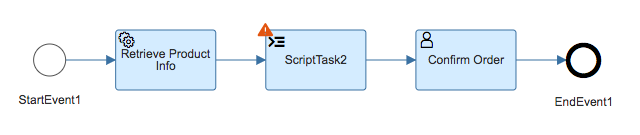

Select it, and in the **Script Task Properties**, specify **`Configure Context`** for the `Name` property and select the **Create File** link to be able to create and name a JavaScript file to hold the script. Call the file **`configurecontext.js`**.

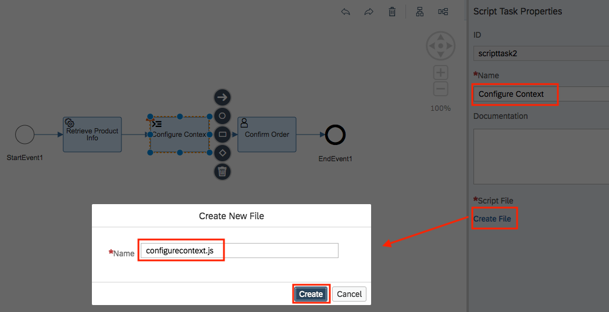

Don't forget to go back and save the workflow definition.

The `configurecontext.js` file should have been created within the project's folder structure, as shown below. Remove any sample code and comments that have been automatically placed in there, replacing everything with the following content, and then save the file:

```javascript
$.context.genericusertask = {
	control: {
		source: "/stockinfo",
		properties: ["ProductID", "ProductName", "UnitsInStock", "UnitsOnOrder"]
	}
};
```

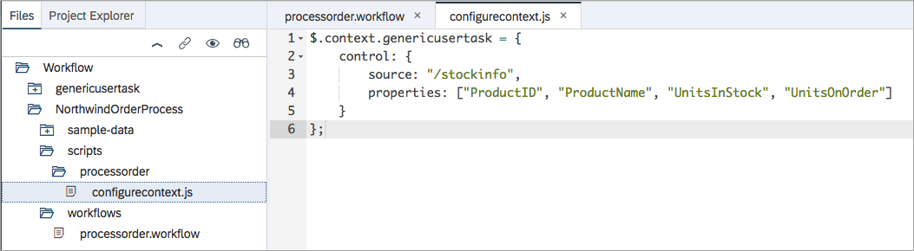

There is a single statement here that creates a new workflow context property called `genericusertask`, containing some control information for the display of data from the rest of the context, specifically properties such as `ProductID` and `ProductName` from the `stockinfo` data which will also be in the context (stored there after the call to the external service).

> In script tasks, reference to the context is made with a different syntax. Rather than `${context...}`, it's necessary to use `$.context...` in JavaScript. Refer to the [Expressions](https://help.sap.com/viewer/f85276c5069a429fa37d1cd352785c25/Cloud/en-US/9f91b1c0fac3414d9cba1015dea381f1.html) topic in the SAP Help Portal for more information.

[VALIDATE_8]
[ACCORDION-END]

[ACCORDION-BEGIN [Step 9: ](Re-deploy the workflow definition and try it out)]

Now you have a workflow definition containing a service task, a script task and a user task. Re-deploy it using the same method as previously in this tutorial (context menu path **Deploy** > **Deploy to SAP Cloud Platform Workflow** on the `processorder.workflow` file).

Use the **Monitor Workflows - Workflow Definitions** app in the launchpad to start a new `processorder` workflow instance as before:

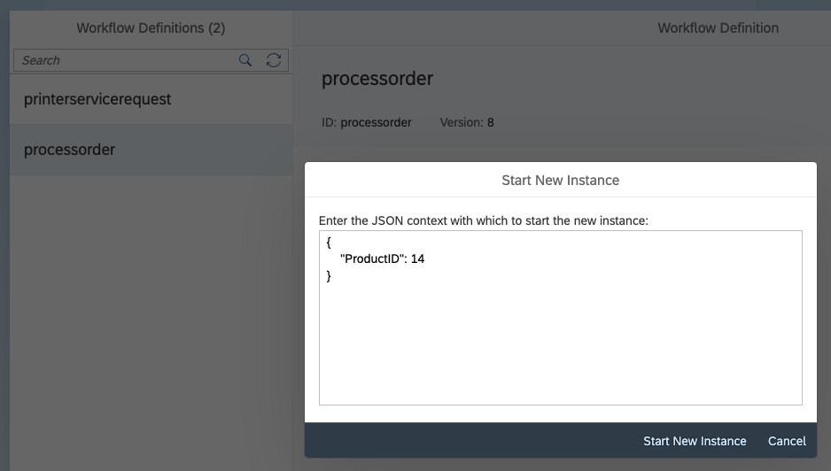

> Feel free to specify a different value for the `ProductID` property. Check the possible values in the OData service with this request: <https://services.odata.org/V3/Northwind/Northwind.svc/Products?$format=json&$select=ProductID,ProductName>.

Jump to the instances with the **Show Instances** button and select the **EXECUTION LOG** for the instance you just created. You should see the entire history of the workflow instance, including the start and successful completion of the Configure Context script task:

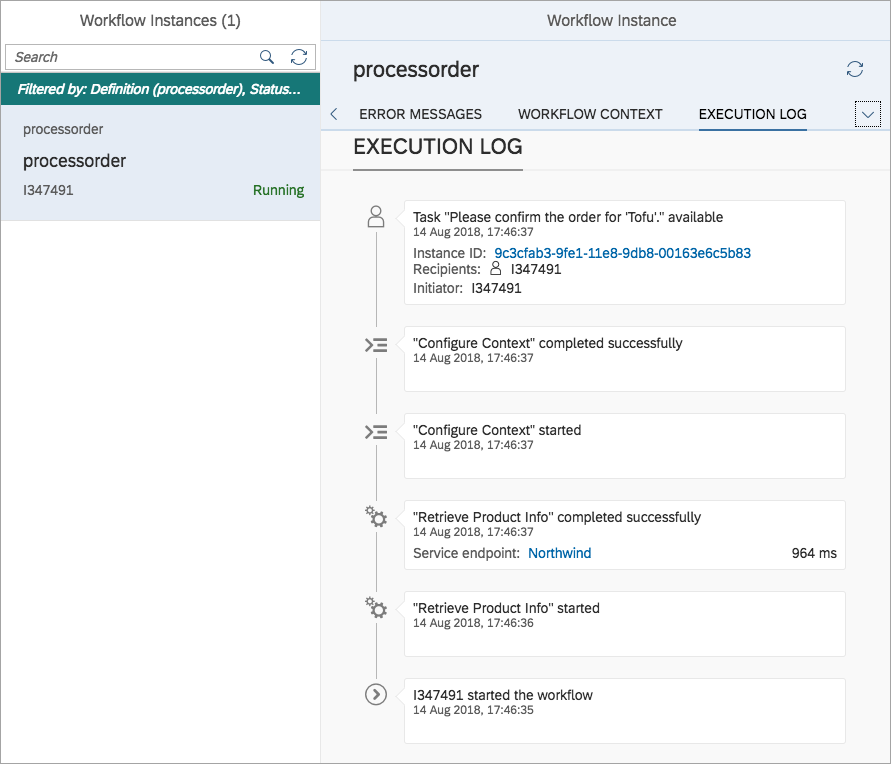

Switch now to the **`MyInbox`** app to view the user task for this workflow instance.

If everything has gone to plan, you should see the detail of the user task displayed like this, with the values for the four properties `ProductID`, `ProductName`, `UnitsInStock` and `UnitsOnOrder` displayed, albeit in a simple manner.

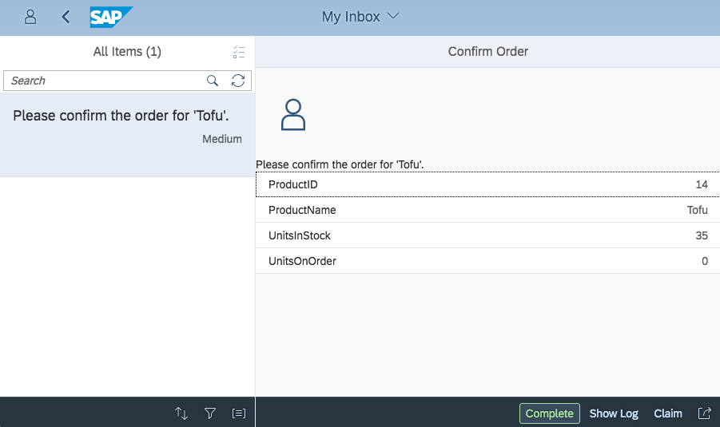

Well done!

[VALIDATE_9]
[ACCORDION-END]
