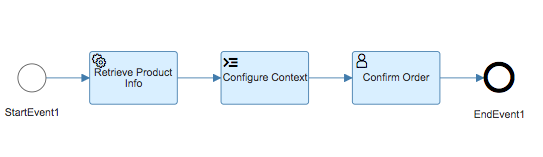
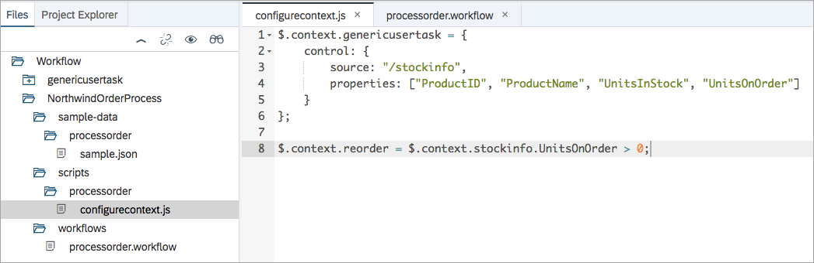
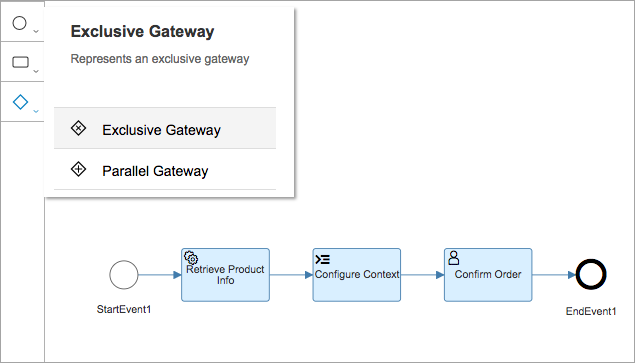
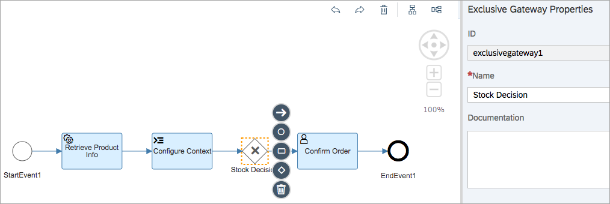
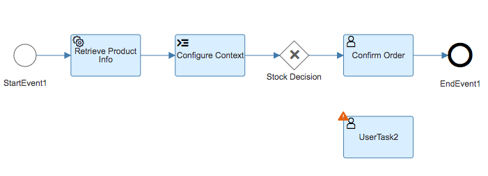
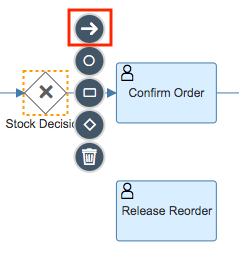
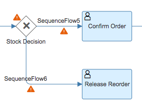

## Details
### You will learn
- How workflows can take different paths through their flow via gateways
- How to specify the conditions that influence an exclusive gateway decision

This tutorial follows on from [Add a user task and generic UI to your workflow definition](https://www.sap.com/developer/tutorials/cp-wf-02-add-user-task.html). As the workflow from this previous tutorial stands, there is a single flow from end to end, which looks like this:



In this tutorial you'll split the flow and introduce a decision into it, based on the sample scenario being used. Currently the flow moves directly to the **Confirm Order** user task. Information in the external service used in this scenario shows that for some products, the stock is low and there is a re-order that needs to be completed.

Here's an example of that information, comparing two products.

There are 39 units of <a href="https://services.odata.org/V3/Northwind/Northwind.svc/Products(1)?$format=json">`Chai`</a> (product ID 1) in stock and none on reorder:

```
{
    odata.metadata: "https://services.odata.org/V3/Northwind/Northwind.svc/$metadata#Products/@Element",
    ProductID: 1,
    ProductName: "Chai",
    SupplierID: 1,
    CategoryID: 1,
    QuantityPerUnit: "10 boxes x 20 bags",
    UnitPrice: "18.0000",
    UnitsInStock: 39,
    UnitsOnOrder: 0,
    ReorderLevel: 10,
    Discontinued: false,
}
```

However, there are only 13 units of <a href="https://services.odata.org/V3/Northwind/Northwind.svc/Products(3)?$format=json">`Aniseed Syrup`</a> (product ID 3) in stock, and 70 on reorder:

```
{
    odata.metadata: "https://services.odata.org/V3/Northwind/Northwind.svc/$metadata#Products/@Element",
    ProductID: 3,
    ProductName: "Aniseed Syrup",
    SupplierID: 1,
    CategoryID: 2,
    QuantityPerUnit: "12 - 550 ml bottles",
    UnitPrice: "10.0000",
    UnitsInStock: 13,
    UnitsOnOrder: 70,
    ReorderLevel: 25,
    Discontinued: false,
}
```

> Data in the Northwind service used may change over time, so the values you see may differ from what's shown here. That doesn't matter -- there's enough variation in the data set to allow you to work through this tutorial.

In this tutorial, you'll enhance the workflow definition, to make a decision based on whether any units are on reorder. If there are, there should be a user task requesting the task recipient release the reorder. If there aren't, the order can be processed as normal and the existing user task for order confirmation should be presented.

> In this tutorial and others the general name "SAP Web IDE" is used. Specifically, the "Full Stack" version is implied throughout.

---

[ACCORDION-BEGIN [Step 1: ](Start up SAP Web IDE and open workflow definition)]

Access SAP Web IDE from your trial SAP Cloud Platform cockpit. Use the details in the tutorial [Enable the SAP Web IDE Full Stack](https://www.sap.com/developer/tutorials/webide-multi-cloud.html) to find out how to access it, or simply invoke it using a URL, which will look like this:

`https://webidecp-XYZ.dispatcher.hanatrial.ondemand.com/`

Here, `XYZ` represents your trial subaccount name, such as `p999999trial`.

You can find out more about accessing the SAP Web IDE in the Help Portal, specifically in the [Open SAP Web IDE](https://help.sap.com/viewer/825270ffffe74d9f988a0f0066ad59f0/CF/en-US/51321a804b1a4935b0ab7255447f5f84.html) section.

Once you're in SAP Web IDE, ensure you're in the workspace containing your **`NorthwindOrderProcess`** project that you were working on in the previous tutorial and open up the workflow definition via the **`processorder.workflow`** file. You should see the workflow definition shown at the start of this tutorial.

[DONE]
[ACCORDION-END]


[ACCORDION-BEGIN [Step 2: ](Add decision logic to the script task)]

It's good practice to encapsulate decision logic into a script task, especially if the decision is to be based on a number of factors. In this case, there's only one factor (whether there are any units on reorder or not) but it's still worth capturing that logic in one place.

Open the JavaScript file associated with the Configure Context script task. This is **`configurecontext.js`**. Add the following line to it and save the file.

```javascript
$.context.reorder = $.context.stockinfo.UnitsOnOrder > 0;
```

This adds a further property, `reorder`, to the context. Later, when you add the exclusive gateway, you will refer to this property to make the flow decision. The property's value will be based upon the value of the `UnitsOnOrder` property in the stock information retrieved from the Northwind service.

The file should now look like this:



[VALIDATE_1]
[ACCORDION-END]


[ACCORDION-BEGIN [Step 3: ](Add an exclusive gateway)]

Now you have a value upon which a decision can be made, you should add an [exclusive gateway](https://help.sap.com/viewer/f85276c5069a429fa37d1cd352785c25/Cloud/en-US/60ae81179050478caa4212fad4ba50f2.html). Switch to the **`processorder.workflow`** definition in your editor and use the menu to add one:



Insert it between the **Configure Context** script task and the **Confirm Order** user task. You may want to use the rearrangement icons as shown to have the flow re-drawn with more space.


Specify the value **`Stock Decision`** for the **Name** property of this new exclusive gateway. The definition should now look like this:



Save the definition.

As it stands, the gateway is just acting as a pass-through, as though it weren't there. That's because there is only one flow coming from it (leading to the **`Confirm Order`** user task). Next, you'll add another user task, and then add a second flow from the exclusive gateway to that.

[DONE]
[ACCORDION-END]


[ACCORDION-BEGIN [Step 4: ](Add a second user task)]

In this step you will add a second user task, similar to the first. This second task will represent the requirement for the task recipient to release the reorder of stock, in the case where a reorder is required (i.e. when there are units on reorder for the product chosen).

Use the menu to add a user task, and place it near the existing **Confirm Order** user task, like this:



In a similar way to how you added the first user task in the tutorial [Add a user task & generic UI to your workflow](https://www.sap.com/developer/tutorials/cp-wf-02-add-user-task.html), specify the values for the user task properties as follows.

In the **GENERAL** section:

| Field        | Value
|:------------ | :-------------
| Name         | **`Release Reorder`**

In the **DETAILS** section:

| Field        | Value
|:------------ | :-------------
| Subject      | **`Release reorder for ${context.stockinfo.ProductName}`**
| Description  | **`${context.stockinfo.UnitsOnOrder} units are to be reordered.`**
| Users        | (Your trial user name, e.g. P999999 - use upper case for the initial letter)

In the **USER INTERFACE** section:

| Field            | Value
|:--------------   | :-------------
| HTML5 App Name   | **`genericusertask`**
| Component Name   | **`webapp`**
| SAPUI5 Component | **`tutorial.genericusertask`**

Now save the workflow definition.

Right now, this second user task is not part of the flow. In the next step you'll rectify this.

[DONE]
[ACCORDION-END]


[ACCORDION-BEGIN [Step 5: ](Connect the exclusive gateway to the new user task)]

Wire up the exclusive gateway to the user task you've just created by adding a second flow line between the gateway and the user task. Do this by using the arrow icon.



Keep the mouse button or trackpad pressed and move the cursor to connect to the new user task, so that the result looks like this:



The flow looks now quite busy; that's because the two outbound flows from the exclusive gateway have been labelled and require attention.

> In what follows, the names of the sequence flows may be different in your editor. The names used here refer to the names shown in the screenshot above.

Address the **`SequenceFlow5`** flow:

Select the line marked **`SequenceFlow5`** and you'll see that it too can have properties -- indeed, now there are two flows from this exclusive gateway, the `Condition` property is mandatory.


This is the flow that represents the circumstance where the product in question has enough stock and there are no units on reorder. It leads to the **Confirm Order** user task. Specify that this flow should be the default, by marking the **Default** checkbox in the sequence flow properties. Also, change the **Name** property of this sequence flow from `SequenceFlow5` to **`Stock OK`**.

Now address the **`SequenceFlow6`** flow:

Select the line marked **`SequenceFlow6`**. This is the flow that represents the circumstance where the product in question has units on reorder. It leads to the **Release Reorder** user task. Change the **Name** property of this sequence flow from `SequenceFlow6` to **`Reorder Needed`** and in the **Condition** field, add this condition:

```javascript
${context.reorder == true}
```

This of course refers to the `reorder` property you defined in the `configurecontext.js` file related to the **Configure Context** script task earlier in this tutorial:

```
$.context.reorder = $.context.stockinfo.UnitsOnOrder > 0;
```

Finally, wire up the second user task to the end event, by selecting the **Release Reorder** box, using the arrow icon as before, to connect it up to the **`EndEvent1`** circle.

> You must always properly connect up each element of your flow -- you can't leave a user task (in this case) with no onward connection.

As before, you may wish to have the editor tidy up the flow diagram for you with the rearrangement icons.


This is what your workflow definition should now look like:


Don't forget to save it!

[VALIDATE_5]
[ACCORDION-END]


[ACCORDION-BEGIN [Step 6: ](Test the new flow)]

Deploy the updated workflow definition in the same way as you did in [Add a User Task and Generic UI to Your Workflow](https://www.sap.com/developer/tutorials/cp-wf-02-add-user-task.html) -- in other words by using the context menu on the workflow definition file **`processorder.workflow`** and choosing **Deploy** > **Deploy to SAP Cloud Platform Workflow**.

Switch to your launchpad site and start the **Monitor Workflow - Workflow Definitions** app.

Select your **`processorder`** definition and start a new instance, leaving the specification of the `ProductID` property in the sample data as 1 for the `Chai` product.

Repeat this process to create a second instance, but this time specify the value **`3`** for the `Aniseed Syrup` product.

Now you should have two new user tasks. Start the **`MyInbox`** app from your launchpad to have a look. You should see these two tasks, and as long as the `UnitsOnOrder` values for the Northwind products that you picked fit the example scenario as described at the start of this tutorial, you should see two different user tasks -- one requesting the release of a reorder for `Aniseed Syrup`, and another for requesting the order confirmation for `Chai`:


With that, you're pretty much done. You may wish to experiment further with the script task, adding more complex conditions upon which you can base a different type of exclusive gateway decision. But for now, well done!

[DONE]
[ACCORDION-END]
