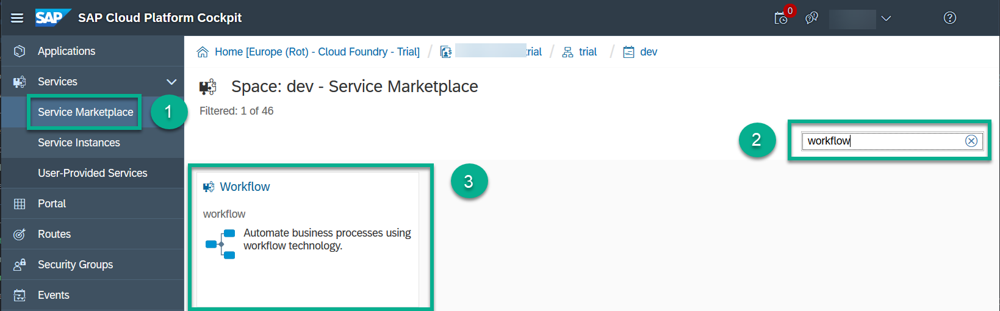
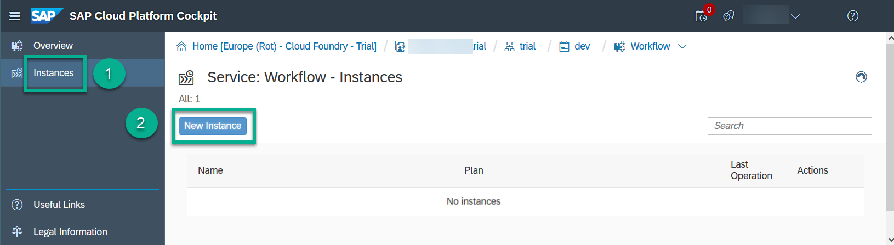
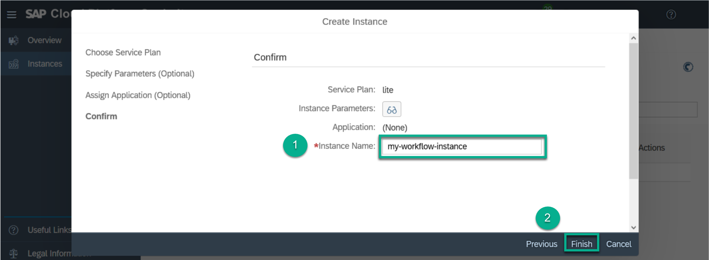
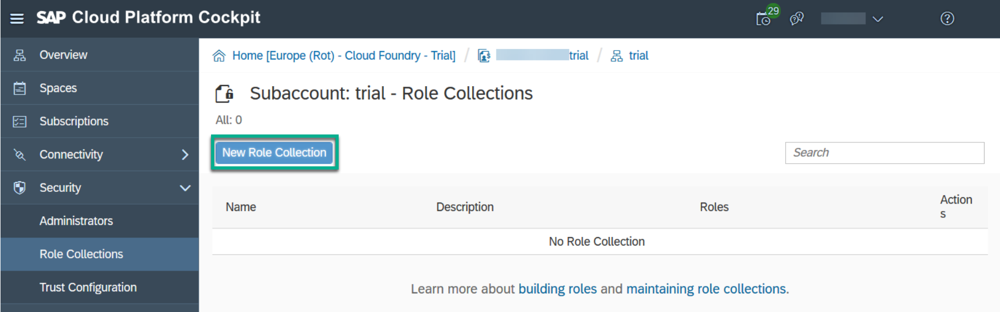
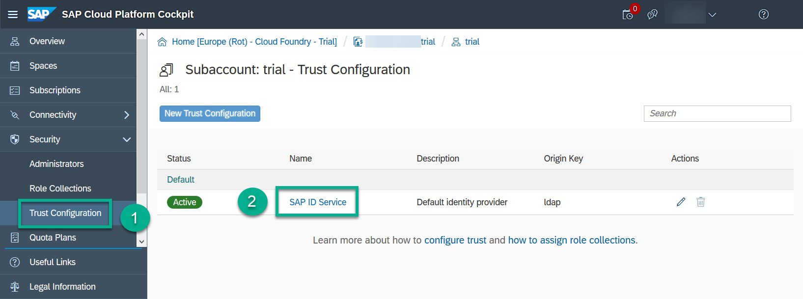
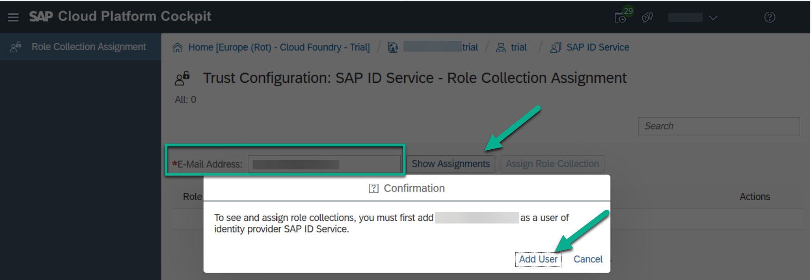
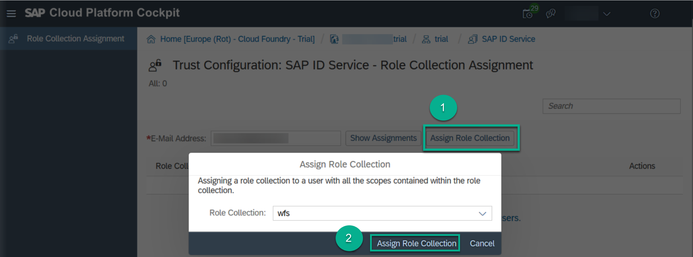
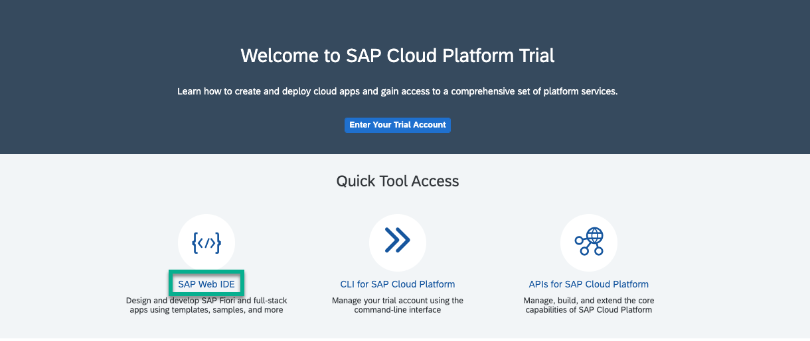
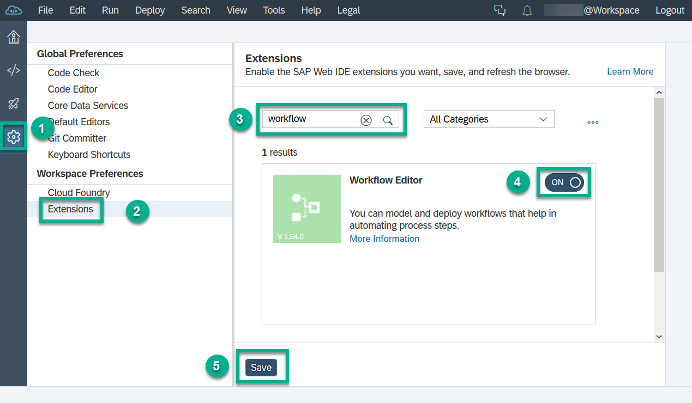
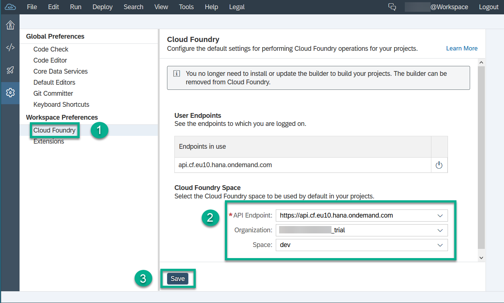

## Prerequisites  
 - [Get a Trial Account](https://help.sap.com/viewer/65de2977205c403bbc107264b8eccf4b/Cloud/en-US/42e7e54590424e65969fced1acd47694.html)

## Details
### You will learn  
  - How to enable the workflow service and create an instance in your SAP Cloud Platform account
  - How to assign the roles you need to develop and use workflow applications

---

[ACCORDION-BEGIN [Step 1: ](Add a workflow instance)]

1. From the breadcrumbs choose **trial**.

2. Choose **Spaces** from the left-hand navigation, and then choose **dev**.

3. Choose **Services** | **Service Marketplace** from the left-hand navigation, and search for `workflow`.

4. Search for the **Workflow** service.

    

    The **Workflow** tile displays the service description and the service plan.

5. Choose **Instances** from the left-hand navigation, then choose **New Instance**.

    

6. In the wizard that comes up, leave the data as is and proceed by choosing **Next**. On the last page, enter `my-workflow-instance` as the instance name and choose **Finish**.

    

[DONE]
[ACCORDION-END]

[ACCORDION-BEGIN [Step 2: ](Create role collection)]

1. Go back to your trial subaccount by choosing the **trial** from the breadcrumbs.

2. From the left-hand navigation, choose **Security** | **Role Collections**, then choose **New Role Collection**.

    

3. Enter `wfs` as the name for your role collection, then choose **Save**.

4. After the role collection is created, click its name and choose **Add Role**.

5. In the wizard that comes up, select `workflow!b10150` in the field **Application Identifier**. Add the following roles one by one:

    - `WorkflowAdmin`
    - `WorkflowDeveloper`
    - `WorkflowInitiator`
    - `WorkflowParticipant`

[DONE]
[ACCORDION-END]

[ACCORDION-BEGIN [Step 3: ](Assign role collection)]

1. Go back to your trial subaccount by choosing the **trial** from the breadcrumbs.

2. From the left-hand navigation, choose **Security** | **Trust Configuration**, then click **SAP ID Service**.

    

3. Enter your email address, then choose **Show Assignments**.

    

4. Choose **Add User**.

5. Choose **Assign Role Collection**, and select the `wfs` collection that you created before. Then choose **Assign Role Collection** again.

    

[DONE]
[ACCORDION-END]

[ACCORDION-BEGIN [Step 4: ](Enable the workflow extension and Cloud Foundry)]

1. In your web browser, open the cockpit of [SAP Cloud Platform Trial](https://account.hanatrial.ondemand.com/cockpit).

2. Choose **Launch SAP Web IDE**.

    

3. In the navigation area of **SAP Web IDE**, choose the **Preferences** icon.

4. Select **Extensions**, and search for **workflow**.

5. Toggle the switch of the **Workflow Editor** extension, choose **Save** and then **Refresh**.

    

6. Switch to the **Cloud Foundry** preference.

7. Enter your API endpoint, and select the organization and space from the respective dropdowns.

8. Save your changes.

> In the credentials popup, enter your trial user email and password.

[VALIDATE_1]
[ACCORDION-END]

---
