## Details
### You will learn
  - How to create ``multitarget`` application projects for your workflow in the SAP Web IDE.
  - How to deploy these projects to the SAP Cloud Platform.

---

[ACCORDION-BEGIN [Step 1: ](Create an SAP Fiori launchpad project)]
1. In your web browser, open the cockpit of [SAP Cloud Platform Trial](https://cockpit.hanatrial.ondemand.com/cockpit).

2. Choose **Launch SAP Web IDE**.

    

3. In the navigation area of SAP Web IDE, choose the **Development** icon.

4. Select the **Show hidden files** icon to display hidden files.

    

5. Under **Files**, right-click **Workspace** and choose **New** | **Project from Template**.

    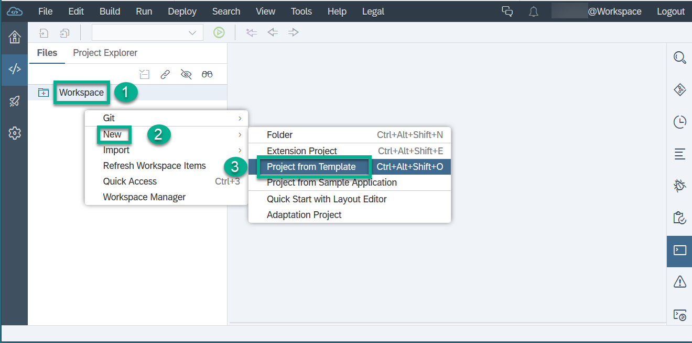

6. In the wizard, set **Environment** to **Cloud Foundry** and select the **Multi-Target Application** template. Then choose **Next**.

    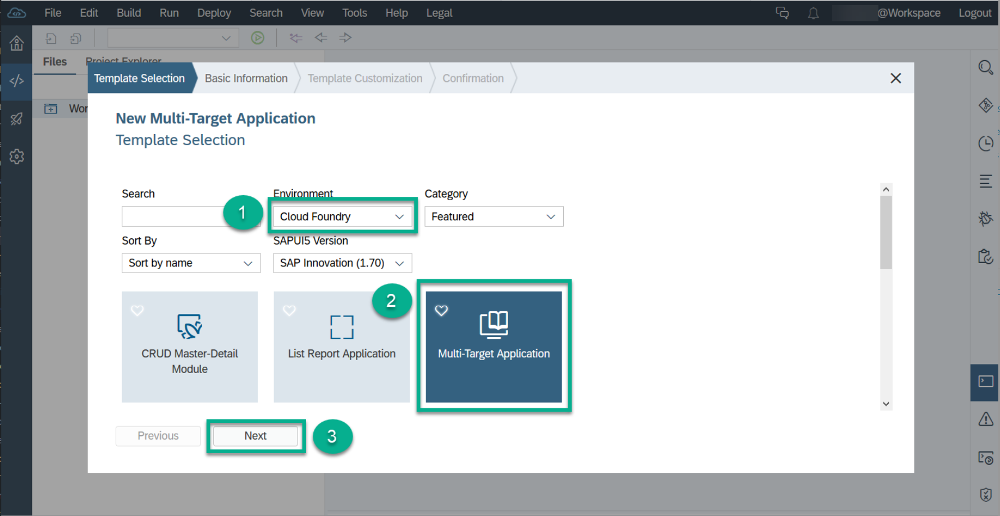

7. Enter a name for the new project, for example, `MyFLPProject`, then choose **Next**.

    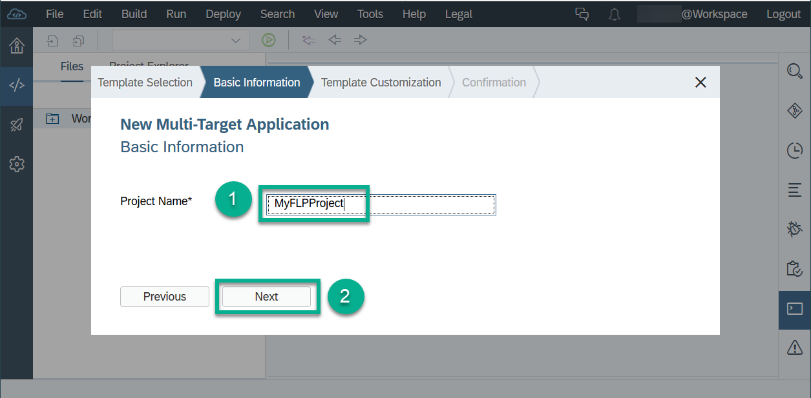

8. Select **Use HTML5 Application Repository**, then choose **Finish**.

    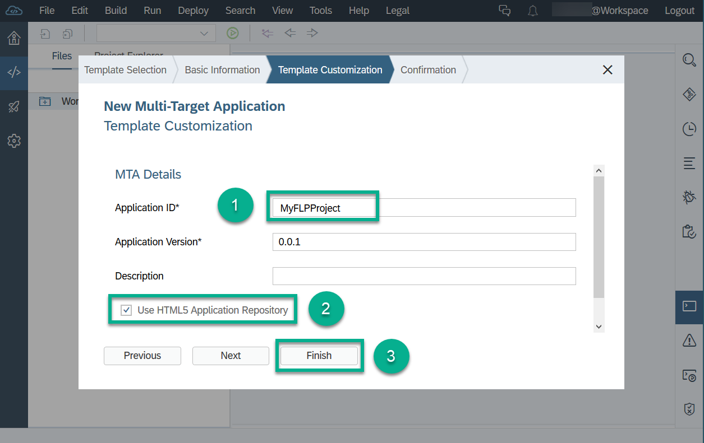

[DONE]
[ACCORDION-END]


[ACCORDION-BEGIN [Step 2: ](Add an SAP Fiori launchpad module)]
1. Right-click your `MyFLPProject` project, and choose **New** | **SAP Fiori Launchpad Site Module**.

    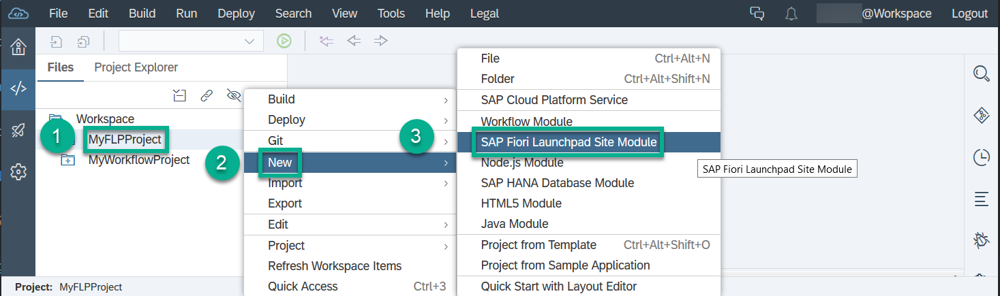

2. Enter the module name `MyFLP`, and choose **Finish**.

    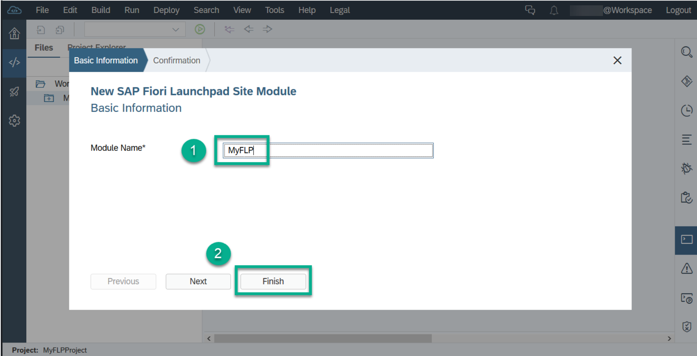

3. To create launchpad tiles, double-click the `CommonDataModel.json` under **`MyFLPProject`** | **`MyFLP`** | **`portal-site`**. Then choose the **+** icon.

    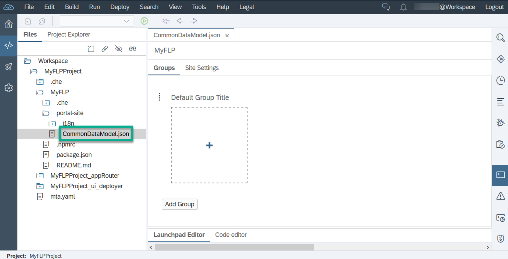

4. On the **Select Project Apps** popup, click the **+** icon three times to insert three table rows. Then enter the following data, and choose **Select**:

    | App ID                               | Intent Navigation                               |
    | :----------------------------------- | :---------------------------------------------- |
    | **`cross.fnd.fiori.inbox`**          | **`WorkflowTask-DisplayMyInbox`**               |
    | **`com.sap.bpm.monitorworkflow`**    | **`bpmworkflowmonitor-DisplayInstances`**       |
    | **`com.sap.bpm.monitorworkflow`**    | **`bpmworkflowmonitor-DisplayDefinitions`**     |


    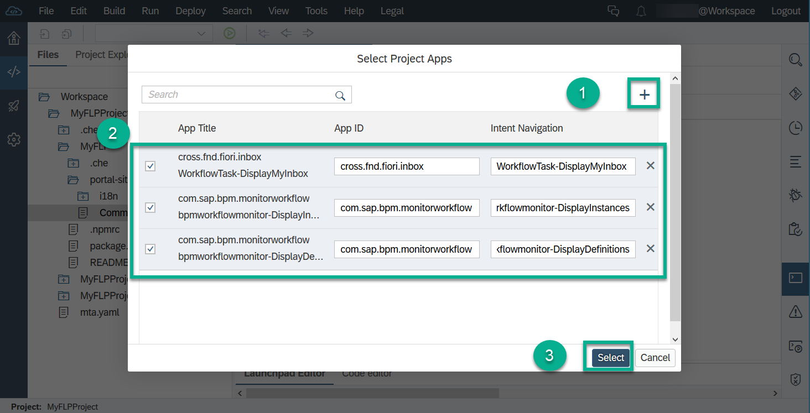

5. Save your changes.

    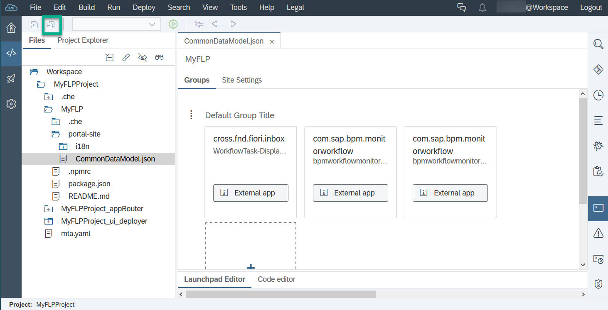

[VALIDATE_8]
[ACCORDION-END]


[ACCORDION-BEGIN [Step 3: ](Configure the User Account and Authentication module to access SAP Fiori launchpad)]
1. Right-click your `MyFLPProject` project, and choose **New** | **Folder**.

    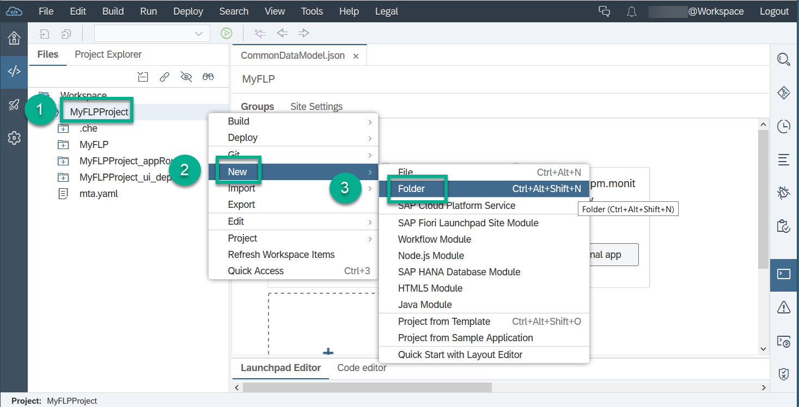

2. Enter the folder name `MyFLPProject_UAA`, and choose **OK**.

3. Right-click your `MyFLPProject_UAA` folder, and choose **New** | **File**.

    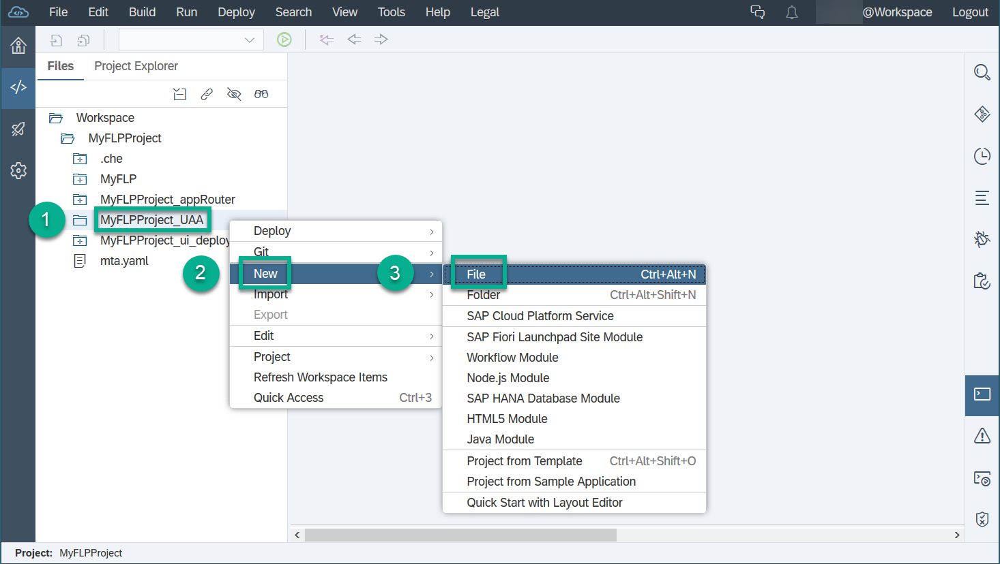

4. Enter the file name `xs-security.json`, and choose **OK**.

5. Paste the following code into the `xs-security.json` file.

    ``` JSON
    {
      "xsappname":"MyFLPProject_UAA",
      "tenant-mode": "dedicated",
      "description": "Security profile of called application",
      "scopes": [
        {
          "name": "uaa.user",
          "description": "UAA"
        }
      ],
      "role-templates": [
        {
          "name": "Token_Exchange",
          "description": "UAA",
          "scope-references": [
            "uaa.user"
          ]
        }
      ]
    }
    ```
6. Save your changes.

[DONE]
[ACCORDION-END]


[ACCORDION-BEGIN [Step 4: ](Add resources to the MTA launchpad project)]
1. In your workspace in the **`MyFLPProject`** project, right-click the **`mta.yaml`** file and choose **Open MTA Editor**.

    

2. Switch to the **Resources** tab, and add the `UAA` resource. On the left-hand side, press the plus icon and enter `uaa_MyFLPProject` in the new field. Choose `org.cloudfoundry.managed-service` in the **Type** field. Add the following parameters, by choosing the plus icon under **Parameters**.

    | Key                  | Value                                           |
    | :------------------- | :---------------------------------------------- |
    | **path**             | **`./MyFLPProject_UAA/xs-security.json`**       |
    | **`service-plan`**   | **application**                                 |
    | **service**          | **`xsuaa`**                                     |

    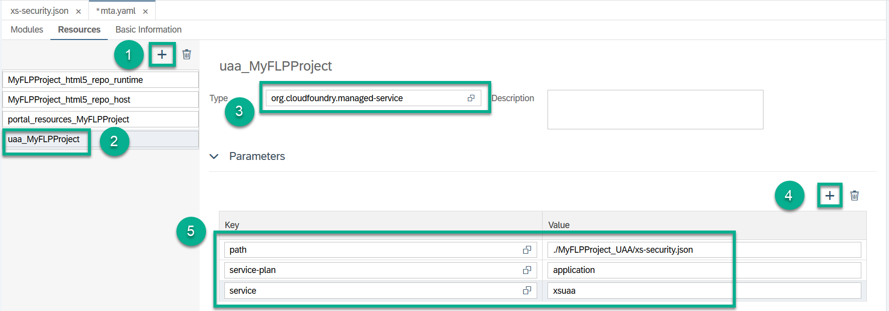

3. Still on the **Resources** tab, and add the workflow resource. On the left-hand side, press the plus icon and enter `my-workflow-instance` in the new field. Choose `org.cloudfoundry.existing-service` in the **Type** field.

    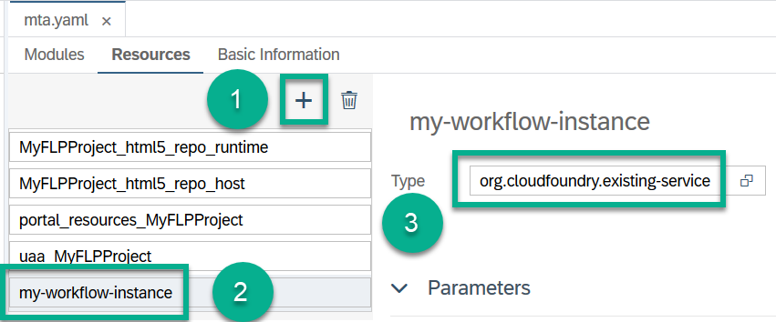

4. Save your changes.

[DONE]
[ACCORDION-END]


[ACCORDION-BEGIN [Step 5: ](Add required resources to the modules)]
1. In the **`MTA Editor`**, switch to the **Modules** tab.

2. Select **`MyFLPProject_appRouter`**.

3. In the **Requires** section, press the plus icon twice and enter `my-workflow-instance` and `uaa_MyFLPProject` into the new lines.

    >You have to scroll down in the list after you press the plus icon. The new lines are pre-filled with the text of the first entry. Overwrite these entries.

    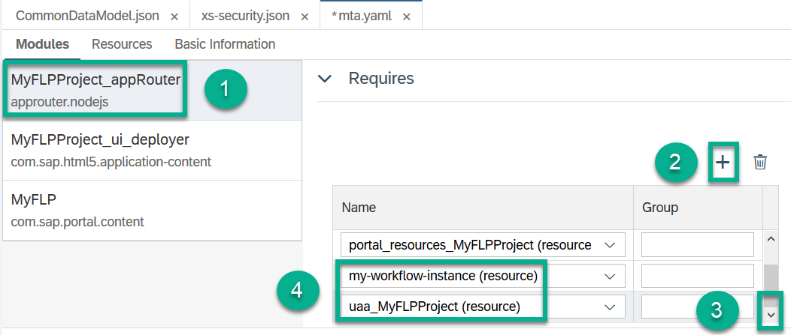

4. Select **`MyFLP`**.

5. In the **Requires** section, press the plus icon and enter `my-workflow-instance`. The `uaa_MyFLPProject` resource is added automatically.

    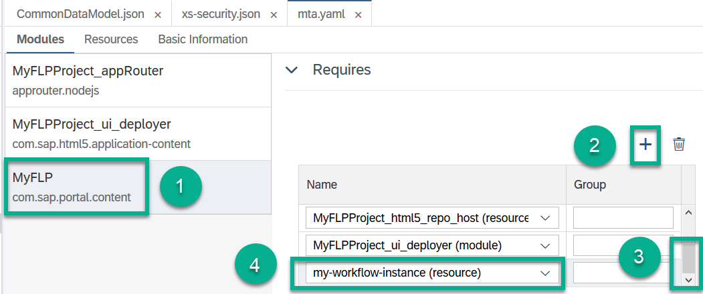

6. Save your changes.

7. Clean up the superfluous `MyFLPProject_ui_deployer` module in this order:

    - Go back to the **Modules** tab and select the `MyFLP` module. In the **Requires** section, place your cursor inside the **Group** field next to the `MyFLPProject_ui_deployer` entry and choose the **Remove** icon.

    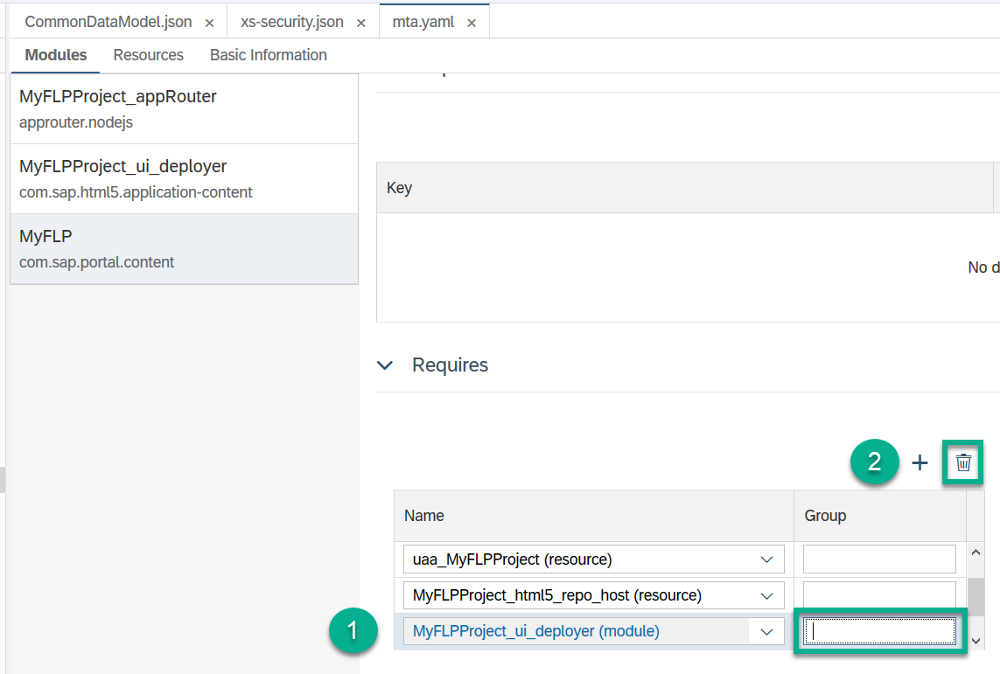

    - Save your changes.

    - Delete the **`MyFLPProject_ui_deployer`** folder from the **`MyFLPProject`** project in your workspace by right-clicking and choosing **Edit** | **Delete**.

    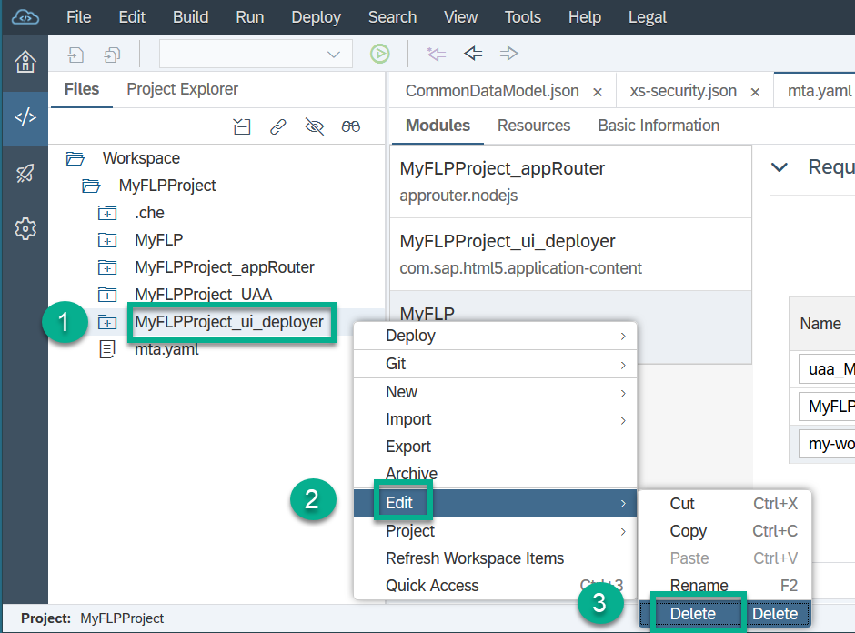

[DONE]
[ACCORDION-END]


[ACCORDION-BEGIN [Step 6: ](Build and deploy your launchpad project)]
1. Right-click your **`MyFLPProject`** project in the workspace, and choose **Build** | **Build**.

    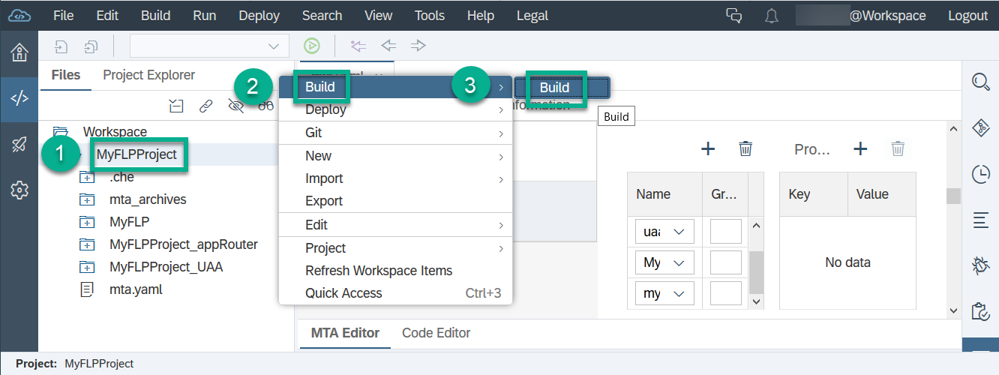

    The console shows the status of the build: Build of `MyFLPProject` completed.

2. Open the **`mta_archives`** folder.

3. Right-click your **`.mtar`** file, and choose **Deploy** | **Deploy to SAP Cloud Platform**.

    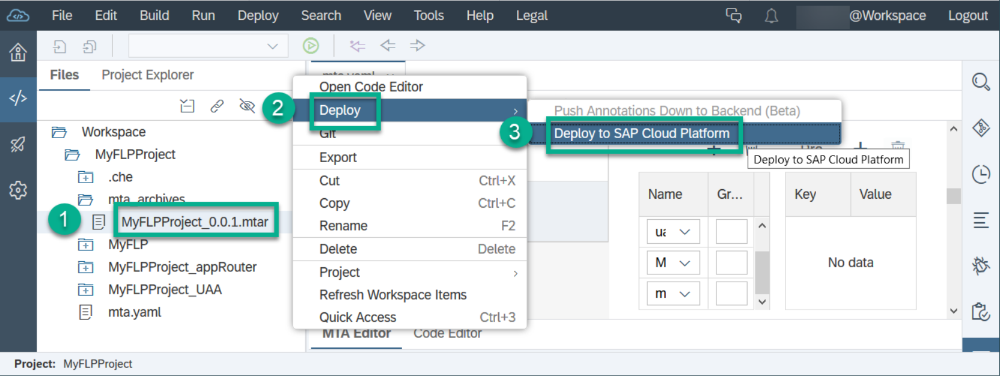

4. Enter your API endpoint, and choose **Deploy**.

    

[VALIDATE_2]
[ACCORDION-END]


[ACCORDION-BEGIN [Step 7: ](Access your SAP Fiori launchpad apps)]
1. Open the SAP Web IDE console, and search for the launchpad URL `https://<dev space name>-trial-dev-myflpproject-approuter.cfapps.<your endoint>.hana.ondemand.com`.

    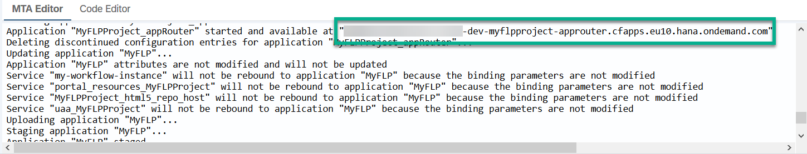

2. Copy it to your browser and append `/cp.portal` to it.

3. Log on to your trial account by entering your email address and password. Your home page of SAP Fiori launchpad is displayed.

    

[DONE]
[ACCORDION-END]


---
