## Details
### You will learn  
  - How to create ``multitarget`` application projects for your workflow in the SAP Web IDE.
  - How to deploy these projects to the SAP Cloud Platform.

---

[ACCORDION-BEGIN [Step 1: ](Create an SAP Fiori launchpad project)]
1. In your web browser, open the cockpit of [SAP Cloud Platform Trial](https://account.hanatrial.ondemand.com/cockpit).

2. Choose **Launch SAP Web IDE**.

    

3. In the navigation area of SAP Web IDE, choose the **Development** icon.

4. Select the **Show hidden files** icon to display hidden files.

    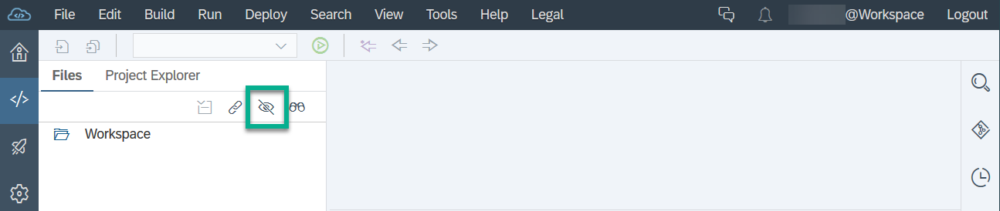

5. Under **Files**, right-click **Workspace** and choose **New** | **New Project from Sample Application**.

    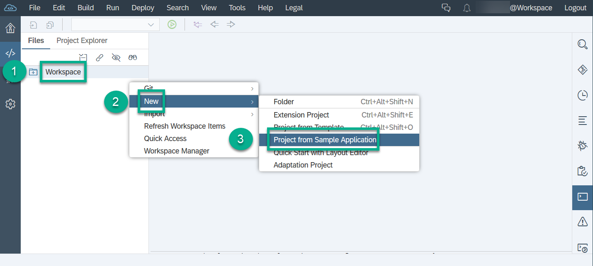

6. In the wizard, set **Category** to **Workflow Sample Application** and select the **Workflow Applications on SAP Fiori Launchpad for Cloud Foundry (Trial)** template. Then choose **Next**.

    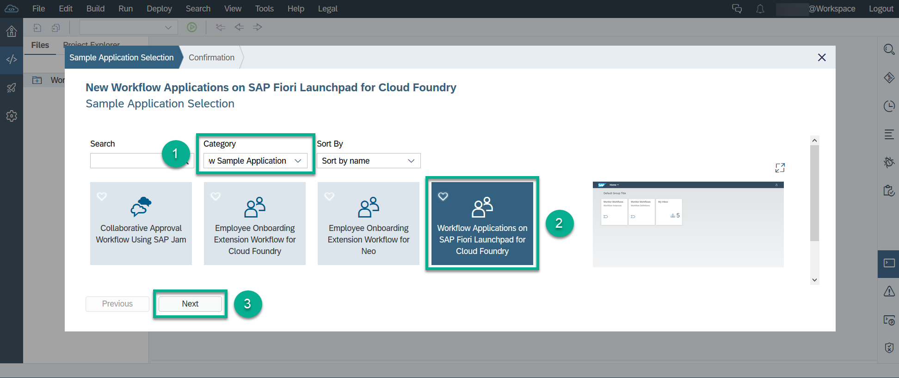

7. Select the checkbox and provide your consent to create the application, and choose **Finish**.

    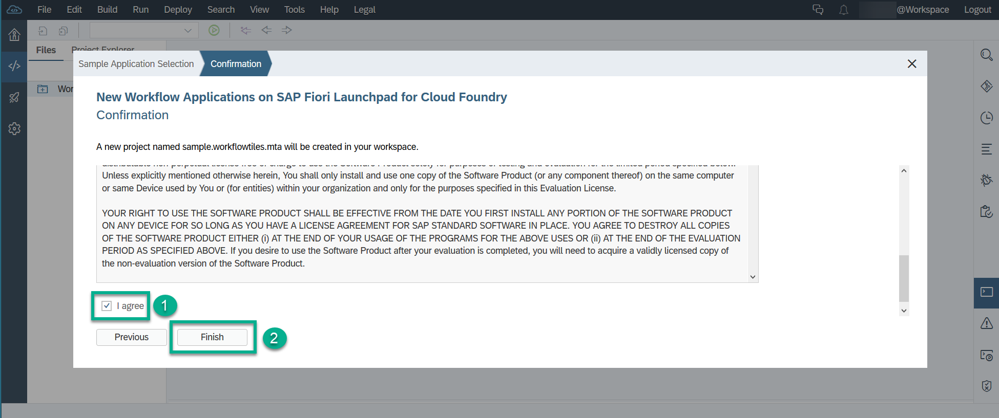

You now see a project with an `mta.yaml` file in your workspace:

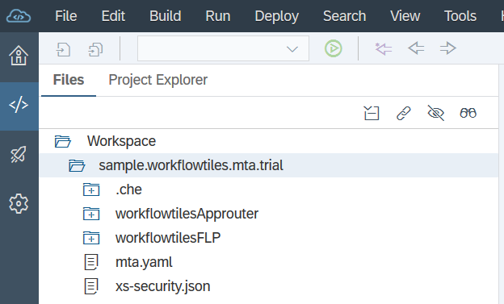    

> If there are layout issues with the editor window (can't see the properties), simply refresh the SAP Web IDE window (F5).

[DONE]
[ACCORDION-END]

[ACCORDION-BEGIN [Step 2: ](Use existing workflow instance project)]
1. In your workspace in the **`sample.trial`** project, right-click the **`mta.yaml`** file and choose **Open MTA Editor**.

    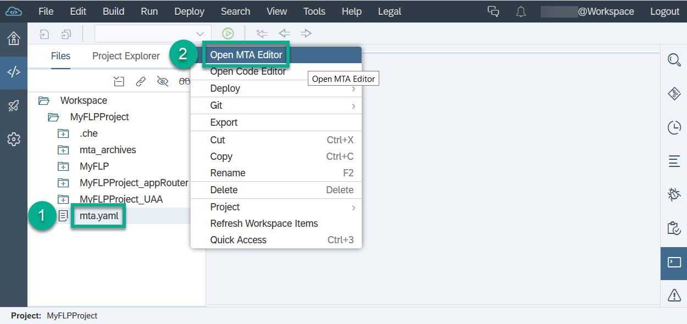

2. On the **Resources** tab, replace the workflow resource. On the left-hand side, select `workflow_workflowtiles` and change it to `my-workflow-instance`. Choose `org.cloudfoundry.existing-service` in the **Type** field.

    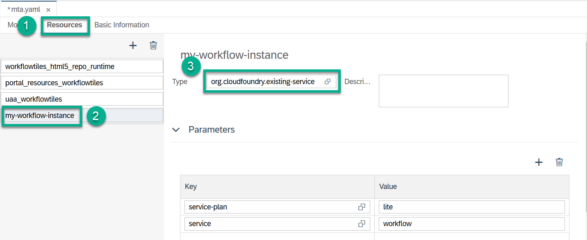

3. Save your changes.

4. Switch to the **Modules** tab, and select **`workflowtilesApprouter`**. Under **Requires** replace one of the `uaa_workflowtiles (resource)` entries with a **my-workflow-instance (resource)** resource entry.

    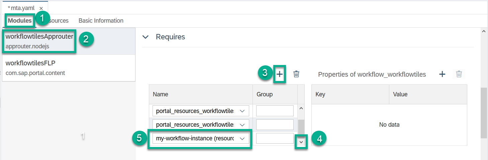

To really ensure that the updated instance name is used in all respective places, execute the following steps:

1. Select the **`workflowtilesFLP`** module and under **Requires** switch the **my-workflow-instance (resource)** entry to some other entry.

2. Save your changes.

3. Switch the changed resource entry back to **my-workflow-instance (resource)**.

4. Save your changes.

[DONE]
[ACCORDION-END]

[ACCORDION-BEGIN [Step 3: ](Build and deploy your launchpad project)]
1. Right-click your **`sample.workflowtiles.mta.trial`** project in the workspace, and choose **Build** | **Build with Cloud MTA Build Tool (recommended)**.

    

    The console shows the status of the build: Build of `sample.workflowtiles.mta.trial` completed.

2. Open the **`mta_archives`** folder.

3. Right-click your **`.mtar`** file, and choose **Deploy** | **Deploy to SAP Cloud Platform**.

    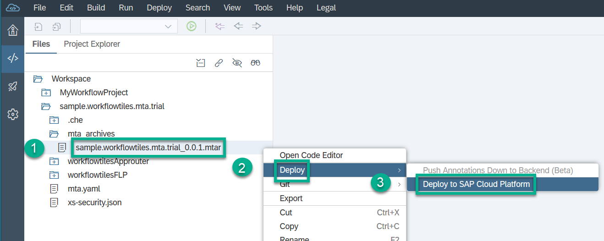

4. Enter your API endpoint, and choose **Deploy**.

    

[VALIDATE_2]
[ACCORDION-END]

[ACCORDION-BEGIN [Step 4: ](Access your SAP Fiori launchpad apps)]
1. Open the SAP Web IDE console, and search for the launchpad URL `https://<dev space name>-trial-dev-workflowtilesapprouter.cfapps.<your endoint>.hana.ondemand.com`.

    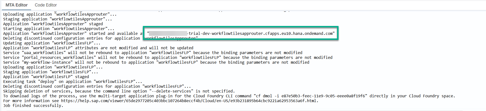

2. Copy the URL to your browser.

    >If the URL does not work, append `/cp.portal` to it.

3. Log on to your trial account by entering your email address and password. Your home page of SAP Fiori launchpad is displayed.

    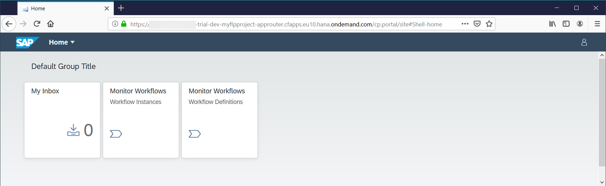

[DONE]
[ACCORDION-END]

---
