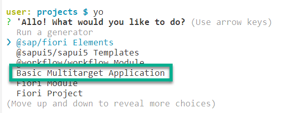
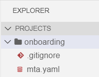
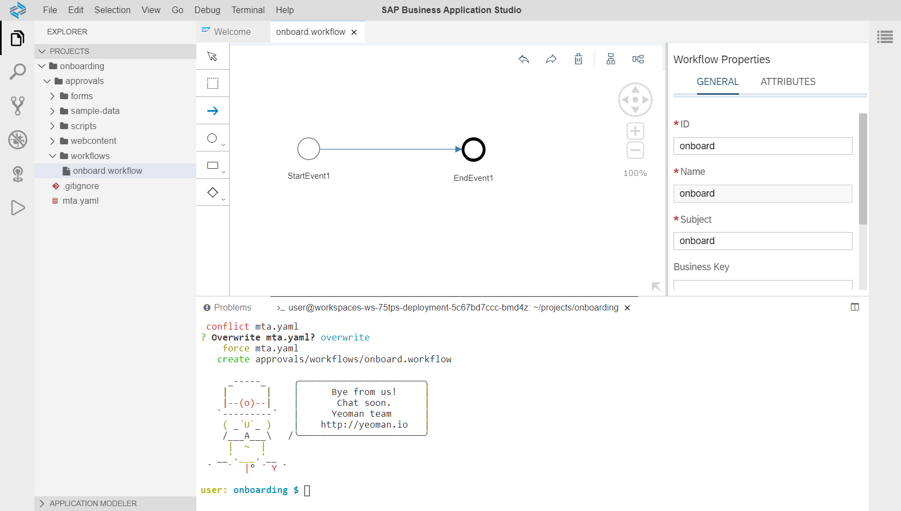

## Prerequisites
 - [Get a Trial Account](https://developers.sap.com/tutorials/hcp-create-trial-account.html)
 - "Step 1: Setup your account using Booster" of the [Set Up Workflow Management in Cloud Cockpit](https://developers.sap.com/tutorials/cp-starter-ibpm-employeeonboarding-1-setup.html) tutorial creates the entitlements for the Portal and Workflow services and enables SAP Business Application Studio.

## Details
### You will learn  
  - How to create a basic workflow

---
[ACCORDION-BEGIN [Step 1: ](Set up SAP Business Application Studio)]
You create your workspace where you will later build the workflow.

1. In your web browser, open the [SAP Cloud Platform Trial cockpit](https://account.hanatrial.ondemand.com/cockpit).

2. Choose **SAP Business Application Studio**.

3. In the application studio, choose **Create Dev Space**.

    

4. Enter a name, for example, `mydevspace`, and make sure to select **SAP Fiori**, the **Workflow Management**, and the **Launchpad Module** extension. Then choose **Create Dev Space** again.

    > The **Launchpad Module** extension makes the Launchpad Editor available in your dev space and is only needed if you want to execute the start form tutorial.

    

    > Wait until the dev space is created and you see the RUNNING status.
    !

5. Click the **Dev Space** to access the workspace.

    > It takes 2-3 minutes to initialize your dev workspace for the first time. You will see a Welcome page once the dev space is initialized.

6. If you have never accessed the workspace before, open it with the **Open Workspace** button.

7. Select the **projects** folder and choose **Open**.

    

    > The **PROJECTS** explorer is opened.

[DONE]
[ACCORDION-END]

[ACCORDION-BEGIN [Step 2: ](Create an MTA application)]
To create a deployment artifact, you need to create a multitarget (MTA) application.

1. Open a terminal window to start the Yeoman generator, choose **Terminal** | **New Terminal**.

    A new terminal window opens.

2. Type in *yo*, and choose ENTER to start the generator framework.

3. Use the down arrow to select **Basic Multitarget Application**, then choose ENTER.

    

4. Enter a project name, for example, `onboarding`, and choose ENTER.

    A new folder with the project name appears in the **Explorer** view. It contains an `mta.yaml` file, which describes the application.

    

[DONE]
[ACCORDION-END]

[ACCORDION-BEGIN [Step 3: ](Create a workflow module and a workflow)]
You now need to create a workflow module within the MTA project.

1. In the terminal, access the application folder below the **projects** folder using the command `cd <folder name>`. Use, for example, `cd onboarding`, then choose ENTER.

2. Type in *yo*, then choose ENTER again.

3. Use the down arrow to select the **`@workflow/workflow Module`**, then choose ENTER.

4. Enter a name for the workflow module, for example, `approvals`, then choose ENTER.

5. In the same way, enter a name for the workflow itself, for example, `onboard`, and a description.

6. Confirm to overwrite the `mta.yaml` file by entering `y`, then press ENTER.

    Now you see the newly created workflow in the editor.

    

[VALIDATE_1]
[ACCORDION-END]

---
Summary

You have now created your first workflow with SAP Business Application Studio in the Cloud Foundry environment.

Your next step is to add a user task to this workflow and then display that task using the standard apps of Workflow Management in SAP Fiori launchpad.
