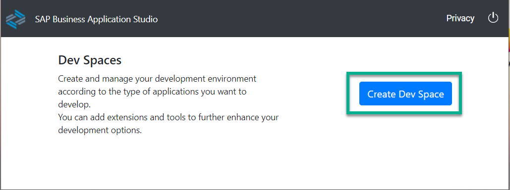
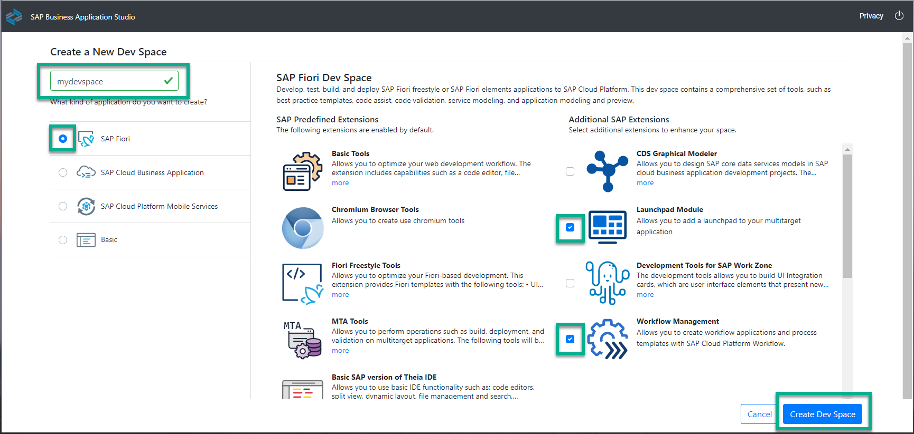
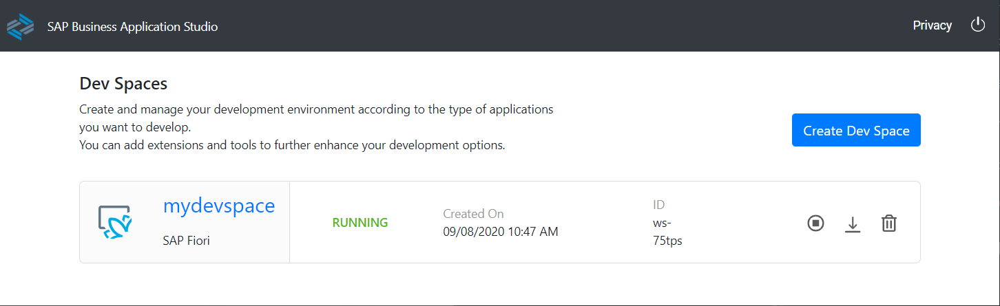
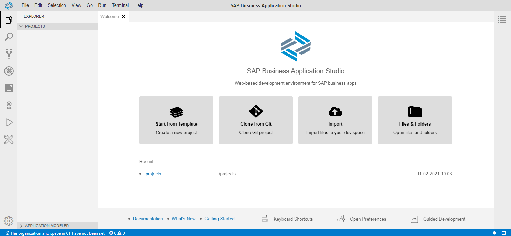
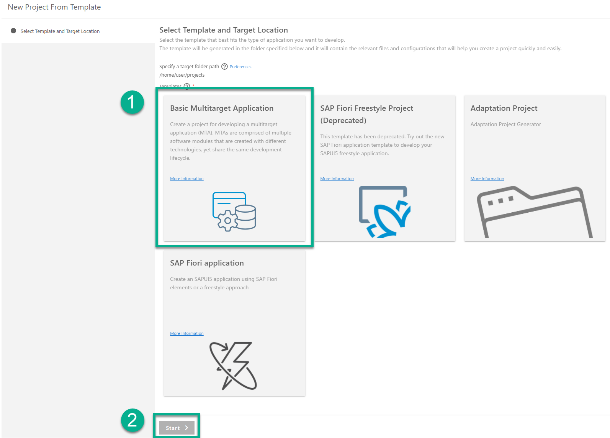
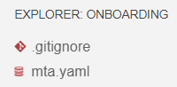
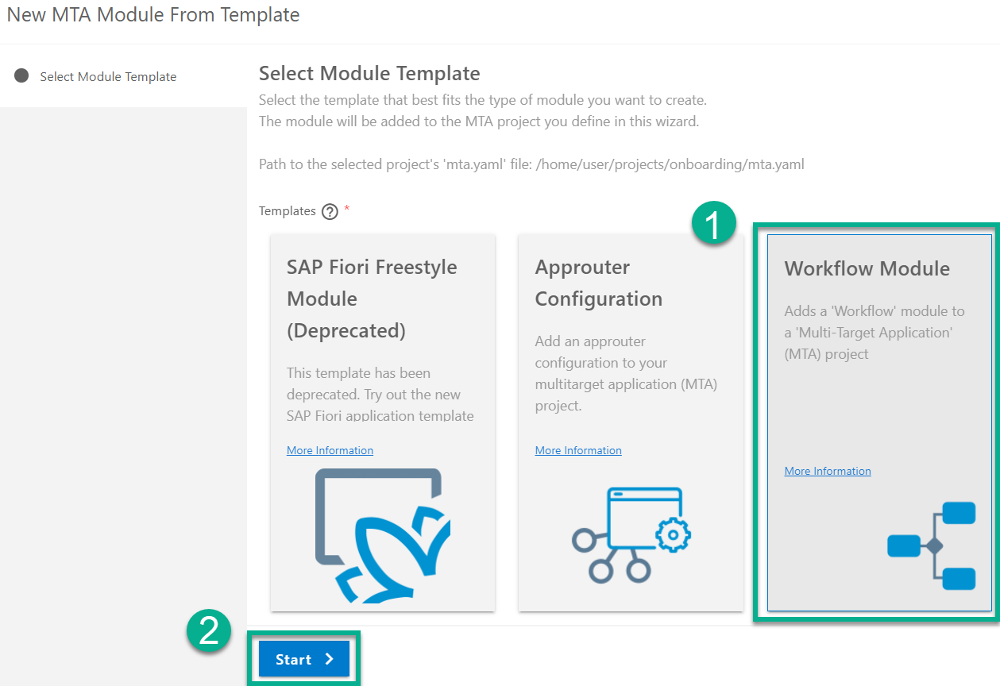
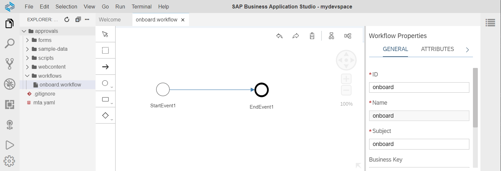

## Prerequisites
 - [Get a Trial Account](hcp-create-trial-account)
 - "Step 1: Setup your account using Booster" of the [Set Up Workflow Management in the Cockpit](cp-starter-ibpm-employeeonboarding-1-setup) tutorial creates the entitlements for the SAP Cloud Portal service as well as the SAP Workflow service and it enables SAP Business Application Studio.

## Details
### You will learn  
  - How to create a basic workflow

---
[ACCORDION-BEGIN [Step 1: ](Set up SAP Business Application Studio)]
You create your workspace where you will later build the workflow.

1. In your web browser, open the [SAP BTP Trial cockpit](https://account.hanatrial.ondemand.com/cockpit).

2. Choose **SAP Business Application Studio**.

3. In the application studio, choose **Create Dev Space**.

    

4. Enter a name, for example, `mydevspace`, and make sure to select **SAP Fiori** kind and the **Workflow Management** extension. Then choose **Create Dev Space** again.

    

    > Wait until the dev space is created and you see the RUNNING status.
    !

5. Click the **Dev Space** to access the workspace.

    > It takes 2-3 minutes to initialize your dev workspace for the first time. You will see a Welcome page once the dev space is initialized.

6. If you have never accessed the workspace before, choose **File** | **Open Workspace**.

7. Select the **projects** folder, and choose **Open**.

    

    > The **PROJECTS** explorer is opened.

[DONE]
[ACCORDION-END]

[ACCORDION-BEGIN [Step 2: ](Create an MTA project)]
You need to create a multitarget application (MTA) project that contains a workflow module.

1. Open **File** | **New Project from Template**.

2. Choose **Basic Multitarget Application**, and then choose **Start**.

    

3. Enter a project name, for example, `onboarding`, and choose **Finish**.

    The IDE opens again with MTA as a workspace. It contains an `mta.yaml` file, which describes the application.

    

[DONE]
[ACCORDION-END]

[ACCORDION-BEGIN [Step 3: ](Create a workflow module and a workflow)]
You now need to create a workflow module within the MTA project.

1. Right-click the `mta.yaml` file, and then choose **Create MTA Module from Template**.

2. Choose **Workflow Module**, and then choose **Start**.

    

3. Enter a path to the location where the module is to be generated. We recommend using the proposed one.

4. Enter a name for the workflow module, for example, `approvals`, then choose **Next**.

5. Enter a name for the workflow, for example, `onboard`, and a description, then choose **Finish**.

    

The workflow module together with a workflow is created and opens.

[VALIDATE_1]
[ACCORDION-END]

---
Summary

You have now created your first workflow with SAP Business Application Studio in the Cloud Foundry environment.

Your next step is to add a user task to this workflow and then display that task using the standard apps of Workflow Management in SAP Fiori launchpad.
