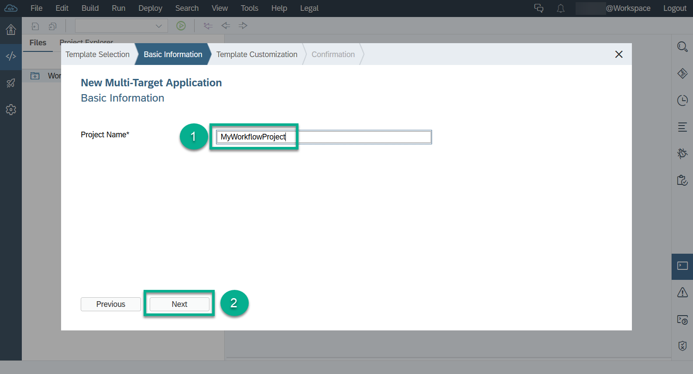
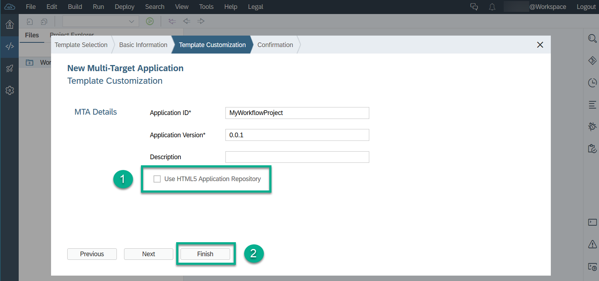
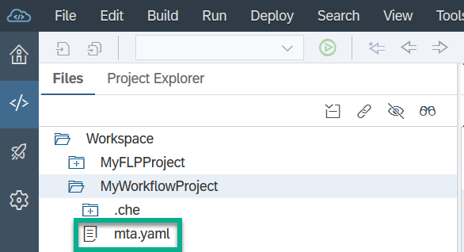
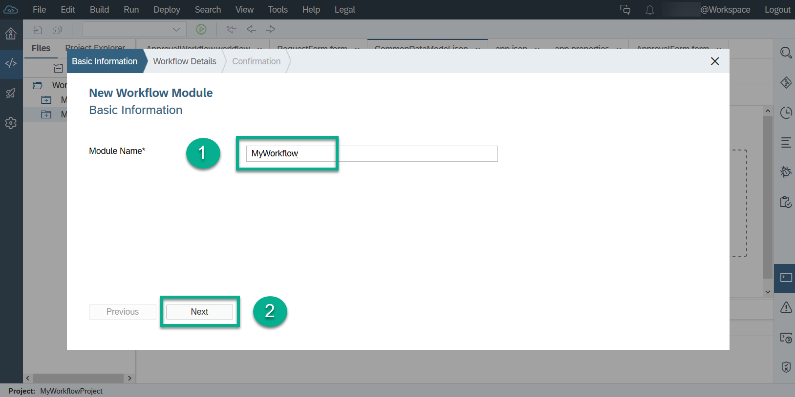
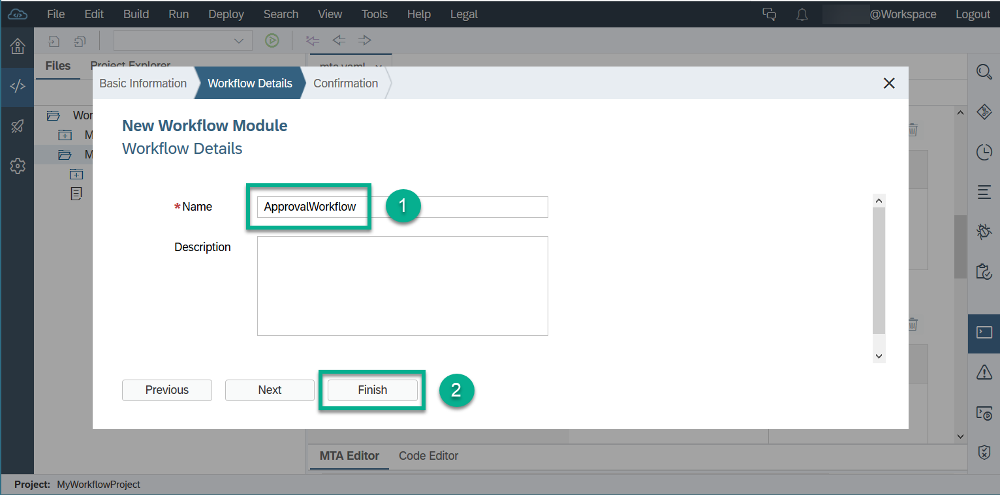
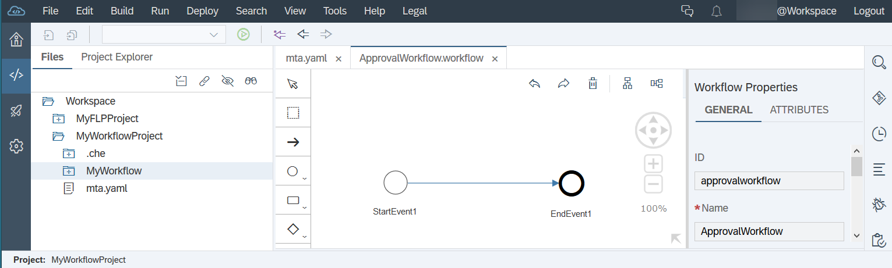
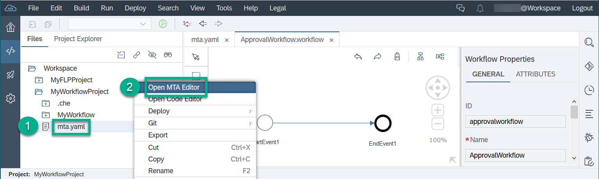
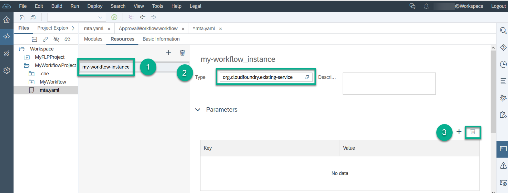
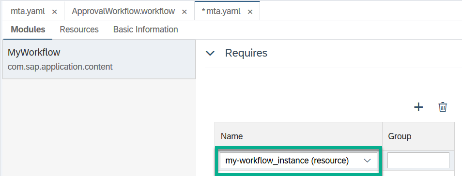

## Details
### You will learn  
  - How to create ``multitarget`` application projects for your workflow in the SAP Web IDE.
  - How to deploy these projects to the SAP Cloud Platform.

---
[ACCORDION-BEGIN [Step 1: ](Create a workflow project)]
1. In your web browser, open the cockpit of [SAP Cloud Platform Trial](https://account.hanatrial.ondemand.com/cockpit).

2. Choose **Launch SAP Web IDE**.

    

3. In the navigation area of SAP Web IDE, choose the **Development** icon.

4. Under **Files**, right-click **Workspace** and choose **New** | **Project from Template**.

    

5. In the wizard, set **Environment** to **Cloud Foundry** and select the **Multi-Target Application** template. Then choose **Next**.

    

6. Enter a name for the new workflow project, for example, `MyWorkflowProject`, and choose **Next**.

    

7. Do **not** select **Use HTML5 Application Repository**, and choose **Finish**.  

    

You now see a project with an `mta.yaml` file in your workspace:

> If there are layout issues with the editor window (can't see the properties), simply refresh the SAP Web IDE window (F5).

[DONE]
[ACCORDION-END]

[ACCORDION-BEGIN [Step 2: ](Create a workflow module)]

1. Select and right-click your project, then choose **New** | **Workflow Module**.

    

2. Enter the name `MyWorkflow`, then choose **Next**.

    

3. Enter the workflow name `ApprovalWorkflow`, then choose **Finish**.

    

You now see your new workflow:

[DONE]
[ACCORDION-END]

[ACCORDION-BEGIN [Step 3: ](Adapt the MTA Workflow project)]
1. In your workspace under **`MyWorkflowProject`**, right-click the ``mta.yaml`` file and choose **Open MTA Editor**.

    

2. Switch to the **Resources** tab, and change the name from `workflow_MyWorkflowProject` to `my-workflow-instance`.

3. Under **Type**, select `org.cloudfoundry.existing-service`.

4. Under **Parameters**, select and delete the key entries `service-plan` and `service`.

5. Save your changes.

    

6. Switch to the **Modules** tab, and check that `my-workflow-instance (resource)` is listed under **Requires**.

    

7. Save your changes.

[VALIDATE_9]
[ACCORDION-END]

---
