## Details
### You will learn  
  - How to start an instance of the workflow definition that you have defined using a start form

---
[ACCORDION-BEGIN [Step 1: ](Launch SAP Web IDE)]
1. In your web browser, open the cockpit of [SAP Cloud Platform Trial](https://account.hanatrial.ondemand.com/cockpit).

2. Choose **Launch SAP Web IDE**.

     

[DONE]
[ACCORDION-END]

[ACCORDION-BEGIN [Step 2: ](Create task form)]
1. In your workspace, choose **`MyWorkflowProject`** | **`MyWorkflow`** | **`workflows`**. Then double-click the **`ApprovalWorkflow.workflow`** file.

    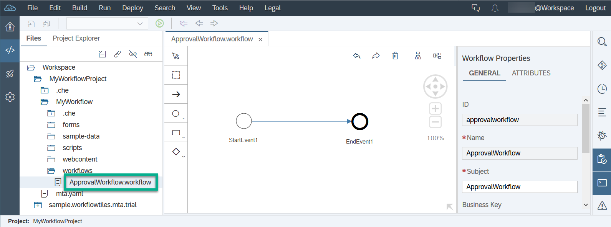

2. To create a user task in the editor, select **`StartEvent1`** and then from the `speedbuttons` choose **User Task** .

    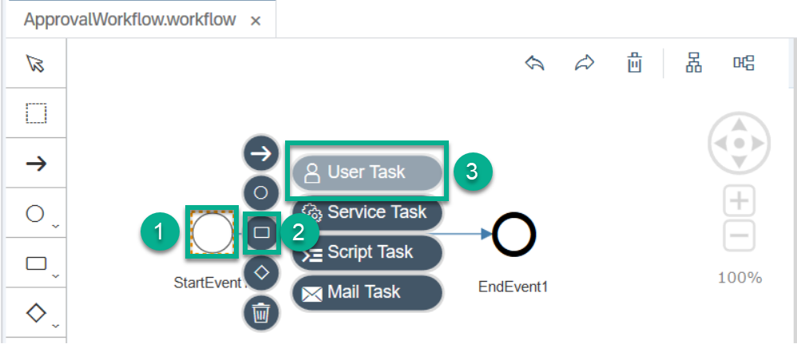

3. Make sure to select the newly created user task. Otherwise, the **User Task Properties** are not displayed.

4. Under **User Task Properties** | **USER INTERFACE**, set the **Type** to **Form**.

    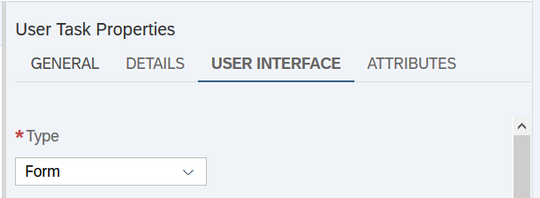

5. Under **Form Details**, select **Create File**.

    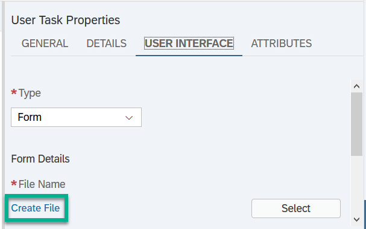

6. In the popup, enter the following data, then choose **Create**:

    | Field                  | Value                  |
    | :--------------------- | :--------------------- |
    | **Name**               | **`ApprovalForm`**     |
    | **Revision**           | **`1.0`**              |      

    

A message confirms that the form has been created.

[DONE]
[ACCORDION-END]

[ACCORDION-BEGIN [Step 3: ](Add fields to your task form)]

1. In the form editor (for the ``ApprovalForm.form``), select the **Fields** section.

2. To add two new fields, click **Add Field** twice, and enter the following data to define the fields:

    | Label/Title      | Type          | Context Path                
    | :--------------- | :------------ | :--------------------------
    | **Title**        | **String**    | **`${context.product}`**    
    | **Price**        | **Float**     | **`${context.price}`**      

    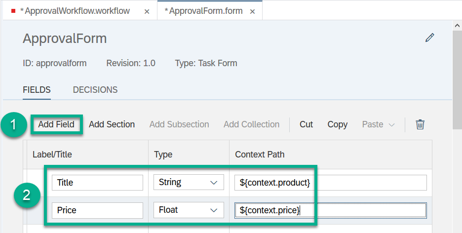

3. Save your changes.

[DONE]
[ACCORDION-END]

[ACCORDION-BEGIN [Step 4: ](Add approve and reject buttons)]

1. In the form editor (for the ``ApprovalForm.form``), select the **Decisions** section.

2. To add two new buttons, click **Add** twice.

3. In the two new rows that are added in the **Decisions** section, enter the following data:

    | **Text**         | **ID**           | **Type**       |
    | :--------------- | :--------------- | :------------- |
    | **`Approve`**    | **`approve`**    | **Positive**   |
    | **`Reject`**     | **`reject`**     | **Negative**   |

    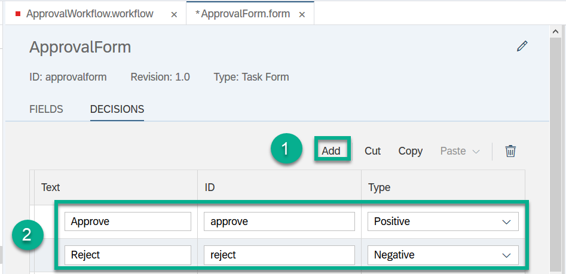

4. Save your changes.

[DONE]
[ACCORDION-END]

[ACCORDION-BEGIN [Step 5: ](Complete the user task)]
1. Go back to the `ApprovalWorkflow.workflow` file. If you have closed it, reopen it by selecting and choosing **Workflow Editor**.

2. Under **User Task Properties** | **GENERAL**, enter `ApproveBook` in the **Name** field.

    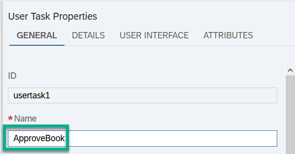

3. Switch to the **DETAILS** tab, and enter `Approval` in the **Subject** field.

    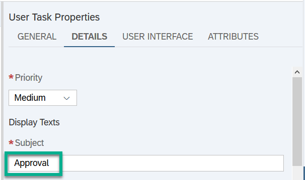

4. Under **Recipients**, enter your email address in the **Users** field.

    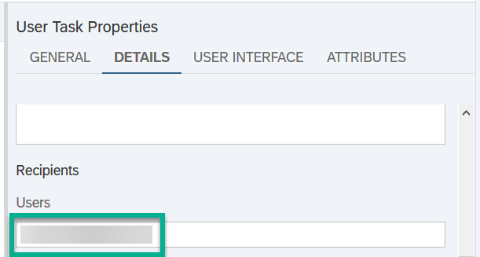

5. Save your changes.

[DONE]
[ACCORDION-END]

[ACCORDION-BEGIN [Step 6: ](Build the workflow project)]

1. Build the **`MyWorkflowProject`** project by right-clicking it and choosing **Build** | **Build with Cloud MTA Build Tool (recommended)**.

    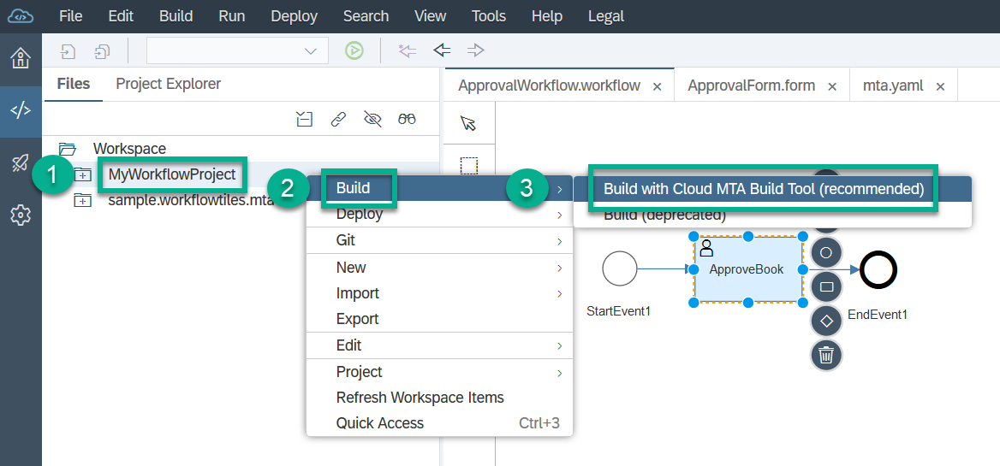

    You will receive a build confirmation popup.

2. In your workspace from the **`mta_archives`** folder, right-click the `MyWorkflowProject_0_0_1.mtar` file and choose **Deploy** | **Deploy to SAP Cloud Platform**.

    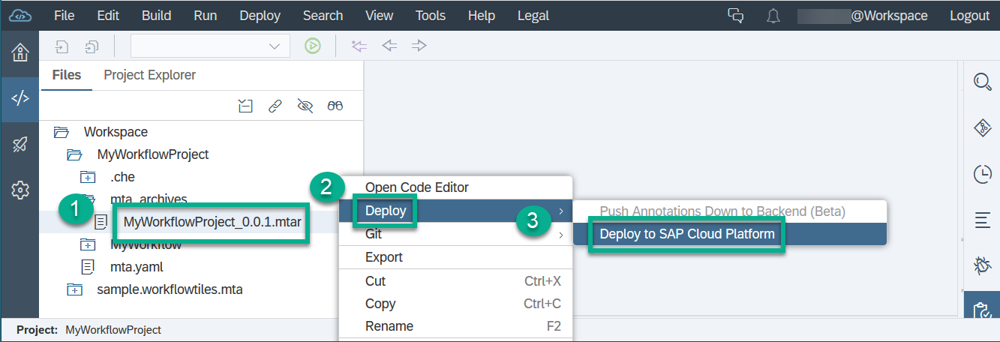

3. In the popup, select your API endpoint, organization, and space.

4. Choose **Deploy**.

    

    You will receive a deploy confirmation popup.

[DONE]
[ACCORDION-END]

[ACCORDION-BEGIN [Step 7: ](Open the Workflow Monitor - Workflow Definitions app)]
1. Open your browser and access your SAP Fiori launchpad at: `https://<dev space name>-trial-dev-workflowtilesapprouter.cfapps.<your endoint>.hana.ondemand.com`.

2. Choose the **Workflow Monitor - Workflow Definitions** tile, and for the `ApprovalWorkflow` task choose **Start New Instance**.

    

3. Leave the `JSON` context as is, and choose **Start New Instance**.

    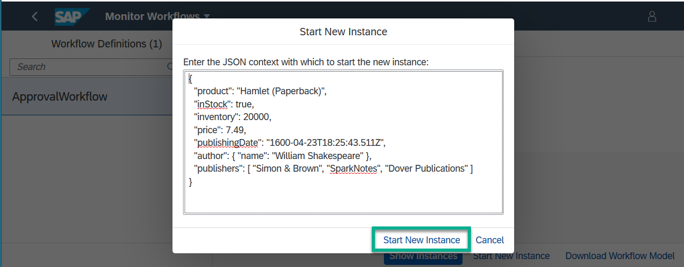

4. Go back to the **Home** page. The **My Inbox** app displays one task.

    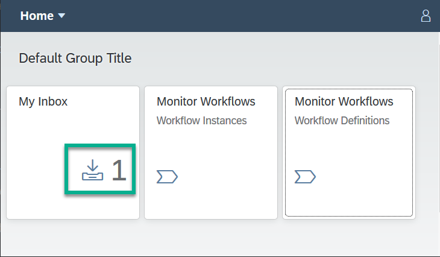

5. Open **My Inbox**, and choose **Approve** to process the task.

    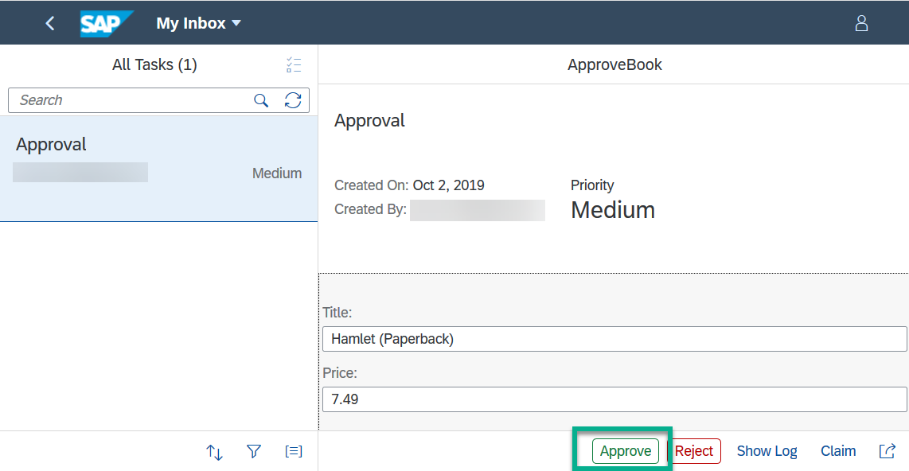

[VALIDATE_3]
[ACCORDION-END]

---
