## Details
### You will learn  
  - How to create a simple approval task for your workflow.
  - How to deploy the workflow.

---

[ACCORDION-BEGIN [Step 1: ](Add a user task)]
1. In SAP Business Application Studio, access the `onboard.workflow` you created in the **projects** folder.

2. In the workflow editor, select  **Tasks** | **User Tasks**, then click the connector between the Start and the End event to insert the task there.

    > Make sure that the connector color is green. Otherwise, your task is not correctly processed.

    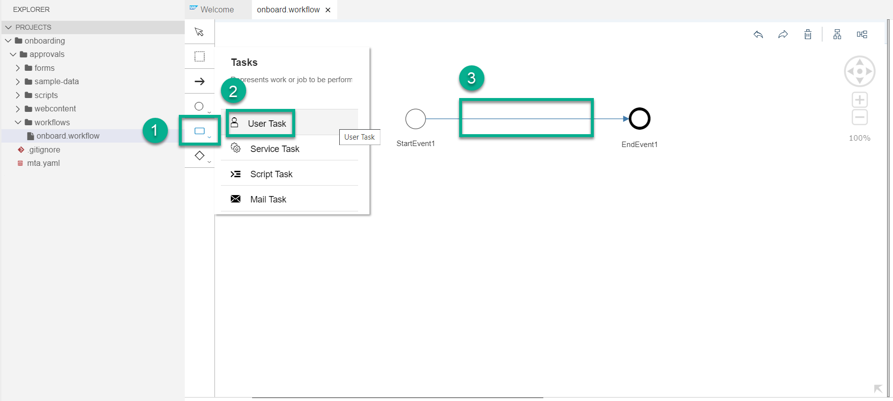

3. Enter the following data:
    - In the **GENERAL** tab of the **User Task Properties**, enter **`Assign and Approve Equipment`** in the **Name** field.

    - Switch to the **DETAILS** tab, enter **`Assign and Approve Equipment for ${context.empData.firstName} ${context.empData.lastName}`** in the **Subject** field.

        The subject will be shown in the task list in My Inbox.

    - Enter a description **`The manager assigns and approves equipment and relocation of the newly onboarded employee`**.

    - Assign a recipient for the task. In the **Users** field, enter **`${info.startedBy}`**.

        With this recipient information everyone who starts the workflow will then receive the task.

    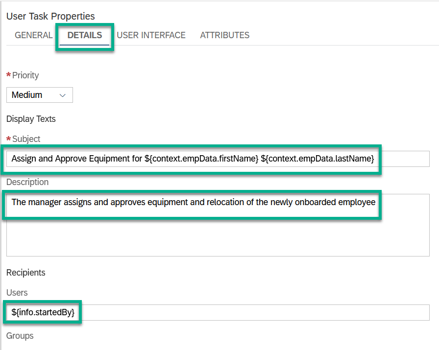


[DONE]
[ACCORDION-END]

[ACCORDION-BEGIN [Step 2: ](Create a task form)]
Define the form, which is shown when the task is opened in the My Inbox.

1. On the **User Interface** tab of the **User Task Properties**, set the **Type** to **Form** and choose **Create File**.

    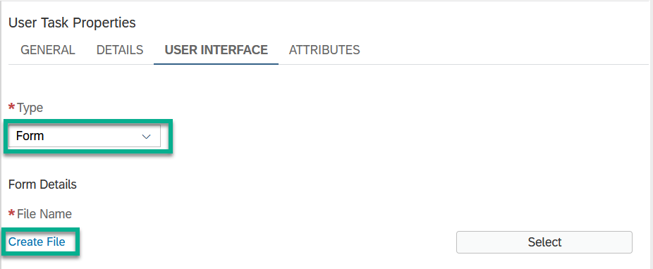

2. Enter the name **`approvalform`**, keep the ID. For the revision enter **`1.0`**. Keep the **Task Form** type.

    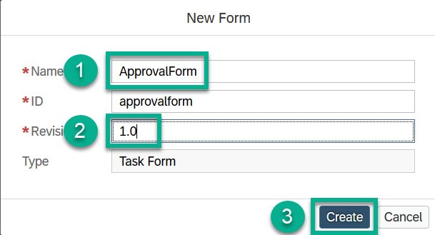

3. Choose **Create**.

    The form file is created in the **forms** folder under **onboarding** | **approvals**.

4. Once the form editor opens, add form data by choosing **Add Field**.

    The context path refers to the task context.

    | Label/Title    | Type       | Context Path                         |
    | :--------------| :----------| :------------------------------------|
    | **First Name** | **String** | **`${context.empData.firstName}`**   |
    | **Last Name**  | **String** | **`${context.empData.lastName}`**    |
    | **Country**    | **String** | **`${context.empData.country}`**     |      
    | **Hire Date**  | **Date**   | **`${context.empData.hireDate}`**    |      
    | **Job Title**  | **String** | **`${context.empData.jobTitle}`**    |      
    | **Relocation** | **String** | **`${context.empData.relocation}`**  |      
    | **Equipment**  | **String** | **`${context.empData.equipment}`**   |      

    For **Relocation**, select **Radio Buttons** under **Control** in the right side-panel. Then add **`Yes`** in the first line and **`No`** in the second line both as string and as display values.

    For **Equipment**, select **Dropdown** under **Control** in the right side-panel. Then add **`Notebook`** in the first line and **`Cables and Accessories`** in the second line both as string and as display values.

    The filled form looks like this:

    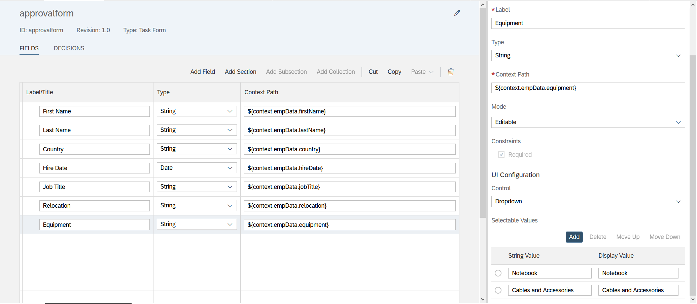

[DONE]
[ACCORDION-END]

[ACCORDION-BEGIN [Step 3: ](Add a button to your task form)]

1. In the form editor, switch from the **FIELDS** to the **DECISIONS** tab, and choose **Add**.

    Then enter the following data.

    | Text         | ID           | Type         |
    | :------------| :------------| :------------|
    | **Approve**  | **approve**  | **Positive** |


    The form looks like this:

    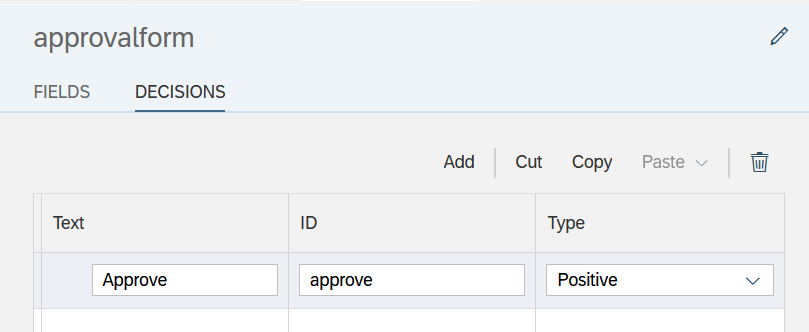

[DONE]
[ACCORDION-END]

[ACCORDION-BEGIN [Step 4: ](Build and deploy)]
Now, you are ready to build and deploy the workflow.

1. Open the **mta.yaml** file of your **onboarding** project by double-clicking it. In  lines 9 and 13, replace `workflow_mta` with `wm_workflow`.

    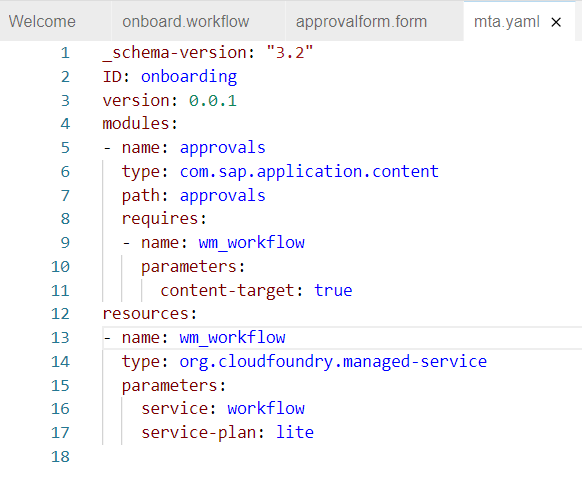

2. Right-click the **mta.yaml** file in your **onboarding** project folder, and then select **Build MTA Project**.

    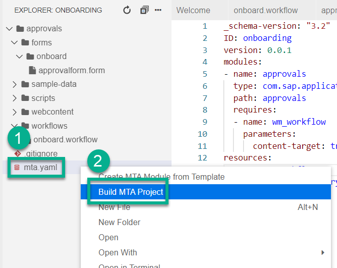

    Once the build is completed, the new folder **`mta_archives`** appears under your application folder.

3. Check whether the blue message line at the bottom of your screen, asks you to log in to your Cloud Foundry space.

    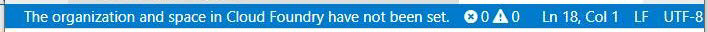

    If so, click it to open the entry field. Enter the right API endpoint depending on your region, for example, `https://api.cf.eu10.hana.ondemand.com`, your username and password, and select the Cloud Foundry org and space of your trial account.

    > You can get the trial API Endpoint, organisation name, and space name from your trial account overview page.
        !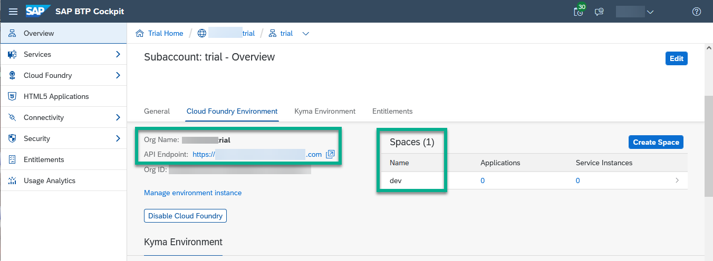

4. Right-click the `.mtar` file, and then select **Deploy MTA Archive**.

    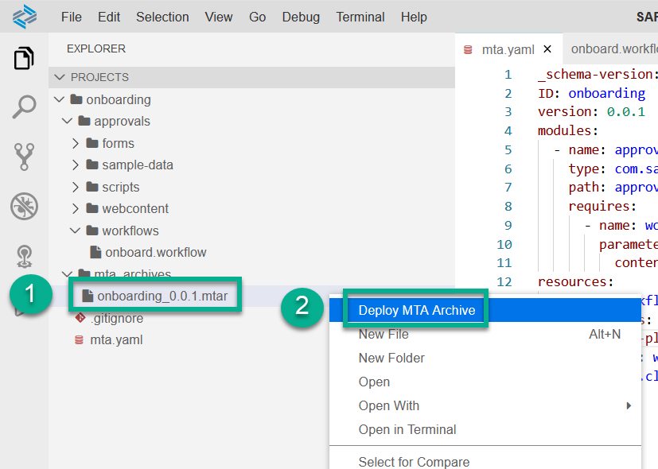

    > It will take approximately 5 minutes to deploy the multitarget application.

[DONE]
[ACCORDION-END]

[ACCORDION-BEGIN [Step 5: ](Run the workflow)]

After deployment is finished, open the SAP Fiori launchpad site that contains the workflow applications.

1. In your web browser, open the [SAP Business Technology Platform (SAP BTP) Trial cockpit](https://cockpit.hanatrial.ondemand.com/).

2. Navigate to the trial global account by clicking **Enter Your Trial Account**.

3. Access your **trial** subaccount.

4. From the navigation area, choose **Instances and Subscriptions**, and search for **Workflow Management**.

5. Open your SAP Fiori launchpad, by choosing **Go to Application** in the **Workflow Management** row.

    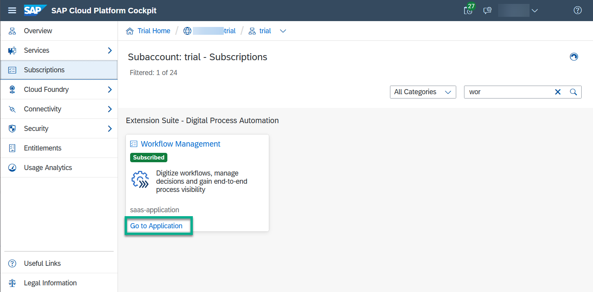

6. In the SAP Fiori launchpad, open the **Monitor Workflows (Workflow Definitions)** application and select the **onboard** workflow definition.

7. Choose **Start New Instance**.

    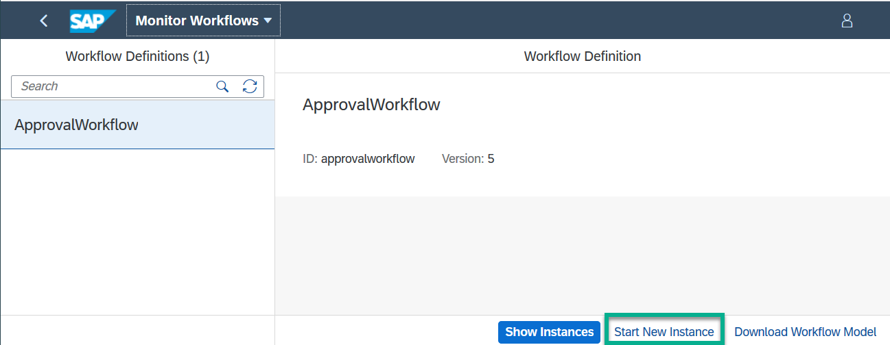

8. Replace the payload by adding the following code as context, then choose **Start New Instance and Close**.

    ```
    {
      "managerId": "john.edrich@sapdemo.com",
      "buddyId": "kevin.hart@saptest.com",
      "userId": "cgrant1",
      "empData": {
        "firstName": "Carla",
        "lastName": "Grant",
        "city": "San Mateo",
        "country": "United States",
        "hireDate": "2020-07-11",
        "jobTitle": "General Manager, Industries"
      }
    }

    ```
    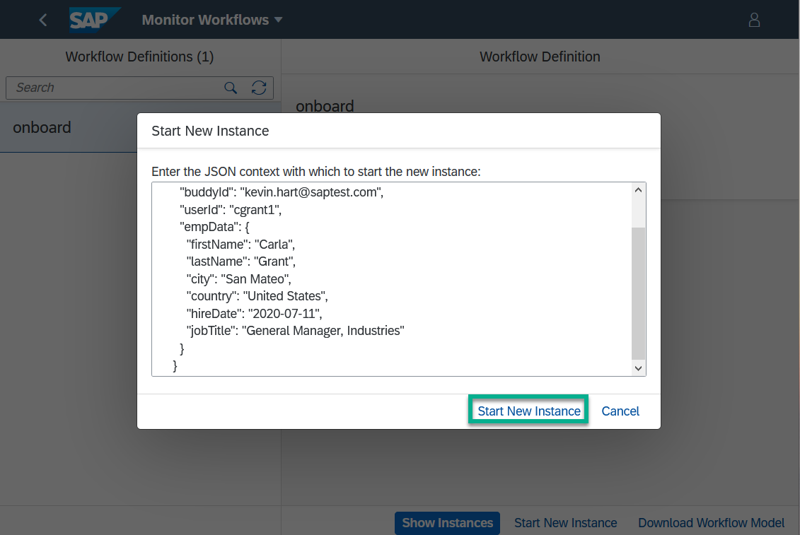

9. To display the execution log of the instance, choose **Show Instances** and go to the **Execution Log** tab.

    This opens the **Monitor Workflows (Workflow Instances)** application.

    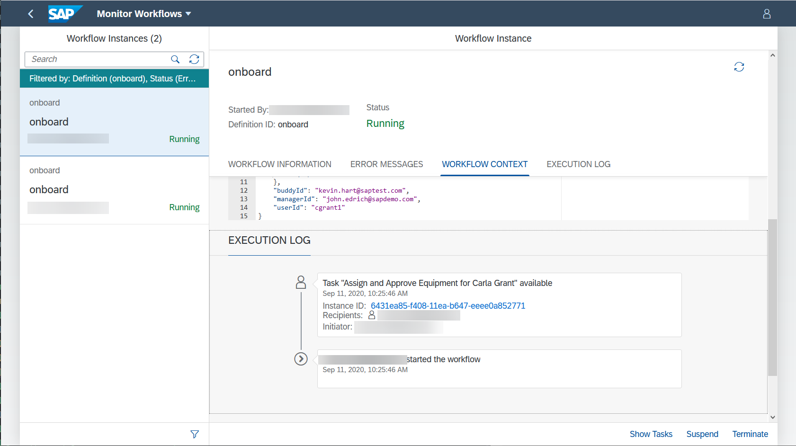

10. Go back to the home page and open the **My Inbox** application.

    You should see the **Approval** task with a form, showing the equipment name and an **Approve** button.

    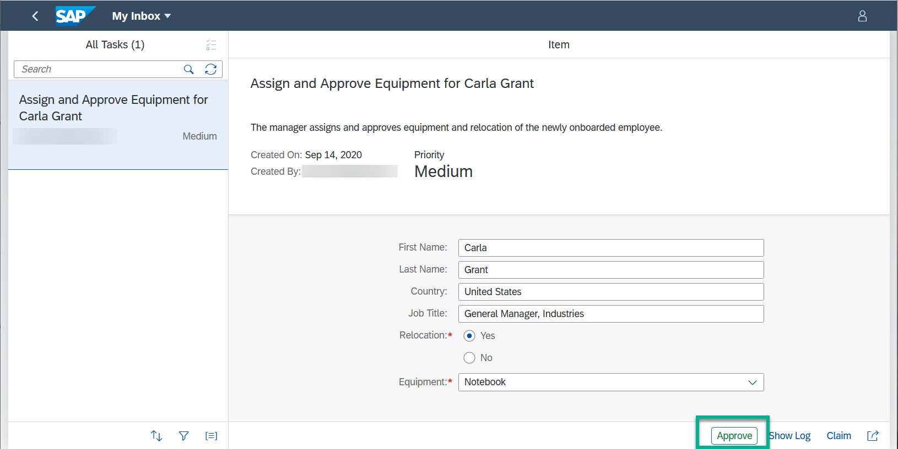

[VALIDATE_2]
[ACCORDION-END]


---
Summary

If you want to build a dedicated UI for end users and not use the administrative **Monitor Workflow (Workflow Definitions)** application, you can use a start form. See the next tutorial.
